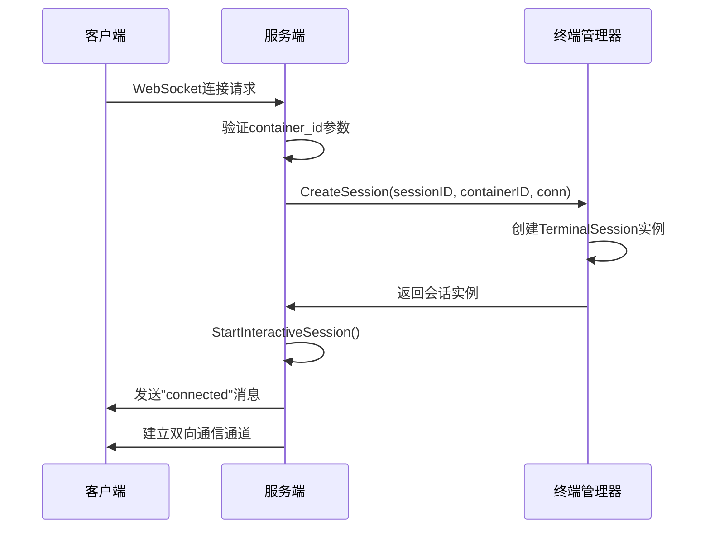
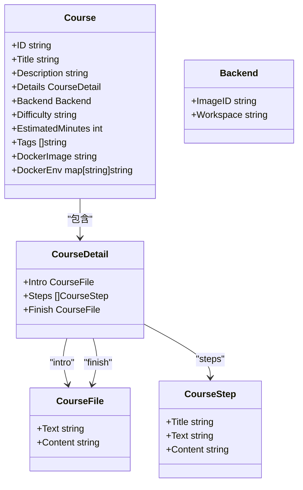
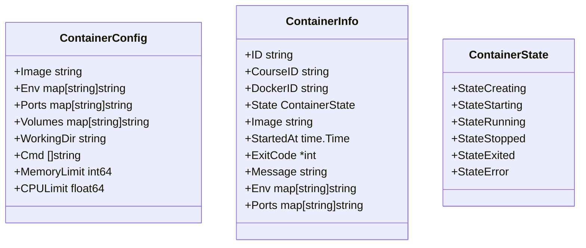
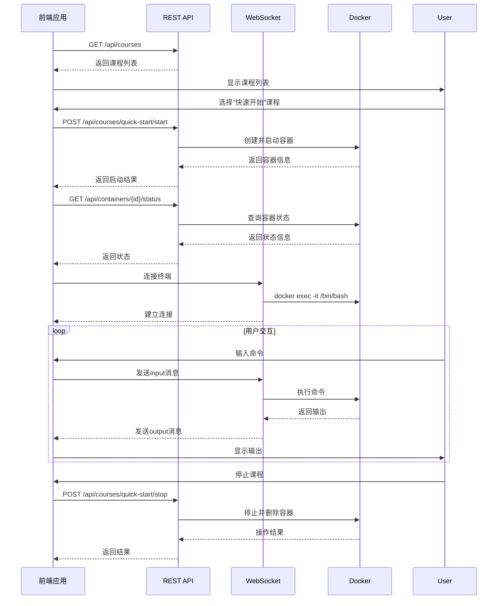
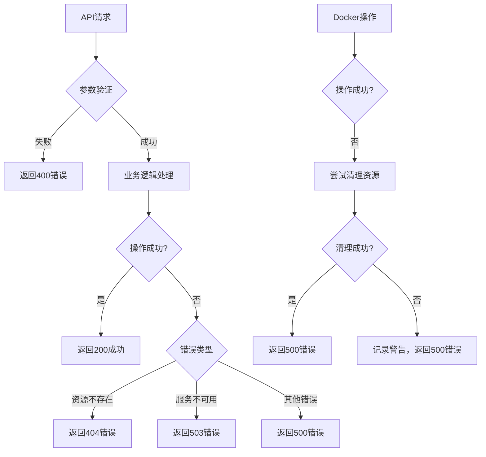

# API文档

<cite>
**本文档中引用的文件**
- [routes.go](file://internal/api/routes.go)
- [models.go](file://internal/course/models.go)
- [types.go](file://internal/docker/types.go)
- [terminal.go](file://internal/websocket/terminal.go)
- [config.go](file://internal/config/config.go)
</cite>

## 目录
1. [简介](#简介)
2. [RESTful API](#restful-api)
   1. [健康检查](#健康检查)
   2. [课程管理](#课程管理)
   3. [容器管理](#容器管理)
3. [WebSocket终端接口](#websocket终端接口)
4. [数据模型](#数据模型)
5. [使用示例](#使用示例)
6. [认证与安全](#认证与安全)
7. [错误处理](#错误处理)
8. [最佳实践](#最佳实践)

## 简介
本API文档为playground项目提供完整的公共接口说明，涵盖所有RESTful端点和WebSocket接口。系统通过Gin框架提供HTTP API，通过Gorilla WebSocket实现终端交互功能，为用户提供隔离的KWDB实验环境。

系统核心功能包括：
- 课程列表与详情获取
- 课程容器的启动、停止与管理
- 容器状态与日志查询
- WebSocket终端会话交互
- 健康检查与系统监控

所有API端点均以`/api`为前缀，WebSocket接口位于根路径。系统使用Docker作为底层容器运行时，为每个课程实例创建独立的容器环境。

## RESTful API

### 健康检查
健康检查接口用于验证服务的运行状态，通常用于负载均衡器和服务监控。

**端点**
```
GET /health
```

**响应**
```json
{
  "status": "ok",
  "message": "KWDB Playground is running"
}
```

**状态码**
- `200 OK`: 服务正常运行

**Section sources**
- [routes.go](file://internal/api/routes.go#L75-L83)

### 课程管理

#### 获取所有课程
获取系统中所有可用课程的列表。

**端点**
```
GET /api/courses
```

**响应**
```json
{
  "courses": [
    {
      "id": "quick-start",
      "title": "快速开始",
      "description": "欢迎来到 KWDB 课程，本场景将引导您快速开始使用 KWDB。",
      "difficulty": "beginner",
      "estimatedMinutes": 10,
      "tags": ["quick-start", "快速开始"],
      "dockerImage": "",
      "backend": {
        "imageid": "kwdb/kwdb",
        "workspace": "/kaiwudb/bin"
      }
    }
  ]
}
```

**状态码**
- `200 OK`: 成功获取课程列表

**Section sources**
- [routes.go](file://internal/api/routes.go#L85-L95)

#### 获取指定课程
根据课程ID获取课程的详细信息。

**端点**
```
GET /api/courses/:id
```

**路径参数**
- `id`: 课程ID

**响应**
```json
{
  "course": {
    "id": "install",
    "title": "单节点部署",
    "description": "使用官网脚本一键部署 KWDB 单节点",
    "details": {
      "intro": {
        "text": "intro.md",
        "content": "..."
      },
      "steps": [
        {
          "title": "下载安装包",
          "text": "step1.md",
          "content": "..."
        }
      ],
      "finish": {
        "text": "finish.md",
        "content": "..."
      }
    },
    "backend": {
      "imageid": "ubuntu:20.04",
      "workspace": ""
    },
    "difficulty": "intermediate",
    "estimatedMinutes": 10,
    "tags": ["安装", "单节点"],
    "dockerImage": ""
  }
}
```

**状态码**
- `200 OK`: 成功获取课程信息
- `400 Bad Request`: 课程ID不能为空
- `404 Not Found`: 课程不存在

**Section sources**
- [routes.go](file://internal/api/routes.go#L97-L124)

#### 启动课程
为指定课程启动Docker容器环境。

**端点**
```
POST /api/courses/:id/start
```

**路径参数**
- `id`: 课程ID

**请求体**
无（使用课程配置中的容器配置）

**响应**
```json
{
  "message": "课程容器启动成功",
  "courseId": "quick-start",
  "containerId": "kwdb-playground-quick-start-123",
  "image": "kwdb/kwdb:latest"
}
```

**状态码**
- `200 OK`: 容器启动成功（包括已运行状态）
- `400 Bad Request`: 课程ID不能为空
- `404 Not Found`: 课程不存在
- `500 Internal Server Error`: 容器启动失败

**Section sources**
- [routes.go](file://internal/api/routes.go#L126-L258)

#### 停止课程
停止指定课程的Docker容器并清理资源。

**端点**
```
POST /api/courses/:id/stop
```

**路径参数**
- `id`: 课程ID

**响应**
```json
{
  "message": "课程容器停止成功",
  "courseId": "quick-start",
  "containerId": "kwdb-playground-quick-start-123"
}
```

**状态码**
- `200 OK`: 容器停止成功
- `400 Bad Request`: 课程ID不能为空
- `404 Not Found`: 未找到课程对应的容器
- `500 Internal Server Error`: 容器停止失败

**Section sources**
- [routes.go](file://internal/api/routes.go#L260-L338)

### 容器管理

#### 获取容器状态
获取指定容器的运行状态和基本信息。

**端点**
```
GET /api/containers/:id/status
```

**路径参数**
- `id`: 容器名称或ID

**响应**
```json
{
  "status": "running",
  "containerId": "kwdb-playground-quick-start-123",
  "info": {
    "id": "kwdb-playground-quick-start-123",
    "courseId": "quick-start",
    "dockerId": "abc123def456",
    "image": "kwdb/kwdb:latest",
    "startedAt": "2024-01-01T12:00:00Z",
    "ports": {},
    "env": {}
  }
}
```

**状态码**
- `200 OK`: 成功获取容器状态
- `400 Bad Request`: 容器ID不能为空
- `404 Not Found`: 容器不存在
- `500 Internal Server Error`: 获取容器状态失败

**Section sources**
- [routes.go](file://internal/api/routes.go#L340-L408)

#### 获取容器日志
获取指定容器的运行日志。

**端点**
```
GET /api/containers/:id/logs
```

**路径参数**
- `id`: 容器ID

**查询参数**
- `lines`: 日志行数限制（默认100）
- `follow`: 是否持续跟踪日志（默认false）

**响应**
```json
{
  "logs": "container log output...",
  "containerId": "kwdb-playground-quick-start-123",
  "lines": 100,
  "follow": false
}
```

**状态码**
- `200 OK`: 成功获取容器日志
- `400 Bad Request`: 容器ID不能为空
- `404 Not Found`: 容器不存在
- `500 Internal Server Error`: 获取容器日志失败

**Section sources**
- [routes.go](file://internal/api/routes.go#L410-L463)

#### 重启容器
重启指定的Docker容器。

**端点**
```
POST /api/containers/:id/restart
```

**路径参数**
- `id`: 容器ID

**响应**
```json
{
  "message": "容器重启成功",
  "containerId": "kwdb-playground-quick-start-123"
}
```

**状态码**
- `200 OK`: 容器重启成功
- `400 Bad Request`: 容器ID不能为空
- `404 Not Found`: 容器不存在
- `500 Internal Server Error`: 容器重启失败

**Section sources**
- [routes.go](file://internal/api/routes.go#L465-L518)

## WebSocket终端接口
WebSocket终端接口提供与容器的交互式shell会话，支持命令输入和实时输出。

### 连接建立
客户端通过WebSocket连接到终端接口，建立与容器的交互式会话。

**端点**
```
GET /ws/terminal
```

**查询参数**
- `container_id`: 容器ID（必需）
- `session_id`: 会话ID（可选，系统会自动生成）

**响应**
- `101 Switching Protocols`: WebSocket连接建立成功
- `400 Bad Request`: 容器ID不能为空
- `500 Internal Server Error`: 终端管理器不可用

**连接流程**
1. 客户端发起WebSocket连接请求
2. 服务端验证容器ID参数
3. 升级HTTP连接为WebSocket连接
4. 创建终端会话并启动交互式bash会话
5. 建立双向通信通道

**Section sources**
- [routes.go](file://internal/api/routes.go#L520-L575)

### 消息帧格式
WebSocket连接建立后，客户端和服务端通过JSON格式的消息帧进行通信。

#### 消息结构
```json
{
  "type": "input|output|error|connected",
  "data": "消息内容"
}
```

**字段说明**
- `type`: 消息类型
  - `input`: 客户端发送的命令输入
  - `output`: 服务端返回的命令输出
  - `error`: 错误信息
  - `connected`: 连接成功确认
- `data`: 消息内容

#### 输入消息
客户端发送命令到容器。

```json
{
  "type": "input",
  "data": "ls -la\n"
}
```

#### 输出消息
服务端返回命令执行结果。

```json
{
  "type": "output",
  "data": "total 24\ndrwxr-xr-x 3 user user 4096 Jan 1 12:00 .\n"
}
```

**Section sources**
- [terminal.go](file://internal/websocket/terminal.go#L10-L18)

### 会话生命周期
#### 会话创建


**Diagram sources**
- [terminal.go](file://internal/websocket/terminal.go#L54-L68)
- [routes.go](file://internal/api/routes.go#L520-L575)

#### 会话管理
```mermaid
classDiagram
class TerminalManager {
+sessions map[string]*TerminalSession
+mu sync.RWMutex
+logger *logger.Logger
+CreateSession(sessionID, containerID, conn)
+RemoveSession(sessionID)
+SetLogger(logger)
}
class TerminalSession {
+sessionID string
+containerID string
+conn *websocket.Conn
+cmd *exec.Cmd
+pty *os.File
+ctx context.Context
+cancel context.CancelFunc
+logger *logger.Logger
+StartInteractiveSession()
+handleWebSocketInput()
+handleTerminalOutput()
+waitForTerminalExit()
+Close()
+Done()
}
TerminalManager --> TerminalSession : "创建"
TerminalSession --> "docker exec" : "执行"
TerminalSession --> websocket.Conn : "通信"
```

**Diagram sources**
- [terminal.go](file://internal/websocket/terminal.go#L34-L52)
- [terminal.go](file://internal/websocket/terminal.go#L69-L189)

#### 会话关闭
```mermaid
flowchart TD
A[客户端断开连接] --> B{会话是否活跃}
B --> |是| C[发送关闭信号]
B --> |否| D[结束]
C --> E[关闭PTY和命令]
E --> F[关闭WebSocket连接]
F --> G[从管理器移除会话]
G --> H[释放资源]
H --> I[结束]
J[终端命令退出] --> K[触发Close()]
K --> E
```

**Diagram sources**
- [terminal.go](file://internal/websocket/terminal.go#L158-L189)

## 数据模型
### 课程模型


**Diagram sources**
- [models.go](file://internal/course/models.go#L5-L16)

### 容器配置模型


**Diagram sources**
- [types.go](file://internal/docker/types.go#L31-L48)

## 使用示例
### 启动课程并连接终端
以下示例展示如何通过API启动课程并连接到终端。

#### 使用cURL
```bash
# 1. 获取所有课程
curl -X GET http://localhost:8080/api/courses

# 2. 启动快速开始课程
curl -X POST http://localhost:8080/api/courses/quick-start/start

# 3. 获取容器状态
curl -X GET http://localhost:8080/api/containers/kwdb-playground-quick-start/status

# 4. 连接WebSocket终端（需要WebSocket客户端）
# 使用wscat工具示例：
wscat -c 'ws://localhost:8080/ws/terminal?container_id=kwdb-playground-quick-start'

# 在WebSocket连接中发送命令
{"type": "input", "data": "ls -la\n"}
```

#### 使用JavaScript
```javascript
// 1. 启动课程
async function startCourse(courseId) {
  const response = await fetch(`/api/courses/${courseId}/start`, {
    method: 'POST'
  });
  return await response.json();
}

// 2. 创建终端连接
function connectTerminal(containerId) {
  const socket = new WebSocket(
    `ws://localhost:8080/ws/terminal?container_id=${containerId}`
  );
  
  // 处理消息
  socket.onmessage = (event) => {
    const message = JSON.parse(event.data);
    if (message.type === 'output') {
      console.log('终端输出:', message.data);
    }
  };
  
  // 发送命令
  function sendCommand(command) {
    socket.send(JSON.stringify({
      type: 'input',
      data: command + '\n'
    }));
  }
  
  return { socket, sendCommand };
}

// 3. 使用示例
async function runExample() {
  // 启动课程
  const result = await startCourse('quick-start');
  console.log('课程启动:', result);
  
  // 连接终端
  const terminal = connectTerminal(result.containerId);
  
  // 发送命令
  terminal.sendCommand('pwd');
  terminal.sendCommand('ls -la');
}
```

**Section sources**
- [routes.go](file://internal/api/routes.go#L126-L258)
- [terminal.go](file://internal/websocket/terminal.go#L54-L189)

### 前端集成场景


**Diagram sources**
- [routes.go](file://internal/api/routes.go#L126-L338)
- [terminal.go](file://internal/websocket/terminal.go#L54-L189)

## 认证与安全
### 认证机制
当前系统未实现复杂的认证机制，主要依赖以下安全措施：

1. **服务器配置**: 通过环境变量配置访问令牌
   ```go
   ServerConfig {
       Token: getEnv("TOKEN", ""),
   }
   ```

2. **WebSocket来源检查**: 允许所有来源连接
   ```go
   upgrader := websocket.Upgrader{
       CheckOrigin: func(r *http.Request) bool {
           return true // 允许所有来源
       },
   }
   ```

3. **路径遍历防护**: 静态文件服务中防止路径遍历攻击
   ```go
   if strings.Contains(filepath, "..") {
       c.JSON(http.StatusBadRequest, gin.H{"error": "Invalid file path"})
       return
   }
   ```

**Section sources**
- [config.go](file://internal/config/config.go#L25-L28)
- [routes.go](file://internal/api/routes.go#L540-L544)
- [main.go](file://main.go#L115-L118)

### 配置安全
系统通过环境变量和配置文件管理敏感信息：

```mermaid
graph TD
A[环境变量] --> B[Load()函数]
C[.env文件] --> B
B --> D[Config结构体]
D --> E[ServerConfig]
D --> F[DockerConfig]
D --> G[CourseConfig]
D --> H[LogConfig]
E --> I[Host, Port, Token]
F --> J[Host, Timeout]
G --> K[Dir, Reload]
H --> L[Level, Format]
```

**Diagram sources**
- [config.go](file://internal/config/config.go#L13-L60)

## 错误处理
### HTTP错误响应
所有API端点遵循统一的错误响应格式：

```json
{
  "error": "错误描述信息"
}
```

**常见错误码**
- `400 Bad Request`: 参数验证失败
- `404 Not Found`: 资源不存在
- `500 Internal Server Error`: 服务器内部错误
- `503 Service Unavailable`: 依赖服务不可用

### 错误处理策略


**Section sources**
- [routes.go](file://internal/api/routes.go#L99-L122)
- [routes.go](file://internal/api/routes.go#L170-L178)

## 最佳实践
### 文档同步策略
建议使用OpenAPI规范生成工具链保持文档与代码同步：

1. **API注解**: 在Go代码中添加Swagger注解
   ```go
   // @Summary 获取所有课程
   // @Description 返回系统中所有可用课程的列表
   // @Tags 课程管理
   // @Produce json
   // @Success 200 {object} GetCoursesResponse
   // @Router /api/courses [get]
   func (h *Handler) getCourses(c *gin.Context) {
   ```

2. **自动化生成**: 使用swag工具生成OpenAPI文档
   ```bash
   # 安装swag
   go install github.com/swaggo/swag/cmd/swag@latest
   
   # 生成文档
   swag init
   
   # 生成静态文件
   swag fmt
   ```

3. **CI/CD集成**: 在构建流程中自动更新文档
   ```yaml
   jobs:
     build:
       steps:
         - name: Generate API Docs
           run: swag init
         - name: Commit Docs
           run: |
             git config user.name "CI Bot"
             git add docs/swagger/*
             git commit -m "docs: update API documentation"
   ```

4. **文档服务**: 通过HTTP提供交互式文档
   ```go
   import "github.com/swaggo/gin-swagger"
   
   r.GET("/swagger/*any", ginSwagger.WrapHandler(swaggerFiles.Handler))
   ```

### 性能优化建议
1. **容器状态缓存**: 减少Docker API调用频率
2. **连接池管理**: 限制并发会话数量
3. **日志级别控制**: 生产环境使用INFO级别
4. **静态文件缓存**: 设置长期缓存头

### 扩展性考虑
1. **认证增强**: 集成JWT或OAuth2
2. **多租户支持**: 隔离不同用户的容器环境
3. **资源配额**: 限制每个用户的资源使用
4. **监控集成**: 添加Prometheus指标收集