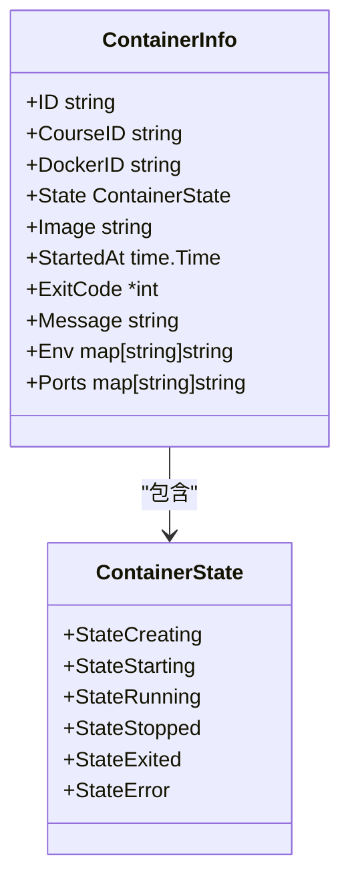
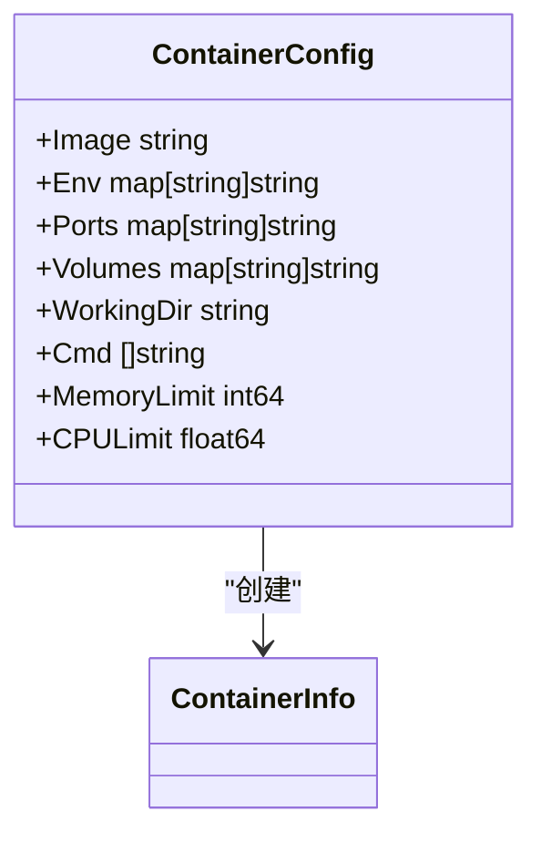
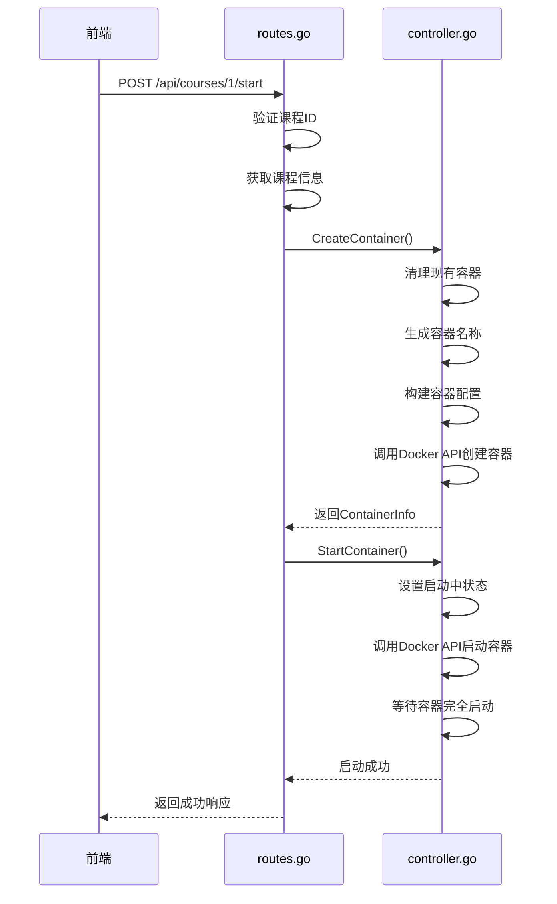
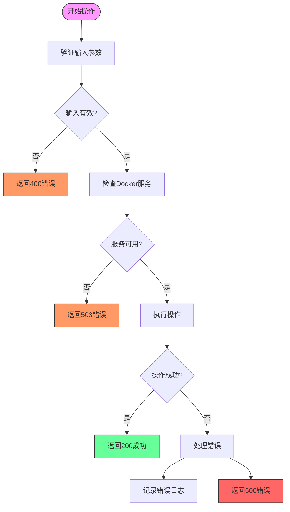
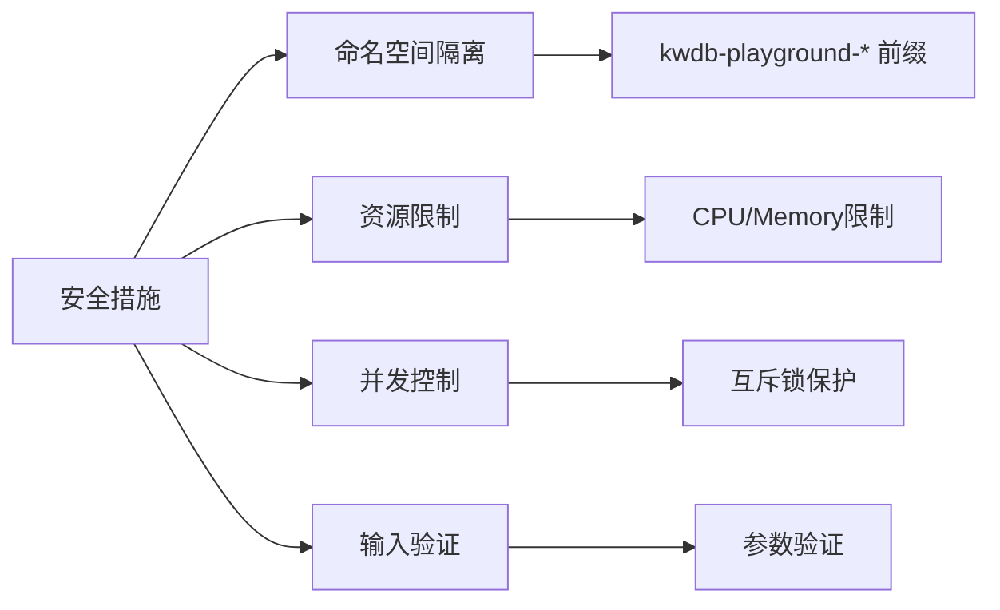
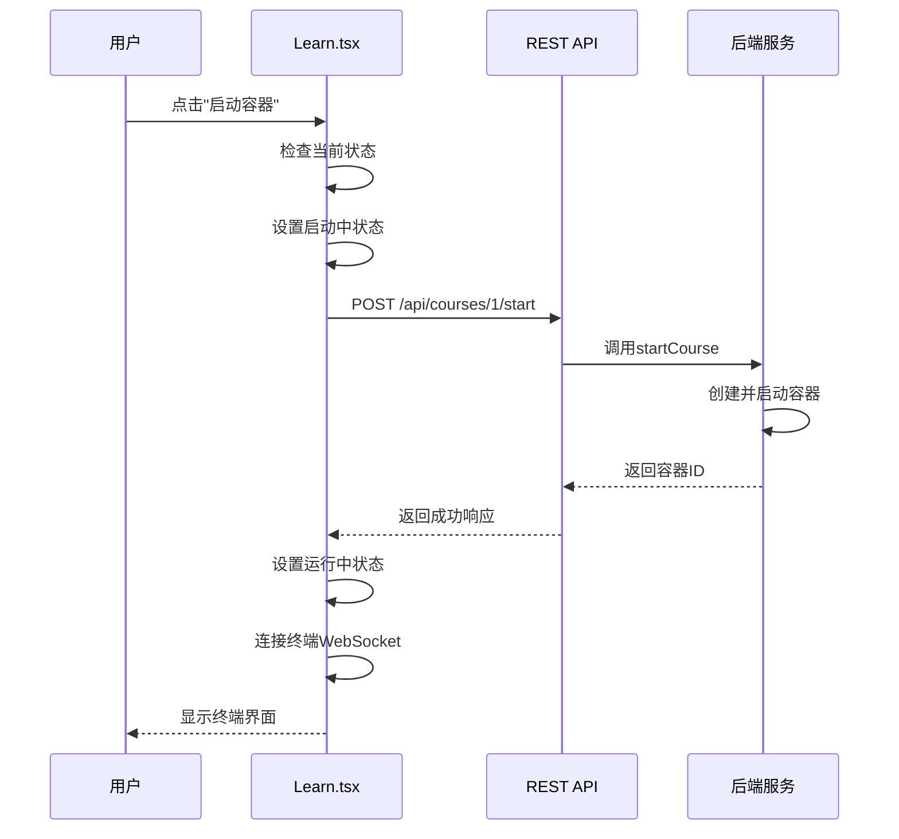
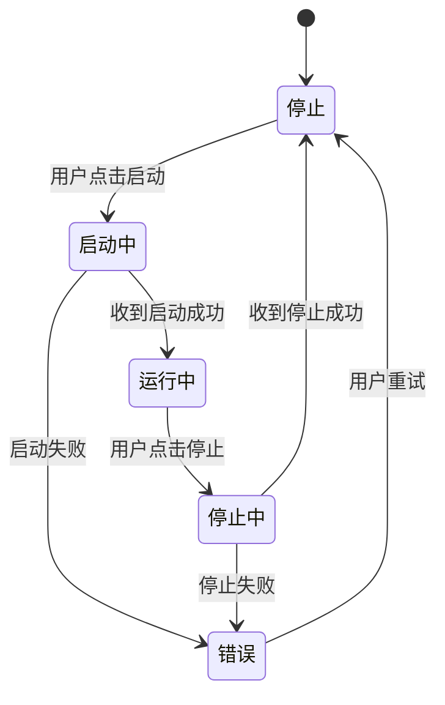

# 容器管理API

<cite>
**本文档引用的文件**   
- [routes.go](file://internal/api/routes.go)
- [controller.go](file://internal/docker/controller.go)
- [types.go](file://internal/docker/types.go)
- [Learn.tsx](file://src/pages/Learn.tsx)
</cite>

## 目录
1. [简介](#简介)
2. [核心接口](#核心接口)
3. [容器状态管理](#容器状态管理)
4. [异常处理与安全](#异常处理与安全)
5. [前端调用流程](#前端调用流程)
6. [总结](#总结)

## 简介

本技术文档详细描述了playground项目中用于管理Docker容器的RESTful接口。这些接口为用户提供了一套完整的课程实验环境管理功能，包括启动、停止和查询容器状态等操作。系统通过Docker API与底层容器引擎交互，为每个课程创建隔离的运行环境。

容器管理API的设计遵循RESTful原则，通过清晰的HTTP方法和路径参数来表达操作意图。所有接口都提供了详细的错误处理机制和状态码语义，确保客户端能够准确理解操作结果。系统还实现了幂等性设计，防止重复操作导致的状态不一致。

**Section sources**
- [routes.go](file://internal/api/routes.go#L1-L100)

## 核心接口

### POST /api/courses/:id/start - 启动课程容器

该接口为指定课程ID启动Docker容器环境，提供隔离的实验环境。

**HTTP方法**: POST  
**路径参数**: 
- `id`: 课程ID

**请求体**: 无

**响应格式**:
```json
{
  "message": "课程容器启动成功",
  "courseId": "course-1",
  "containerId": "kwdb-playground-course-1-1700000000",
  "image": "kwdb/kwdb:latest"
}
```

**状态码语义**:
- `200`: 容器启动成功或已在运行中
- `400`: 课程ID不能为空
- `404`: 课程不存在
- `500`: 容器启动失败

接口首先验证课程ID的有效性，然后检查Docker控制器是否可用。为防止并发创建容器，使用互斥锁保护操作。系统会先检查是否已有该课程的运行中容器，如果存在则返回已运行状态，实现幂等性设计。

**Section sources**
- [routes.go](file://internal/api/routes.go#L168-L302)

### POST /api/courses/:id/stop - 停止课程容器

该接口停止指定课程的Docker容器并清理相关资源。

**HTTP方法**: POST  
**路径参数**: 
- `id`: 课程ID

**请求体**: 无

**响应格式**:
```json
{
  "message": "课程容器停止成功",
  "courseId": "course-1",
  "containerId": "kwdb-playground-course-1-1700000000"
}
```

**状态码语义**:
- `200`: 容器停止成功
- `400`: 课程ID不能为空
- `404`: 未找到课程对应的容器
- `500`: 容器停止失败

接口通过课程ID查找对应的容器，使用`kwdb-playground-`前缀进行匹配。找到容器后，先停止再删除，确保资源被彻底清理。即使删除操作失败，只要停止成功仍返回200状态码，保证操作的可靠性。

**Section sources**
- [routes.go](file://internal/api/routes.go#L316-L402)

### GET /api/courses/:id/status - 获取容器状态

该接口获取指定容器的运行状态和基本信息。

**HTTP方法**: GET  
**路径参数**: 
- `id`: 容器名称或ID

**请求体**: 无

**响应格式**:
```json
{
  "status": "running",
  "containerId": "kwdb-playground-course-1-1700000000",
  "info": {
    "id": "kwdb-playground-course-1-1700000000",
    "courseId": "course-1",
    "dockerId": "abc123def456",
    "image": "kwdb/kwdb:latest",
    "startedAt": "2023-11-15T10:30:00Z",
    "ports": {
      "8080/tcp": "32768"
    },
    "env": {
      "ENV": "development"
    }
  }
}
```

**状态码语义**:
- `200`: 获取成功
- `400`: 容器ID不能为空
- `404`: 容器不存在
- `500`: 获取容器状态失败

接口首先尝试直接获取容器信息，如果失败则通过容器列表查找匹配的容器。这种双重查找机制提高了接口的鲁棒性，能够处理各种边界情况。

**Section sources**
- [routes.go](file://internal/api/routes.go#L416-L492)

## 容器状态管理

### 容器状态模型

`ContainerInfo`结构体定义了容器的完整信息，是API响应的核心数据模型。



**Diagram sources**
- [types.go](file://internal/docker/types.go#L1-L48)

### 容器配置模型

`ContainerConfig`结构体定义了创建容器时的配置参数，包括资源限制和环境设置。



**Diagram sources**
- [types.go](file://internal/docker/types.go#L1-L48)

### 容器生命周期管理

容器的创建和启动过程涉及多个步骤，确保容器能够正确初始化。



**Diagram sources**
- [routes.go](file://internal/api/routes.go#L168-L302)
- [controller.go](file://internal/docker/controller.go#L507-L606)

## 异常处理与安全

### 异常处理机制

系统实现了多层次的异常处理机制，确保在各种故障情况下都能提供有意义的反馈。



当Docker守护进程不可达时，系统会尝试多个socket路径进行连接，包括macOS和Linux的标准路径。这种容错设计提高了系统的兼容性和可靠性。

**Section sources**
- [controller.go](file://internal/docker/controller.go#L1-L100)

### 幂等性设计

所有容器操作都实现了幂等性设计，确保重复调用不会产生意外结果。

- **启动操作**: 在创建容器前，会清理该课程的所有现有容器。同时检查是否已有运行中的容器，如果有则直接返回成功状态。
- **停止操作**: 即使容器已经停止或不存在，接口仍返回成功状态，确保清理操作的可靠性。
- **状态查询**: 接口支持通过ID或名称匹配查找容器，提高了查询的灵活性。

这种设计使得前端可以安全地重复调用接口，无需担心状态不一致问题。

**Section sources**
- [routes.go](file://internal/api/routes.go#L168-L302)
- [controller.go](file://internal/docker/controller.go#L415-L472)

### 安全考虑

系统实施了多项安全措施，防止非法容器操作：

1. **命名空间隔离**: 所有课程容器都使用`kwdb-playground-`前缀命名，确保容器名称的唯一性和可识别性。
2. **资源限制**: 支持CPU和内存限制配置，防止单个容器耗尽系统资源。
3. **并发控制**: 使用互斥锁防止并发创建或删除容器，避免竞态条件。
4. **输入验证**: 对所有输入参数进行严格验证，防止注入攻击。



**Diagram sources**
- [controller.go](file://internal/docker/controller.go#L237-L257)
- [types.go](file://internal/docker/types.go#L1-L48)

## 前端调用流程

### 从Learn.tsx触发课程启动

前端页面Learn.tsx通过一系列步骤触发课程容器的启动，展示了完整的用户交互流程。



**Diagram sources**
- [Learn.tsx](file://src/pages/Learn.tsx#L1-L821)
- [routes.go](file://internal/api/routes.go#L168-L302)

### 前端状态管理

前端使用状态机模式管理容器的生命周期状态，确保UI与后端状态保持同步。



前端代码中实现了详细的错误处理和重试机制。例如，在启动容器后，会定期检查容器状态，直到确认容器完全启动或超时。这种设计提供了更好的用户体验，避免了因短暂延迟导致的失败感知。

**Section sources**
- [Learn.tsx](file://src/pages/Learn.tsx#L1-L821)

## 总结

playground项目的容器管理API提供了一套完整、可靠且安全的课程实验环境管理功能。通过精心设计的RESTful接口，系统实现了容器的创建、启动、停止和状态查询等核心操作。

关键特性包括：
- **幂等性设计**: 确保重复操作不会产生意外结果
- **异常处理**: 多层次的错误处理机制，提供有意义的反馈
- **安全性**: 命名空间隔离和资源限制，防止非法操作
- **可靠性**: 容错设计和状态同步机制，确保系统稳定运行

这些接口与前端页面紧密集成，为用户提供流畅的课程学习体验。通过WebSocket终端连接，用户可以直接在浏览器中与容器环境交互，实现了真正的云端实验平台。

**Section sources**
- [routes.go](file://internal/api/routes.go#L1-L694)
- [controller.go](file://internal/docker/controller.go#L1-L1199)
- [types.go](file://internal/docker/types.go#L1-L48)
- [Learn.tsx](file://src/pages/Learn.tsx#L1-L821)