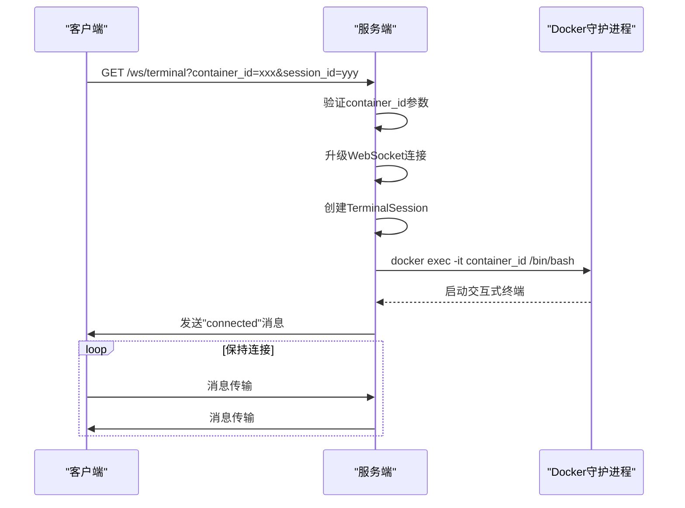
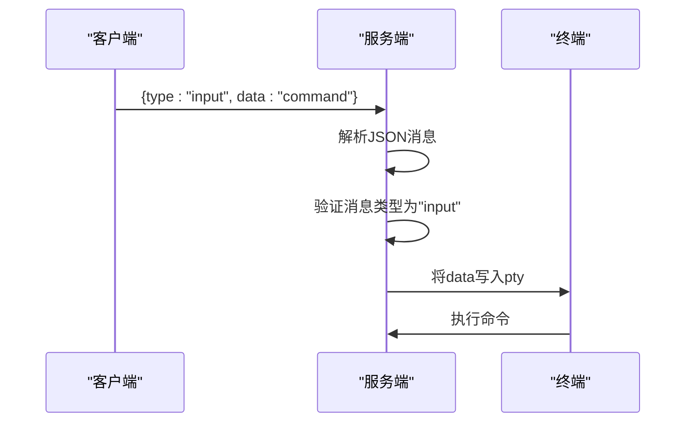
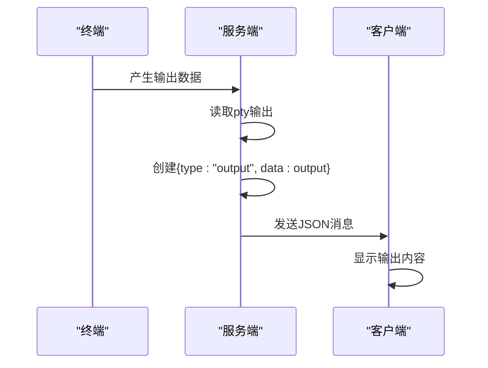
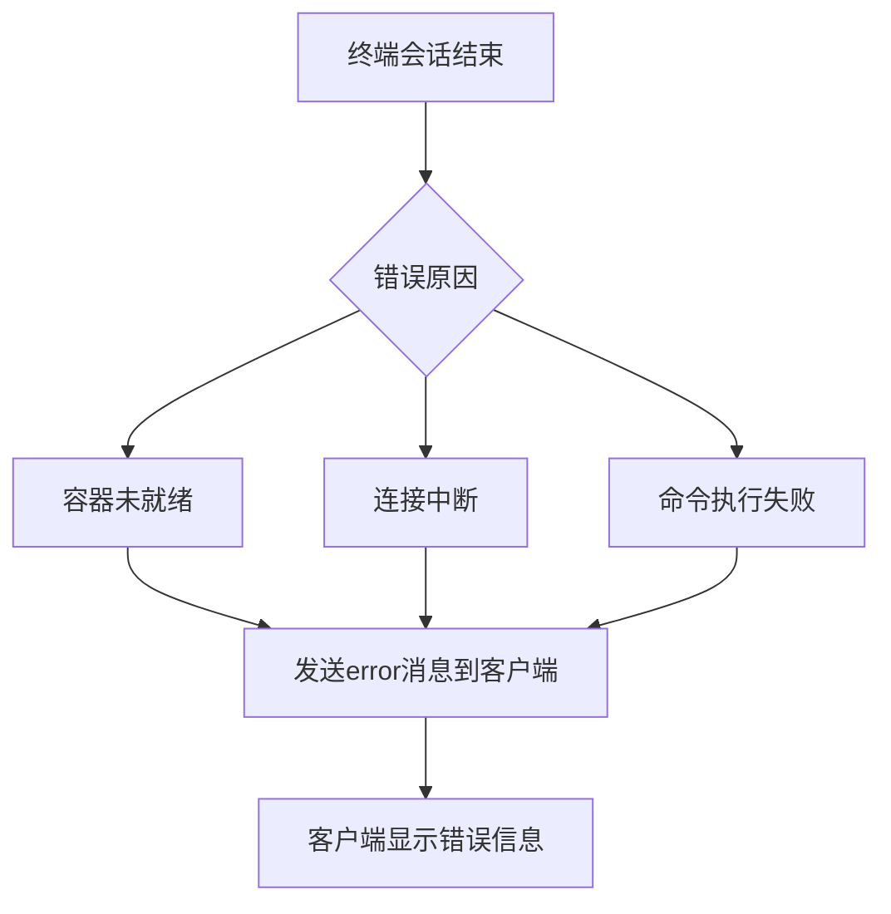

# 终端WebSocket API

<cite>
**本文档引用的文件**
- [terminal.go](file://internal/websocket/terminal.go)
- [Terminal.tsx](file://src/components/Terminal.tsx)
- [routes.go](file://internal/api/routes.go)
</cite>

## 目录
1. [简介](#简介)
2. [连接建立流程](#连接建立流程)
3. [消息协议](#消息协议)
4. [交互模式](#交互模式)
5. [客户端实现](#客户端实现)
6. [边界情况处理](#边界情况处理)
7. [Docker集成](#docker集成)

## 简介
本文档详细说明了playground项目中终端WebSocket接口的协议规范，聚焦于`GET /ws/terminal`端点。该接口为用户提供与Docker容器的交互式终端连接，支持命令输入、输出流推送、终端尺寸调整等完整终端功能。

**Section sources**
- [terminal.go](file://internal/websocket/terminal.go#L1-L208)
- [routes.go](file://internal/api/routes.go#L637-L693)

## 连接建立流程

### WebSocket连接端点
```
GET /ws/terminal
```

### 查询参数
- `container_id` (必需): 目标容器的ID
- `session_id` (可选): 会话ID，若未提供则自动生成

### 连接建立步骤
1. 客户端发起WebSocket连接请求，携带`container_id`参数
2. 服务端验证`container_id`参数有效性
3. 创建WebSocket连接升级器，允许所有来源
4. 升级HTTP连接为WebSocket连接
5. 创建终端会话实例并启动交互式bash会话
6. 保持连接直到客户端断开或会话结束



**Diagram sources**
- [routes.go](file://internal/api/routes.go#L637-L693)
- [terminal.go](file://internal/websocket/terminal.go#L81-L111)

**Section sources**
- [routes.go](file://internal/api/routes.go#L637-L693)
- [terminal.go](file://internal/websocket/terminal.go#L81-L111)

## 消息协议

### 消息结构
所有WebSocket消息均为JSON格式，包含以下字段：

```json
{
  "type": "消息类型",
  "data": "消息数据"
}
```

### 消息类型定义

| 消息类型 | 方向 | 描述 | 示例 |
|---------|------|------|------|
| `input` | 客户端 → 服务端 | 用户输入的命令 | `{"type": "input", "data": "ls -l"}` |
| `output` | 服务端 → 客户端 | 终端输出内容 | `{"type": "output", "data": "file1.txt file2.txt"}` |
| `connected` | 服务端 → 客户端 | 连接成功确认 | `{"type": "connected", "data": "Terminal session started"}` |
| `error` | 服务端 → 客户端 | 错误信息 | `{"type": "error", "data": "终端会话结束: exit status 1"}` |

```mermaid
classDiagram
class Message {
+string type
+string data
}
Message : type : input|output|connected|error
Message : data : string
```

**Diagram sources**
- [terminal.go](file://internal/websocket/terminal.go#L17-L20)

**Section sources**
- [terminal.go](file://internal/websocket/terminal.go#L17-L20)

## 交互模式

### 终端会话初始化
当`StartInteractiveSession`方法被调用时，系统执行以下操作：
1. 创建`docker exec -it [container_id] /bin/bash`命令
2. 使用`pty`包创建伪终端以支持交互式操作
3. 发送`connected`消息到客户端确认连接建立
4. 启动三个goroutine处理双向通信

### 命令输入转发


**Section sources**
- [terminal.go](file://internal/websocket/terminal.go#L114-L135)

### 输出流推送


**Section sources**
- [terminal.go](file://internal/websocket/terminal.go#L138-L165)

### 终端尺寸调整
虽然当前实现中未显式处理resize事件，但通过xterm.js的fit插件实现了自适应尺寸调整：
1. 监听窗口resize事件
2. 调用fitAddon.fit()方法调整终端尺寸
3. 终端自动适应容器大小

**Section sources**
- [Terminal.tsx](file://src/components/Terminal.tsx#L108-L113)

## 客户端实现

### JavaScript客户端示例
```typescript
// 在Terminal.tsx组件中实现
const connectWebSocket = useCallback(() => {
  const protocol = window.location.protocol === 'https:' ? 'wss:' : 'ws:';
  const wsUrl = `${protocol}//${window.location.host}/ws/terminal?container_id=${containerId}&session_id=${Date.now()}`;
  
  const ws = new WebSocket(wsUrl);
  
  ws.onopen = () => {
    // 连接成功处理
  };

  ws.onmessage = (event) => {
    try {
      const message = JSON.parse(event.data);
      if (message.type === 'output') {
        xtermRef.current.write(message.data);
      } else if (message.type === 'error') {
        xtermRef.current.write(`\r\n错误: ${message.data}\r\n`);
      }
    } catch {
      // 非JSON格式数据直接显示
      xtermRef.current.write(event.data);
    }
  };
  
  // 其他事件处理...
}, [containerId]);
```

### 命令发送方法
```typescript
const sendCommand = useCallback((command: string) => {
  if (wsRef.current && wsRef.current.readyState === WebSocket.OPEN) {
    const message = {
      type: 'input',
      data: command + '\r'
    };
    wsRef.current.send(JSON.stringify(message));
  }
}, []);
```

**Section sources**
- [Terminal.tsx](file://src/components/Terminal.tsx#L114-L213)

## 边界情况处理

### 连接超时
- 服务端无显式超时设置，连接保持直到客户端断开或会话结束
- 客户端可配置WebSocket超时机制

### 会话恢复
- 当前实现不支持会话恢复
- 每次连接都创建新的会话实例
- 会话ID可由客户端指定以实现一定程度的会话管理

### 错误通知


当发生错误时，服务端会：
1. 记录错误日志
2. 发送`error`类型的消息到客户端
3. 关闭终端会话

**Section sources**
- [terminal.go](file://internal/websocket/terminal.go#L168-L181)

## Docker集成

### Docker Exec API集成
终端会话通过以下方式与Docker Exec API集成：

```mermaid
graph TD
A[TerminalSession] --> B[docker exec]
B --> C[创建命令]
C --> D["exec.CommandContext(ctx, \"docker\", \"exec\", \"-it\", containerID, \"/bin/bash\")"]
D --> E[pty.Start(cmd)]
E --> F[创建伪终端]
F --> G[双向数据流]
G --> H[WebSocket连接]
```

### 集成要点
1. 使用`exec.CommandContext`创建Docker exec命令
2. 通过`pty`包创建伪终端，支持交互式操作
3. 标准输入从WebSocket接收并写入pty
4. 标准输出从pty读取并发送到WebSocket
5. 命令执行完成后自动清理资源

**Section sources**
- [terminal.go](file://internal/websocket/terminal.go#L81-L111)
- [controller.go](file://internal/docker/controller.go#L578-L585)