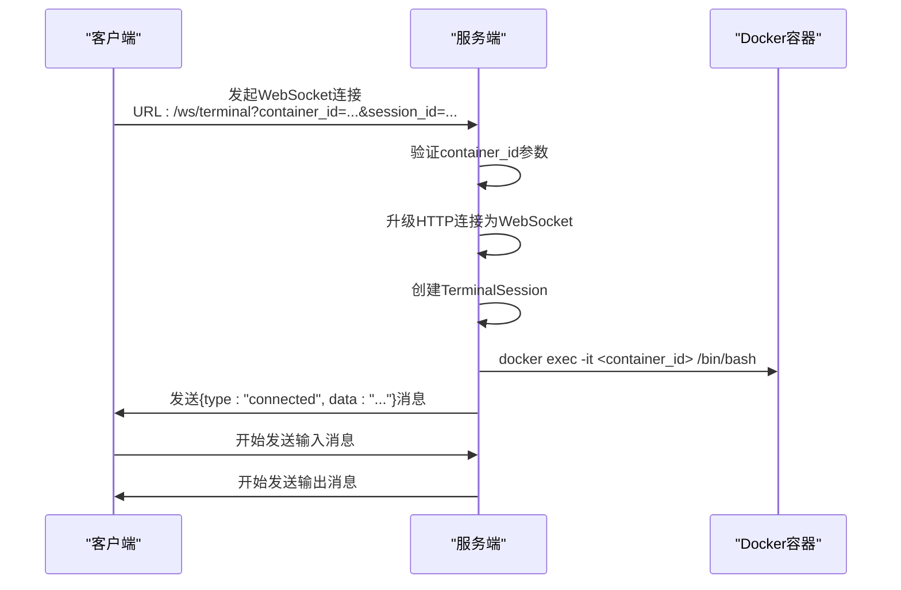
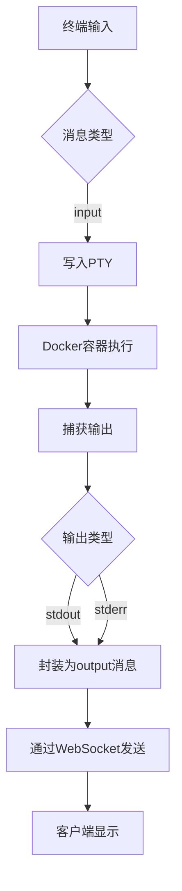
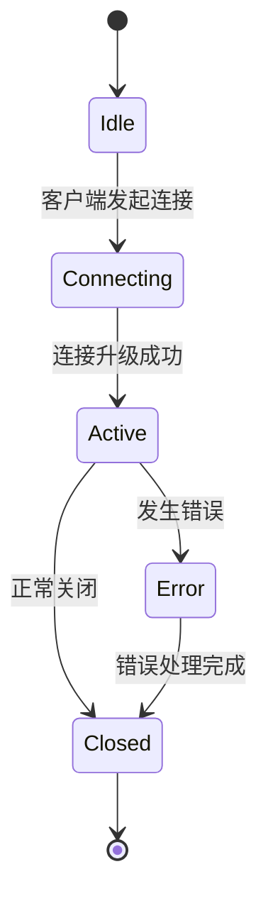

# WebSocket API

<cite>
**本文档引用文件**  
- [terminal.go](file://internal/websocket/terminal.go)
- [Terminal.tsx](file://src/components/Terminal.tsx)
- [routes.go](file://internal/api/routes.go)
- [logger.go](file://internal/logger/logger.go)
</cite>

## 目录
1. [引言](#引言)
2. [连接建立](#连接建立)
3. [消息协议](#消息协议)
4. [会话生命周期](#会话生命周期)
5. [会话管理与Docker集成](#会话管理与docker集成)
6. [客户端实现](#客户端实现)
7. [安全与性能建议](#安全与性能建议)
8. [结论](#结论)

## 引言
本文档详细说明了playground项目中WebSocket终端接口（/ws/terminal）的完整通信协议。该接口为用户提供了一个交互式终端环境，通过WebSocket协议与后端Docker容器进行实时通信。文档涵盖了从连接建立、消息格式、会话管理到客户端实现的各个方面，旨在为开发者提供全面的技术参考。

**Section sources**
- [terminal.go](file://internal/websocket/terminal.go#L1-L20)
- [routes.go](file://internal/api/routes.go#L637-L693)

## 连接建立
客户端通过向`/ws/terminal`端点发起WebSocket Upgrade请求来建立连接。请求必须包含必要的查询参数以标识目标容器和会话。

### 必需查询参数
- `container_id`: 目标Docker容器的ID，用于绑定终端会话到特定容器
- `session_id`: 会话唯一标识符，用于会话跟踪和管理（可选，未提供时服务端自动生成）

### 连接流程
1. 客户端构造WebSocket URL，包含`container_id`和可选的`session_id`
2. 发起WebSocket连接请求
3. 服务端验证参数并升级连接
4. 创建终端会话并启动交互式bash shell
5. 发送连接成功确认消息



**Diagram sources**
- [routes.go](file://internal/api/routes.go#L637-L693)
- [terminal.go](file://internal/websocket/terminal.go#L81-L111)

**Section sources**
- [routes.go](file://internal/api/routes.go#L637-L693)
- [terminal.go](file://internal/websocket/terminal.go#L81-L111)

## 消息协议
WebSocket连接建立后，客户端和服务端通过JSON格式的消息帧进行双向通信。消息遵循统一的结构，包含类型和数据字段。

### 消息结构
```json
{
  "type": "消息类型",
  "data": "消息内容"
}
```

### 消息类型
| 类型 | 方向 | 描述 |
|------|------|------|
| input | 客户端 → 服务端 | 客户端发送的终端输入命令 |
| output | 服务端 → 客户端 | 终端的标准输出和标准错误流 |
| connected | 服务端 → 客户端 | 连接建立成功的确认消息 |
| error | 服务端 → 客户端 | 会话错误或异常信息 |

### 客户端输入
客户端发送`input`类型的消息，`data`字段包含用户输入的命令文本。消息必须为JSON格式：
```json
{"type": "input", "data": "ls -la\n"}
```

### 服务端输出
服务端将终端的所有输出（包括stdout和stderr）封装为`output`类型的消息发送给客户端。输出数据保持原始格式，包含控制字符和ANSI转义序列。



**Diagram sources**
- [terminal.go](file://internal/websocket/terminal.go#L114-L135)
- [terminal.go](file://internal/websocket/terminal.go#L138-L165)

**Section sources**
- [terminal.go](file://internal/websocket/terminal.go#L17-L20)
- [terminal.go](file://internal/websocket/terminal.go#L114-L165)

## 会话生命周期
终端会话具有明确的生命周期，包括创建、运行和终止三个阶段，服务端通过事件机制管理会话状态。

### 会话事件
- **open**: 连接建立成功，服务端发送`connected`消息
- **close**: 客户端或服务端主动关闭连接
- **error**: 会话过程中发生错误，服务端发送`error`消息

### 会话状态转换


### 异常恢复机制
服务端实现了基本的重连策略：
1. 会话ID持久化：使用提供的或生成的session_id标识会话
2. 会话清理：新会话创建时自动清理同ID的旧会话
3. 连接保持：通过心跳机制维持长连接

当连接意外中断时，客户端可以使用相同的session_id重新连接，服务端会创建新的WebSocket连接并绑定到相同的容器会话。

**Diagram sources**
- [terminal.go](file://internal/websocket/terminal.go#L168-L181)
- [terminal.go](file://internal/websocket/terminal.go#L184-L194)

**Section sources**
- [terminal.go](file://internal/websocket/terminal.go#L56-L78)
- [terminal.go](file://internal/websocket/terminal.go#L168-L194)

## 会话管理与Docker集成
终端会话管理器负责协调WebSocket连接与Docker容器之间的交互，实现安全的终端访问。

### 终端管理器架构
```mermaid
classDiagram
class TerminalManager {
+sessions map[string]*TerminalSession
+mu sync.RWMutex
+logger *logger.Logger
+CreateSession(sessionID, containerID, conn)
+RemoveSession(sessionID)
+SetLogger(logger)
}
class TerminalSession {
+sessionID string
+containerID string
+conn *websocket.Conn
+cmd *exec.Cmd
+pty *os.File
+ctx context.Context
+cancel context.CancelFunc
+logger *logger.Logger
+StartInteractiveSession()
+handleWebSocketInput()
+handleTerminalOutput()
+waitForTerminalExit()
+Close()
+Done()
}
TerminalManager --> TerminalSession : "管理"
TerminalSession --> "docker exec" : "创建"
TerminalSession --> WebSocket : "通信"
```

**Diagram sources**
- [terminal.go](file://internal/websocket/terminal.go#L35-L39)
- [terminal.go](file://internal/websocket/terminal.go#L23-L32)

### 核心处理流程
1. **会话创建**: `CreateSession`方法创建新的终端会话，清理同ID的旧会话
2. **Docker集成**: `StartInteractiveSession`使用`docker exec -it`命令连接到指定容器
3. **伪终端(PTY)**: 使用`github.com/creack/pty`库创建伪终端，支持交互式操作
4. **双向通信**: 启动三个goroutine分别处理输入、输出和会话终止

### 终端尺寸调整
虽然当前实现未显式处理终端尺寸调整，但xterm.js客户端的fit插件会自动调整终端大小以适应容器元素。服务端通过PTY自动继承WebSocket连接的终端尺寸。

### 输入流控制
服务端通过非阻塞I/O模式处理输入流，使用`select`语句监听上下文完成信号，确保在会话关闭时能及时终止输入处理。

**Section sources**
- [terminal.go](file://internal/websocket/terminal.go#L56-L194)
- [routes.go](file://internal/api/routes.go#L637-L693)

## 客户端实现
前端使用React和xterm.js库实现交互式终端组件，提供了完整的用户界面和WebSocket通信逻辑。

### JavaScript客户端示例
```javascript
// 创建终端实例
const terminal = new Terminal({
  cursorBlink: true,
  fontSize: 14,
  fontFamily: '"JetBrains Mono", "Fira Code", ...',
  theme: {
    background: '#0d1117',
    foreground: '#f0f6fc',
  }
});

// 建立WebSocket连接
const ws = new WebSocket(`${protocol}//${host}/ws/terminal?container_id=${containerId}&session_id=${Date.now()}`);

// 处理用户输入
terminal.onData((data) => {
  if (ws.readyState === WebSocket.OPEN) {
    const message = { type: 'input', data: data };
    ws.send(JSON.stringify(message));
  }
});

// 处理服务端消息
ws.onmessage = (event) => {
  try {
    const message = JSON.parse(event.data);
    if (message.type === 'output') {
      terminal.write(message.data);
    } else if (message.type === 'error') {
      terminal.write(`\r\n错误: ${message.data}\r\n`);
    }
  } catch {
    // 非JSON消息直接显示
    terminal.write(event.data);
  }
};
```

### 组件特性
- **现代化主题**: 深色主题，支持语法高亮颜色
- **字体优化**: 使用等宽编程字体，提升可读性
- **响应式设计**: 使用fit插件自动调整大小
- **连接管理**: 自动重连和状态指示

**Section sources**
- [Terminal.tsx](file://src/components/Terminal.tsx#L15-L213)

## 安全与性能建议
为确保终端服务的安全性和高性能，建议采取以下措施。

### 安全考虑
- **连接鉴权**: 当前实现允许所有来源连接（CheckOrigin返回true），生产环境应实现来源验证或令牌鉴权
- **输入过滤**: 服务端直接执行客户端发送的所有输入，应考虑实现输入验证和命令白名单
- **容器隔离**: 确保Docker容器运行在适当的隔离环境中，限制资源使用
- **会话超时**: 实现会话空闲超时机制，自动清理长时间未活动的会话

### 性能建议
- **消息缓冲**: 对于高频率输出场景，实现服务端消息缓冲和批量发送
- **流量控制**: 实现WebSocket流量控制机制，防止客户端被大量输出淹没
- **连接复用**: 对于频繁交互场景，考虑实现连接池和会话复用
- **日志级别**: 根据环境调整日志级别，生产环境使用INFO或WARN级别减少日志开销

**Section sources**
- [routes.go](file://internal/api/routes.go#L637-L693)
- [terminal.go](file://internal/websocket/terminal.go#L114-L165)

## 结论
WebSocket终端接口为playground项目提供了强大的交互式终端功能，通过简洁的协议设计和高效的Docker集成，实现了流畅的用户体验。文档详细说明了从连接建立到消息通信的完整流程，并提供了客户端实现参考。通过实施建议的安全和性能优化措施，可以进一步提升系统的稳定性和安全性。