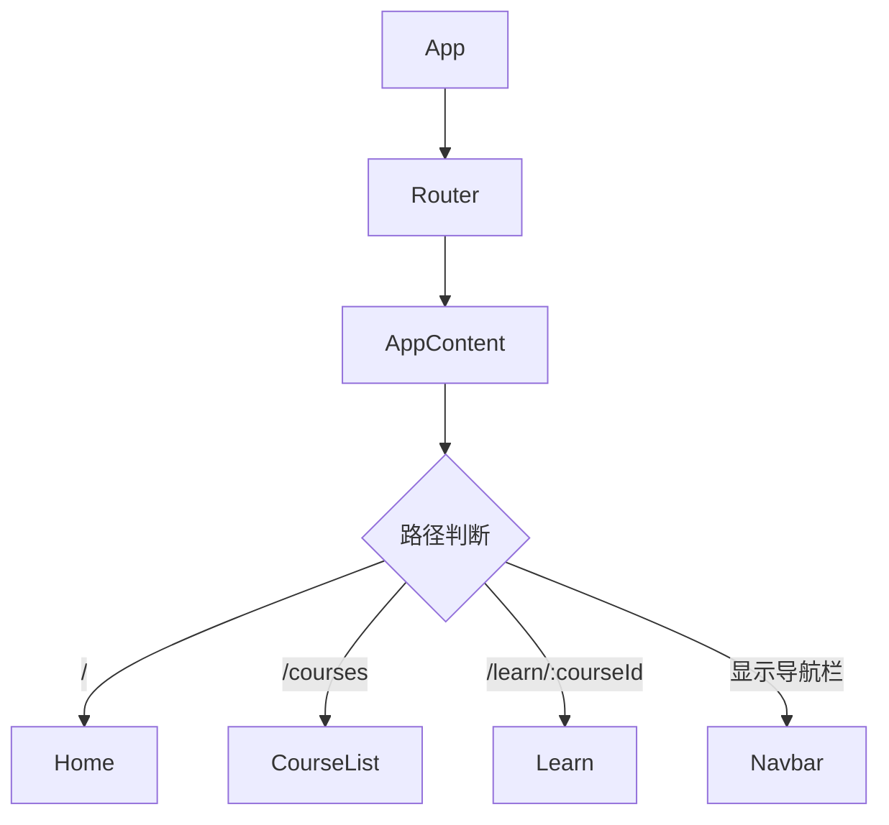
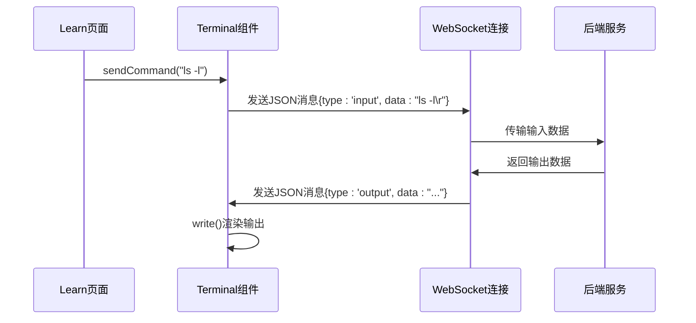
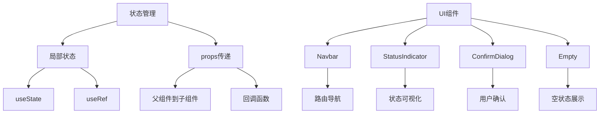

# 前端架构

<cite>
**本文档引用的文件**  
- [App.tsx](file://src/App.tsx)
- [Learn.tsx](file://src/pages/Learn.tsx)
- [Terminal.tsx](file://src/components/Terminal.tsx)
- [useTheme.ts](file://src/hooks/useTheme.ts)
- [utils.ts](file://src/lib/utils.ts)
- [StatusIndicator.tsx](file://src/components/StatusIndicator.tsx)
- [Navbar.tsx](file://src/components/Navbar.tsx)
- [Home.tsx](file://src/pages/Home.tsx)
- [CourseList.tsx](file://src/pages/CourseList.tsx)
- [ConfirmDialog.tsx](file://src/components/ConfirmDialog.tsx)
- [Empty.tsx](file://src/components/Empty.tsx)
</cite>

## 目录
1. [项目结构](#项目结构)
2. [路由与页面映射](#路由与页面映射)
3. [核心组件交互机制](#核心组件交互机制)
4. [终端功能实现](#终端功能实现)
5. [状态管理与UI组件](#状态管理与ui组件)
6. [主题切换与工具函数](#主题切换与工具函数)
7. [样式与响应式设计](#样式与响应式设计)
8. [性能优化与扩展建议](#性能优化与扩展建议)

## 项目结构

前端代码组织遵循功能模块化原则，主要目录结构如下：
- `src/components`：存放可复用的UI组件，如导航栏、状态指示器、确认对话框等
- `src/pages`：存放页面级组件，包括首页、课程列表和学习页面
- `src/hooks`：存放自定义Hook，如主题切换逻辑
- `src/lib`：存放工具函数库
- `src/styles`：存放样式常量和CSS文件
- `src/App.tsx`：应用根组件，负责路由配置和全局布局

**Section sources**
- [App.tsx](file://src/App.tsx#L1-L34)
- [Navbar.tsx](file://src/components/Navbar.tsx#L4-L97)
- [Home.tsx](file://src/pages/Home.tsx#L1-L44)
- [CourseList.tsx](file://src/pages/CourseList.tsx#L1-L163)

## 路由与页面映射

应用使用React Router实现路由管理，`App.tsx`中的路由配置将不同路径映射到相应的页面组件。通过`AppContent`组件根据当前路由决定是否显示导航栏，在学习页面不显示导航栏以提供更专注的学习体验。



**Diagram sources**
- [App.tsx](file://src/App.tsx#L1-L34)

**Section sources**
- [App.tsx](file://src/App.tsx#L1-L34)

## 核心组件交互机制

学习页面（Learn.tsx）作为核心交互界面，整合了多个组件实现完整的学习流程。页面通过URL参数获取课程ID，使用`useParams`和`useNavigate`进行路由参数管理和页面跳转。

```mermaid
classDiagram
class Learn {
+courseId : string
+course : Course
+currentStep : number
+containerId : string
+containerStatus : string
+terminalRef : Ref
+fetchCourse() : Promise
+startCourseContainer() : Promise
+stopContainer() : Promise
+handleExecButtonClick() : void
+renderMarkdown() : JSX.Element
}
class TerminalComponent {
+containerId : string
+sendCommand() : void
}
class StatusIndicator {
+status : StatusType
+label : string
}
class ConfirmDialog {
+isOpen : boolean
+onConfirm() : void
+onCancel() : void
}
Learn --> TerminalComponent : "ref引用"
Learn --> StatusIndicator : "状态显示"
Learn --> ConfirmDialog : "退出确认"
Learn --> "Markdown渲染" : "内容展示"
```

**Diagram sources**
- [Learn.tsx](file://src/pages/Learn.tsx#L34-L820)

**Section sources**
- [Learn.tsx](file://src/pages/Learn.tsx#L34-L820)

## 终端功能实现

`Terminal.tsx`组件通过WebSocket连接后端终端服务，实现双向通信。组件使用xterm.js库渲染终端界面，通过`useRef`暴露`sendCommand`方法供父组件调用，实现从课程内容到终端的命令执行。



**Diagram sources**
- [Terminal.tsx](file://src/components/Terminal.tsx#L15-L213)
- [Learn.tsx](file://src/pages/Learn.tsx#L34-L820)

**Section sources**
- [Terminal.tsx](file://src/components/Terminal.tsx#L15-L213)
- [Learn.tsx](file://src/pages/Learn.tsx#L34-L820)

## 状态管理与UI组件

应用采用局部状态管理策略，通过`useState`和`useEffect`管理组件状态。`StatusIndicator`组件统一处理各种状态显示，支持不同尺寸和状态类型。`ConfirmDialog`组件提供模态对话框功能，用于关键操作的确认。



**Diagram sources**
- [StatusIndicator.tsx](file://src/components/StatusIndicator.tsx#L115-L197)
- [ConfirmDialog.tsx](file://src/components/ConfirmDialog.tsx#L14-L134)
- [Empty.tsx](file://src/components/Empty.tsx#L3-L7)

**Section sources**
- [StatusIndicator.tsx](file://src/components/StatusIndicator.tsx#L115-L197)
- [ConfirmDialog.tsx](file://src/components/ConfirmDialog.tsx#L14-L134)
- [Empty.tsx](file://src/components/Empty.tsx#L3-L7)

## 主题切换与工具函数

`useTheme`自定义Hook实现主题切换逻辑，优先使用用户本地存储的主题设置，其次根据系统偏好选择主题。`utils.ts`中的`cn`函数结合clsx和tailwind-merge，提供条件类名合并功能，简化Tailwind CSS的使用。

```mermaid
classDiagram
class useTheme {
+theme : 'light'|'dark'
+toggleTheme() : void
+isDark : boolean
}
class utils {
+cn(...inputs : ClassValue[]) : string
}
useTheme --> "localStorage" : "存储主题"
useTheme --> "matchMedia" : "系统偏好"
utils --> "clsx" : "类名处理"
utils --> "tailwind-merge" : "样式合并"
```

**Diagram sources**
- [useTheme.ts](file://src/hooks/useTheme.ts#L4-L28)
- [utils.ts](file://src/lib/utils.ts#L3-L5)

**Section sources**
- [useTheme.ts](file://src/hooks/useTheme.ts#L4-L28)
- [utils.ts](file://src/lib/utils.ts#L3-L5)

## 样式与响应式设计

前端采用Tailwind CSS + CSS模块的混合样式方案，结合PostCSS和Tailwind配置实现现代化UI设计。通过`@apply`指令在CSS文件中定义可复用的样式类，同时使用内联样式处理动态样式需求。响应式设计通过Tailwind的断点系统实现，支持移动设备和桌面设备的适配。

**Section sources**
- [App.tsx](file://src/App.tsx#L1-L34)
- [Learn.tsx](file://src/pages/Learn.tsx#L34-L820)
- [Terminal.tsx](file://src/components/Terminal.tsx#L15-L213)

## 性能优化与扩展建议

为避免不必要的重渲染，组件使用`useCallback`缓存函数引用，`useMemo`缓存计算结果。对于新页面的扩展，建议遵循现有模式创建页面组件并添加路由配置。自定义UI组件应放置在`components`目录，复用现有样式和交互模式以保持一致性。

**Section sources**
- [Learn.tsx](file://src/pages/Learn.tsx#L34-L820)
- [Terminal.tsx](file://src/components/Terminal.tsx#L15-L213)
- [useTheme.ts](file://src/hooks/useTheme.ts#L4-L28)