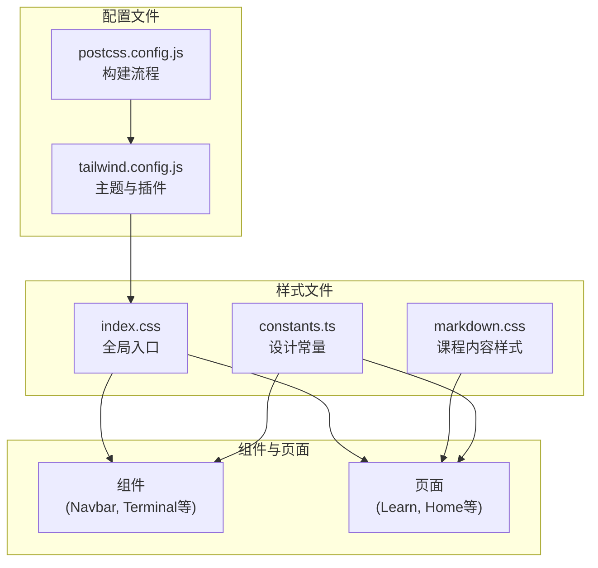
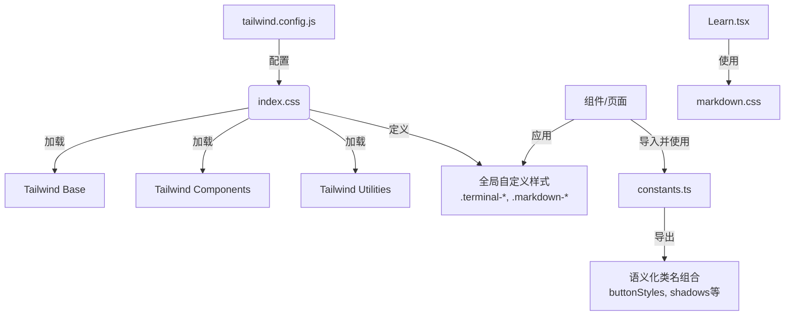
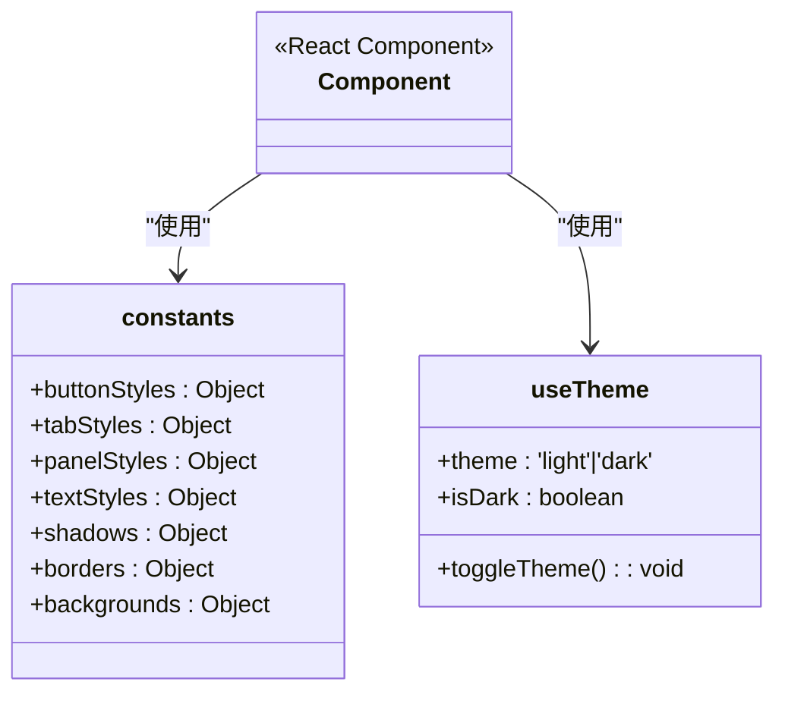
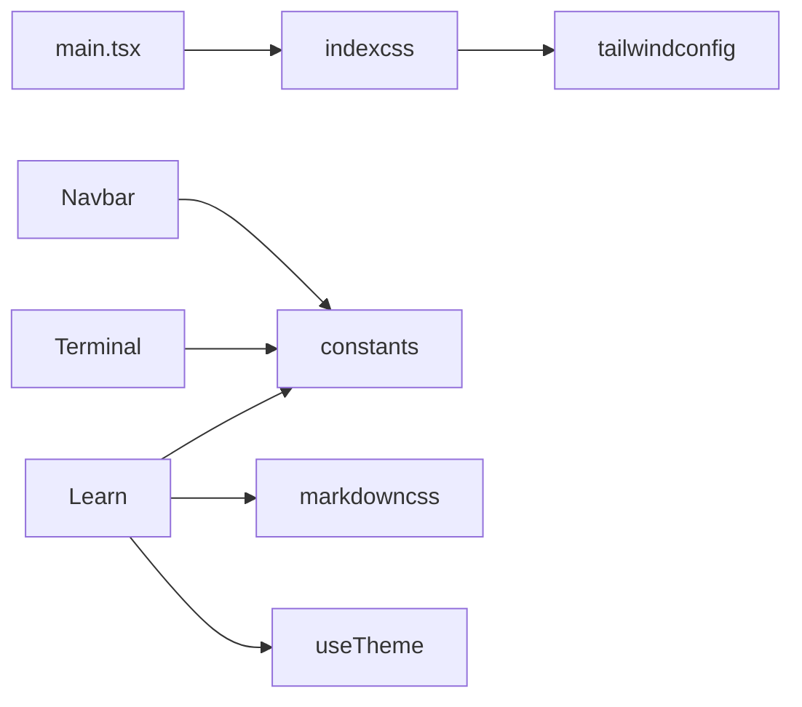

# 样式方案

<cite>
**本文档中引用的文件**  
- [index.css](file://src/styles/index.css)
- [markdown.css](file://src/styles/markdown.css)
- [constants.ts](file://src/styles/constants.ts)
- [tailwind.config.js](file://tailwind.config.js)
- [useTheme.ts](file://src/hooks/useTheme.ts)
- [Navbar.tsx](file://src/components/Navbar.tsx)
- [Terminal.tsx](file://src/components/Terminal.tsx)
- [Learn.tsx](file://src/pages/Learn.tsx)
- [main.tsx](file://src/main.tsx)
</cite>

## 目录
1. [简介](#简介)
2. [项目结构](#项目结构)
3. [核心组件](#核心组件)
4. [架构概述](#架构概述)
5. [详细组件分析](#详细组件分析)
6. [依赖分析](#依赖分析)
7. [性能考虑](#性能考虑)
8. [故障排除指南](#故障排除指南)
9. [结论](#结论)

## 简介
本项目采用Tailwind CSS与CSS模块混合的前端样式架构，旨在实现高度可维护、一致且现代化的用户界面。通过将Tailwind的实用类系统与CSS模块的自定义样式相结合，项目在保持开发效率的同时，实现了精细的视觉控制。全局样式入口`index.css`集成了Tailwind预设并定义了基础布局与终端组件的样式，而`markdown.css`则专门负责课程内容的渲染。设计变量通过`constants.ts`集中管理，确保了颜色、间距等元素的统一性。`tailwind.config.js`中的主题扩展配置支持自定义颜色和字体，并通过`useTheme`钩子实现暗色模式切换。整体架构充分考虑了响应式设计、无障碍访问和CSS性能优化。

## 项目结构
项目前端样式文件集中存放在`src/styles/`目录下，与Tailwind配置文件`tailwind.config.js`共同构成完整的样式体系。`index.css`作为全局样式入口，引入Tailwind的base、components和utilities层，并在此基础上定义项目特有的CSS类。`constants.ts`文件以TypeScript常量的形式导出常用的Tailwind类名组合，极大地提升了代码的可读性和可维护性。`markdown.css`则是一个独立的CSS模块，专门用于渲染课程页面中的Markdown内容，确保了内容展示的专业性和美观性。

**Diagram sources**
- [index.css](file://src/styles/index.css)
- [markdown.css](file://src/styles/markdown.css)
- [constants.ts](file://src/styles/constants.ts)
- [tailwind.config.js](file://tailwind.config.js)

**Section sources**
- [index.css](file://src/styles/index.css)
- [markdown.css](file://src/styles/markdown.css)
- [constants.ts](file://src/styles/constants.ts)
- [tailwind.config.js](file://tailwind.config.js)

## 核心组件
核心组件的样式实现依赖于`constants.ts`中定义的样式常量和`index.css`中的全局样式。例如，`Navbar`组件使用`buttonStyles`和`panelStyles`来构建其导航按钮和容器，确保了与应用其他部分的一致性。`Terminal`组件则大量依赖`index.css`中定义的`.terminal-font`、`.terminal-scrollbar`和`.terminal-glow`等类，以创建一个现代化、高性能的终端界面。`StatusIndicator`等状态组件通过`shadows`和`borders`常量应用统一的视觉效果。这种将实用类组合成语义化常量的策略，是项目样式架构的核心优势。

**Section sources**
- [constants.ts](file://src/styles/constants.ts)
- [index.css](file://src/styles/index.css)
- [Navbar.tsx](file://src/components/Navbar.tsx)
- [Terminal.tsx](file://src/components/Terminal.tsx)
- [StatusIndicator.tsx](file://src/components/StatusIndicator.tsx)

## 架构概述
该项目的前端样式架构采用分层设计，结合了Tailwind CSS的原子化方法和传统CSS模块的优势。`tailwind.config.js`作为配置中心，启用了`class`模式的暗色主题，并通过`tailwind-scrollbar`插件扩展功能。`index.css`作为应用的样式入口，首先加载Tailwind的三层（base, components, utilities），然后注入自定义的全局样式，特别是针对终端组件的复杂样式。`constants.ts`充当了“样式字典”的角色，将常用的Tailwind类名组合成命名常量，供所有组件复用。最后，`markdown.css`作为一个独立的CSS模块，通过CSS类名直接应用于`Learn`页面的Markdown渲染器，实现了内容样式的完全隔离和定制。

**Diagram sources**
- [tailwind.config.js](file://tailwind.config.js)
- [index.css](file://src/styles/index.css)
- [constants.ts](file://src/styles/constants.ts)
- [Learn.tsx](file://src/pages/Learn.tsx)

## 详细组件分析

### 全局样式与Tailwind集成
`index.css`文件是整个应用视觉风格的基石。它通过`@tailwind`指令将Tailwind的CSS注入到构建流程中。`:root`选择器定义了全局的字体栈和文本渲染优化，确保了跨平台的一致性。文件中定义的`.terminal-*`系列类（如`.terminal-font`、`.terminal-scrollbar`）展示了如何在Tailwind之上构建复杂的、特定于组件的样式。这些样式不仅包括字体和滚动条，还包含`.terminal-glow`这样的动画效果和`.terminal-loading`这样的状态指示器，体现了对用户体验细节的关注。此外，该文件通过媒体查询实现了对暗色模式、高对比度模式和减少动画偏好的支持。

**Section sources**
- [index.css](file://src/styles/index.css)

### Markdown内容渲染样式
`markdown.css`文件是一个功能完备的CSS模块，专门用于美化课程内容。它定义了一套完整的`.markdown-*`类名，覆盖了从标题、段落到代码块、表格的所有Markdown元素。该文件采用了现代化的设计语言，例如为内联代码和代码块应用渐变背景和圆角边框，为执行按钮添加了光效动画。其设计充分考虑了响应式需求，在移动设备上会自动调整布局。最值得注意的是，它通过`@media (prefers-color-scheme: dark)`查询实现了完整的暗色主题适配，为每个元素都定义了相应的深色变体，确保了在任何环境下都有良好的阅读体验。

**Section sources**
- [markdown.css](file://src/styles/markdown.css)
- [Learn.tsx](file://src/pages/Learn.tsx#L346-L375)

### 设计常量与主题管理
`constants.ts`文件是项目样式可维护性的关键。它将分散的Tailwind类名组织成结构化的常量对象，如`buttonStyles`、`textStyles`和`shadows`。这不仅避免了在JSX中重复书写冗长的`className`字符串，更重要的是，它创建了一个单一的“真相源”。当需要修改某个设计属性（例如主按钮的颜色）时，开发者只需在此文件中修改一次，所有使用该常量的地方都会自动更新。`useTheme.ts`钩子则负责管理应用的主题状态，它读取用户的系统偏好或本地存储设置，并通过操作`documentElement`的类名来触发Tailwind的暗色模式，实现了无缝的主题切换。

**Diagram sources**
- [constants.ts](file://src/styles/constants.ts)
- [useTheme.ts](file://src/hooks/useTheme.ts)

## 依赖分析
项目的样式依赖关系清晰且高效。`main.tsx`作为应用的入口，直接导入`index.css`，从而将所有全局样式注入到应用中。`tailwind.config.js`是构建时依赖，它被PostCSS和Vite在构建过程中读取，以生成最终的CSS。`constants.ts`被各个组件文件（如`Navbar.tsx`、`Terminal.tsx`）作为运行时依赖导入，用于构建`className`。`markdown.css`则被`Learn.tsx`页面通过CSS模块的方式引用，确保了样式的局部作用域。这种依赖结构避免了循环依赖，并确保了样式的加载顺序正确。

**Diagram sources**
- [main.tsx](file://src/main.tsx)
- [index.css](file://src/styles/index.css)
- [tailwind.config.js](file://tailwind.config.js)
- [Navbar.tsx](file://src/components/Navbar.tsx)
- [Terminal.tsx](file://src/components/Terminal.tsx)
- [Learn.tsx](file://src/pages/Learn.tsx)

**Section sources**
- [main.tsx](file://src/main.tsx)
- [tailwind.config.js](file://tailwind.config.js)
- [Learn.tsx](file://src/pages/Learn.tsx)

## 性能考虑
项目在CSS性能方面做了多项优化。首先，通过使用`tailwind-merge`库（在`lib/utils.ts`中通过`cn`函数暴露），可以安全地合并来自不同来源的类名，避免了类名冲突和冗余。其次，`index.css`中对`.xterm`等高频更新的元素应用了`will-change: transform`和`contain: layout style paint`，提示浏览器进行硬件加速，提升了终端渲染的流畅度。对于动画，项目使用了`transition`和`animation`属性，并通过`@media (prefers-reduced-motion)`为偏好减少动画的用户提供更平缓的体验。最后，`constants.ts`的使用减少了JSX中庞大的`className`字符串，略微降低了JavaScript的解析和执行开销。

**Section sources**
- [index.css](file://src/styles/index.css)
- [lib/utils.ts](file://src/lib/utils.ts)

## 故障排除指南
当遇到样式问题时，应遵循以下步骤进行排查：
1.  **检查类名拼写**：确认在`constants.ts`中使用的常量名是否正确。
2.  **验证主题切换**：如果暗色模式不工作，检查`useTheme`钩子是否正确执行，并确认`documentElement`上是否添加了`dark`类。
3.  **审查CSS优先级**：对于被覆盖的样式，检查`index.css`或`markdown.css`中的选择器是否具有足够的特异性，或尝试使用`!important`（仅作为临时调试手段）。
4.  **检查构建配置**：如果Tailwind类名未生效，确认`tailwind.config.js`中的`content`字段是否正确包含了所有源文件路径。
5.  **终端渲染问题**：若终端显示异常，检查`Terminal.tsx`中`xterm.js`的配置是否与`index.css`中的`.terminal-*`类名兼容。

**Section sources**
- [useTheme.ts](file://src/hooks/useTheme.ts)
- [index.css](file://src/styles/index.css)
- [tailwind.config.js](file://tailwind.config.js)
- [Terminal.tsx](file://src/components/Terminal.tsx)

## 结论
该项目的前端样式架构是一个成功的实践案例，它巧妙地融合了Tailwind CSS的开发速度和CSS模块的精确控制。通过`index.css`、`constants.ts`和`markdown.css`的协同工作，项目实现了高度的可维护性、一致性和可扩展性。`tailwind.config.js`的简洁配置和`useTheme`钩子的实现，为暗色模式和响应式设计提供了坚实的基础。这种架构不仅提升了开发效率，也确保了最终用户能够享受到一个美观、流畅且无障碍的交互式学习体验。未来可以考虑进一步利用Tailwind的`@apply`指令来减少`index.css`中的重复代码。