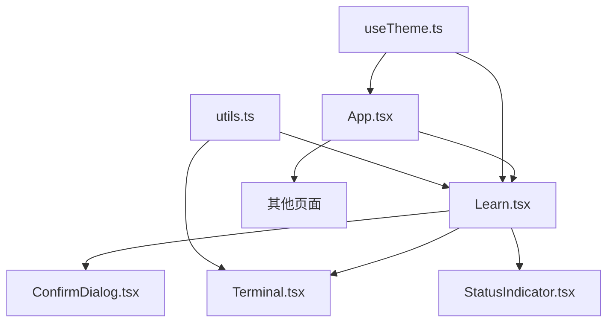
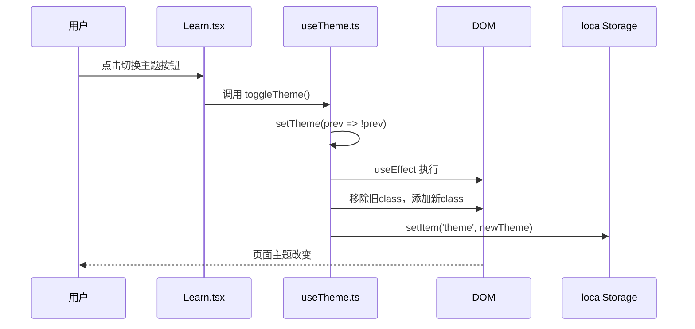
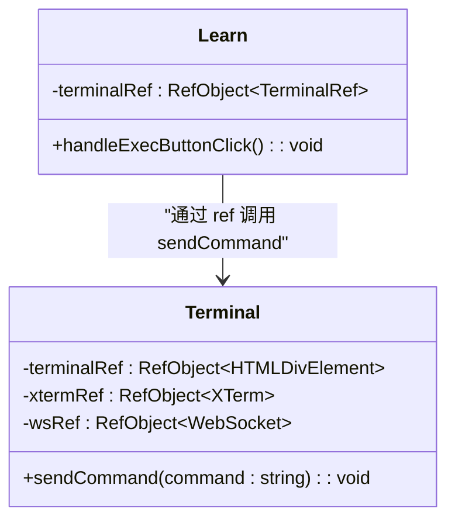
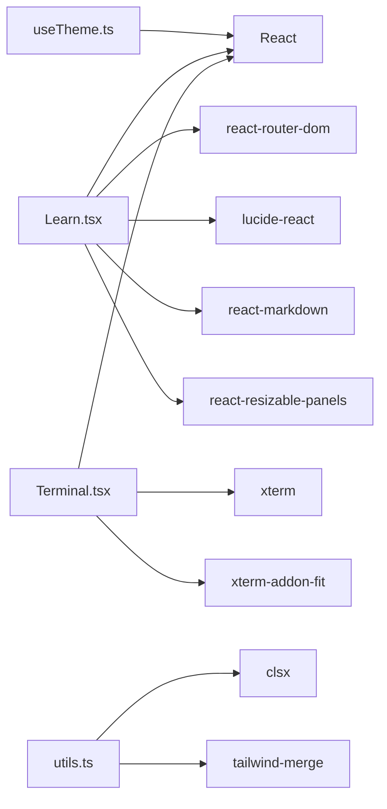

# 状态与自定义Hook

<cite>
**本文档中引用的文件**   
- [useTheme.ts](file://src/hooks/useTheme.ts)
- [Learn.tsx](file://src/pages/Learn.tsx)
- [Terminal.tsx](file://src/components/Terminal.tsx)
- [utils.ts](file://src/lib/utils.ts)
- [App.tsx](file://src/App.tsx)
</cite>

## 目录
1. [项目结构](#项目结构)
2. [核心组件](#核心组件)
3. [架构概述](#架构概述)
4. [详细组件分析](#详细组件分析)
5. [依赖分析](#依赖分析)
6. [性能考虑](#性能考虑)
7. [故障排除指南](#故障排除指南)
8. [结论](#结论)

## 项目结构

根据项目目录结构，前端状态管理相关的核心文件位于 `src` 目录下，主要集中在 `hooks`、`pages` 和 `components` 三个子目录中。`hooks` 目录下的 `useTheme.ts` 是自定义 Hook 的核心实现。`pages` 目录中的 `Learn.tsx` 是 `useTheme` Hook 的主要调用场景之一。`components` 目录中的 `Terminal.tsx` 是另一个重要的状态管理组件，通过 `ref` 暴露方法，实现了父组件对子组件状态的控制。

**Section sources**
- [useTheme.ts](file://src/hooks/useTheme.ts)
- [Learn.tsx](file://src/pages/Learn.tsx)
- [Terminal.tsx](file://src/components/Terminal.tsx)

## 核心组件

`useTheme` 自定义 Hook 是前端状态管理的核心。它利用 `useState` 管理主题状态，并通过 `useEffect` 在状态变化时同步更新 DOM 和 `localStorage`。该 Hook 还通过 `window.matchMedia` API 响应系统主题变化，实现了用户偏好与系统设置的联动。`Learn` 组件是 `useTheme` 的主要消费者，它通过调用该 Hook 获取当前主题和切换函数，从而构建一个主题感知的用户界面。`Terminal` 组件则展示了另一种状态管理模式，它通过 `useImperativeHandle` 将内部方法暴露给父组件，实现了状态的提升和共享。

**Section sources**
- [useTheme.ts](file://src/hooks/useTheme.ts#L4-L28)
- [Learn.tsx](file://src/pages/Learn.tsx#L34-L820)
- [Terminal.tsx](file://src/components/Terminal.tsx#L15-L213)

## 架构概述

整个前端应用采用 React 函数组件和 Hooks 的架构。状态管理分为全局状态和局部状态。`useTheme` 提供了一种轻量级的全局状态管理方案，通过在根组件或公共父组件中使用，可以将主题状态传递给所有后代组件。对于更复杂的状态，如 `Learn` 组件中的课程状态和容器状态，则使用组件内部的 `useState` 进行管理。组件间的通信主要通过 props 传递回调函数和状态，以及通过 `ref` 访问子组件实例来实现。

**Diagram sources **
- [App.tsx](file://src/App.tsx#L25-L31)
- [Learn.tsx](file://src/pages/Learn.tsx#L34-L820)
- [Terminal.tsx](file://src/components/Terminal.tsx#L15-L213)
- [useTheme.ts](file://src/hooks/useTheme.ts#L4-L28)
- [utils.ts](file://src/lib/utils.ts#L4-L6)

## 详细组件分析

### useTheme Hook 分析

`useTheme` Hook 的实现机制是状态管理的典范。它首先使用 `useState` 的惰性初始化特性，从 `localStorage` 中读取用户上次保存的主题偏好。如果不存在，则根据 `window.matchMedia` 的结果判断系统偏好，实现了开箱即用的暗色模式支持。`useEffect` 作为副作用钩子，负责将状态变化同步到外部环境：一方面通过操作 `documentElement` 的 classList 来应用 CSS 样式，另一方面将新的主题值持久化到 `localStorage`。`toggleTheme` 函数封装了状态更新的逻辑，使得调用者无需关心具体的更新过程。

**Diagram sources **
- [useTheme.ts](file://src/hooks/useTheme.ts#L4-L28)
- [Learn.tsx](file://src/pages/Learn.tsx#L34-L820)

### Learn 组件分析

`Learn` 组件是一个复杂的状态管理案例。它管理着课程数据、当前步骤、容器状态等多个状态。通过 `useCallback` 优化了 `startCourseContainer`、`stopContainer` 等异步操作函数，避免了不必要的重新渲染。`useRef` 被用来保存 `Terminal` 组件的引用，从而实现了父组件 (`Learn`) 对子组件 (`Terminal`) 的直接命令调用（`sendCommand`），这是一种典型的状态提升模式。`useEffect` 被用于在组件卸载时清理资源（停止容器），防止了内存泄漏。

**Section sources**
- [Learn.tsx](file://src/pages/Learn.tsx#L34-L820)

### Terminal 组件分析

`Terminal` 组件展示了如何封装一个复杂的第三方库（xterm.js）。它使用 `useRef` 来保存对 DOM 元素和 xterm 实例的引用。`useEffect` 负责在组件挂载时初始化 xterm 实例，并在卸载时进行清理。WebSocket 连接的管理也通过 `useEffect` 完成，确保了连接的生命周期与组件的生命周期同步。最关键的是，它使用 `useImperativeHandle` 将 `sendCommand` 方法暴露给父组件，这使得父组件可以在不直接操作 DOM 的情况下向终端发送指令，实现了良好的封装性和可复用性。

**Diagram sources **
- [Terminal.tsx](file://src/components/Terminal.tsx#L15-L213)
- [Learn.tsx](file://src/pages/Learn.tsx#L34-L820)

### utils 工具函数分析

`utils.ts` 文件中的 `cn` 函数是一个典型的辅助工具，用于合并和处理 CSS 类名。它结合了 `clsx` 和 `tailwind-merge` 库，能够智能地合并来自不同来源的 Tailwind CSS 类，解决类名冲突问题。虽然它本身不直接管理状态，但在构建动态 UI 时，经常需要根据组件状态来决定应用哪些 CSS 类。`cn` 函数极大地简化了这一过程，使得状态到样式的映射更加清晰和可靠。

**Section sources**
- [utils.ts](file://src/lib/utils.ts#L4-L6)

## 依赖分析

项目依赖清晰。`useTheme` Hook 仅依赖于 React 的核心 API (`useState`, `useEffect`)。`Learn` 组件依赖于 `react-router-dom` 进行路由管理，依赖于 `lucide-react` 提供图标，依赖于 `react-markdown` 及其插件渲染 Markdown 内容，依赖于 `react-resizable-panels` 实现可调整大小的面板布局。`Terminal` 组件依赖于 `xterm` 和 `xterm-addon-fit` 来提供终端功能。`utils.ts` 依赖于 `clsx` 和 `tailwind-merge` 来处理类名。这些依赖关系都通过 `package.json` 进行管理。

**Diagram sources **
- [package.json](file://package.json)
- [useTheme.ts](file://src/hooks/useTheme.ts)
- [Learn.tsx](file://src/pages/Learn.tsx)
- [Terminal.tsx](file://src/components/Terminal.tsx)
- [utils.ts](file://src/lib/utils.ts)

## 性能考虑

在性能方面，代码中多处使用了 `useCallback` 和 `useMemo`（虽然在提供的代码片段中未直接体现 `useMemo`，但 `useCallback` 的使用是类似的）来缓存函数和值，避免了子组件的不必要重渲染。例如，`startCourseContainer` 和 `stopContainer` 函数被 `useCallback` 包裹，其依赖项数组确保了只有当相关状态变化时才会重新创建。`useRef` 的使用避免了在每次渲染时重新创建对象或实例。此外，`useEffect` 的清理函数确保了事件监听器和定时器等资源被正确释放，有效防止了内存泄漏。

## 故障排除指南

在开发和使用自定义 Hook 时，常见的问题包括状态不一致和内存泄漏。为避免状态不一致，应确保 `useEffect` 的依赖项数组完整且准确。例如，在 `useTheme` 中，`useEffect` 的依赖项是 `[theme]`，这保证了只有当 `theme` 变化时才会执行副作用。为避免内存泄漏，必须在 `useEffect` 的清理函数中取消所有异步操作、清除定时器并移除事件监听器。`Terminal` 组件中对 `window.resize` 事件的监听就是一个很好的例子，它在组件卸载时被正确移除。对于 `WebSocket` 连接，也应在组件卸载时主动关闭。

**Section sources**
- [useTheme.ts](file://src/hooks/useTheme.ts#L4-L28)
- [Terminal.tsx](file://src/components/Terminal.tsx#L15-L213)

## 结论

`playground` 前端的状态管理设计良好，充分利用了 React Hooks 的能力。`useTheme` Hook 提供了一个简洁、可复用的主题管理方案。`Learn` 和 `Terminal` 组件则展示了如何在复杂场景下管理状态、处理副作用和进行组件间通信。通过结合使用 `useState`、`useEffect`、`useCallback`、`useRef` 和 `useImperativeHandle`，代码实现了关注点分离和良好的可维护性。开发者在创建新的自定义 Hook 时，应遵循相同的模式：明确 Hook 的职责，使用 `useState` 管理状态，使用 `useEffect` 处理副作用并记得清理，使用 `useCallback` 优化性能，并返回一个清晰的 API 供调用者使用。