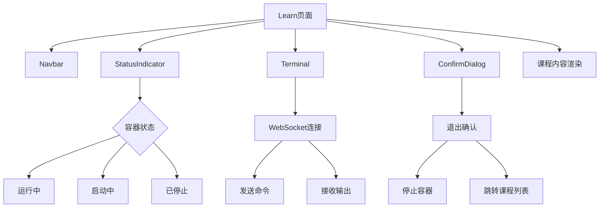
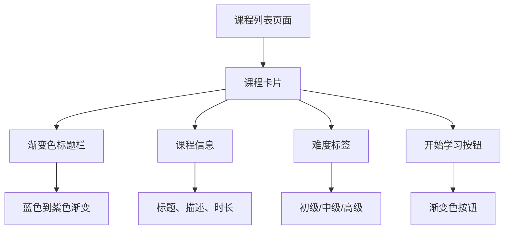

# 组件体系

<cite>
**本文档中引用的文件**  
- [Navbar.tsx](file://src/components/Navbar.tsx)
- [Terminal.tsx](file://src/components/Terminal.tsx)
- [StatusIndicator.tsx](file://src/components/StatusIndicator.tsx)
- [Empty.tsx](file://src/components/Empty.tsx)
- [ConfirmDialog.tsx](file://src/components/ConfirmDialog.tsx)
- [Learn.tsx](file://src/pages/Learn.tsx)
- [CourseList.tsx](file://src/pages/CourseList.tsx)
- [utils.ts](file://src/lib/utils.ts)
</cite>

## 目录
1. [简介](#简介)
2. [核心UI组件分析](#核心ui组件分析)
3. [组件组合与实际应用](#组件组合与实际应用)
4. [可访问性与错误处理](#可访问性与错误处理)
5. [性能优化建议](#性能优化建议)
6. [组件扩展与复用指南](#组件扩展与复用指南)

## 简介
本文档详细介绍了playground前端项目中的UI组件体系，重点分析了导航栏、终端、状态指示器、空状态和确认对话框等核心组件的设计与实现。通过深入解析各组件的接口定义、事件机制和样式集成方式，为开发者提供全面的使用和扩展指导。

## 核心UI组件分析

### Navbar.tsx：导航布局与响应式菜单实现
`Navbar`组件实现了现代化的导航栏布局和响应式设计，支持桌面端和移动端的不同展示模式。

该组件使用`react-router-dom`的`useLocation`钩子来判断当前路径的活跃状态，并通过条件渲染为当前页面的链接添加高亮样式。导航栏包含品牌Logo、标题和导航链接，采用渐变色设计提升视觉吸引力。

在移动端，组件隐藏导航链接并显示一个汉堡菜单按钮。当用户点击按钮时，会显示一个下拉菜单，包含与桌面端相同的导航选项。这种响应式设计确保了在不同设备上都能提供良好的用户体验。

**组件特性**：
- 使用`lucide-react`图标库提供视觉元素
- 通过Tailwind CSS实现现代化样式和响应式布局
- 支持路径激活状态的自动高亮
- 采用渐变色文本和背景提升视觉效果

**Section sources**
- [Navbar.tsx](file://src/components/Navbar.tsx#L4-L97)

### Terminal.tsx：WebSocket通信封装与终端界面渲染
`Terminal`组件封装了WebSocket通信逻辑，并使用`xterm.js`库渲染交互式终端界面，为用户提供真实的命令行体验。

组件通过`forwardRef`暴露`sendCommand`方法给父组件，实现了父组件向终端发送命令的能力。它使用`useRef`管理终端实例、WebSocket连接和fit插件的引用，并在`useEffect`中初始化xterm终端实例，配置了现代化的字体、主题和光标样式。

WebSocket连接通过`connectWebSocket`函数建立，连接URL根据当前页面协议（http/https）自动选择`ws`或`wss`。组件监听WebSocket的`onopen`、`onmessage`、`onclose`和`onerror`事件，实时更新终端显示内容。当收到消息时，组件会解析JSON格式的消息，根据消息类型（output或error）在终端中显示相应内容。

**关键功能**：
- 使用`xterm.js`和`xterm-addon-fit`实现终端功能
- 自动适应窗口大小变化
- 支持用户输入并发送到后端
- 提供`sendCommand`方法供外部调用
- 完整的WebSocket生命周期管理

**Section sources**
- [Terminal.tsx](file://src/components/Terminal.tsx#L15-L213)

### StatusIndicator.tsx：容器运行状态可视化
`StatusIndicator`组件提供了一种统一的方式来可视化各种状态，如容器运行状态、连接状态等。

组件定义了`StatusType`类型，包含`running`、`stopped`、`starting`、`stopping`、`error`等多种状态。每种状态都有对应的配置对象，包含标签文本、颜色、背景色、边框色和阴影色等视觉属性。组件还支持不同尺寸（sm、md、lg）的显示。

状态指示器由一个彩色圆点、可选图标和状态标签组成。在移动设备上，组件会显示简化的标签文本以节省空间。对于`starting`、`stopping`和`connecting`等过渡状态，组件会应用`animate-pulse`动画效果，通过视觉变化提示用户当前处于过渡状态。

**设计特点**：
- 支持多种状态类型和视觉变体
- 响应式设计，移动端显示简化标签
- 过渡状态使用脉冲动画增强视觉反馈
- 支持自定义图标和标签
- 使用backdrop-blur实现毛玻璃效果

**Section sources**
- [StatusIndicator.tsx](file://src/components/StatusIndicator.tsx#L115-L197)

### Empty.tsx：空状态场景处理
`Empty`组件是一个极简的空状态占位符，用于在数据为空或加载时提供视觉反馈。

该组件使用`cn`工具函数（来自`utils.ts`）组合Tailwind CSS类名，创建一个居中对齐的容器，显示"Empty"文本。虽然实现简单，但遵循了项目统一的样式规范，确保与其他组件风格一致。

**使用场景**：
- 列表数据为空时的占位显示
- 异步加载完成但无数据时的提示
- 作为其他组件的默认空状态展示

**Section sources**
- [Empty.tsx](file://src/components/Empty.tsx#L3-L7)

### ConfirmDialog.tsx：模态确认交互实现
`ConfirmDialog`组件提供了一个可配置的模态确认对话框，支持多种变体（警告、危险、信息）和自定义文本。

组件通过`isOpen`属性控制显示与隐藏，当`isOpen`为`false`时直接返回`null`，避免不必要的渲染。对话框包含背景遮罩层，点击遮罩层会触发`onCancel`回调，实现点击外部关闭的功能。

组件支持三种变体：`warning`（默认，琥珀色）、`danger`（红色）和`info`（蓝色）。每种变体都有不同的颜色主题，通过`getVariantStyles`函数返回相应的CSS类名。对话框使用CSS动画（`fadeIn`和`slideInUp`）实现平滑的显示和隐藏效果。

**交互特性**：
- 点击遮罩层关闭对话框
- 点击内部内容不关闭（通过`stopPropagation`实现）
- 支持自定义标题、消息和按钮文本
- 提供确认和取消两个操作按钮
- 使用动画增强用户体验

**Section sources**
- [ConfirmDialog.tsx](file://src/components/ConfirmDialog.tsx#L14-L134)

## 组件组合与实际应用

### Learn.tsx中的组件集成
`Learn`页面是组件体系的主要应用场景，它集成了多个UI组件来构建完整的课程学习体验。

页面顶部使用`StatusIndicator`显示容器运行状态，让用户实时了解环境状态。当用户点击"启动容器"按钮时，状态指示器会从"已停止"变为"启动中"，并显示脉冲动画，提供清晰的视觉反馈。

课程内容区域使用`Terminal`组件作为交互式终端，通过`ref`引用调用`sendCommand`方法，实现课程内容中"执行"按钮与终端的联动。当用户点击带有`{{exec}}`标记的代码块旁的执行按钮时，相关命令会自动发送到终端执行。

页面导航使用`ConfirmDialog`组件，在用户尝试退出课程时显示确认对话框，防止意外丢失未保存的进度。这种设计模式确保了关键操作都有明确的确认步骤，提升了应用的可靠性。

**Diagram sources**
- [Learn.tsx](file://src/pages/Learn.tsx#L100-L800)

**Section sources**
- [Learn.tsx](file://src/pages/Learn.tsx#L100-L800)

### CourseList.tsx中的组件应用
`CourseList`页面展示了课程卡片列表，虽然没有直接使用前述组件，但其设计模式与组件体系保持一致。

课程卡片采用渐变色标题栏、阴影效果和悬停动画，与`Navbar`和`ConfirmDialog`的视觉风格相呼应。卡片布局响应式设计，支持不同屏幕尺寸的适配，体现了项目统一的设计语言。

**Diagram sources**
- [CourseList.tsx](file://src/pages/CourseList.tsx#L50-L150)

**Section sources**
- [CourseList.tsx](file://src/pages/CourseList.tsx#L50-L150)

## 可访问性与错误处理

### 可访问性（a11y）实践
项目在多个组件中实现了可访问性最佳实践：

- `Navbar`组件为导航链接提供了清晰的文本标签，并使用适当的对比度确保可读性
- `ConfirmDialog`组件为图标按钮提供了`title`属性，并确保键盘可访问性
- 所有交互元素都有适当的焦点样式，支持键盘导航
- 使用语义化的HTML元素（如`button`、`nav`）增强屏幕阅读器的兼容性
- 为图标提供了替代文本或上下文信息

### 错误边界处理建议
虽然项目中没有显式的错误边界组件，但可以从现有代码中提炼出错误处理模式：

1. **状态管理**：使用`useState`管理错误状态，在`Learn`组件中通过`setError`函数更新错误信息
2. **网络请求错误处理**：在`fetch`调用中使用`try-catch`捕获异常，并提供用户友好的错误消息
3. **资源清理**：在`useEffect`的清理函数中取消订阅、关闭连接，防止内存泄漏
4. **边界检查**：在`StatusIndicator`中对未知状态进行警告处理，避免组件崩溃

建议为关键组件添加错误边界，捕获子组件中的JavaScript错误，并显示降级的UI。

**Section sources**
- [Learn.tsx](file://src/pages/Learn.tsx#L50-L100)
- [StatusIndicator.tsx](file://src/components/StatusIndicator.tsx#L150-L160)

## 性能优化建议

### 避免重复渲染
项目中已采用多种技术避免不必要的渲染：

- 使用`useCallback`记忆化函数，防止子组件因父组件重新渲染而重新渲染
- `Terminal`组件的`sendCommand`方法使用`useCallback`包裹，确保引用稳定性
- `ConfirmDialog`仅在`isOpen`为`true`时渲染，减少DOM操作

**进一步优化建议**：
1. 为`StatusIndicator`等纯展示组件添加`React.memo`，避免在props未变化时重新渲染
2. 在`Learn`页面中，将课程内容渲染提取到独立组件并使用`React.memo`
3. 考虑使用`useMemo`缓存预处理后的Markdown内容

### 资源管理
- `Terminal`组件在`useEffect`清理函数中正确处置xterm实例和WebSocket连接
- `Learn`页面在组件卸载时自动停止容器，防止资源浪费
- WebSocket连接在组件卸载时正确关闭，避免连接泄漏

## 组件扩展与复用指南

### 组件复用模式
现有组件设计具有良好的复用性：

- `StatusIndicator`可通过扩展`statusConfigs`支持新状态类型
- `ConfirmDialog`可通过`variant`参数轻松创建不同风格的确认对话框
- `Terminal`的`ref`机制允许父组件灵活控制终端行为

### 扩展建议
1. **创建组件变体**：基于现有组件创建特定用途的变体，如`DatabaseStatusIndicator`继承自`StatusIndicator`
2. **组合组件**：将多个基础组件组合成更复杂的复合组件，如创建`TerminalWithStatus`组件
3. **主题支持**：提取颜色和样式常量到主题配置中，支持主题切换
4. **国际化**：将组件中的文本提取到i18n文件，支持多语言

通过遵循这些指南，开发者可以高效地复用和扩展现有组件，快速构建新功能，同时保持UI的一致性和代码的可维护性。