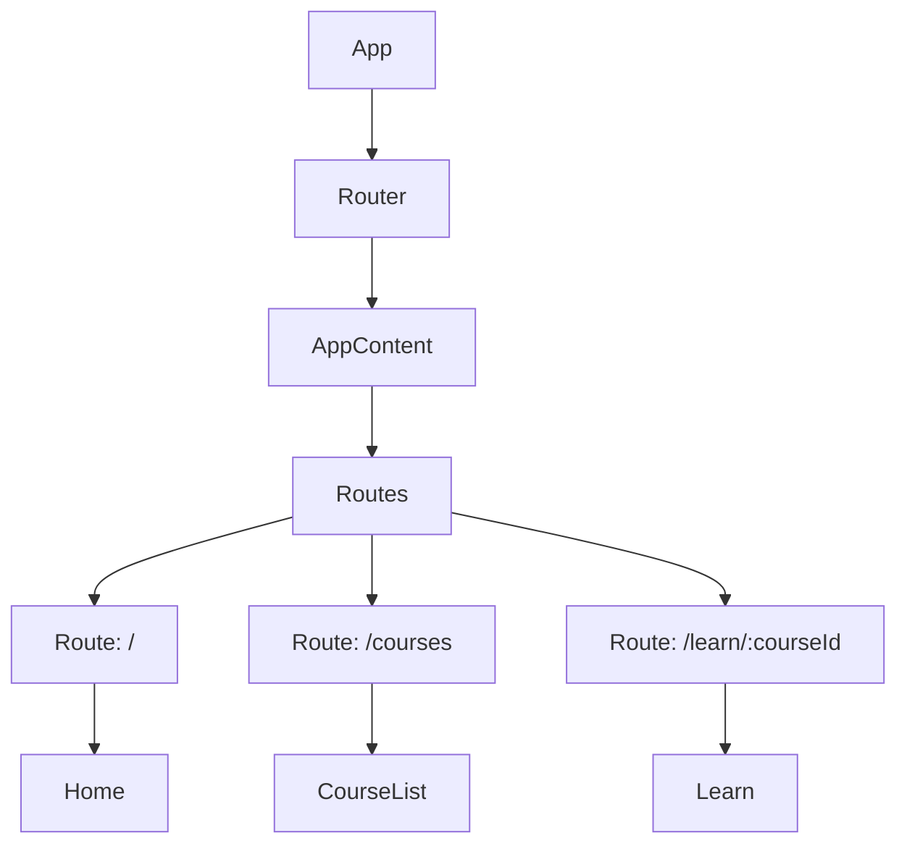
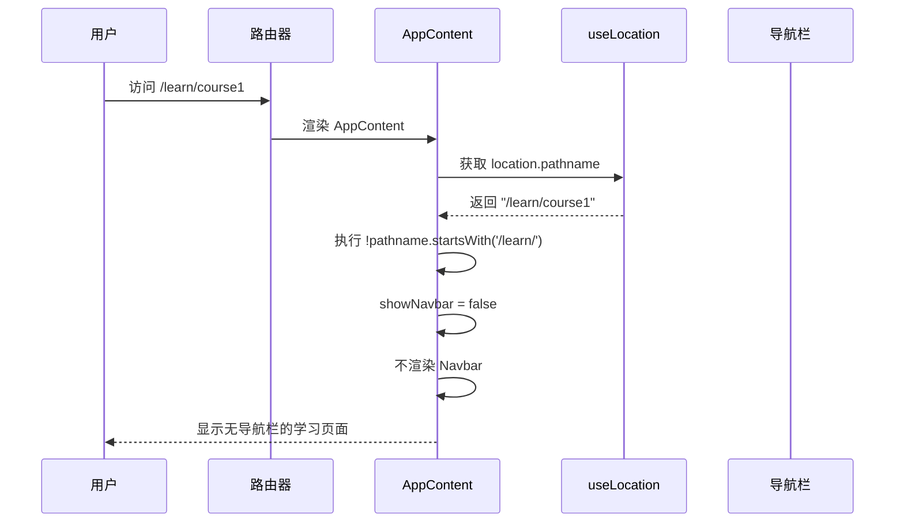
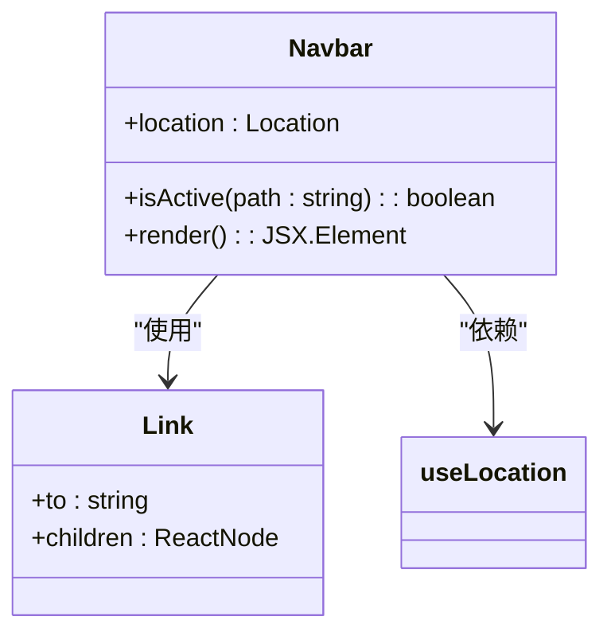

<cite>
**Referenced Files in This Document**   
- [App.tsx](file://src/App.tsx)
- [Home.tsx](file://src/pages/Home.tsx)
- [CourseList.tsx](file://src/pages/CourseList.tsx)
- [Learn.tsx](file://src/pages/Learn.tsx)
- [Navbar.tsx](file://src/components/Navbar.tsx)
</cite>

# 路由管理

## Table of Contents
1. [路由配置概述](#路由配置概述)
2. [核心路由映射](#核心路由映射)
3. [路由守卫与条件渲染](#路由守卫与条件渲染)
4. [导航集成与用户交互](#导航集成与用户交互)
5. [动态路由参数处理](#动态路由参数处理)
6. [路由调试与常见问题](#路由调试与常见问题)
7. [扩展与维护](#扩展与维护)

## 路由配置概述

本项目采用 React Router 作为前端路由管理解决方案，通过声明式的方式定义应用的导航结构。路由配置集中于 `App.tsx` 文件中，利用 `BrowserRouter`、`Routes` 和 `Route` 组件构建了清晰的路由层级。整个系统设计遵循单一入口原则，`App` 组件作为根组件包裹 `Router`，确保路由上下文在整个应用中可用。

路由系统的设计充分考虑了用户体验和界面一致性，通过条件渲染机制实现了不同页面间的布局切换。核心路由包括根路径、课程列表和学习页面，每个路由都映射到特定的页面组件，实现了模块化的页面组织。



**Diagram sources**
- [App.tsx](file://src/App.tsx#L1-L34)

**Section sources**
- [App.tsx](file://src/App.tsx#L1-L34)

## 核心路由映射

### 根路径 (/) 配置

根路径 `/` 映射到 `Home.tsx` 组件，作为应用的欢迎页面和入口点。该页面采用渐变背景和卡片式布局，展示了平台的核心功能：丰富的课程内容、实时终端交互和容器化学习环境。页面通过 `Link` 组件提供到课程列表的导航，实现了无刷新的页面跳转。

```mermaid
flowchart TD
Start[/] --> Home[Home.tsx]
Home --> |展示| Welcome[欢迎信息]
Home --> |展示| Features[功能卡片]
Home --> |导航| Courses[课程列表]
```

**Section sources**
- [App.tsx](file://src/App.tsx#L15-L17)
- [Home.tsx](file://src/pages/Home.tsx#L3-L44)

### 课程列表路径 (/courses) 配置

`/courses` 路径渲染 `CourseList.tsx` 组件，负责展示所有可用课程。该组件通过 `useEffect` 钩子在挂载时发起 API 请求获取课程数据，实现了数据驱动的页面渲染。课程卡片采用响应式网格布局，包含课程标题、难度、时长和标签等元信息，并通过 `Link` 组件连接到具体的学习页面。

```mermaid
flowchart TD
Start[/courses] --> CourseList[CourseList.tsx]
CourseList --> |fetch| API[/api/courses]
API --> |返回| Data[课程数据]
Data --> |渲染| Cards[课程卡片]
Cards --> |Link| LearnPage[/learn/:courseId]
```

**Section sources**
- [App.tsx](file://src/App.tsx#L18-L19)
- [CourseList.tsx](file://src/pages/CourseList.tsx#L14-L163)

### 动态学习路径 (/learn/:courseId) 配置

`/learn/:courseId` 是一个动态路由，用于加载特定课程的学习内容。`:courseId` 作为路由参数，允许系统根据不同的课程 ID 加载相应的课程数据。`Learn.tsx` 组件通过 `useParams` 钩子获取 `courseId` 参数，并据此从后端 API 获取课程详情，实现了内容的动态加载和个性化展示。

```mermaid
flowchart TD
Start[/learn/123] --> Learn[Learn.tsx]
Learn --> |useParams| courseId[courseId=123]
Learn --> |fetch| API[/api/courses/123]
API --> |返回| CourseData[课程详情]
CourseData --> |渲染| Content[学习内容]
Content --> |包含| Terminal[终端组件]
```

**Section sources**
- [App.tsx](file://src/App.tsx#L20-L21)
- [Learn.tsx](file://src/pages/Learn.tsx#L34-L820)

## 路由守卫与条件渲染

### 导航栏显示控制

项目实现了一种轻量级的路由守卫机制，通过 `AppContent` 组件中的条件渲染来控制 `Navbar` 的显示。利用 `useLocation` 钩子获取当前路由信息，当路径以 `/learn/` 开头时，隐藏导航栏，为学习页面提供更大的内容展示空间。

```typescript
const showNavbar = !location.pathname.startsWith('/learn/');
return (
  <div>
    {showNavbar && <Navbar />}
    {/* 其他路由内容 */}
  </div>
);
```

这种设计模式避免了复杂的权限验证逻辑，专注于用户体验的优化，确保学习页面的沉浸式体验。

### 路由守卫实现分析



**Diagram sources**
- [App.tsx](file://src/App.tsx#L7-L23)

**Section sources**
- [App.tsx](file://src/App.tsx#L7-L23)

## 导航集成与用户交互

### 导航栏组件集成

`Navbar.tsx` 组件作为全局导航，集成在除学习页面外的所有页面中。它通过 `Link` 组件实现声明式导航，利用 `useLocation` 钩子判断当前活跃路由，并为当前页面的链接添加高亮样式。导航栏包含平台 Logo、品牌名称和主要导航链接，支持桌面端和移动端的响应式布局。



**Section sources**
- [Navbar.tsx](file://src/components/Navbar.tsx#L4-L97)

### 页面间状态传递

项目中的页面间状态传递主要通过路由参数和 URL 查询参数实现。在课程列表页面，通过 `Link` 组件的 `to` 属性传递 `courseId`：

```typescript
<Link to={`/learn/${course.id}`}>开始学习</Link>
```

在学习页面，通过 `useParams` 钩子接收参数：

```typescript
const { courseId } = useParams<{ courseId: string }>();
```

对于更复杂的状态管理，项目依赖 React 的状态提升和上下文机制，而非路由状态，确保了状态的可预测性和可维护性。

## 动态路由参数处理

### 参数解析与验证

动态路由 `/learn/:courseId` 的参数处理在 `Learn.tsx` 组件中完成。`useParams` 钩子返回一个包含所有路由参数的对象，系统通过解构赋值获取 `courseId`。组件在 `useEffect` 中使用该参数发起 API 请求，获取课程详情。

```mermaid
flowchart LR
A[URL: /learn/kwdb-intro] --> B{useParams}
B --> C[courseId = "kwdb-intro"]
C --> D{fetchCourse}
D --> E[/api/courses/kwdb-intro]
E --> F[课程数据]
F --> G[渲染学习内容]
```

**Section sources**
- [Learn.tsx](file://src/pages/Learn.tsx#L34-L820)

### 错误处理与边界情况

当 `courseId` 无效或 API 请求失败时，组件会进入错误状态，显示友好的错误信息和返回链接。这种设计确保了用户体验的连续性，避免了空白页面或崩溃。

## 路由调试与常见问题

### 常见问题与解决方案

| 问题现象 | 可能原因 | 解决方案 |
|--------|--------|--------|
| 页面空白 | 路由配置错误或组件未正确导入 | 检查 `App.tsx` 中的 `Route` 配置和组件导入路径 |
| 404 错误 | 访问了未定义的路由 | 确认 URL 路径与 `Route` 的 `path` 属性匹配 |
| 参数解析失败 | `useParams` 使用不当 | 确保在函数组件内部调用 `useParams`，并正确解构参数 |
| 导航不生效 | `Link` 组件使用错误 | 检查 `to` 属性的路径是否正确，确保 `Router` 包裹了所有路由组件 |

### 调试方法

1. **控制台日志**：在路由组件的 `useEffect` 或 `useParams` 后添加 `console.log` 输出参数值。
2. **React DevTools**：检查组件树，确认路由组件是否被正确渲染。
3. **网络请求监控**：使用浏览器开发者工具的 Network 面板，检查 API 请求是否按预期发起。

## 扩展与维护

### 添加新路由

要添加新路由，需在 `App.tsx` 的 `Routes` 组件中添加新的 `Route` 元素：

```tsx
<Route path="/new-page" element={<NewPage />} />
```

同时，确保 `NewPage` 组件已正确定义和导入。

### 修改现有路由

修改现有路由行为通常涉及调整 `Route` 的 `path` 属性或 `element` 属性。对于复杂的路由逻辑，可以创建新的路由守卫组件或使用 `Navigate` 组件进行重定向。

本路由系统设计简洁、可维护性强，通过集中式配置和组件化设计，为应用的持续扩展提供了坚实的基础。