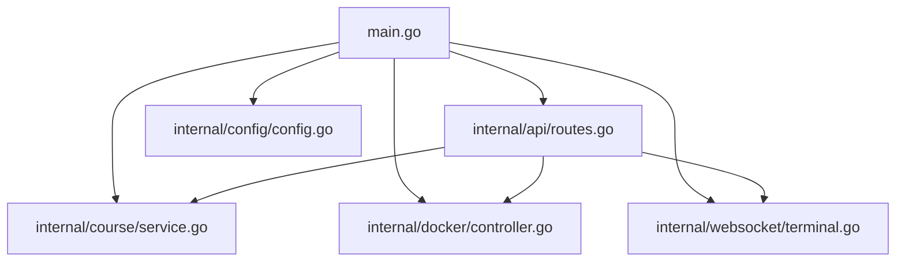
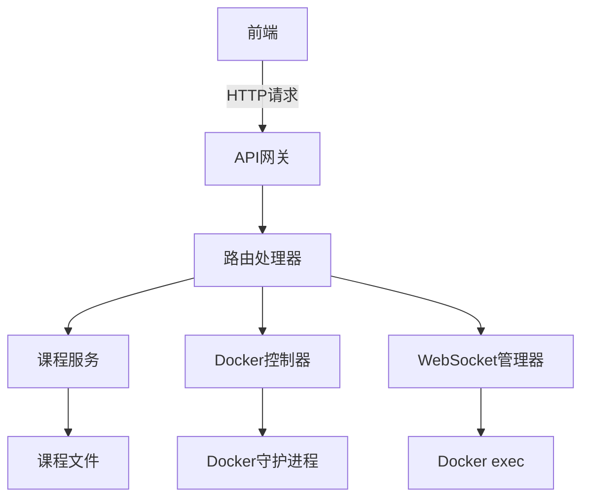
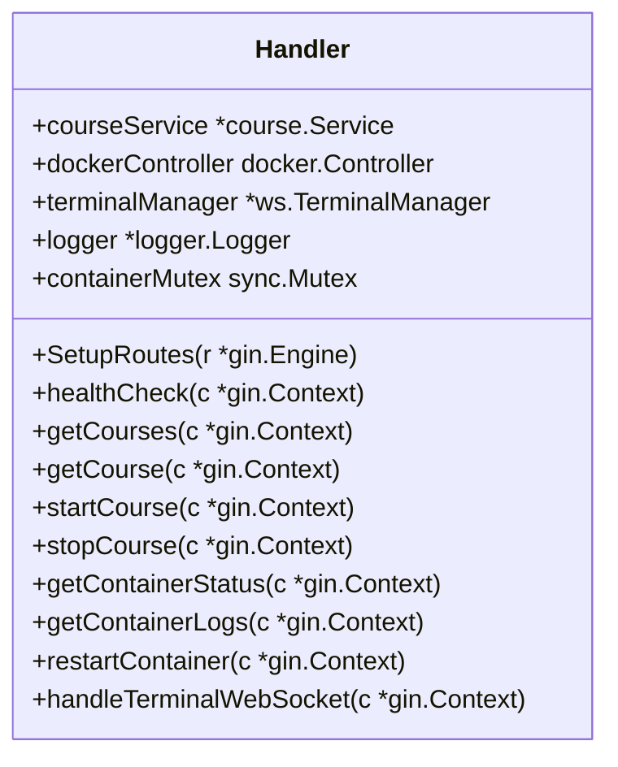
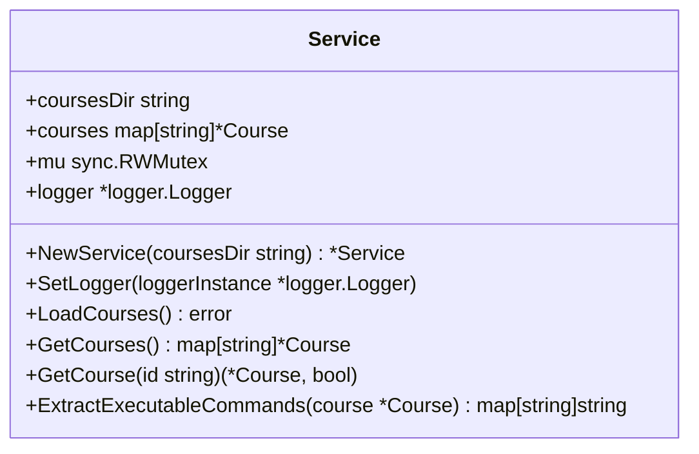
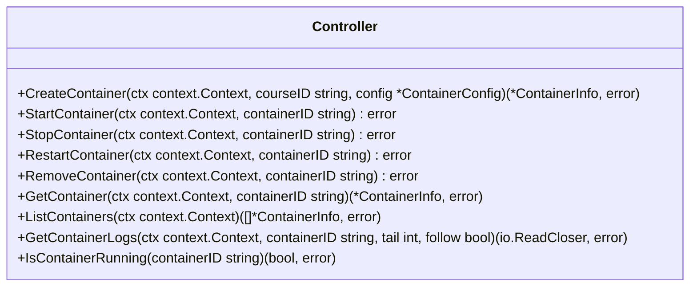
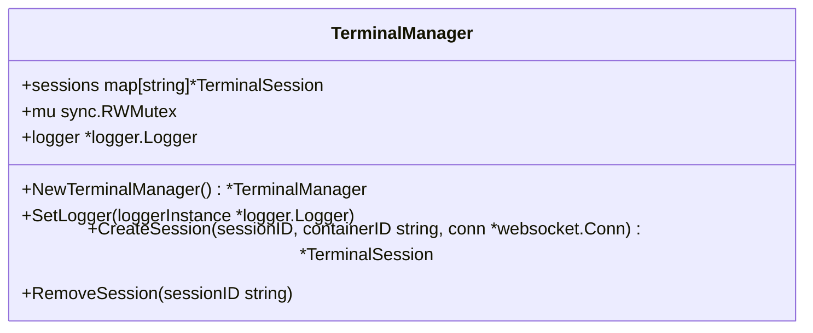
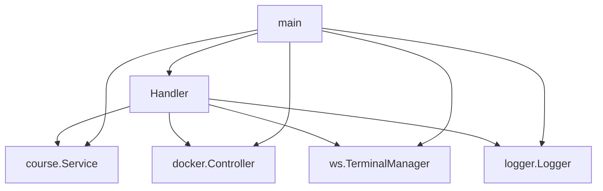

# API服务

<cite>
**本文档引用的文件**
- [main.go](file://main.go)
- [internal/api/routes.go](file://internal/api/routes.go)
- [internal/course/service.go](file://internal/course/service.go)
- [internal/docker/controller.go](file://internal/docker/controller.go)
- [internal/websocket/terminal.go](file://internal/websocket/terminal.go)
- [internal/config/config.go](file://internal/config/config.go)
</cite>

## 目录
1. [简介](#简介)
2. [项目结构](#项目结构)
3. [核心组件](#核心组件)
4. [架构概述](#架构概述)
5. [详细组件分析](#详细组件分析)
6. [依赖分析](#依赖分析)
7. [性能考虑](#性能考虑)
8. [故障排除指南](#故障排除指南)
9. [结论](#结论)

## 简介
本文档详细描述了playground项目中基于Gin框架的RESTful API服务设计。重点分析了`internal/api/routes.go`中的路由配置、中间件应用、端点绑定逻辑以及`main.go`中的服务初始化过程。文档涵盖了API版本控制、统一响应格式、错误处理机制、安全性考虑和性能优化建议，为开发者提供了全面的API服务参考。

## 项目结构
本项目采用分层架构设计，主要分为以下几个目录：

- `courses/`: 存储课程内容文件，包括Markdown文档和YAML配置
- `internal/`: 核心业务逻辑实现
  - `api/`: API路由和处理器
  - `course/`: 课程管理服务
  - `docker/`: Docker容器管理
  - `logger/`: 日志记录
  - `websocket/`: WebSocket终端管理
- `main.go`: 应用程序入口点
- `internal/config/`: 配置管理

这种结构实现了关注点分离，使代码更易于维护和扩展。

**图源**
- [main.go](file://main.go)
- [internal/api/routes.go](file://internal/api/routes.go)

**节源**
- [main.go](file://main.go)
- [internal/api/routes.go](file://internal/api/routes.go)

## 核心组件
API服务的核心组件包括路由处理器、课程服务、Docker控制器和WebSocket终端管理器。这些组件通过依赖注入的方式在`main.go`中初始化并组合在一起，形成了完整的API服务。

**节源**
- [internal/api/routes.go](file://internal/api/routes.go#L22-L34)
- [main.go](file://main.go#L31-L165)

## 架构概述
系统采用典型的分层架构，前端通过HTTP请求与后端API交互，后端通过Docker API管理容器环境。API层负责请求处理和响应生成，业务逻辑层处理核心功能，数据访问层与Docker守护进程通信。

**图源**
- [internal/api/routes.go](file://internal/api/routes.go)
- [main.go](file://main.go)

## 详细组件分析
### 路由处理器分析
`Handler`结构体封装了所有HTTP请求处理逻辑，通过`SetupRoutes`方法配置路由。

#### 路由分组与组织
API路由采用分层分组策略，以`/api`为前缀，下设`/courses`和`/containers`子组，实现了逻辑上的清晰分离。

**图源**
- [internal/api/routes.go](file://internal/api/routes.go#L22-L34)

**节源**
- [internal/api/routes.go](file://internal/api/routes.go#L64-L92)

#### 中间件应用
系统使用了Gin框架的`Recovery`中间件进行错误恢复，确保服务的稳定性。WebSocket连接使用`gorilla/websocket`的`CheckOrigin`中间件允许所有来源的连接。

#### 端点与处理器绑定
路由端点与处理器函数通过`gin.Engine`的方法进行绑定，如`courses.GET("", h.getCourses)`将GET请求绑定到`getCourses`方法。

### 课程服务分析
课程服务负责加载和管理课程内容，从文件系统读取课程配置和内容。

**图源**
- [internal/course/service.go](file://internal/course/service.go#L30-L35)

**节源**
- [internal/course/service.go](file://internal/course/service.go)

### Docker控制器分析
Docker控制器封装了Docker API调用，提供了容器管理的高级接口。

**图源**
- [internal/docker/interfaces.go](file://internal/docker/interfaces.go#L34-L70)

**节源**
- [internal/docker/controller.go](file://internal/docker/controller.go)

### WebSocket终端管理器分析
终端管理器负责管理WebSocket会话，实现与Docker容器的交互式连接。

**图源**
- [internal/websocket/terminal.go](file://internal/websocket/terminal.go#L35-L39)

**节源**
- [internal/websocket/terminal.go](file://internal/websocket/terminal.go)

## 依赖分析
系统各组件之间的依赖关系清晰，遵循依赖倒置原则。API层依赖业务逻辑层，业务逻辑层依赖数据访问层，形成了稳定的依赖链。

**图源**
- [internal/api/routes.go](file://internal/api/routes.go)
- [main.go](file://main.go)

**节源**
- [internal/api/routes.go](file://internal/api/routes.go)
- [main.go](file://main.go)

## 性能考虑
系统在设计时考虑了多个性能优化点：

1. **路由树结构**：Gin框架使用Radix树进行路由匹配，确保了O(log n)的查找效率。
2. **连接池**：Docker客户端复用连接，减少了连接建立的开销。
3. **缓存机制**：课程内容在内存中缓存，避免了频繁的文件I/O操作。
4. **并发控制**：使用互斥锁防止并发容器操作，确保数据一致性。

## 故障排除指南
### 常见问题
1. **Docker连接失败**：检查Docker守护进程是否运行，socket路径是否正确。
2. **课程加载失败**：验证课程目录是否存在，配置文件格式是否正确。
3. **容器启动失败**：检查镜像是否存在，资源限制是否合理。

### 日志分析
系统使用结构化日志记录，便于问题排查。关键操作都有详细的日志输出，包括时间戳、操作类型和结果状态。

**节源**
- [internal/api/routes.go](file://internal/api/routes.go)
- [internal/docker/controller.go](file://internal/docker/controller.go)
- [internal/websocket/terminal.go](file://internal/websocket/terminal.go)

## 结论
playground项目的API服务设计合理，结构清晰，具有良好的可维护性和扩展性。通过合理的分层和依赖管理，实现了功能的解耦和复用。系统的性能优化和错误处理机制确保了服务的稳定性和可靠性。未来可以考虑增加API版本控制、更细粒度的权限管理和更完善的监控体系。