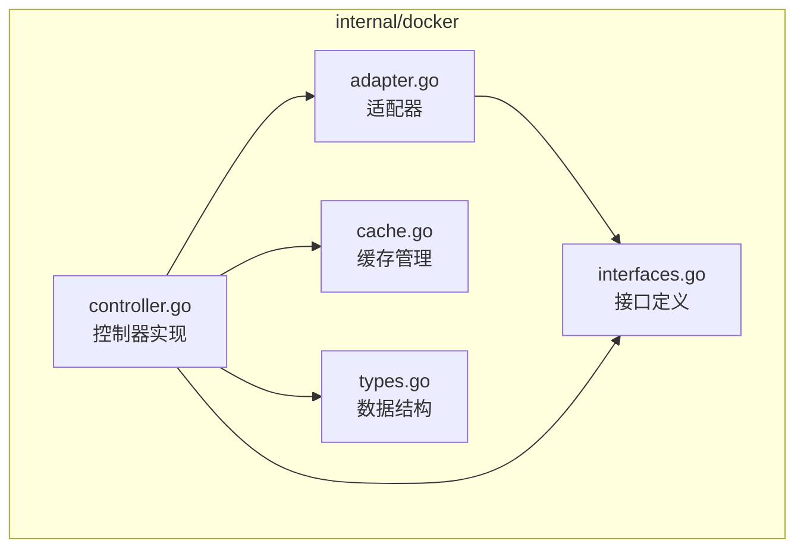
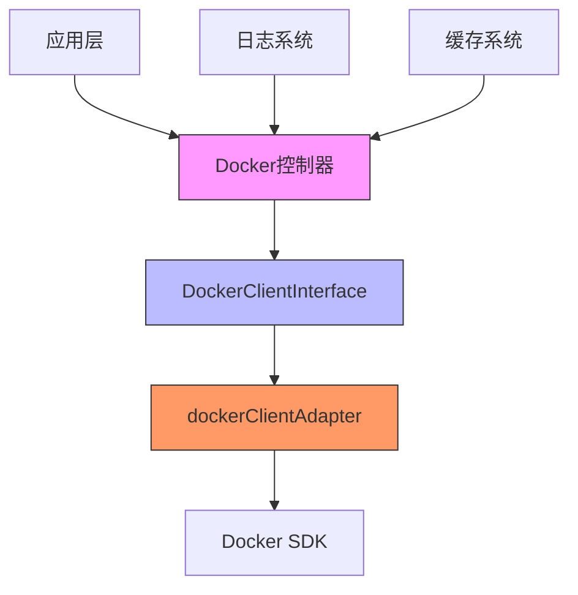
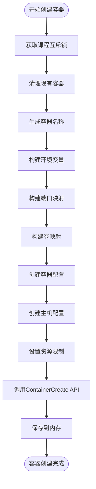
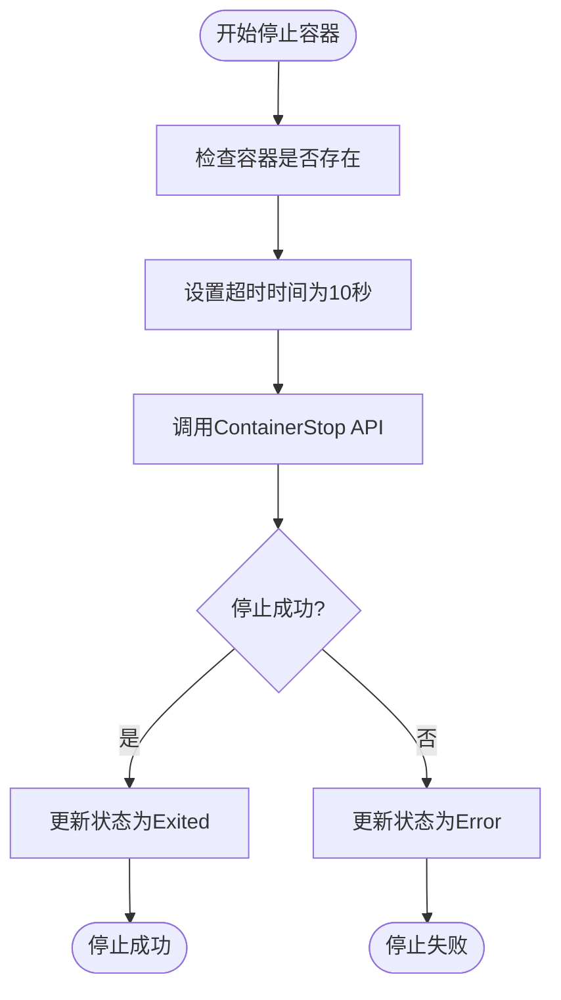
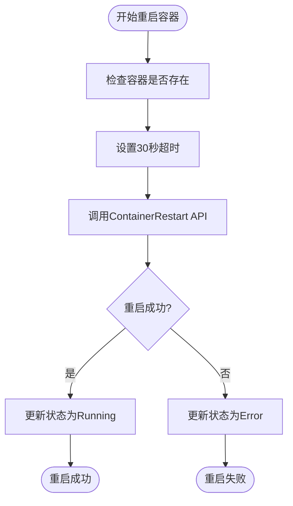
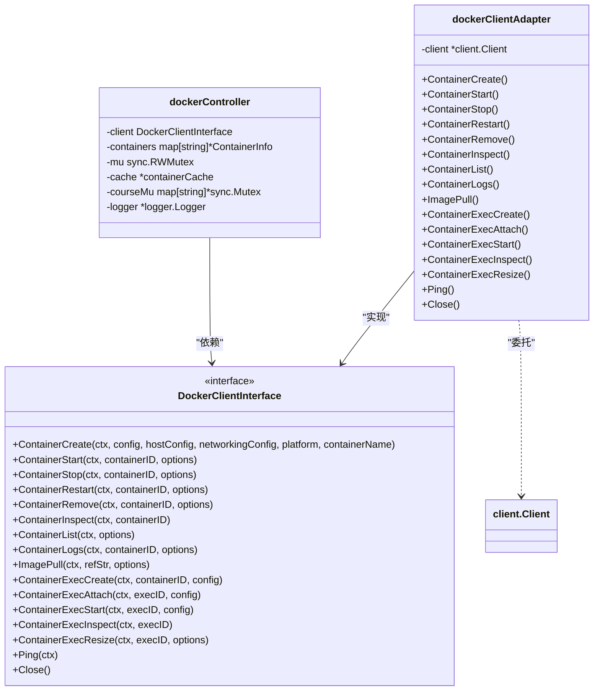
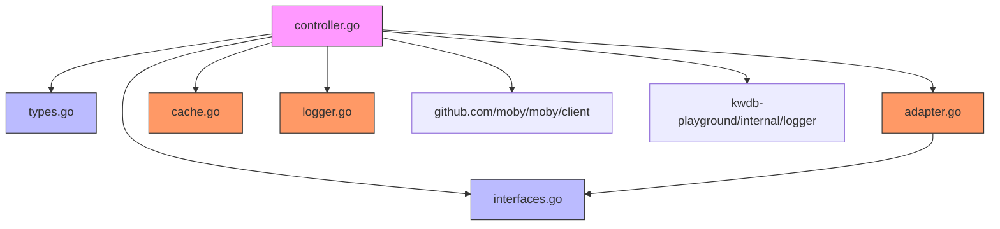
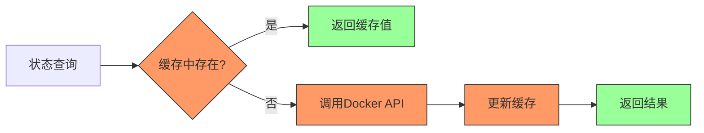
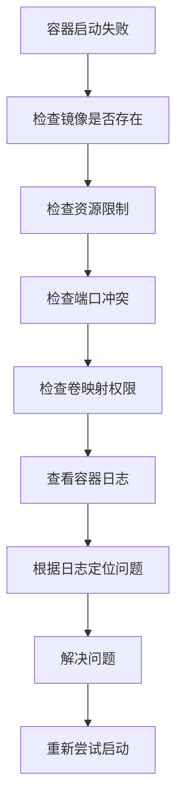

# Docker控制器

<cite>
**本文档中引用的文件**   
- [controller.go](file://internal/docker/controller.go)
- [interfaces.go](file://internal/docker/interfaces.go)
- [types.go](file://internal/docker/types.go)
- [adapter.go](file://internal/docker/adapter.go)
- [cache.go](file://internal/docker/cache.go)
- [logger.go](file://internal/logger/logger.go)
</cite>

## 目录
1. [简介](#简介)
2. [项目结构](#项目结构)
3. [核心组件](#核心组件)
4. [架构概述](#架构概述)
5. [详细组件分析](#详细组件分析)
6. [依赖分析](#依赖分析)
7. [性能考虑](#性能考虑)
8. [故障排除指南](#故障排除指南)
9. [结论](#结论)

## 简介
本文档全面介绍`internal/docker/controller.go`如何利用Docker SDK实现容器全生命周期管理。详细说明`NewController`函数的初始化过程，包括Docker客户端创建和依赖注入。阐述`StartContainer`、`StopContainer`、`RestartContainer`等核心方法的实现细节，包括容器配置构建、镜像拉取策略和资源限制设置。解释`interfaces.go`中定义的适配器接口如何解耦业务逻辑与底层Docker调用，提升测试性和可扩展性。描述`types.go`中定义的`ContainerConfig`和`ContainerInfo`等数据结构及其在状态管理中的作用。提供实际调用示例，并涵盖常见问题如容器启动失败的排查、网络配置和安全选项。

## 项目结构
Docker控制器模块位于`internal/docker`目录下，采用分层架构设计，将接口定义、实现逻辑、数据结构和适配器分离。该模块负责管理KwDB Playground环境中的Docker容器生命周期，为上层应用提供统一的容器操作接口。



**图示来源**
- [controller.go](file://internal/docker/controller.go#L1-L50)
- [interfaces.go](file://internal/docker/interfaces.go#L1-L10)
- [types.go](file://internal/docker/types.go#L1-L5)
- [adapter.go](file://internal/docker/adapter.go#L1-L10)
- [cache.go](file://internal/docker/cache.go#L1-L5)

**本节来源**
- [controller.go](file://internal/docker/controller.go#L1-L20)
- [interfaces.go](file://internal/docker/interfaces.go#L1-L10)

## 核心组件
Docker控制器的核心组件包括控制器实现、接口定义、数据结构、适配器和缓存管理。控制器实现负责容器的全生命周期管理，包括创建、启动、停止、重启和删除操作。接口定义通过适配器模式解耦业务逻辑与底层Docker调用，提升代码的可测试性和可扩展性。数据结构定义了容器配置和状态信息，为上层应用提供统一的数据模型。缓存管理优化了频繁的状态查询操作，减少对Docker API的调用次数。

**本节来源**
- [controller.go](file://internal/docker/controller.go#L1-L100)
- [interfaces.go](file://internal/docker/interfaces.go#L1-L20)
- [types.go](file://internal/docker/types.go#L1-L10)

## 架构概述
Docker控制器采用适配器模式和依赖注入设计，实现了业务逻辑与底层Docker SDK的解耦。控制器通过`DockerClientInterface`接口与Docker守护进程交互，实际实现由`dockerClientAdapter`提供。这种设计使得控制器可以轻松替换底层Docker客户端，便于单元测试和未来的技术演进。



**图示来源**
- [controller.go](file://internal/docker/controller.go#L1-L50)
- [interfaces.go](file://internal/docker/interfaces.go#L1-L15)
- [adapter.go](file://internal/docker/adapter.go#L1-L20)

## 详细组件分析

### 控制器初始化分析
`NewController`函数负责创建和初始化Docker控制器实例。该函数首先创建日志记录器，然后尝试创建Docker客户端，支持多种socket路径，包括macOS Docker Desktop路径和默认Linux路径。如果环境变量配置失败，控制器会尝试预定义的socket路径列表。创建客户端后，会通过适配器模式包装客户端实例，并测试与Docker守护进程的连接。最后，创建缓存实例并初始化控制器的内部状态。

```mermaid
sequenceDiagram
participant App as 应用
participant Controller as NewController
participant Logger as 日志系统
participant Client as Docker客户端
participant Adapter as 适配器
participant Cache as 缓存
App->>Controller : 调用NewController()
Controller->>Logger : 创建日志实例
Controller->>Client : createDockerClient()
alt 环境变量配置成功
Client->>Client : 使用FromEnv选项
Client->>Client : Ping测试
Client-->>Controller : 成功
else 尝试预定义路径
loop 遍历socket路径
Client->>Client : 检查socket文件
Client->>Client : 创建客户端
Client->>Client : Ping测试
alt 测试成功
Client-->>Controller : 返回客户端
break
end
end
end
Controller->>Adapter : 创建适配器实例
Controller->>Cache : 创建缓存实例
Controller->>Controller : 初始化内部状态
Controller->>Controller : 加载现有容器
Controller-->>App : 返回控制器实例
```

**图示来源**
- [controller.go](file://internal/docker/controller.go#L98-L139)
- [controller.go](file://internal/docker/controller.go#L142-L234)

**本节来源**
- [controller.go](file://internal/docker/controller.go#L98-L139)

### 容器生命周期管理分析
Docker控制器提供了完整的容器生命周期管理功能，包括创建、启动、停止、重启和删除操作。每个操作都经过精心设计，确保操作的原子性和状态的一致性。

#### 容器创建流程
`CreateContainer`方法负责创建新的Docker容器。该方法首先获取课程级别的互斥锁，确保同一课程的容器创建操作是原子性的。然后清理该课程的所有现有容器，生成唯一的容器名称，并根据`ContainerConfig`构建容器配置和主机配置。最后调用Docker API创建容器，并将容器信息保存到内存中。



**图示来源**
- [controller.go](file://internal/docker/controller.go#L507-L606)
- [types.go](file://internal/docker/types.go#L25-L48)

**本节来源**
- [controller.go](file://internal/docker/controller.go#L507-L606)

#### 容器启动流程
`StartContainer`方法负责启动已创建的容器。该方法首先检查容器是否存在，然后设置启动中状态，调用Docker API启动容器。启动后，方法会轮询容器状态，等待容器完全启动或确定启动失败。此设计确保了启动操作的可靠性和状态的准确性。

```mermaid
sequenceDiagram
participant Client as 客户端
participant Controller as 控制器
participant Docker as Docker守护进程
Client->>Controller : StartContainer(containerID)
Controller->>Controller : 检查容器是否存在
Controller->>Controller : 设置状态为Starting
Controller->>Docker : ContainerStart(containerID)
alt 启动成功
loop 每秒检查状态
Controller->>Docker : ContainerInspect(containerID)
Docker-->>Controller : 返回状态
alt 状态为Running
Controller->>Controller : 设置状态为Running
break
else 状态为Dead/OOMKilled/ExitCode!=0
Controller->>Controller : 设置状态为Error
break
else 启动中
Controller->>Controller : 继续等待
end
end
else 启动失败
Controller->>Controller : 设置状态为Error
end
Controller-->>Client : 返回结果
```

**图示来源**
- [controller.go](file://internal/docker/controller.go#L328-L383)
- [controller.go](file://internal/docker/controller.go#L475-L483)

**本节来源**
- [controller.go](file://internal/docker/controller.go#L328-L383)

#### 容器停止流程
`StopContainer`方法负责停止正在运行的容器。该方法首先检查容器是否存在，然后设置较短的超时时间（10秒）以避免前端等待过久。调用Docker API停止容器后，更新容器状态为已退出。



**图示来源**
- [controller.go](file://internal/docker/controller.go#L386-L412)

**本节来源**
- [controller.go](file://internal/docker/controller.go#L386-L412)

#### 容器重启流程
`RestartContainer`方法负责重启容器。该方法首先检查容器是否存在，然后调用Docker API重启容器，设置30秒的超时时间。重启成功后，更新容器状态为运行中。



**图示来源**
- [controller.go](file://internal/docker/controller.go#L486-L504)

**本节来源**
- [controller.go](file://internal/docker/controller.go#L486-L504)

### 接口与适配器分析
Docker控制器采用适配器模式，通过`DockerClientInterface`接口解耦业务逻辑与底层Docker调用。这种设计模式提升了代码的可测试性和可扩展性。



**图示来源**
- [interfaces.go](file://internal/docker/interfaces.go#L1-L72)
- [adapter.go](file://internal/docker/adapter.go#L1-L105)
- [controller.go](file://internal/docker/controller.go#L1-L50)

**本节来源**
- [interfaces.go](file://internal/docker/interfaces.go#L1-L72)
- [adapter.go](file://internal/docker/adapter.go#L1-L105)

### 数据结构分析
Docker控制器定义了清晰的数据结构来管理容器配置和状态信息。

```mermaid
erDiagram
ContainerConfig {
string image PK
map[string]string env
map[string]string ports
map[string]string volumes
string workingDir
string[] cmd
int64 memoryLimit
float64 cpuLimit
}
ContainerInfo {
string id PK
string courseId
string dockerId
ContainerState state
string image
datetime startedAt
int? exitCode
string message
map[string]string env
map[string]string ports
}
ContainerState {
string CREATING
string STARTING
string RUNNING
string STOPPED
string EXITED
string ERROR
}
ContainerConfig ||--o{ ContainerInfo : "创建"
```

**图示来源**
- [types.go](file://internal/docker/types.go#L1-L48)

**本节来源**
- [types.go](file://internal/docker/types.go#L1-L48)

## 依赖分析
Docker控制器模块依赖于多个内部和外部组件，形成了清晰的依赖关系图。



**图示来源**
- [go.mod](file://go.mod#L1-L20)
- [controller.go](file://internal/docker/controller.go#L1-L20)

**本节来源**
- [go.mod](file://go.mod#L1-L30)
- [controller.go](file://internal/docker/controller.go#L1-L20)

## 性能考虑
Docker控制器在设计时充分考虑了性能优化，主要体现在以下几个方面：

1. **状态缓存**：通过`containerCache`减少对Docker API的频繁调用，提高状态查询性能。
2. **连接复用**：Docker客户端在整个控制器生命周期内复用，避免重复建立连接的开销。
3. **并发控制**：使用读写锁保护共享状态，允许多个goroutine同时读取容器信息。
4. **课程级锁**：为每个课程使用独立的互斥锁，避免不同课程之间的操作相互阻塞。



**图示来源**
- [cache.go](file://internal/docker/cache.go#L1-L60)
- [controller.go](file://internal/docker/controller.go#L307-L325)

## 故障排除指南
本节提供常见问题的排查方法和解决方案。

### 容器启动失败
当容器启动失败时，应检查以下方面：

1. **镜像可用性**：确保指定的Docker镜像存在且可访问。
2. **资源限制**：检查内存和CPU限制是否合理，避免因资源不足导致启动失败。
3. **端口冲突**：确认指定的主机端口未被其他进程占用。
4. **卷映射**：验证主机路径是否存在且有适当的读写权限。
5. **日志分析**：查看容器日志以获取具体的错误信息。



**本节来源**
- [controller.go](file://internal/docker/controller.go#L328-L383)
- [controller.go](file://internal/docker/controller.go#L662-L700)

## 结论
Docker控制器通过精心设计的架构和实现，提供了可靠、高效的容器全生命周期管理功能。采用适配器模式和接口定义，实现了业务逻辑与底层Docker SDK的解耦，提升了代码的可测试性和可扩展性。通过状态缓存和并发控制，优化了性能表现。控制器的模块化设计和清晰的依赖关系，使其易于维护和扩展。该控制器为KwDB Playground提供了稳定的容器管理基础，支持课程环境的动态创建和销毁。