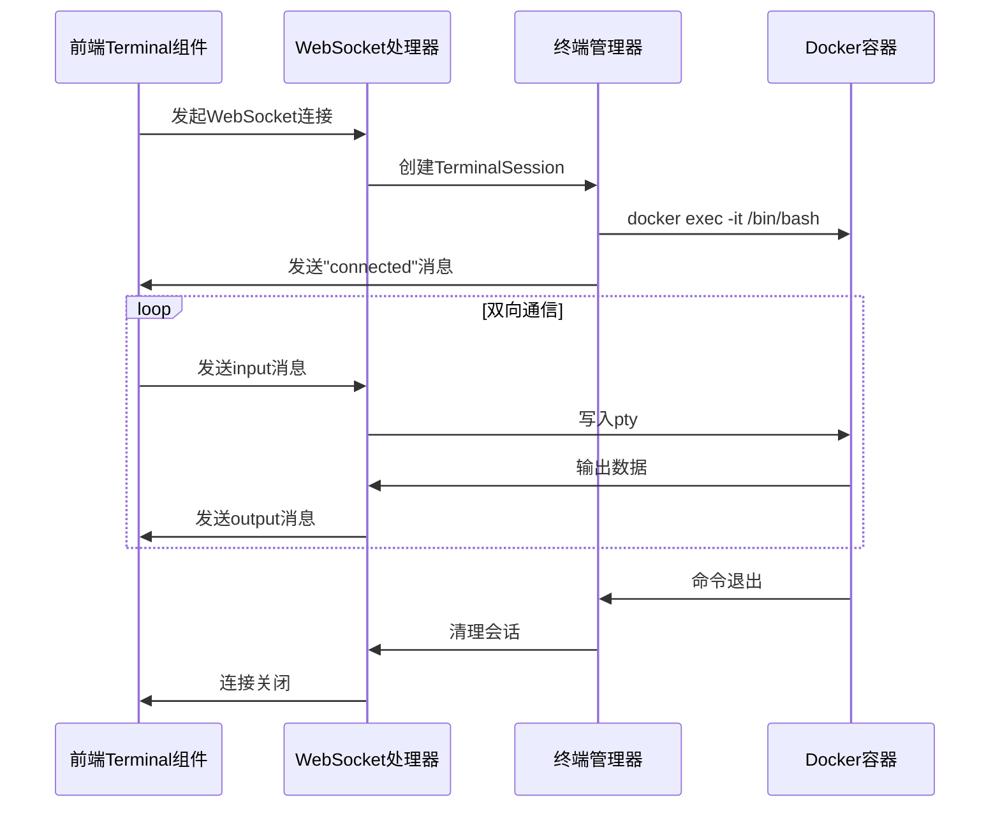
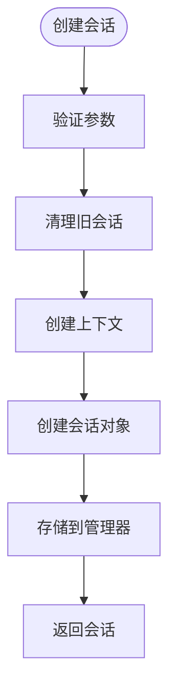
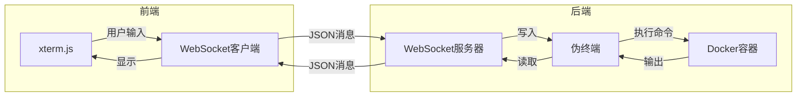
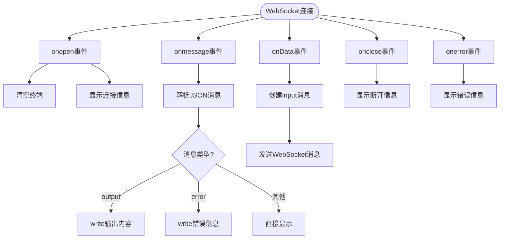

# WebSocket终端管理

<cite>
**本文档引用文件**   
- [terminal.go](file://internal/websocket/terminal.go)
- [Terminal.tsx](file://src/components/Terminal.tsx)
- [routes.go](file://internal/api/routes.go)
- [main.go](file://main.go)
</cite>

## 目录
1. [项目结构](#项目结构)
2. [核心组件](#核心组件)
3. [架构概述](#架构概述)
4. [详细组件分析](#详细组件分析)
5. [依赖分析](#依赖分析)
6. [性能考虑](#性能考虑)
7. [故障排除指南](#故障排除指南)

## 项目结构

本项目采用分层架构设计，前端与后端分离，WebSocket终端功能主要涉及以下核心文件：

```mermaid
graph TD
subgraph "前端"
Terminal[Terminal.tsx]
end
subgraph "后端"
API[routes.go]
WebSocket[terminal.go]
end
Terminal --> API : WebSocket连接
API --> WebSocket : 创建会话
```

**图示来源**
- [terminal.go](file://internal/websocket/terminal.go)
- [Terminal.tsx](file://src/components/Terminal.tsx)
- [routes.go](file://internal/api/routes.go)

**本节来源**
- [internal/websocket/terminal.go](file://internal/websocket/terminal.go)
- [src/components/Terminal.tsx](file://src/components/Terminal.tsx)

## 核心组件

WebSocket终端管理模块实现了前端Terminal组件与Docker容器之间的双向通信桥接。系统通过`TerminalManager`管理多个`TerminalSession`会话，每个会话对应一个Docker容器的交互式bash会话。前端通过WebSocket连接到后端，后端使用`github.com/creack/pty`库创建伪终端，实现与Docker容器的交互。

**本节来源**
- [terminal.go](file://internal/websocket/terminal.go#L1-L50)
- [Terminal.tsx](file://src/components/Terminal.tsx#L1-L20)

## 架构概述

系统架构实现了从用户界面到Docker容器的完整通信链路：



**图示来源**
- [terminal.go](file://internal/websocket/terminal.go#L81-L111)
- [Terminal.tsx](file://src/components/Terminal.tsx#L126-L135)

**本节来源**
- [terminal.go](file://internal/websocket/terminal.go#L1-L207)
- [Terminal.tsx](file://src/components/Terminal.tsx#L1-L217)

## 详细组件分析

### 终端会话分析

`TerminalSession`是核心会话对象，负责管理单个WebSocket连接与Docker容器之间的双向通信。

#### 类图
```mermaid
classDiagram
class TerminalSession {
+string sessionID
+string containerID
+*websocket.Conn conn
+*exec.Cmd cmd
+*os.File pty
+context.Context ctx
+context.CancelFunc cancel
+*logger.Logger logger
+StartInteractiveSession() error
+handleWebSocketInput()
+handleTerminalOutput()
+waitForTerminalExit()
+Close()
+Done() <-chan struct{}
}
class Message {
+string Type
+string Data
}
class TerminalManager {
+map[string]*TerminalSession sessions
+sync.RWMutex mu
+*logger.Logger logger
+CreateSession(sessionID, containerID string, conn *websocket.Conn) *TerminalSession
+RemoveSession(sessionID string)
}
TerminalManager --> TerminalSession : "管理"
TerminalSession --> Message : "发送/接收"
```

**图示来源**
- [terminal.go](file://internal/websocket/terminal.go#L25-L206)

#### 会话创建流程


**图示来源**
- [terminal.go](file://internal/websocket/terminal.go#L56-L78)

#### 数据流分析


**图示来源**
- [terminal.go](file://internal/websocket/terminal.go#L114-L165)
- [Terminal.tsx](file://src/components/Terminal.tsx#L82-L126)

**本节来源**
- [terminal.go](file://internal/websocket/terminal.go#L1-L207)
- [Terminal.tsx](file://src/components/Terminal.tsx#L1-L217)

### 消息格式分析

前后端通过JSON格式的WebSocket消息进行通信，定义了统一的消息结构。

#### 消息类型表
| 消息类型 | 数据内容 | 方向 | 说明 |
|---------|--------|------|------|
| input | 用户输入命令 | 前端→后端 | 前端发送的命令输入 |
| output | 终端输出内容 | 后端→前端 | Docker容器的执行输出 |
| connected | 连接成功消息 | 后端→前端 | 会话建立确认 |
| error | 错误信息 | 后端→前端 | 执行错误或会话结束 |

**图示来源**
- [terminal.go](file://internal/websocket/terminal.go#L17-L20)
- [Terminal.tsx](file://src/components/Terminal.tsx#L126-L135)

#### 前端处理流程


**图示来源**
- [Terminal.tsx](file://src/components/Terminal.tsx#L126-L155)

**本节来源**
- [terminal.go](file://internal/websocket/terminal.go#L17-L20)
- [Terminal.tsx](file://src/components/Terminal.tsx#L1-L217)

## 依赖分析

系统各组件之间的依赖关系清晰，实现了良好的解耦：

```mermaid
graph TD
main[main.go] --> Handler[api.Handler]
Handler --> TerminalManager[websocket.TerminalManager]
TerminalManager --> Logger[logger.Logger]
TerminalManager --> Session[TerminalSession]
Session --> PTY[github.com/creack/pty]
Session --> Docker[docker exec命令]
Session --> Logger[logger.Logger]
Handler --> CourseService[course.Service]
Handler --> DockerController[docker.Controller]
Frontend[Terminal.tsx] --> BackendAPI[/ws/terminal]
BackendAPI --> Handler
```

**图示来源**
- [main.go](file://main.go#L31-L165)
- [routes.go](file://internal/api/routes.go#L637-L693)

**本节来源**
- [main.go](file://main.go#L1-L198)
- [routes.go](file://internal/api/routes.go#L1-L694)

## 性能考虑

### 缓冲策略
后端在处理终端输出时采用了1024字节的缓冲区，平衡了实时性和性能：

```go
buf := make([]byte, 1024)
n, err := ts.pty.Read(buf)
```

这种设计避免了频繁的小数据包传输，同时保证了足够的实时性。前端xterm.js也内置了滚动缓冲区（scrollback: 10000），优化了大量输出时的性能表现。

### 并发控制
`TerminalManager`使用`sync.RWMutex`实现会话的并发安全访问，允许多个goroutine同时读取会话列表，但在创建或删除会话时进行写锁定，确保数据一致性。

### 连接管理
系统实现了完整的资源清理机制：
- 使用`context.WithCancel`管理会话生命周期
- `defer`语句确保连接关闭
- `Close()`方法统一清理所有资源（context、pty、WebSocket连接）

**本节来源**
- [terminal.go](file://internal/websocket/terminal.go#L184-L194)
- [Terminal.tsx](file://src/components/Terminal.tsx#L101-L103)

## 故障排除指南

### 常见问题
1. **WebSocket连接失败**
   - 检查后端服务是否正常运行
   - 确认WebSocket端点`/ws/terminal`是否正确配置
   - 检查浏览器控制台是否有CORS错误

2. **终端无响应**
   - 确认Docker服务是否正常运行
   - 检查容器ID是否正确
   - 查看服务端日志中的错误信息

3. **命令执行无输出**
   - 检查pty创建是否成功
   - 确认Docker容器中是否存在`/bin/bash`
   - 检查权限问题

### 安全性考虑
1. **命令注入防护**
   - 系统直接执行`docker exec`命令，应确保容器ID来自可信来源
   - 建议在生产环境中添加容器ID白名单验证

2. **连接验证**
   - 当前实现允许所有来源的WebSocket连接（`CheckOrigin`返回true）
   - 生产环境应实现来源验证或身份认证

3. **资源限制**
   - 未对会话数量进行限制，可能遭受资源耗尽攻击
   - 建议添加会话超时和最大会话数限制

**本节来源**
- [terminal.go](file://internal/websocket/terminal.go#L114-L135)
- [routes.go](file://internal/api/routes.go#L637-L693)