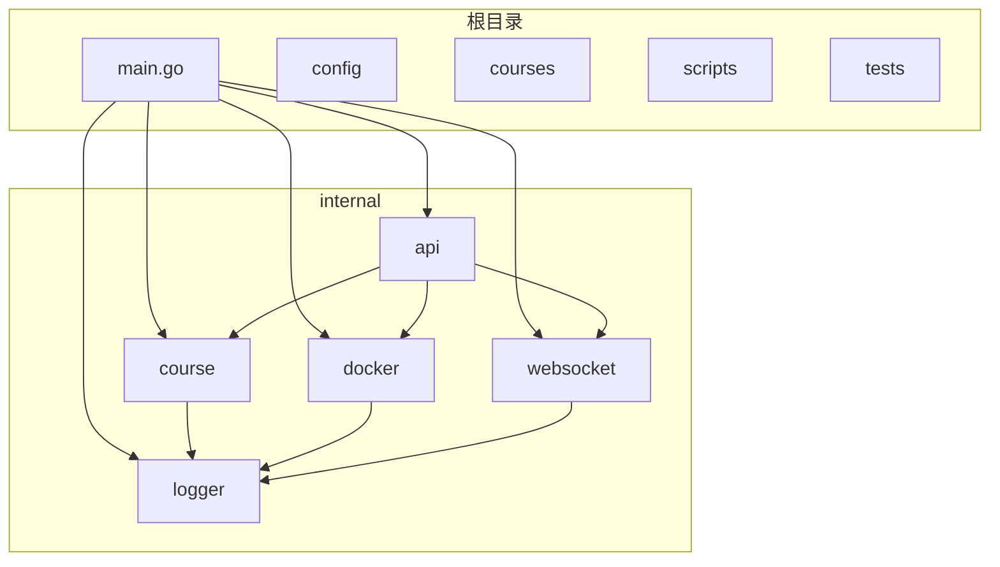
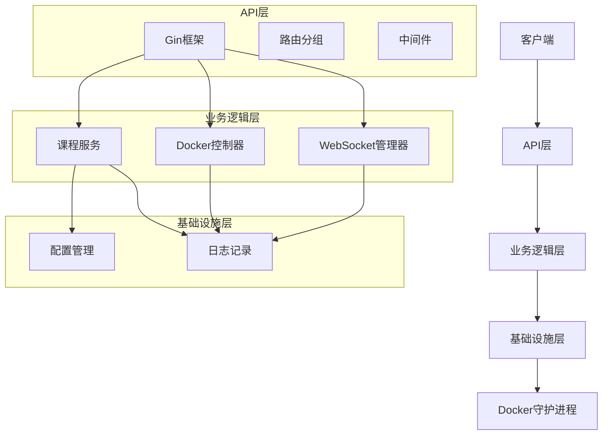
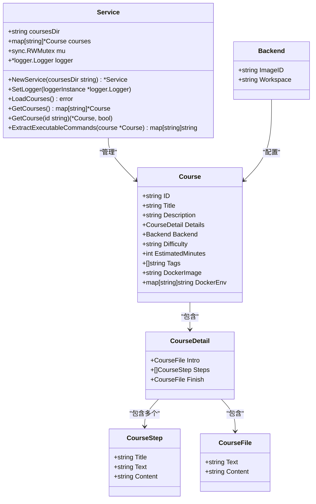
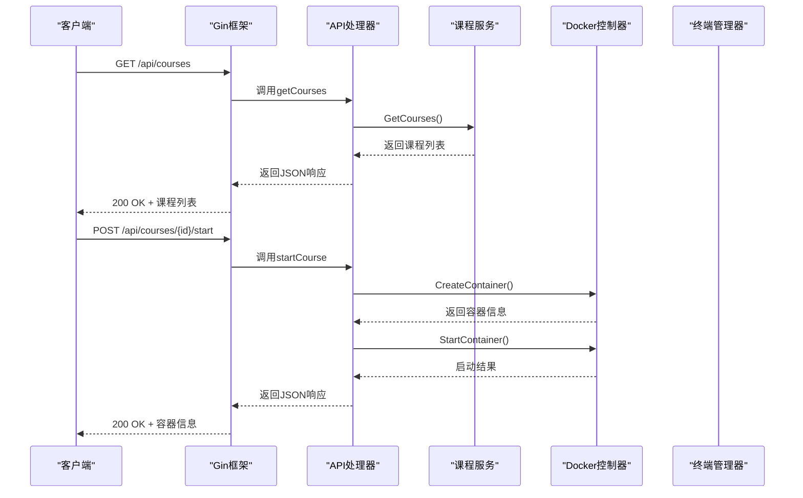
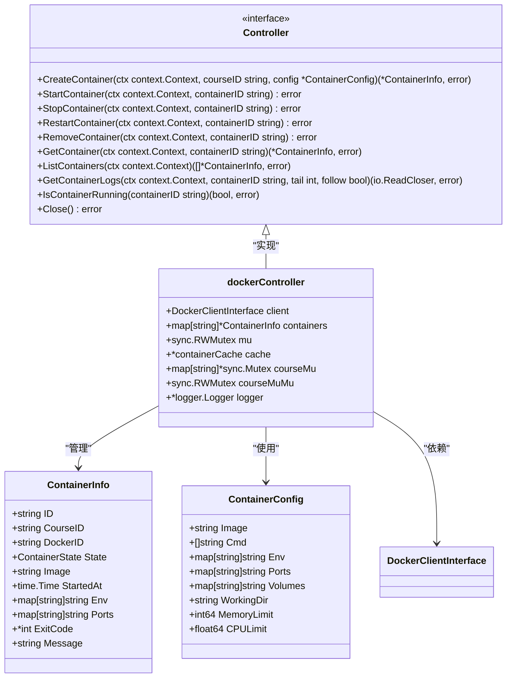
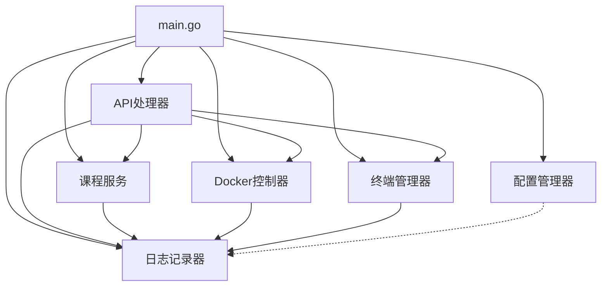

# 后端架构

<cite>
**本文档引用的文件**  
- [main.go](file://main.go)
- [internal/api/routes.go](file://internal/api/routes.go)
- [internal/course/service.go](file://internal/course/service.go)
- [internal/docker/controller.go](file://internal/docker/controller.go)
- [internal/websocket/terminal.go](file://internal/websocket/terminal.go)
- [internal/config/config.go](file://internal/config/config.go)
- [internal/logger/logger.go](file://internal/logger/logger.go)
</cite>

## 目录
1. [简介](#简介)
2. [项目结构](#项目结构)
3. [核心组件](#核心组件)
4. [架构概览](#架构概览)
5. [详细组件分析](#详细组件分析)
6. [依赖分析](#依赖分析)
7. [性能考虑](#性能考虑)
8. [故障排除指南](#故障排除指南)
9. [结论](#结论)
10. [附录](#附录)（如有必要）

## 简介
本文档系统阐述了playground后端架构的模块化设计与服务协作机制。该系统采用Go语言开发，基于Gin框架构建RESTful API服务，通过模块化设计实现了课程管理、容器控制、WebSocket终端等核心功能的解耦。系统通过依赖注入方式将各组件组装，实现了高内聚、低耦合的架构设计。后端支持通过Docker SDK与Docker守护进程通信，动态管理容器生命周期，为用户提供隔离的实验环境。同时，系统通过WebSocket实现终端会话的实时双向通信，提供交互式操作体验。

## 项目结构
playground项目采用分层架构设计，代码组织清晰，各模块职责明确。项目根目录下包含前端资源、配置文件和主程序入口，`internal`目录下按功能划分了多个子模块，实现了关注点分离。



**图源**  
- [main.go](file://main.go#L1-L50)
- [internal/api/routes.go](file://internal/api/routes.go#L1-L50)

**本节来源**  
- [main.go](file://main.go#L1-L50)
- [internal/api/routes.go](file://internal/api/routes.go#L1-L50)

## 核心组件
系统由多个核心组件构成，包括API处理器、课程服务、Docker控制器、WebSocket终端管理器、配置管理器和日志记录器。这些组件通过依赖注入方式在`main.go`中初始化并组装，形成完整的后端服务。API处理器负责处理HTTP请求，课程服务负责管理课程内容，Docker控制器负责容器生命周期管理，WebSocket终端管理器负责处理终端会话，配置管理器负责加载应用配置，日志记录器负责统一日志管理。

**本节来源**  
- [main.go](file://main.go#L25-L100)
- [internal/api/routes.go](file://internal/api/routes.go#L15-L80)

## 架构概览
系统采用分层架构，从上到下分为API层、业务逻辑层和基础设施层。API层基于Gin框架处理HTTP请求，业务逻辑层包含课程服务和Docker控制器，基础设施层提供配置和日志服务。各层之间通过接口定义进行通信，实现了松耦合设计。



**图源**  
- [main.go](file://main.go#L10-L50)
- [internal/api/routes.go](file://internal/api/routes.go#L20-L40)

## 详细组件分析
本节详细分析系统中的关键组件，包括其设计模式、实现细节和交互方式。

### 课程服务分析
课程服务负责加载和管理课程内容，从文件系统中读取课程配置和内容，提供课程数据的缓存和访问。



**图源**  
- [internal/course/service.go](file://internal/course/service.go#L30-L35)
- [internal/course/models.go](file://internal/course/models.go#L5-L20)

#### API路由分析
API处理器定义了系统的RESTful API接口，通过路由分组和中间件实现功能模块化。



**图源**  
- [internal/api/routes.go](file://internal/api/routes.go#L64-L92)
- [main.go](file://main.go#L150-L180)

#### Docker控制器分析
Docker控制器封装了Docker SDK的调用，提供了容器生命周期管理的高级接口。



**图源**  
- [internal/docker/interfaces.go](file://internal/docker/interfaces.go#L34-L70)
- [internal/docker/controller.go](file://internal/docker/controller.go#L15-L45)

#### WebSocket终端分析
WebSocket终端管理器处理终端会话的创建和管理，实现与容器exec会话的桥接。

```mermaid
classDiagram
class TerminalManager {
+map[string]*TerminalSession sessions
+sync.RWMutex mu
+*logger.Logger logger
+NewTerminalManager() *TerminalManager
+SetLogger(loggerInstance *logger.Logger)
+CreateSession(sessionID, containerID string, conn *websocket.Conn) *TerminalSession
+RemoveSession(sessionID string)
}
class TerminalSession {
+string sessionID
+string containerID
+*websocket.Conn conn
+*exec.Cmd cmd
+*os.File pty
+context.Context ctx
+context.CancelFunc cancel
+*logger.Logger logger
+StartInteractiveSession() error
+handleWebSocketInput()
+handleTerminalOutput()
+waitForTerminalExit()
+Close()
+Done() <-chan struct{}
}
class Message {
+string Type
+string Data
}
TerminalManager --> TerminalSession : "管理"
TerminalSession --> Message : "发送/接收"
TerminalSession --> websocket.Conn : "通信"
TerminalSession --> exec.Cmd : "执行"
TerminalSession --> os.File : "PTY"
```

**图源**  
- [internal/websocket/terminal.go](file://internal/websocket/terminal.go#L35-L39)
- [internal/websocket/terminal.go](file://internal/websocket/terminal.go#L50-L80)

**本节来源**  
- [internal/course/service.go](file://internal/course/service.go#L1-L100)
- [internal/api/routes.go](file://internal/api/routes.go#L1-L100)
- [internal/docker/controller.go](file://internal/docker/controller.go#L1-L100)
- [internal/websocket/terminal.go](file://internal/websocket/terminal.go#L1-L100)

## 依赖分析
系统各组件之间存在明确的依赖关系，通过依赖注入方式在`main.go`中组装，避免了硬编码的依赖。



**图源**  
- [main.go](file://main.go#L1-L20)
- [internal/api/routes.go](file://internal/api/routes.go#L10-L30)

**本节来源**  
- [main.go](file://main.go#L1-L30)
- [internal/api/routes.go](file://internal/api/routes.go#L1-L30)

## 性能考虑
系统在设计时考虑了多项性能优化措施。首先，课程服务在启动时加载所有课程内容到内存中，避免了频繁的文件I/O操作。其次，Docker控制器实现了容器状态缓存，减少了对Docker API的频繁调用。此外，系统使用了读写锁（sync.RWMutex）来保护共享数据的并发访问，提高了读操作的性能。API层通过Gin框架的中间件机制实现了请求的快速处理和错误恢复。静态文件服务通过嵌入式文件系统（embed.FS）提供，减少了磁盘I/O开销，并设置了长缓存头以提高前端资源的加载性能。

## 故障排除指南
当系统出现故障时，可按照以下步骤进行排查：

1. **检查日志输出**：查看系统日志，定位错误信息。日志级别可通过环境变量LOG_LEVEL配置。
2. **验证Docker连接**：确保Docker守护进程正在运行，且应用程序有权限访问Docker socket。
3. **检查课程目录**：确认课程文件目录存在且包含有效的课程配置文件。
4. **验证API端点**：使用curl或Postman测试API端点，确认服务正常运行。
5. **检查容器状态**：通过Docker命令行工具检查相关容器的状态和日志。

**本节来源**  
- [main.go](file://main.go#L150-L180)
- [internal/api/routes.go](file://internal/api/routes.go#L100-L150)

## 结论
playground后端架构采用模块化设计，各组件职责清晰，通过依赖注入方式组装，实现了高内聚、低耦合的架构目标。系统通过Gin框架提供RESTful API服务，通过Docker SDK与容器引擎交互，通过WebSocket实现终端会话的实时通信。课程服务实现了课程内容的加载和缓存，Docker控制器封装了容器生命周期管理的复杂性，WebSocket终端管理器实现了与容器exec会话的桥接。整体架构设计合理，扩展性强，便于维护和功能迭代。

## 附录
### 添加新API端点指南
要添加新的API端点，需遵循以下步骤：
1. 在`internal/api/routes.go`的`Handler`结构体中定义新的处理方法。
2. 在`SetupRoutes`方法中注册新的路由。
3. 实现处理逻辑，调用相应的业务服务。
4. 添加必要的错误处理和日志记录。

### 集成其他容器运行时指南
要集成其他容器运行时（如containerd），需：
1. 实现`docker.Controller`接口，提供新的容器运行时适配器。
2. 修改`NewController`工厂函数，根据配置选择适当的控制器实现。
3. 确保新的控制器实现支持所有必需的操作（创建、启动、停止容器等）。
4. 更新依赖注入逻辑，使API处理器能够使用新的控制器。