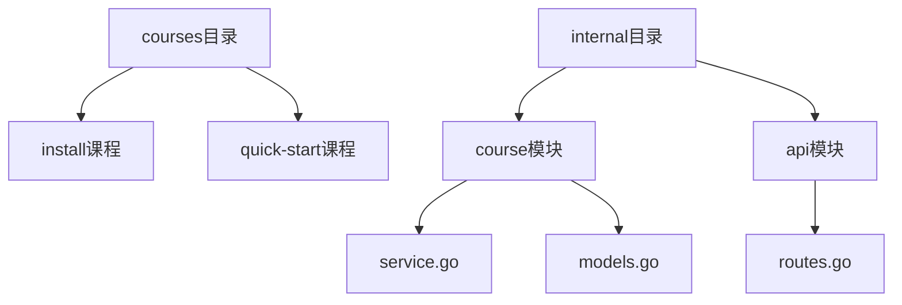
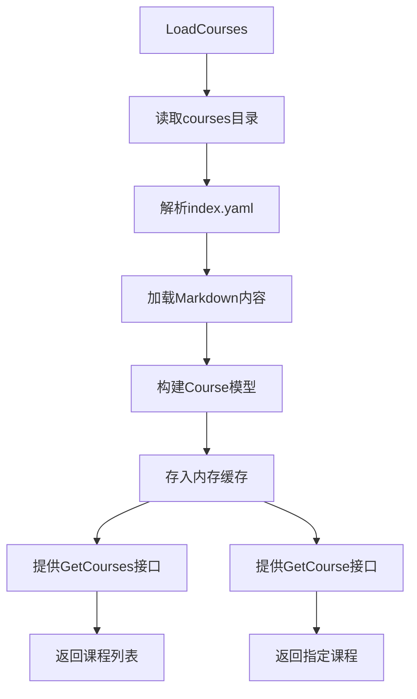
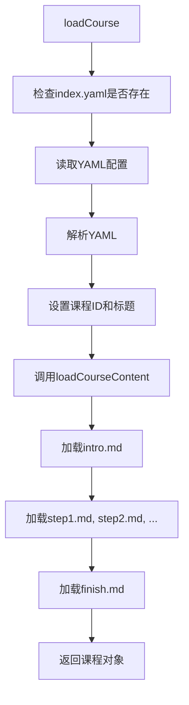
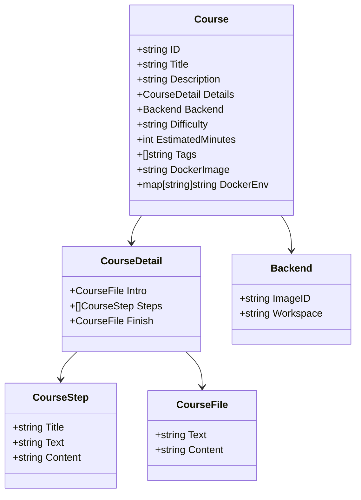
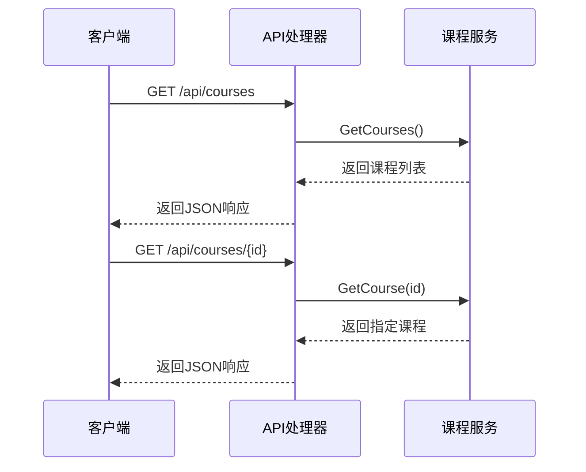
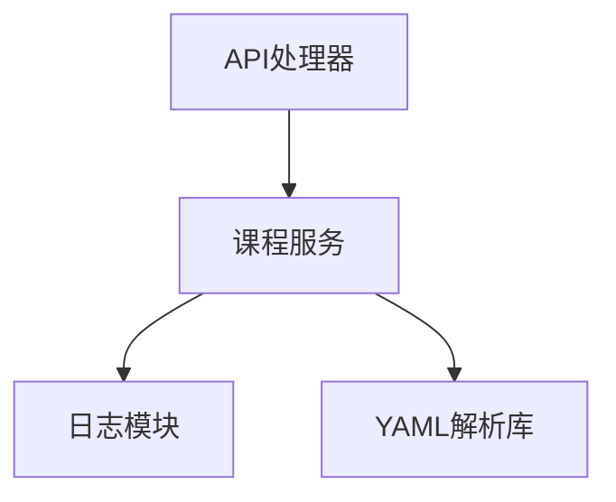

# 课程服务

<cite>
**本文档引用的文件**
- [service.go](file://internal/course/service.go)
- [models.go](file://internal/course/models.go)
- [routes.go](file://internal/api/routes.go)
- [index.yaml](file://courses/install/index.yaml)
- [index.yaml](file://courses/quick-start/index.yaml)
</cite>

## 目录
1. [简介](#简介)
2. [项目结构](#项目结构)
3. [核心组件](#核心组件)
4. [架构概述](#架构概述)
5. [详细组件分析](#详细组件分析)
6. [依赖分析](#依赖分析)
7. [性能考虑](#性能考虑)
8. [故障排除指南](#故障排除指南)
9. [结论](#结论)

## 简介
本课程服务模块为KWDB Playground提供课程管理功能，包括课程加载、内容解析、命令提取等核心功能。服务从文件系统加载课程配置和内容，解析Markdown格式的课程文档，并提取课程中的可执行命令。该服务是线程安全的，支持并发访问，确保在多用户环境下稳定运行。

## 项目结构
课程服务模块的项目结构清晰，主要分为以下几个部分：
- `courses` 目录：包含所有课程的Markdown内容和YAML配置文件。
- `internal/course` 目录：包含课程服务的核心实现，包括`service.go`和`models.go`。
- `internal/api` 目录：包含API处理器，负责处理HTTP请求并调用课程服务。

**图示来源**
- [service.go](file://internal/course/service.go#L1-L50)
- [models.go](file://internal/course/models.go#L1-L10)
- [routes.go](file://internal/api/routes.go#L1-L10)

**本节来源**
- [service.go](file://internal/course/service.go#L1-L50)
- [models.go](file://internal/course/models.go#L1-L10)
- [routes.go](file://internal/api/routes.go#L1-L10)

## 核心组件
课程服务的核心组件包括`Service`结构体、`Course`模型和`GetCourses`、`GetCourse`等公共接口。`Service`结构体负责管理所有课程的加载和访问，`Course`模型定义了课程的元信息，如标题、步骤、完成条件等。

**本节来源**
- [service.go](file://internal/course/service.go#L50-L100)
- [models.go](file://internal/course/models.go#L5-L16)

## 架构概述
课程服务的架构设计遵循模块化原则，各组件职责明确，耦合度低。服务通过`LoadCourses`方法从文件系统加载课程，通过`GetCourses`和`GetCourse`方法提供课程数据访问接口。

**图示来源**
- [service.go](file://internal/course/service.go#L68-L105)
- [models.go](file://internal/course/models.go#L5-L16)

## 详细组件分析
### 课程加载与解析
课程服务通过`loadCourse`方法加载单个课程的配置和内容。该方法首先检查配置文件是否存在，然后读取并解析YAML配置，最后加载课程的详细内容。

**图示来源**
- [service.go](file://internal/course/service.go#L98-L148)
- [models.go](file://internal/course/models.go#L5-L16)

**本节来源**
- [service.go](file://internal/course/service.go#L98-L148)
- [models.go](file://internal/course/models.go#L5-L16)

### 课程元信息结构
课程元信息在`models.go`中定义，包括课程ID、标题、描述、详细信息、后端配置、难度、预计时间、标签、Docker镜像和环境变量等字段。

**图示来源**
- [models.go](file://internal/course/models.go#L5-L16)
- [models.go](file://internal/course/models.go#L18-L30)

**本节来源**
- [models.go](file://internal/course/models.go#L5-L30)

### 公共接口
课程服务提供了`GetCourses`和`GetCourse`两个公共接口，用于获取所有课程和指定课程。这些接口被API处理器调用，为前端提供课程数据。

**图示来源**
- [routes.go](file://internal/api/routes.go#L116-L170)
- [service.go](file://internal/course/service.go#L227-L237)
- [service.go](file://internal/course/service.go#L250-L256)

**本节来源**
- [routes.go](file://internal/api/routes.go#L116-L170)
- [service.go](file://internal/course/service.go#L227-L256)

## 依赖分析
课程服务依赖于`logger`模块进行日志记录，依赖于`yaml.v3`库解析YAML配置文件。API处理器依赖于课程服务提供课程数据。

**图示来源**
- [service.go](file://internal/course/service.go#L10-L15)
- [routes.go](file://internal/api/routes.go#L10-L15)

**本节来源**
- [service.go](file://internal/course/service.go#L10-L15)
- [routes.go](file://internal/api/routes.go#L10-L15)

## 性能考虑
课程服务通过内存缓存提升访问性能，避免重复读取文件系统。`GetCourses`和`GetCourse`方法使用读锁保护数据访问，确保线程安全。

**本节来源**
- [service.go](file://internal/course/service.go#L220-L268)

## 故障排除指南
常见问题包括课程目录不存在、配置文件格式错误、Markdown文件缺失等。日志记录器会记录详细的错误信息，帮助定位问题。

**本节来源**
- [service.go](file://internal/course/service.go#L68-L105)
- [service.go](file://internal/course/service.go#L98-L148)

## 结论
课程服务模块设计合理，功能完整，能够高效地管理课程内容。通过合理的架构设计和性能优化，确保了服务的稳定性和可扩展性。