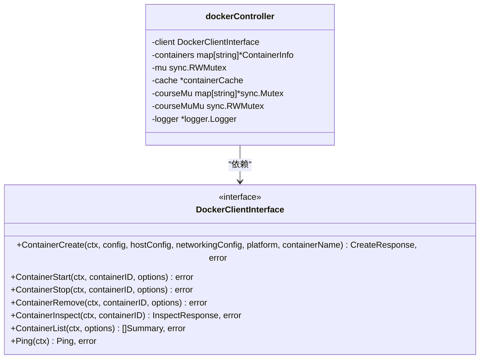
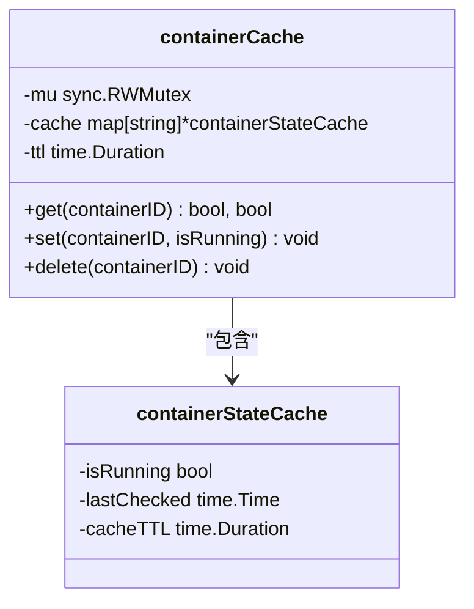
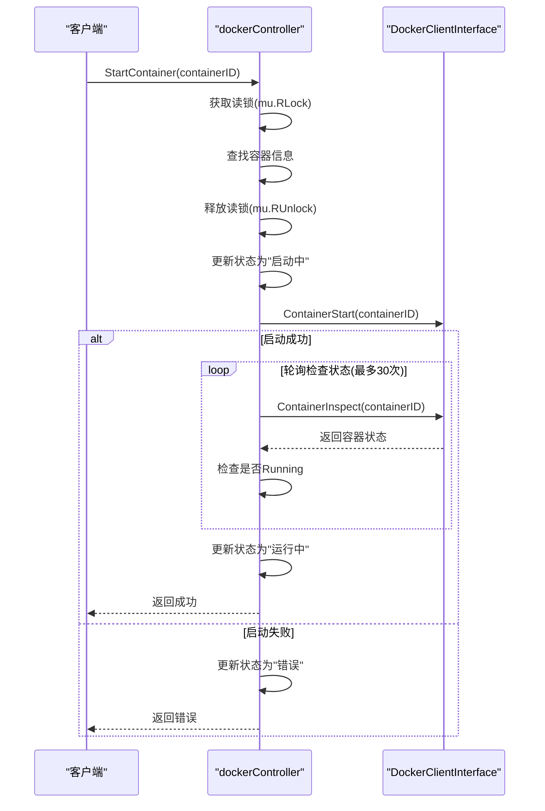
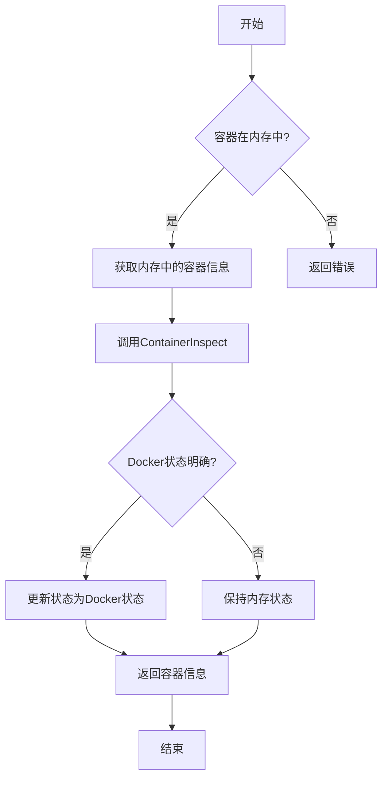
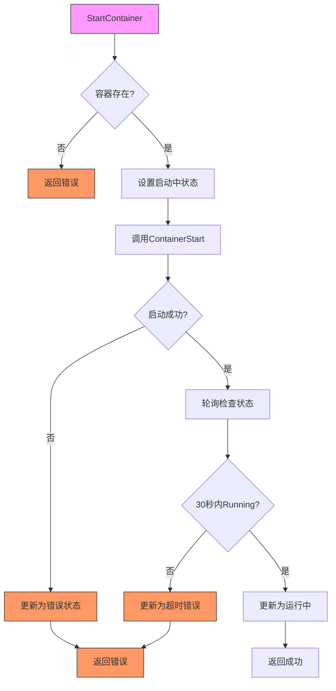

# 容器控制器

<cite>
**本文档中引用的文件**  
- [controller.go](file://internal/docker/controller.go)
- [interfaces.go](file://internal/docker/interfaces.go)
- [types.go](file://internal/docker/types.go)
- [cache.go](file://internal/docker/cache.go)
</cite>

## 目录
1. [简介](#简介)
2. [核心组件](#核心组件)
3. [字段设计与并发控制](#字段设计与并发控制)
4. [容器生命周期管理](#容器生命周期管理)
5. [状态查询与缓存机制](#状态查询与缓存机制)
6. [并发控制策略与状态一致性](#并发控制策略与状态一致性)
7. [调用流程图与错误传播路径](#调用流程图与错误传播路径)
8. [总结](#总结)

## 简介

`dockerController` 是 KwDB 实验室平台的核心组件之一，负责管理 Docker 容器的全生命周期。该控制器实现了课程隔离、并发安全、状态缓存和资源清理等关键功能，为用户提供稳定可靠的容器化实验环境。本文档深入分析 `internal/docker/controller.go` 中 `dockerController` 结构体的实现细节，重点解析其字段设计、方法实现和并发控制策略。

## 核心组件

`dockerController` 结构体是 Docker 操作的核心协调者，封装了与 Docker 守护进程的交互逻辑。它通过接口抽象实现了对底层 Docker 客户端的解耦，支持多种 Docker socket 路径的自动探测和连接。控制器维护了内存中的容器状态映射表，并通过多层锁机制确保并发操作的安全性。

**Section sources**
- [controller.go](file://internal/docker/controller.go#L20-L25)

## 字段设计与并发控制

### DockerClientInterface 接口引用

`client` 字段是 `DockerClientInterface` 接口的实例，提供了与 Docker 守护进程通信的抽象层。这种接口设计实现了依赖倒置原则，使得控制器可以轻松替换不同的 Docker 客户端实现，便于测试和扩展。

**Diagram sources**
- [interfaces.go](file://internal/docker/interfaces.go#L10-L70)
- [controller.go](file://internal/docker/controller.go#L20-L25)

### containers 状态映射表

`containers` 字段是 `map[string]*ContainerInfo` 类型的映射表，用于在内存中维护所有容器的元数据信息。每个容器通过唯一的 `containerID` 进行索引，存储了容器的课程ID、Docker ID、运行状态、镜像信息、启动时间、环境变量和端口映射等关键属性。

### sync.RWMutex 读写锁

`mu` 字段是 `sync.RWMutex` 类型的读写锁，用于保护 `containers` 映射表的并发访问。读写锁允许多个读操作同时进行，但写操作需要独占锁。这种设计在读多写少的场景下显著提升了性能，因为容器状态查询远比状态更新频繁。

### cache 缓存机制

`cache` 字段是 `*containerCache` 类型的指针，指向一个容器状态缓存管理器。缓存机制通过减少对 Docker API 的直接调用，显著提升了状态查询的性能。缓存条目包含容器的运行状态、最后检查时间和缓存有效期，支持基于TTL的自动过期。

**Diagram sources**
- [cache.go](file://internal/docker/cache.go#L10-L60)
- [types.go](file://internal/docker/types.go#L45-L49)

### courseMutex 课程级互斥锁

`courseMu` 字段是 `map[string]*sync.Mutex` 类型的映射表，为每个课程维护一个独立的互斥锁。这种设计确保了同一课程的容器操作是原子性的，防止了并发创建或清理操作导致的状态不一致。`courseMuMu` 字段是保护 `courseMu` 映射表本身的读写锁，实现了双重保护机制。

**Section sources**
- [controller.go](file://internal/docker/controller.go#L20-L25)
- [cache.go](file://internal/docker/cache.go#L10-L60)

## 容器生命周期管理

### StartContainer 方法

`StartContainer` 方法负责启动指定的容器实例。该方法首先通过读锁获取容器信息，然后调用 Docker 客户端的 `ContainerStart` 方法启动容器。启动后，方法会进入一个最多30秒的轮询循环，通过 `ContainerInspect` 检查容器的实际状态。

**Diagram sources**
- [controller.go](file://internal/docker/controller.go#L328-L383)

### StopContainer 方法

`StopContainer` 方法负责安全终止运行中的容器实例。该方法将停止超时时间设置为10秒，以避免前端等待过久。通过 `ContainerStop` 方法发送停止信号，并在成功后更新容器状态为"已退出"。

### cleanupCourseContainers 方法

`cleanupCourseContainers` 方法实现了课程级别的资源清理功能。该方法首先列出所有容器，然后根据课程ID前缀匹配相关容器。对于每个匹配的容器，如果正在运行则先停止，然后强制删除。此方法确保了课程实验环境的干净隔离。

**Section sources**
- [controller.go](file://internal/docker/controller.go#L328-L472)

## 状态查询与缓存机制

### GetContainerStatus 方法

`GetContainerStatus` 方法通过调用 `GetContainer` 方法获取容器的最新状态，并返回状态字符串。该方法间接利用了缓存机制，减少了对 Docker API 的直接调用频率。

### GetContainer 方法

`GetContainer` 方法是状态查询的核心实现。该方法首先从内存映射表中获取容器信息，然后通过 `ContainerInspect` 获取 Docker 守护进程中的最新状态。为了处理边缘情况，方法实现了智能状态合并策略：只有当 Docker 状态明确（如运行中、已死亡、OOM终止）时才更新内存状态，否则保持内存中的状态。

**Diagram sources**
- [controller.go](file://internal/docker/controller.go#L640-L652)

## 并发控制策略与状态一致性

### updateContainerState 方法

`updateContainerState` 方法是状态更新的唯一入口，通过写锁确保原子性。该方法在获取写锁后检查容器是否存在，然后更新其状态和消息字段。

### isContainerRunningCached 方法

`isContainerRunningCached` 方法实现了缓存优化的状态检查。该方法首先查询本地缓存，如果缓存命中则直接返回结果；否则查询 Docker API 并更新缓存。这种设计在高并发场景下显著降低了 API 调用压力。

### 延迟停止与资源清理

控制器在 `CreateContainer` 方法中实现了延迟停止逻辑：在创建新容器前，先调用 `cleanupCourseContainers` 清理该课程的所有现有容器。这种设计确保了每个课程在同一时间只有一个活跃的容器实例，避免了资源冲突。

**Section sources**
- [controller.go](file://internal/docker/controller.go#L475-L483)
- [controller.go](file://internal/docker/controller.go#L307-L325)

## 调用流程图与错误传播路径

**Diagram sources**
- [controller.go](file://internal/docker/controller.go#L328-L383)

## 总结

`dockerController` 通过精心设计的字段结构和并发控制策略，实现了高效、安全的容器管理。其核心优势包括：

1. **接口抽象**：通过 `DockerClientInterface` 实现了与底层 Docker 客户端的解耦
2. **并发安全**：使用读写锁和课程级互斥锁确保多线程环境下的数据一致性
3. **性能优化**：通过状态缓存机制减少对 Docker API 的频繁调用
4. **资源隔离**：基于课程ID的容器命名和清理策略实现了实验环境的完全隔离
5. **错误处理**：完善的错误传播路径和状态更新机制确保了系统的健壮性

这些设计使得 `dockerController` 能够在高并发场景下稳定运行，为 KwDB 实验室平台提供了可靠的容器化支持。