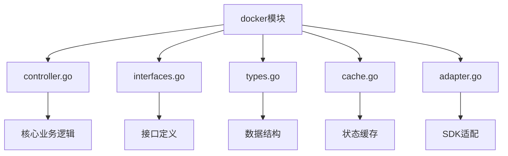
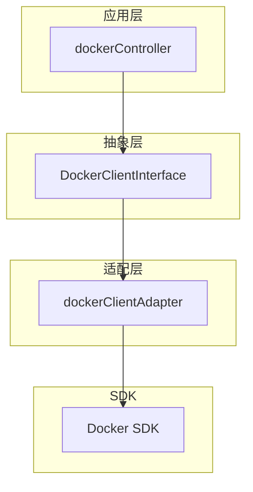
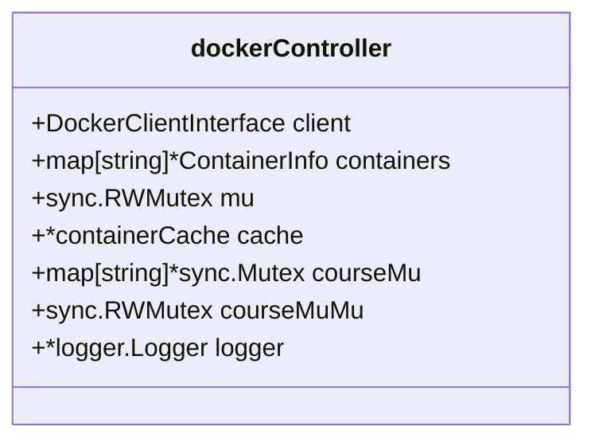
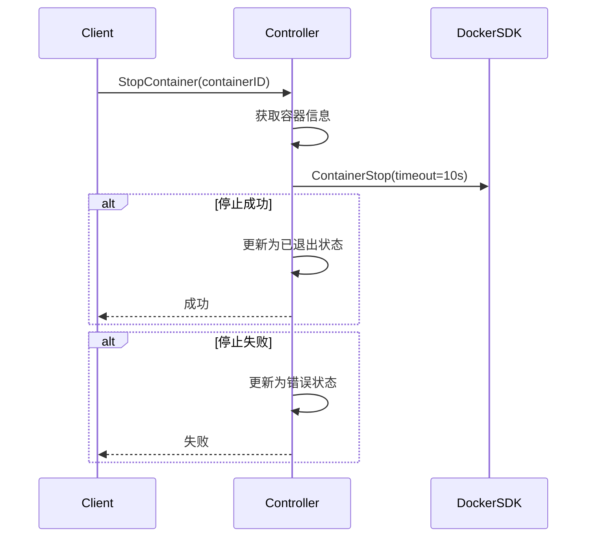
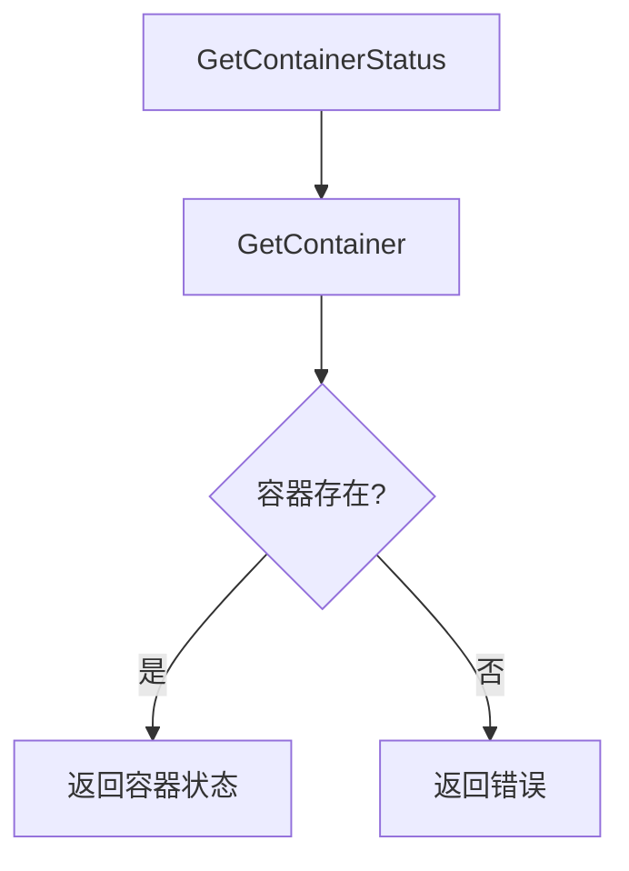
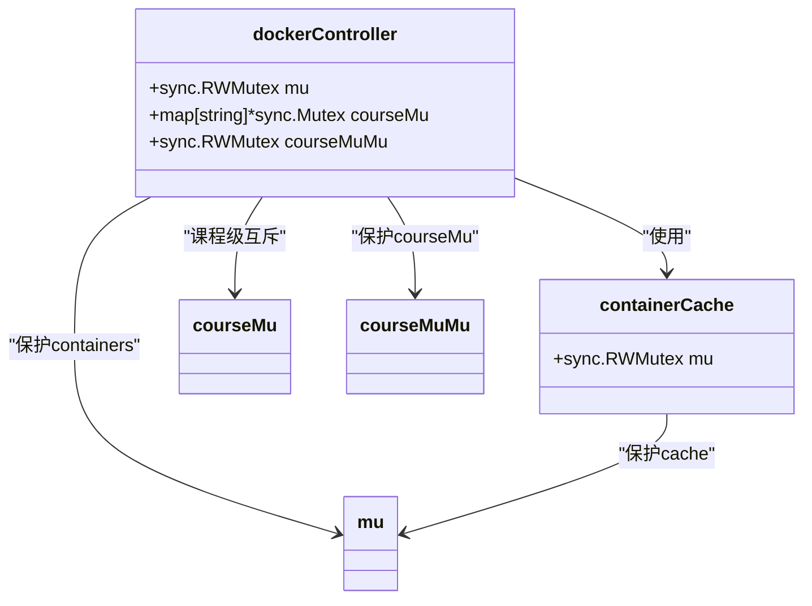
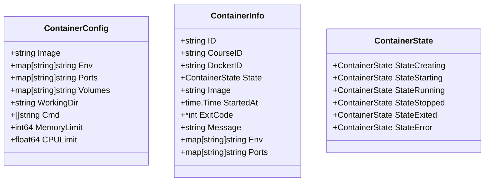
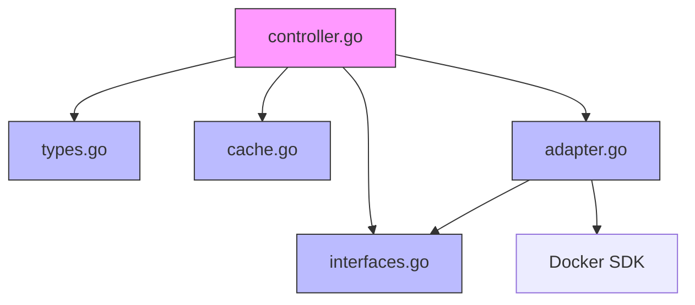
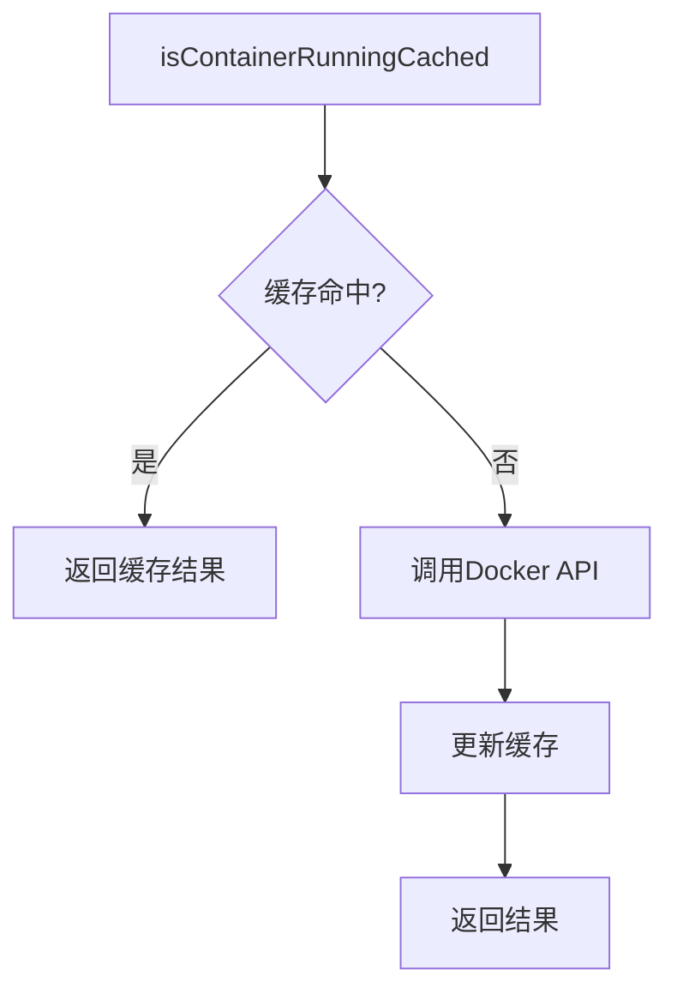

# 容器管理

<cite>
**本文档引用的文件**
- [controller.go](file://internal/docker/controller.go)
- [interfaces.go](file://internal/docker/interfaces.go)
- [types.go](file://internal/docker/types.go)
- [cache.go](file://internal/docker/cache.go)
- [adapter.go](file://internal/docker/adapter.go)
</cite>

## 目录
1. [简介](#简介)
2. [项目结构](#项目结构)
3. [核心组件](#核心组件)
4. [架构概述](#架构概述)
5. [详细组件分析](#详细组件分析)
6. [依赖分析](#依赖分析)
7. [性能考虑](#性能考虑)
8. [故障排除指南](#故障排除指南)
9. [结论](#结论)

## 简介
本文档深入分析了容器管理模块的实现，重点聚焦于 `docker/controller.go` 文件如何通过 Docker SDK 实现对容器的全生命周期控制。文档详细描述了 `dockerController` 结构体的设计意图、关键方法的实现逻辑、并发控制机制以及接口抽象的设计原则。

## 项目结构
容器管理模块位于 `internal/docker` 目录下，采用分层架构设计，各文件职责明确：



**Diagram sources**
- [controller.go](file://internal/docker/controller.go)
- [interfaces.go](file://internal/docker/interfaces.go)
- [types.go](file://internal/docker/types.go)
- [cache.go](file://internal/docker/cache.go)
- [adapter.go](file://internal/docker/adapter.go)

**Section sources**
- [controller.go](file://internal/docker/controller.go)
- [interfaces.go](file://internal/docker/interfaces.go)

## 核心组件
容器管理模块的核心组件包括控制器实现、接口抽象、数据结构定义和缓存机制，共同实现了对 Docker 容器的高效管理。

**Section sources**
- [controller.go](file://internal/docker/controller.go#L19-L27)
- [types.go](file://internal/docker/types.go#L17-L28)
- [interfaces.go](file://internal/docker/interfaces.go#L14-L31)

## 架构概述
容器管理模块采用依赖倒置原则，通过接口抽象与具体实现分离，提高了代码的可测试性和可维护性。



**Diagram sources**
- [controller.go](file://internal/docker/controller.go#L20)
- [interfaces.go](file://internal/docker/interfaces.go#L14-L31)
- [adapter.go](file://internal/docker/adapter.go#L14-L16)

## 详细组件分析

### dockerController结构体分析
`dockerController` 结构体是容器管理的核心，其字段设计体现了多方面的考虑：



**Diagram sources**
- [controller.go](file://internal/docker/controller.go#L19-L27)

#### 字段设计意图
- **client**: `DockerClientInterface` 抽象层，实现依赖倒置，便于单元测试和未来替换 Docker 引擎
- **containers**: 内存中的容器信息映射，存储容器元数据，避免频繁查询 Docker API
- **mu**: 读写锁，保护 `containers` 映射的并发访问，提高读操作性能
- **cache**: 容器状态缓存，减少对 Docker API 的调用频率，提升性能
- **courseMu**: 每个课程的互斥锁，确保同一课程的容器操作原子性
- **courseMuMu**: 保护 `courseMu` 映射的读写锁，防止并发修改
- **logger**: 日志记录器，用于调试和监控

**Section sources**
- [controller.go](file://internal/docker/controller.go#L19-L27)

### 接口抽象设计
通过 `interfaces.go` 中的接口定义，实现了依赖倒置原则：

```mermaid
classDiagram
class DockerClientInterface {
+ContainerCreate()
+ContainerStart()
+ContainerStop()
+ContainerInspect()
+ContainerList()
+ContainerLogs()
+ImagePull()
+ContainerExecCreate()
+ContainerExecAttach()
+ContainerExecStart()
+ContainerExecInspect()
+ContainerExecResize()
+Ping()
+Close()
}
class Controller {
+CreateContainer()
+StartContainer()
+StopContainer()
+RestartContainer()
+RemoveContainer()
+GetContainer()
+ListContainers()
+GetContainerLogs()
+PullImage()
+ExecCommand()
+ExecCommandInteractive()
+ResizeTerminal()
+ContainerExecResize()
+IsContainerRunning()
+Close()
}
class dockerClientAdapter {
-client *client.Client
}
Controller <|-- dockerController
DockerClientInterface <|-- dockerClientAdapter
dockerController --> DockerClientInterface : "依赖"
dockerClientAdapter --> "client.Client" : "适配"
```

**Diagram sources**
- [interfaces.go](file://internal/docker/interfaces.go#L14-L31)
- [adapter.go](file://internal/docker/adapter.go#L14-L16)
- [controller.go](file://internal/docker/controller.go#L19-L27)

#### 依赖倒置优势
- **可测试性**: 可以通过 mock 接口实现单元测试
- **可替换性**: 未来可以替换为其他容器运行时（如 containerd）
- **解耦**: 控制器与具体 SDK 实现解耦，降低维护成本

**Section sources**
- [interfaces.go](file://internal/docker/interfaces.go#L14-L70)
- [adapter.go](file://internal/docker/adapter.go#L19-L23)

### 容器生命周期方法分析

#### StartContainer方法
`StartContainer` 方法实现了容器启动的完整流程，包括状态管理、错误处理和超时控制：

```mermaid
sequenceDiagram
participant Client
participant Controller
participant DockerSDK
Client->>Controller : StartContainer(containerID)
Controller->>Controller : 获取容器信息
Controller->>Controller : 设置启动中状态
Controller->>DockerSDK : ContainerStart()
loop 等待容器启动
Controller->>DockerSDK : ContainerInspect()
DockerSDK-->>Controller : inspect
alt 容器运行中
Controller->>Controller : 更新为运行状态
Controller-->>Client : 成功
break
end
alt 容器启动失败
Controller->>Controller : 更新为错误状态
Controller-->>Client : 失败
break
end
end
alt 超时
Controller->>Controller : 更新为超时状态
Controller-->>Client : 超时
end
```

**Diagram sources**
- [controller.go](file://internal/docker/controller.go#L328-L383)

#### StopContainer方法
`StopContainer` 方法实现了容器停止逻辑，优化了超时时间以提升用户体验：



**Diagram sources**
- [controller.go](file://internal/docker/controller.go#L386-L412)

#### GetContainerStatus方法
`GetContainerStatus` 方法通过组合其他方法实现状态查询：



**Diagram sources**
- [controller.go](file://internal/docker/controller.go#L653-L659)

**Section sources**
- [controller.go](file://internal/docker/controller.go#L328-L383)
- [controller.go](file://internal/docker/controller.go#L386-L412)
- [controller.go](file://internal/docker/controller.go#L653-L659)

### 并发控制机制
容器管理模块采用了多层次的并发控制机制：



**Diagram sources**
- [controller.go](file://internal/docker/controller.go#L22-L25)
- [cache.go](file://internal/docker/cache.go#L10-L12)

#### 并发控制策略
- **读写锁 (RWMutex)**: 用于 `containers` 和缓存，提高读操作并发性能
- **课程级互斥锁**: 确保同一课程的容器操作原子性，防止竞态条件
- **双重检查锁定**: 在获取课程互斥锁时使用，避免不必要的锁竞争

**Section sources**
- [controller.go](file://internal/docker/controller.go#L237-L257)
- [cache.go](file://internal/docker/cache.go#L23-L50)

### 容器配置与资源管理
`types.go` 中定义了容器配置结构体，支持灵活的资源配置：



**Diagram sources**
- [types.go](file://internal/docker/types.go#L5-L40)

#### 资源配置实现
- **CPU限制**: 通过 `CPUQuota` 和 `CPUPeriod` 实现，`CPULimit` 以核心数为单位
- **内存限制**: 直接设置 `Memory` 字段，单位为字节
- **挂载卷**: 通过 `Binds` 字段实现主机路径与容器路径的映射
- **端口映射**: 使用 `PortBindings` 配置容器端口到主机端口的映射

**Section sources**
- [types.go](file://internal/docker/types.go#L31-L40)
- [controller.go](file://internal/docker/controller.go#L507-L606)

## 依赖分析
容器管理模块的依赖关系清晰，体现了良好的分层设计：



**Diagram sources**
- [controller.go](file://internal/docker/controller.go)
- [interfaces.go](file://internal/docker/interfaces.go)
- [types.go](file://internal/docker/types.go)
- [cache.go](file://internal/docker/cache.go)
- [adapter.go](file://internal/docker/adapter.go)

### 依赖关系说明
- **controller.go**: 核心业务逻辑，依赖其他所有组件
- **interfaces.go**: 定义抽象接口，被控制器和适配器依赖
- **types.go**: 定义数据结构，被所有组件依赖
- **cache.go**: 实现状态缓存，被控制器依赖
- **adapter.go**: 适配 Docker SDK，实现接口定义

**Section sources**
- [controller.go](file://internal/docker/controller.go)
- [interfaces.go](file://internal/docker/interfaces.go)
- [types.go](file://internal/docker/types.go)
- [cache.go](file://internal/docker/cache.go)
- [adapter.go](file://internal/docker/adapter.go)

## 性能考虑
容器管理模块在性能方面进行了多项优化：

### 缓存机制
通过 `containerCache` 减少对 Docker API 的调用：



**Diagram sources**
- [cache.go](file://internal/docker/cache.go#L23-L50)
- [controller.go](file://internal/docker/controller.go#L278-L325)

### 性能优化建议
1. **状态缓存**: 频繁查询的容器状态应使用缓存，减少 API 调用
2. **批量操作**: 相关操作应尽量批量执行，减少上下文切换
3. **连接复用**: Docker 客户端连接应复用，避免频繁创建销毁
4. **异步处理**: 耗时操作可考虑异步执行，提高响应速度

**Section sources**
- [cache.go](file://internal/docker/cache.go#L23-L50)
- [controller.go](file://internal/docker/controller.go#L278-L325)

## 故障排除指南
容器管理模块包含完善的错误处理和资源清理机制：

### 错误处理策略
- **网络超时重试**: 关键操作应包含超时控制和重试机制
- **资源清理**: 容器删除时自动清理相关资源，防止资源泄漏
- **命名空间隔离**: 通过课程 ID 实现命名空间隔离，避免容器名称冲突

### 常见问题
1. **容器启动超时**: 检查镜像是否完整，资源是否充足
2. **端口冲突**: 确保主机端口未被占用
3. **权限问题**: 检查 Docker 守护进程权限配置
4. **网络问题**: 验证 Docker 网络配置是否正确

**Section sources**
- [controller.go](file://internal/docker/controller.go#L609-L650)
- [controller.go](file://internal/docker/controller.go#L415-L472)

## 结论
容器管理模块通过精心设计的架构和实现，提供了稳定可靠的容器全生命周期管理功能。其采用的依赖倒置、接口抽象、缓存优化和并发控制等技术，确保了系统的可维护性、可扩展性和高性能。未来可进一步优化异步处理和资源监控功能，提升整体用户体验。