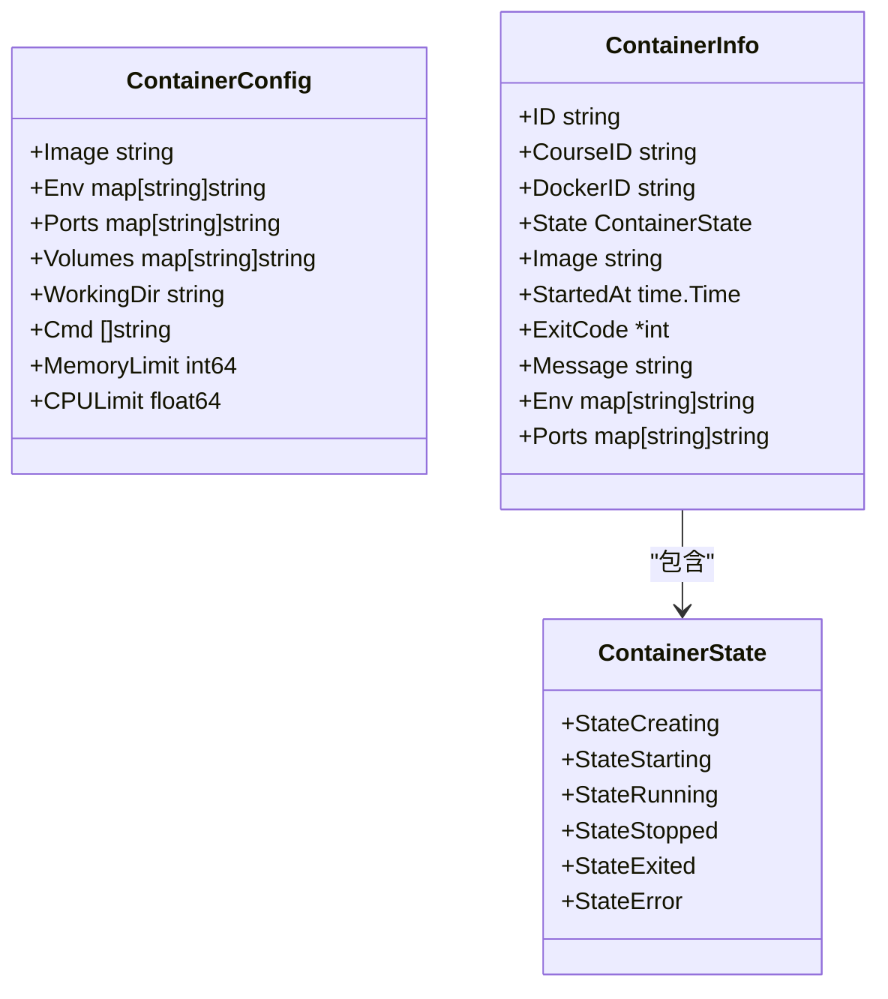
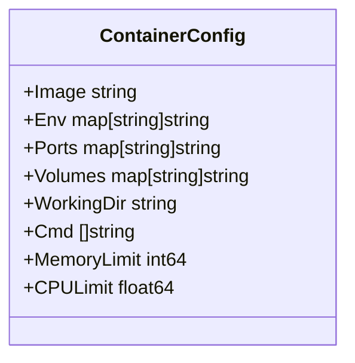
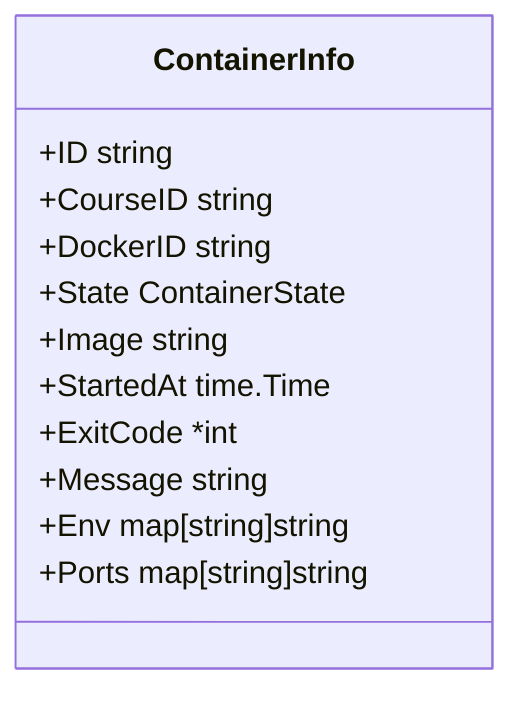
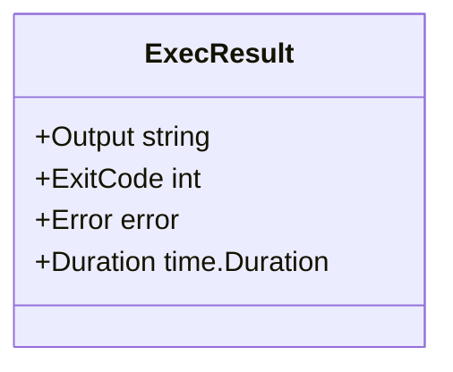
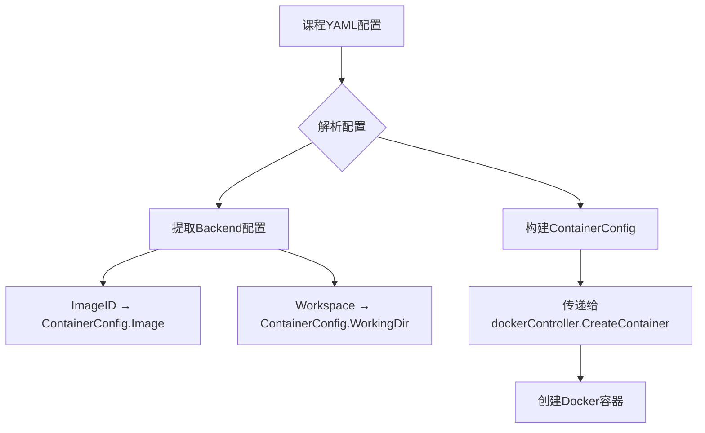
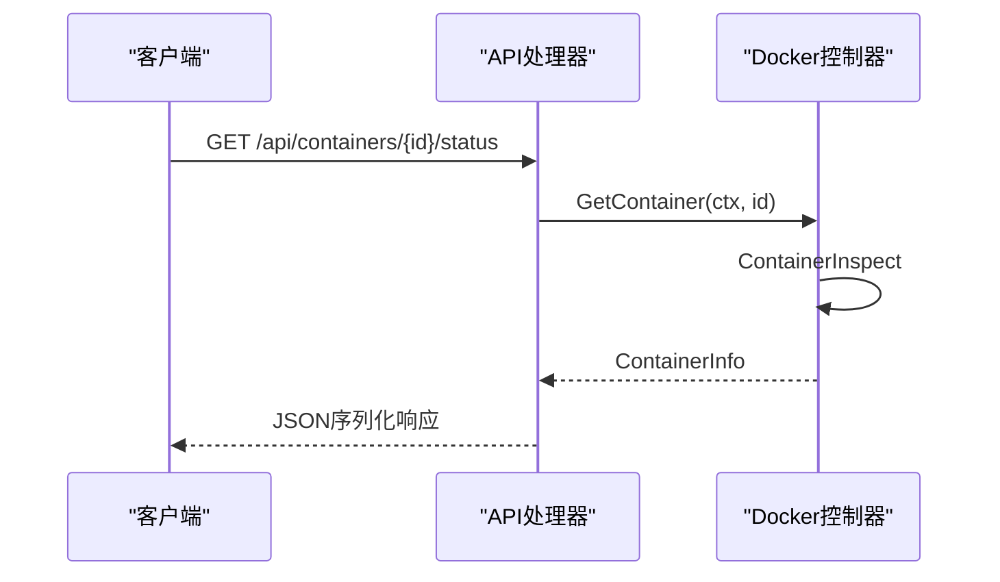
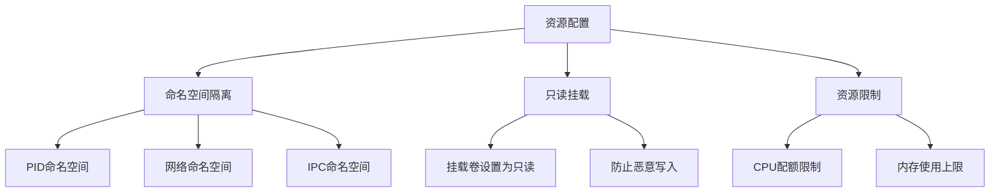
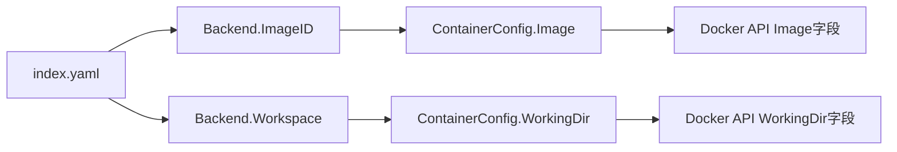

# 容器类型与配置模型

<cite>
**本文档引用的文件**   
- [types.go](file://internal/docker/types.go)
- [controller.go](file://internal/docker/controller.go)
- [routes.go](file://internal/api/routes.go)
- [models.go](file://internal/course/models.go)
- [index.yaml](file://courses/quick-start/index.yaml)
</cite>

## 目录
1. [简介](#简介)
2. [核心数据结构](#核心数据结构)
3. [ContainerConfig资源配置模型](#containerconfig资源配置模型)
4. [ContainerInfo运行时信息结构体](#containerinfo运行时信息结构体)
5. [ExecResult命令执行结果格式](#execresult命令执行结果格式)
6. [容器生命周期中的类型作用](#容器生命周期中的类型作用)
7. [资源配置的安全边界与性能影响](#资源配置的安全边界与性能影响)
8. [课程配置到Docker API的映射](#课程配置到docker-api的映射)
9. [常见配置错误排查清单](#常见配置错误排查清单)
10. [结论](#结论)

## 简介
本文档全面解析`types.go`中定义的容器相关数据结构，包括`ContainerConfig`资源配置模型、`ContainerInfo`运行时信息结构体以及命令执行结果格式。详细说明这些类型在容器生命周期中的作用，资源配置的安全边界设置及其性能影响，并结合实际课程示例展示配置项如何转化为Docker API调用参数。

## 核心数据结构



**Diagram sources**
- [types.go](file://internal/docker/types.go#L3-L48)

## ContainerConfig资源配置模型

`ContainerConfig`结构体定义了容器的配置参数，包括镜像、环境变量、端口映射、卷挂载、工作目录、启动命令以及资源限制等。



**Diagram sources**
- [types.go](file://internal/docker/types.go#L31-L40)

### 配置项详解

| 配置项 | 类型 | 描述 | JSON标签 |
|-------|------|------|---------|
| Image | string | 容器使用的镜像名称 | image |
| Env | map[string]string | 环境变量映射 | env |
| Ports | map[string]string | 端口映射（容器端口:主机端口） | ports |
| Volumes | map[string]string | 卷挂载（主机路径:容器路径） | volumes |
| WorkingDir | string | 容器工作目录 | workingDir |
| Cmd | []string | 容器启动命令 | cmd |
| MemoryLimit | int64 | 内存限制（字节） | memoryLimit |
| CPULimit | float64 | CPU限制（核心数） | cpuLimit |

**Section sources**
- [types.go](file://internal/docker/types.go#L31-L40)

## ContainerInfo运行时信息结构体

`ContainerInfo`结构体存储容器的运行时信息，包括容器ID、课程ID、Docker ID、状态、镜像、启动时间、退出码、消息、环境变量和端口信息。



**Diagram sources**
- [types.go](file://internal/docker/types.go#L17-L28)

### 运行时信息详解

| 信息项 | 类型 | 描述 | JSON标签 |
|-------|------|------|---------|
| ID | string | 容器标识符 | id |
| CourseID | string | 关联的课程ID | courseId |
| DockerID | string | Docker容器ID | dockerId |
| State | ContainerState | 容器当前状态 | state |
| Image | string | 使用的镜像 | image |
| StartedAt | time.Time | 启动时间 | startedAt |
| ExitCode | *int | 退出码（可选） | exitCode |
| Message | string | 状态消息（可选） | message |
| Env | map[string]string | 环境变量 | env |
| Ports | map[string]string | 端口映射信息 | ports |

**Section sources**
- [types.go](file://internal/docker/types.go#L17-L28)

## ExecResult命令执行结果格式
虽然`types.go`中没有直接定义`ExecResult`结构体，但通过分析`controller.go`中的执行逻辑，可以推断出命令执行的结果格式。



**Diagram sources**
- [controller.go](file://internal/docker/controller.go#L898-L938)

### 执行结果分析
命令执行结果主要通过Docker API的`ContainerExecInspect`方法获取，包含输出内容、退出码、错误信息和执行时长等关键指标。

**Section sources**
- [controller.go](file://internal/docker/controller.go#L898-L938)

## 容器生命周期中的类型作用

### ContainerConfig从课程YAML配置映射



**Diagram sources**
- [models.go](file://internal/course/models.go#L44-L47)
- [routes.go](file://internal/api/routes.go#L168-L302)

### ContainerInfo被API层序列化输出



**Diagram sources**
- [routes.go](file://internal/api/routes.go#L400-L480)
- [controller.go](file://internal/docker/controller.go#L662-L700)

**Section sources**
- [routes.go](file://internal/api/routes.go#L400-L480)
- [controller.go](file://internal/docker/controller.go#L662-L700)

## 资源配置的安全边界与性能影响

### 安全边界设置



**Diagram sources**
- [controller.go](file://internal/docker/controller.go#L507-L606)

### 性能影响分析

| 资源配置 | 性能影响 | 建议 |
|---------|---------|------|
| CPU限制 | 防止单个容器占用过多CPU资源，确保系统稳定性 | 根据课程需求合理设置，避免过高或过低 |
| 内存限制 | 防止内存溢出导致系统崩溃，提高资源利用率 | 设置合理的内存上限，避免OOM |
| 卷挂载 | 影响I/O性能，特别是大量文件读写操作 | 使用SSD存储，优化挂载路径 |
| 网络端口 | 多端口映射增加网络复杂性 | 仅开放必要的端口，减少安全风险 |

**Section sources**
- [controller.go](file://internal/docker/controller.go#L507-L606)

## 课程配置到Docker API的映射

### 实际课程示例分析

以`quick-start`课程为例，其`index.yaml`配置如下：

```yaml
backend:
  imageid: kwdb/kwdb
  workspace: /kaiwudb/bin
```

该配置映射到`ContainerConfig`的过程：



**Diagram sources**
- [index.yaml](file://courses/quick-start/index.yaml)
- [models.go](file://internal/course/models.go#L44-L47)
- [controller.go](file://internal/docker/controller.go#L507-L606)

### Docker API调用参数转换

```go
// 创建容器配置
containerConfig := &container.Config{
    Image:        config.Image,
    Env:          env,
    ExposedPorts: exposedPorts,
    WorkingDir:   config.WorkingDir,
    Cmd:          config.Cmd,
}

// 创建主机配置
hostConfig := &container.HostConfig{
    PortBindings: portBindings,
    Binds:        binds,
}

// 设置资源限制
if config.MemoryLimit > 0 {
    hostConfig.Memory = config.MemoryLimit
}
if config.CPULimit > 0 {
    hostConfig.CPUQuota = int64(config.CPULimit * 100000)
    hostConfig.CPUPeriod = 100000
}
```

**Section sources**
- [controller.go](file://internal/docker/controller.go#L507-L606)

## 常见配置错误排查清单

### 配置错误类型及解决方案

| 错误类型 | 可能原因 | 解决方案 | 相关代码位置 |
|---------|---------|---------|-----------|
| 容器无法启动 | 镜像名称错误 | 检查镜像名称拼写和仓库地址 | [routes.go#L200-L210](file://internal/api/routes.go#L200-L210) |
| 端口映射失败 | 端口已被占用 | 更换主机端口号或检查占用情况 | [controller.go#L540-L550](file://internal/docker/controller.go#L540-L550) |
| 卷挂载失败 | 主机路径不存在 | 确认主机路径存在且有读写权限 | [controller.go#L555-L565](file://internal/docker/controller.go#L555-L565) |
| 内存不足 | MemoryLimit设置过高 | 调整内存限制或增加主机内存 | [controller.go#L585-L590](file://internal/docker/controller.go#L585-L590) |
| CPU限制无效 | CPULimit格式错误 | 确保CPULimit为浮点数，表示核心数 | [controller.go#L590-L595](file://internal/docker/controller.go#L590-L595) |
| 环境变量未生效 | Env键值对格式错误 | 检查环境变量格式是否正确 | [controller.go#L530-L535](file://internal/docker/controller.go#L530-L535) |

### 调试建议
1. 查看容器日志：`GET /api/containers/{id}/logs`
2. 检查容器状态：`GET /api/containers/{id}/status`
3. 验证Docker守护进程状态
4. 检查系统资源使用情况
5. 查看应用日志文件

**Section sources**
- [controller.go](file://internal/docker/controller.go#L507-L606)
- [routes.go](file://internal/api/routes.go#L480-L520)

## 结论
本文档详细解析了`types.go`中定义的容器相关数据结构，包括`ContainerConfig`、`ContainerInfo`等核心类型。这些类型在容器生命周期中扮演着重要角色，从课程YAML配置映射到Docker API调用，再到运行时信息的序列化输出。合理的资源配置不仅能够确保安全边界，还能优化性能表现。通过理解这些数据结构及其作用，可以更好地进行容器化应用的开发和维护。