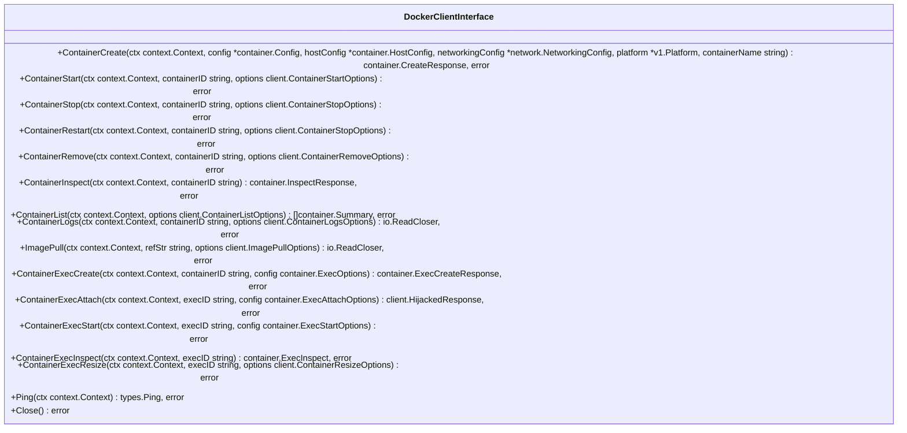
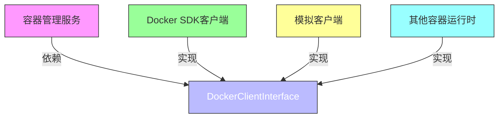
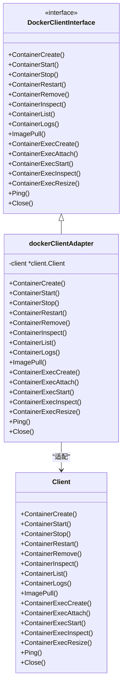
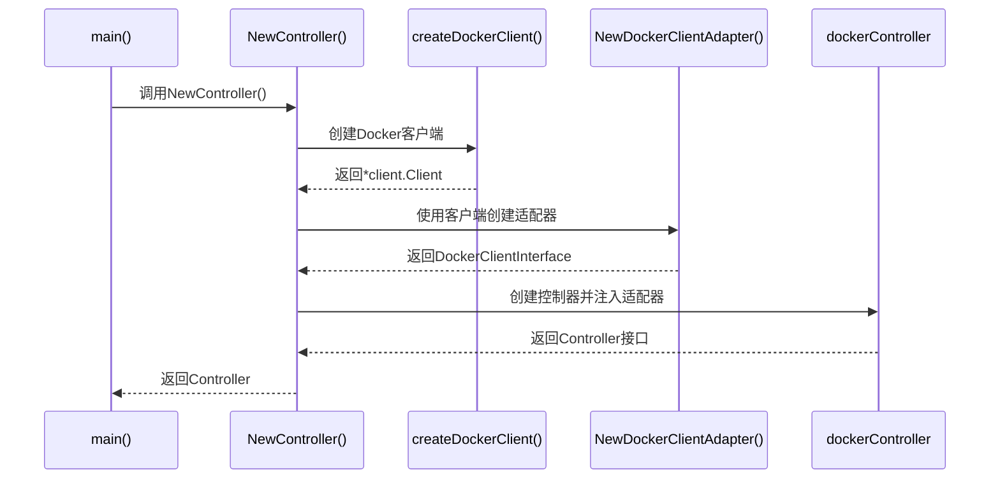

# 接口抽象与依赖倒置

<cite>
**本文档引用的文件**
- [interfaces.go](file://internal/docker/interfaces.go)
- [adapter.go](file://internal/docker/adapter.go)
- [controller.go](file://internal/docker/controller.go)
- [main.go](file://main.go)
</cite>

## 目录
1. [引言](#引言)
2. [DockerClientInterface接口定义](#dockerclientinterface接口定义)
3. [方法契约与参数语义](#方法契约与参数语义)
4. [依赖倒置原则的应用](#依赖倒置原则的应用)
5. [适配器模式实现](#适配器模式实现)
6. [依赖注入实例分析](#依赖注入实例分析)
7. [测试与扩展性](#测试与扩展性)
8. [接口一致性校验建议](#接口一致性校验建议)
9. [测试桩构建指南](#测试桩构建指南)
10. [结论](#结论)

## 引言
本文档详细阐述了`interfaces.go`中定义的`DockerClientInterface`接口如何实现依赖抽象，使容器管理模块与底层Docker SDK解耦。通过分析该接口的方法契约、参数语义以及在系统中的实际应用，展示依赖倒置原则在此处的应用价值。文档还将结合`main.go`中的依赖注入实例，说明服务初始化时如何将真实Docker客户端适配为统一接口，并提供接口实现一致性校验建议和测试桩构建指南。

**Section sources**
- [interfaces.go](file://internal/docker/interfaces.go#L14-L31)

## DockerClientInterface接口定义
`DockerClientInterface`是Docker客户端操作的抽象接口，定义了容器生命周期管理、镜像操作、执行命令等核心功能。该接口通过方法签名封装了对底层Docker SDK的调用，实现了调用方与具体实现的解耦。

接口定义位于`internal/docker/interfaces.go`文件中，包含15个方法，覆盖了容器创建、启动、停止、检查、执行命令等完整生命周期操作。通过将这些操作抽象为接口，系统可以在不修改业务逻辑的情况下替换底层容器运行时实现。

**Diagram sources**
- [interfaces.go](file://internal/docker/interfaces.go#L14-L31)

**Section sources**
- [interfaces.go](file://internal/docker/interfaces.go#L14-L31)

## 方法契约与参数语义
`DockerClientInterface`接口定义了明确的方法契约，每个方法都有清晰的参数语义和返回值约定。这些契约确保了调用方可以基于接口规范进行开发，而不必关心具体实现细节。

### 容器生命周期管理方法
容器生命周期管理方法提供了对容器的完整控制能力，包括创建、启动、停止、重启和删除操作。这些方法使用标准的Docker SDK类型作为参数，保持了与底层API的一致性。

**Section sources**
- [interfaces.go](file://internal/docker/interfaces.go#L15-L19)

### 容器检查与监控方法
容器检查与监控方法提供了获取容器状态信息的能力。`ContainerInspect`方法返回容器的详细信息，`ContainerList`方法返回容器摘要列表，`Ping`方法用于检测Docker守护进程的连接状态。

**Section sources**
- [interfaces.go](file://internal/docker/interfaces.go#L22-L23)
- [interfaces.go](file://internal/docker/interfaces.go#L29)

### 执行命令相关方法
执行命令相关方法支持在容器内执行命令并获取结果。这些方法构成了交互式终端功能的基础，支持标准输入输出流的附加和终端大小调整。

**Section sources**
- [interfaces.go](file://internal/docker/interfaces.go#L24-L28)

## 依赖倒置原则的应用
依赖倒置原则（Dependency Inversion Principle）在此处得到了充分体现。高层模块（容器管理服务）不依赖于低层模块（Docker SDK）的具体实现，而是依赖于抽象（`DockerClientInterface`）。同时，低层模块也依赖于同一抽象，实现了双向依赖于抽象的架构模式。

这种设计带来了两个主要优势：一是支持单元测试中的模拟实现（mock），二是为未来迁移到其他容器运行时（如containerd）提供了扩展可能性。通过接口抽象，系统可以在不修改业务逻辑的情况下替换底层容器运行时实现。

**Diagram sources**
- [interfaces.go](file://internal/docker/interfaces.go#L14-L31)
- [adapter.go](file://internal/docker/adapter.go#L10-L15)

**Section sources**
- [interfaces.go](file://internal/docker/interfaces.go#L14-L31)

## 适配器模式实现
适配器模式通过`dockerClientAdapter`结构体实现，将Docker SDK的客户端适配为`DockerClientInterface`接口。这种模式允许系统使用统一的接口访问不同的底层实现，同时保持现有代码的兼容性。

`dockerClientAdapter`结构体包装了`*client.Client`实例，并实现了`DockerClientInterface`的所有方法。每个方法都直接委托给底层Docker SDK客户端的对应方法，实现了无缝的接口适配。

**Diagram sources**
- [adapter.go](file://internal/docker/adapter.go#L10-L15)
- [adapter.go](file://internal/docker/adapter.go#L17-L104)

**Section sources**
- [adapter.go](file://internal/docker/adapter.go#L10-L104)

## 依赖注入实例分析
在`main.go`文件中，系统通过`NewController`函数实现了依赖注入。该函数创建Docker客户端实例，然后将其包装在`dockerClientAdapter`中，最后将适配器注入到`dockerController`中。

这种依赖注入方式使得`dockerController`不直接依赖于具体的Docker SDK实现，而是依赖于`DockerClientInterface`抽象。这不仅提高了代码的可测试性，还为未来的扩展提供了便利。

**Diagram sources**
- [main.go](file://main.go#L98-L139)
- [controller.go](file://internal/docker/controller.go#L98-L139)

**Section sources**
- [main.go](file://main.go#L98-L139)
- [controller.go](file://internal/docker/controller.go#L98-L139)

## 测试与扩展性
接口抽象为单元测试和系统扩展提供了坚实的基础。通过模拟`DockerClientInterface`的实现，可以轻松地对容器管理功能进行单元测试，而无需实际的Docker环境。

同时，这种设计为迁移到其他容器运行时（如containerd）提供了可能性。只需实现相同的接口，就可以无缝替换底层容器运行时，而无需修改上层业务逻辑。这对于系统的长期维护和演进具有重要意义。

**Section sources**
- [interfaces.go](file://internal/docker/interfaces.go#L14-L31)
- [adapter.go](file://internal/docker/adapter.go#L10-L15)

## 接口一致性校验建议
为确保接口实现的一致性，建议采用以下校验方法：

1. **编译时校验**：利用Go语言的接口隐式实现特性，在编译时自动检查实现是否完整。
2. **单元测试覆盖**：为每个接口方法编写单元测试，确保行为符合预期。
3. **接口契约文档**：维护详细的接口文档，明确每个方法的前置条件、后置条件和异常情况。
4. **静态分析工具**：使用golangci-lint等工具检查接口实现的质量。

这些校验方法可以有效保证接口实现的正确性和一致性，降低系统维护成本。

**Section sources**
- [interfaces.go](file://internal/docker/interfaces.go#L14-L31)

## 测试桩构建指南
构建测试桩（Mock）时，应遵循以下指南：

1. **实现完整接口**：确保测试桩实现`DockerClientInterface`的所有方法。
2. **可配置行为**：使测试桩的行为可配置，以模拟不同的场景（成功、失败、超时等）。
3. **状态跟踪**：在测试桩中跟踪调用状态，便于验证调用顺序和参数。
4. **并发安全**：确保测试桩在并发调用下的行为正确。

通过遵循这些指南，可以构建高质量的测试桩，有效支持单元测试和集成测试。

**Section sources**
- [interfaces.go](file://internal/docker/interfaces.go#L14-L31)

## 结论
`DockerClientInterface`接口通过依赖抽象和依赖倒置原则，成功实现了容器管理模块与底层Docker SDK的解耦。这种设计不仅提高了代码的可测试性和可维护性，还为未来的系统扩展提供了灵活性。通过适配器模式和依赖注入，系统能够在保持接口一致性的同时，灵活地替换底层实现。建议在后续开发中继续遵循这一设计原则，确保系统的长期可维护性和扩展性。