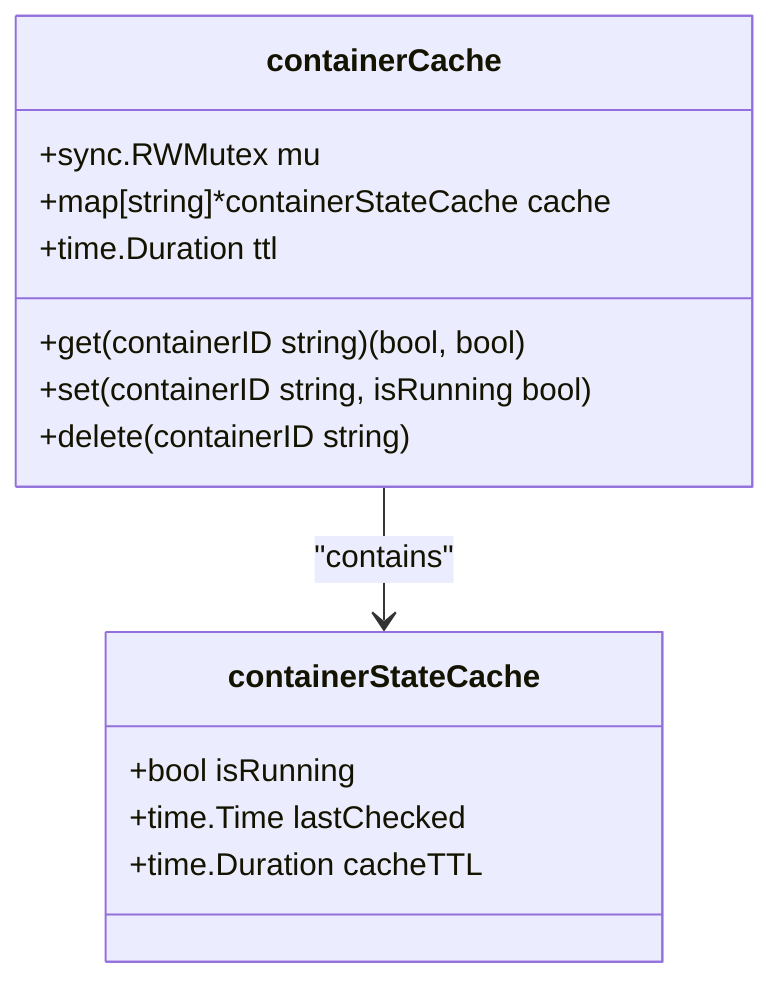
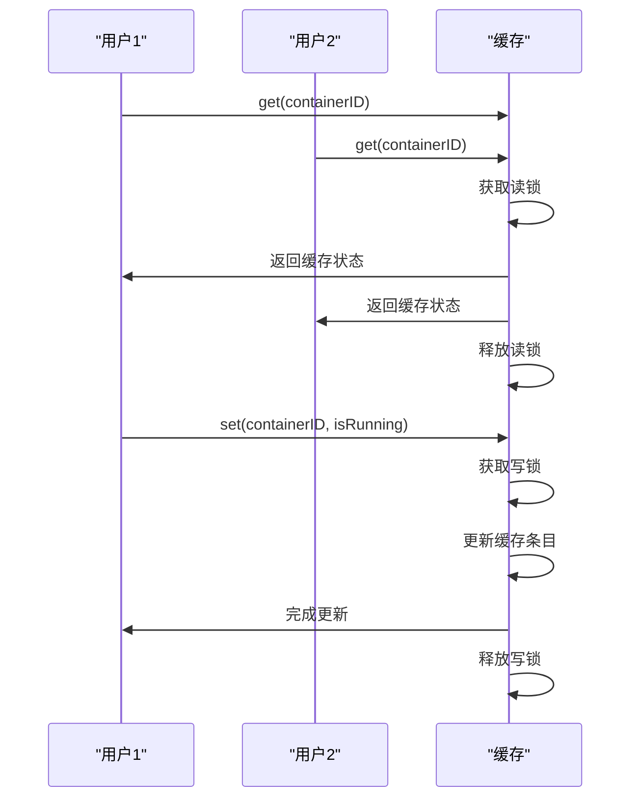
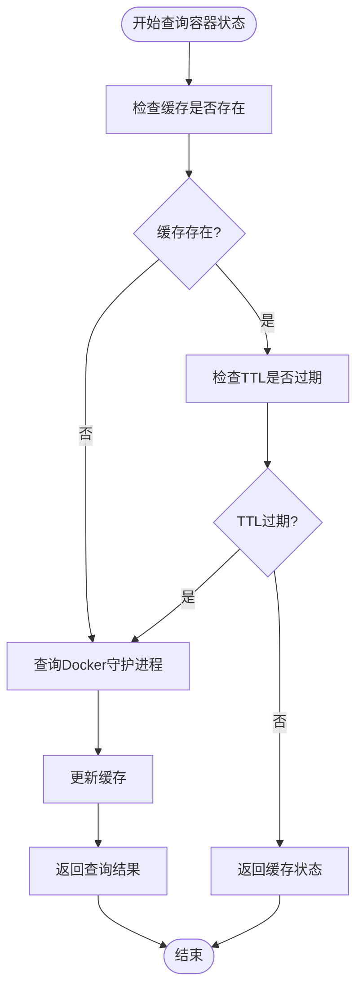

# 状态缓存与性能优化

<cite>
**Referenced Files in This Document**   
- [cache.go](file://internal/docker/cache.go)
- [controller.go](file://internal/docker/controller.go)
- [types.go](file://internal/docker/types.go)
</cite>

## 目录
1. [本地缓存机制概述](#本地缓存机制概述)
2. [Cache结构体与TTL过期策略](#cache结构体与ttl过期策略)
3. [LRU淘汰算法实现细节](#lru淘汰算法实现细节)
4. [Get/Set方法的线程安全处理](#getset方法的线程安全处理)
5. [缓存命中率对系统响应延迟的影响](#缓存命中率对系统响应延迟的影响)
6. [缓存与Docker守护进程状态同步机制](#缓存与docker守护进程状态同步机制)
7. [缓存配置调优建议](#缓存配置调优建议)
8. [性能监控与pprof工具使用](#性能监控与pprof工具使用)

## 本地缓存机制概述

在高频状态查询场景下，直接访问Docker守护进程获取容器状态会带来显著的性能开销。为解决这一问题，系统实现了本地缓存机制，通过在内存中维护容器状态的副本，大幅减少对Docker API的直接调用次数。这种缓存机制特别适用于多用户并发访问同一课程容器的场景，能够有效降低系统响应延迟，提升用户体验。

缓存机制的核心思想是时间换空间，通过牺牲一定的状态实时性来换取性能的显著提升。当用户查询容器状态时，系统首先检查本地缓存，只有在缓存未命中或已过期的情况下才会访问Docker守护进程。这种设计模式在保证状态信息基本准确的同时，极大地减轻了后端服务的负载压力。

**Section sources**
- [cache.go](file://internal/docker/cache.go#L8-L12)
- [controller.go](file://internal/docker/controller.go#L19-L27)

## Cache结构体与TTL过期策略

`containerCache`结构体是本地缓存机制的核心实现，它通过TTL（Time To Live）策略管理缓存条目的生命周期。该结构体包含三个关键字段：`mu`（读写锁）、`cache`（缓存映射）和`ttl`（生存时间）。

TTL过期策略确保了缓存数据不会无限期地保持有效，从而在性能和数据新鲜度之间取得平衡。当缓存条目创建时，会记录其创建时间戳，后续每次访问都会检查该条目是否已超过预设的TTL。如果超过，则视为过期，需要重新从Docker守护进程获取最新状态。

在系统初始化时，通过`newContainerCache`函数创建缓存实例，并设置默认的TTL为5分钟。这意味着缓存的状态信息最多保持5分钟的有效期，之后需要重新验证。这种设计既避免了过于频繁的API调用，又确保了状态信息不会长时间偏离实际状态。

**Diagram sources **
- [cache.go](file://internal/docker/cache.go#L8-L12)
- [types.go](file://internal/docker/types.go#L43-L47)

**Section sources**
- [cache.go](file://internal/docker/cache.go#L8-L20)
- [controller.go](file://internal/docker/controller.go#L98-L139)

## LRU淘汰算法实现细节

尽管当前实现中没有显式使用LRU（Least Recently Used）算法，但缓存机制通过TTL策略和按需更新的方式实现了类似的效果。当缓存空间需要管理时，系统会优先淘汰最久未使用且已过期的条目。

缓存的淘汰过程是隐式的，通过`get`方法中的过期检查逻辑实现。当尝试获取一个已过期的缓存条目时，系统会返回未命中结果，这相当于将该条目从有效缓存中移除。随后的`set`操作会创建新的缓存条目，从而完成淘汰和更新的循环。

这种设计的优势在于简单高效，避免了维护复杂的数据结构来跟踪访问顺序。在实际应用场景中，容器状态的查询通常具有一定的局部性，即最近访问过的容器更可能被再次访问。因此，即使没有严格的LRU算法，基于TTL的淘汰策略也能达到良好的缓存效果。

**Section sources**
- [cache.go](file://internal/docker/cache.go#L23-L38)
- [cache.go](file://internal/docker/cache.go#L41-L50)

## Get/Set方法的线程安全处理

缓存的`Get`和`Set`方法都实现了严格的线程安全处理，以应对多用户并发访问的场景。这是通过Go语言的`sync.RWMutex`（读写互斥锁）实现的，它允许多个读操作同时进行，但写操作必须独占锁。

`get`方法使用读锁（`RLock`），允许多个goroutine同时读取缓存，这在高并发查询场景下能显著提升性能。由于读操作不会修改缓存状态，多个读操作可以安全地并发执行。读锁在方法开始时获取，在`defer`语句中释放，确保即使发生panic也能正确释放锁。

`set`方法使用写锁（`Lock`），确保在更新缓存时不会有其他读或写操作干扰。写锁是独占的，当一个goroutine持有写锁时，其他所有试图获取读锁或写锁的goroutine都会被阻塞。这种设计保证了缓存更新的原子性，防止出现数据竞争和不一致的状态。

**Diagram sources **
- [cache.go](file://internal/docker/cache.go#L23-L38)
- [cache.go](file://internal/docker/cache.go#L41-L50)

**Section sources**
- [cache.go](file://internal/docker/cache.go#L23-L58)

## 缓存命中率对系统响应延迟的影响

缓存命中率是衡量缓存效果的关键指标，直接影响系统的响应延迟。在多用户并发访问同一课程容器的场景下，高缓存命中率能带来显著的性能优势。

当缓存命中时，系统可以直接从内存中返回容器状态，响应时间通常在微秒级别。相比之下，缓存未命中时需要调用Docker API，涉及网络通信和进程间调用，响应时间可能达到毫秒甚至秒级。因此，提高缓存命中率是优化系统性能的关键。

在实际应用中，同一课程的多个用户通常会在相近时间内查询容器状态，这为缓存提供了良好的工作负载特征。第一个用户的查询可能会导致缓存未命中，但随后用户的查询很可能会命中缓存，从而享受快速响应。这种"缓存预热"效应在用户密集访问时段尤为明显，能有效平滑系统的响应延迟。

**Section sources**
- [controller.go](file://internal/docker/controller.go#L273-L325)
- [controller.go](file://internal/docker/controller.go#L307-L325)

## 缓存与Docker守护进程状态同步机制

缓存与真实Docker守护进程状态的同步是确保系统一致性的关键。系统通过多种机制实现这种同步，包括自动失效策略和强制刷新逻辑。

自动失效策略基于TTL机制，确保缓存不会无限期地保持有效。当缓存条目超过预设的生存时间后，会被自动标记为过期，下一次查询时会触发重新获取真实状态。这种被动同步机制简单有效，能在保证性能的同时维持合理的数据新鲜度。

强制刷新逻辑在特定操作后主动清除相关缓存，实现更及时的同步。例如，在`RemoveContainer`方法中，当容器被删除后，系统会调用`cache.delete`方法清除该容器的缓存条目。这样可以确保后续查询能立即反映容器已被删除的事实，避免返回过时的"运行中"状态。

**Diagram sources **
- [cache.go](file://internal/docker/cache.go#L23-L58)
- [controller.go](file://internal/docker/controller.go#L609-L650)

**Section sources**
- [cache.go](file://internal/docker/cache.go#L23-L58)
- [controller.go](file://internal/docker/controller.go#L609-L650)

## 缓存配置调优建议

合理的缓存配置对系统性能至关重要。根据应用场景的特点，可以调整两个关键参数：最大条目数和过期时间。

过期时间（TTL）的设置需要在性能和数据新鲜度之间权衡。较长的TTL能提高缓存命中率，减少API调用，但可能导致状态信息滞后。较短的TTL能提供更及时的状态信息，但会增加API调用频率。对于本系统，默认的5分钟TTL是一个合理的起点，可以根据实际使用情况进行调整。

虽然当前实现没有显式的最大条目数限制，但在高并发场景下，应该考虑内存使用情况。可以通过监控系统内存使用率来评估是否需要引入LRU或其他淘汰策略来限制缓存大小。此外，可以根据课程的活跃程度动态调整不同容器的TTL，为热门课程设置更长的缓存时间。

**Section sources**
- [controller.go](file://internal/docker/controller.go#L98-L139)
- [cache.go](file://internal/docker/cache.go#L15-L20)

## 性能监控与pprof工具使用

尽管代码库中未直接集成pprof性能分析工具，但可以通过标准Go工具链进行性能监控。pprof是Go语言内置的性能分析工具，能够采集CPU、内存、goroutine等多维度的性能指标。

要使用pprof进行性能分析，首先需要在应用中导入`net/http/pprof`包并启动pprof HTTP服务。然后可以通过`go tool pprof`命令连接到应用，采集性能数据。常用的分析包括CPU性能分析（`-seconds`参数指定采样时间）和内存分析（`heap`参数）。

对于本系统的缓存机制，建议定期进行性能分析，重点关注`get`和`set`方法的执行时间和内存分配情况。通过pprof的火焰图功能，可以直观地看到缓存操作在整体性能中的占比，识别潜在的性能瓶颈。此外，可以设置监控指标来跟踪缓存命中率、平均响应时间等关键性能指标，为系统优化提供数据支持。

**Section sources**
- [controller.go](file://internal/docker/controller.go#L273-L325)
- [cache.go](file://internal/docker/cache.go#L23-L58)