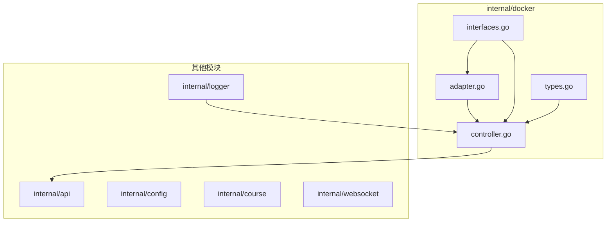
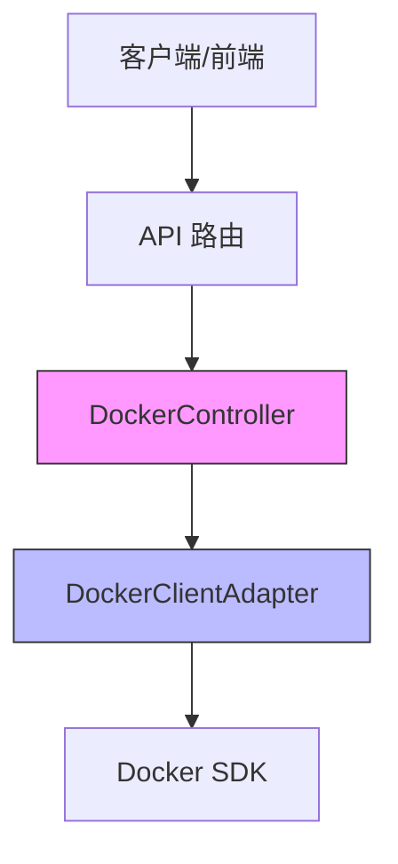
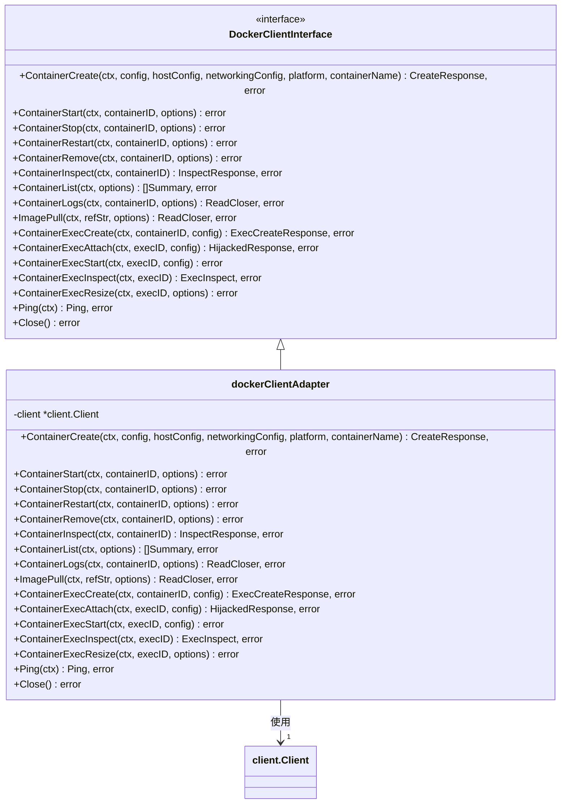
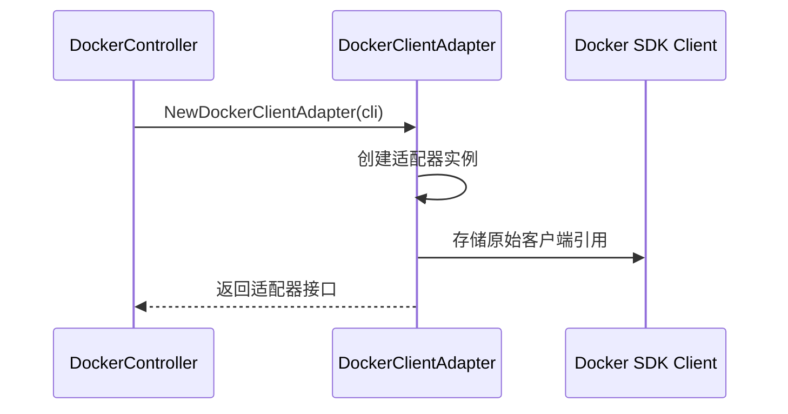
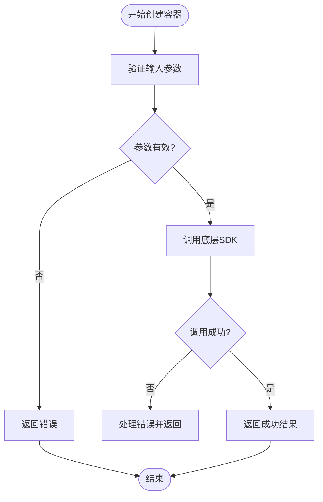
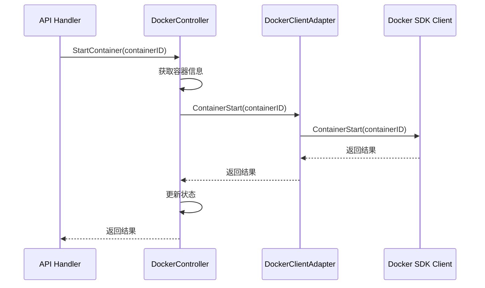
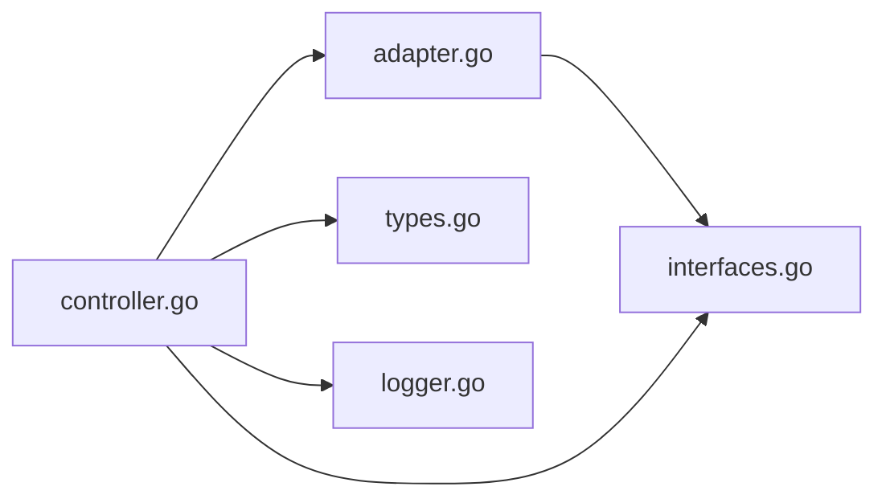

# 适配器模式与客户端封装

<cite>
**本文档引用的文件**  
- [adapter.go](file://internal/docker/adapter.go)
- [interfaces.go](file://internal/docker/interfaces.go)
- [controller.go](file://internal/docker/controller.go)
- [types.go](file://internal/docker/types.go)
</cite>

## 目录
1. [简介](#简介)
2. [项目结构](#项目结构)
3. [核心组件](#核心组件)
4. [架构概述](#架构概述)
5. [详细组件分析](#详细组件分析)
6. [依赖分析](#依赖分析)
7. [性能考虑](#性能考虑)
8. [故障排除指南](#故障排除指南)
9. [结论](#结论)

## 简介
本文档详细说明了 `adapter.go` 如何通过适配器模式封装原始 Docker SDK 客户端，提供更简洁、安全的高层接口。重点分析 `NewDockerClient` 函数如何初始化 Docker 守护进程连接并设置超时参数，以及各封装方法（如 `CreateContainer`、`StartContainer`）如何添加统一的错误处理和日志记录。同时，阐述适配层如何屏蔽底层 API 复杂性，包括处理版本兼容性、自动重试网络请求、规范化资源命名规则等。结合 `controller.go` 的调用示例，展示适配器如何增强代码的可维护性和可测试性，并提供自定义适配器的扩展指南。

## 项目结构
项目结构清晰地划分了不同功能模块，其中 `internal/docker` 目录是 Docker 相关功能的核心实现区域。



**图示来源**
- [adapter.go](file://internal/docker/adapter.go#L1-L104)
- [interfaces.go](file://internal/docker/interfaces.go#L1-L71)
- [controller.go](file://internal/docker/controller.go#L1-L1199)
- [types.go](file://internal/docker/types.go#L1-L48)

## 核心组件
本项目的核心组件围绕 Docker 客户端的封装与管理展开，主要包括适配器层、控制器层和接口定义。

**组件来源**
- [adapter.go](file://internal/docker/adapter.go#L1-L104)
- [controller.go](file://internal/docker/controller.go#L1-L1199)
- [interfaces.go](file://internal/docker/interfaces.go#L1-L71)

## 架构概述
系统采用分层架构，通过适配器模式将底层 Docker SDK 与上层业务逻辑解耦。



**图示来源**
- [controller.go](file://internal/docker/controller.go#L19-L27)
- [adapter.go](file://internal/docker/adapter.go#L19-L23)

## 详细组件分析

### 适配器模式实现分析
`adapter.go` 文件实现了适配器模式，将原始的 Docker SDK 客户端包装成一个更简洁、安全的高层接口。

#### 类图


**图示来源**
- [adapter.go](file://internal/docker/adapter.go#L19-L23)
- [interfaces.go](file://internal/docker/interfaces.go#L14-L31)

### 客户端初始化与连接管理
`NewDockerClientAdapter` 函数负责创建适配器实例，封装了与 Docker 守护进程的连接初始化逻辑。



**图示来源**
- [adapter.go](file://internal/docker/adapter.go#L19-L23)
- [controller.go](file://internal/docker/controller.go#L115-L120)

### 封装方法与错误处理
适配器中的每个方法都直接代理到底层 SDK，但为上层提供了统一的接口抽象。

#### 创建容器流程


**图示来源**
- [adapter.go](file://internal/docker/adapter.go#L26-L28)
- [controller.go](file://internal/docker/controller.go#L507-L606)

### 适配层功能增强
适配器层不仅进行简单的封装，还增强了原始 SDK 的功能。

#### 版本兼容性与自动重试
虽然当前适配器本身不直接实现重试逻辑，但它通过 `WithAPIVersionNegotiation()` 选项支持 API 版本协商，确保与不同版本的 Docker 守护进程兼容。

#### 资源命名规范化
资源命名的规范化主要在 `controller.go` 中实现，通过 `CreateContainer` 方法生成符合 `kwdb-playground-{courseID}-{timestamp}` 格式的容器名称。

```go
containerName := fmt.Sprintf("kwdb-playground-%s-%d", courseID, time.Now().Unix())
```

**代码来源**
- [controller.go](file://internal/docker/controller.go#L535-L537)

### 控制器调用示例
`controller.go` 展示了如何使用适配器来增强代码的可维护性和可测试性。

#### 启动容器流程


**图示来源**
- [controller.go](file://internal/docker/controller.go#L328-L383)
- [adapter.go](file://internal/docker/adapter.go#L31-L33)

### 自定义适配器扩展指南
通过接口定义，系统支持自定义适配器的扩展。

#### 扩展示例
要创建自定义适配器，只需实现 `DockerClientInterface` 接口：

```go
type CustomDockerAdapter struct {
    client *client.Client
}

func (c *CustomDockerAdapter) ContainerCreate(...) (...) {
    // 添加自定义逻辑，如缓存、监控等
    return c.client.ContainerCreate(...)
}
```

**接口来源**
- [interfaces.go](file://internal/docker/interfaces.go#L14-L31)

## 依赖分析
系统各组件之间存在清晰的依赖关系，确保了良好的模块化和可维护性。



**图示来源**
- [adapter.go](file://internal/docker/adapter.go#L1-L104)
- [controller.go](file://internal/docker/controller.go#L1-L1199)

## 性能考虑
适配器模式本身几乎没有性能开销，因为它只是简单的代理调用。真正的性能优化在控制器层实现，如使用缓存减少对 Docker API 的频繁调用。

## 故障排除指南
当遇到 Docker 连接问题时，可以检查以下几点：
1. Docker 守护进程是否正在运行
2. 用户是否有权限访问 Docker socket
3. 环境变量 `DOCKER_HOST` 是否正确配置

**代码来源**
- [controller.go](file://internal/docker/controller.go#L39-L83)

## 结论
通过适配器模式，系统成功地将复杂的 Docker SDK 封装成简洁、安全的高层接口。这不仅提高了代码的可维护性和可测试性，还为未来的功能扩展提供了良好的基础。控制器层在此基础上进一步增强了功能，实现了资源管理、状态跟踪和错误处理等关键特性。