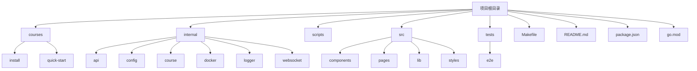
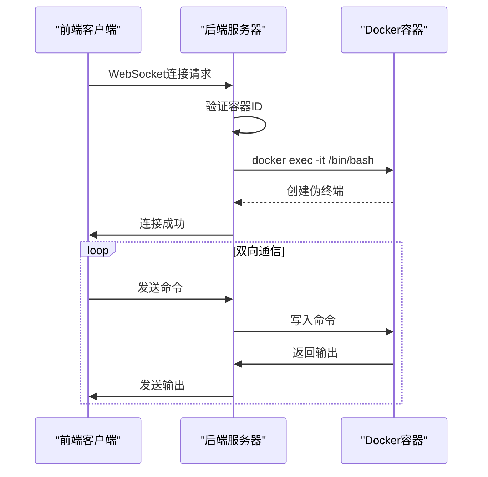

# 开发者指南

<cite>
**本文档中引用的文件**   
- [Makefile](file://Makefile)
- [tsconfig.json](file://tsconfig.json)
- [go.mod](file://go.mod)
- [eslint.config.js](file://eslint.config.js)
- [package.json](file://package.json)
- [vite.config.ts](file://vite.config.ts)
- [main.go](file://main.go)
- [internal/config/config.go](file://internal/config/config.go)
- [internal/api/routes.go](file://internal/api/routes.go)
- [internal/docker/controller.go](file://internal/docker/controller.go)
- [internal/websocket/terminal.go](file://internal/websocket/terminal.go)
- [internal/logger/logger.go](file://internal/logger/logger.go)
- [src/main.tsx](file://src/main.tsx)
- [src/App.tsx](file://src/App.tsx)
- [src/pages/Learn.tsx](file://src/pages/Learn.tsx)
</cite>

## 目录
1. [简介](#简介)
2. [项目结构](#项目结构)
3. [开发环境搭建](#开发环境搭建)
4. [开发工作流](#开发工作流)
5. [代码格式化与质量](#代码格式化与质量)
6. [测试策略](#测试策略)
7. [调试指南](#调试指南)
8. [开发工具配置](#开发工具配置)
9. [模块配置解析](#模块配置解析)
10. [常见问题解答](#常见问题解答)
11. [贡献流程](#贡献流程)

## 简介
本指南旨在为新贡献者提供全面的开发环境搭建和项目规范遵循指导。文档详细说明了如何安装必要的前置依赖、使用Makefile目标启动开发服务器、遵循代码格式化规则、运行测试以及调试前后端组件。通过本指南，开发者可以快速上手项目开发，确保代码质量和一致性。

## 项目结构
项目采用前后端分离的架构设计，前端使用React + TypeScript技术栈，后端使用Go语言开发。项目结构清晰，模块化程度高，便于维护和扩展。



**图示来源**
- [Makefile](file://Makefile#L1-L267)
- [project_structure](file://project_structure#L1-L100)

**本节来源**
- [Makefile](file://Makefile#L1-L267)
- [project_structure](file://project_structure#L1-L100)

## 开发环境搭建
### 前置依赖安装
项目开发需要安装以下前置依赖：

1. **Go语言环境**：版本1.23.0及以上
2. **Node.js**：版本18.x或更高
3. **pnpm**：包管理工具
4. **Docker**：容器化运行环境

可以通过运行`make check`命令检查开发环境是否满足要求。

### 使用Makefile快速搭建
项目提供了完善的Makefile来简化开发环境搭建过程：

```bash
# 安装所有依赖
make install

# 安装开发工具（air, dlv）
make install-tools

# 检查开发环境
make check
```

**本节来源**
- [Makefile](file://Makefile#L1-L267)

## 开发工作流
### 启动开发服务器
项目提供了多种开发模式，通过Makefile目标进行管理：

```bash
# 启动统一开发服务器
make dev

# 启动完整开发环境（前后端热重载）
make dev-full

# 构建并运行应用
make run
```

### 环境变量配置
通过`.env`文件配置环境变量，支持以下配置项：
- `SERVER_PORT`：服务器端口（默认3006）
- `DEBUG_PORT`：调试端口（默认2345）
- `COURSE_DIR`：课程文件目录

**本节来源**
- [Makefile](file://Makefile#L1-L267)
- [internal/config/config.go](file://internal/config/config.go#L1-L179)

## 代码格式化与质量
### 前后端代码格式化
项目遵循统一的代码格式化规范：

```bash
# 格式化代码（Go + 前端）
make fmt
```

- **Go代码**：使用`go fmt`进行格式化
- **前端代码**：使用ESLint进行格式化和lint检查

### 提交规范
遵循约定式提交（Conventional Commits）规范：
- `feat`: 新功能
- `fix`: 修复bug
- `docs`: 文档更新
- `style`: 代码格式调整
- `refactor`: 代码重构
- `test`: 测试相关
- `chore`: 构建过程或辅助工具的变动

### 分支管理策略
采用Git Flow分支管理策略：
- `main`：主分支，保护分支，仅通过PR合并
- `develop`：开发分支，集成所有功能
- `feature/*`：功能分支
- `release/*`：发布分支
- `hotfix/*`：紧急修复分支

**本节来源**
- [Makefile](file://Makefile#L1-L267)
- [eslint.config.js](file://eslint.config.js#L1-L28)

## 测试策略
### 单元测试
运行所有单元测试：

```bash
# 运行测试
make test
```

- **Go测试**：使用`go test`运行
- **前端测试**：使用`pnpm run test`运行

### 端到端测试
端到端测试位于`tests/e2e`目录，使用Python编写：

```bash
# 设置E2E测试环境
./scripts/setup_e2e_env.sh

# 运行E2E测试
./scripts/run_e2e_tests.sh
```

**本节来源**
- [Makefile](file://Makefile#L1-L267)
- [tests/e2e](file://tests/e2e#L1-L100)
- [scripts](file://scripts#L1-L100)

## 调试指南
### 后端API调试
使用delve进行后端调试：

```bash
# 启动后端调试模式
make debug

# 开发+调试模式
make dev-debug
```

### 前端组件调试
前端使用Vite开发服务器，支持热重载和源码映射：

```bash
# 启动开发服务器
make dev-full
```

### WebSocket连接调试
WebSocket终端管理器位于`internal/websocket/terminal.go`，用于处理终端会话：



**图示来源**
- [internal/websocket/terminal.go](file://internal/websocket/terminal.go#L1-L207)
- [internal/api/routes.go](file://internal/api/routes.go#L1-L694)

**本节来源**
- [Makefile](file://Makefile#L1-L267)
- [internal/websocket/terminal.go](file://internal/websocket/terminal.go#L1-L207)

## 开发工具配置
### VS Code配置
推荐使用VS Code进行开发，配置如下：

1. **Go扩展**：提供Go语言支持
2. **ESLint扩展**：提供前端代码lint支持
3. **Docker扩展**：提供Docker支持
4. **Prettier扩展**：提供代码格式化支持

### 调试器设置
配置VS Code调试器，支持前后端调试：

```json
{
  "version": "0.2.0",
  "configurations": [
    {
      "name": "Debug Go",
      "type": "go",
      "request": "launch",
      "mode": "auto",
      "program": "${workspaceFolder}"
    },
    {
      "name": "Debug Frontend",
      "type": "pwa-chrome",
      "request": "launch",
      "url": "http://localhost:3006",
      "webRoot": "${workspaceFolder}/src"
    }
  ]
}
```

### 热重载特性
项目支持前后端热重载：
- **前端**：Vite提供即时热重载
- **后端**：air工具提供Go代码热重载

**本节来源**
- [Makefile](file://Makefile#L1-L267)
- [vite.config.ts](file://vite.config.ts#L1-L26)

## 模块配置解析
### tsconfig.json配置
前端TypeScript配置文件，关键配置：

```json
{
  "compilerOptions": {
    "target": "ES2020",
    "module": "ESNext",
    "baseUrl": "./",
    "paths": {
      "@/*": ["./src/*"]
    }
  },
  "include": ["src"]
}
```

### go.mod配置
后端Go模块配置，声明了项目依赖：

```go
module kwdb-playground

go 1.23.0

require (
    github.com/gin-gonic/gin v1.10.1
    github.com/gorilla/websocket v1.5.3
    github.com/joho/godotenv v1.5.1
)
```

**本节来源**
- [tsconfig.json](file://tsconfig.json#L1-L38)
- [go.mod](file://go.mod#L1-L62)

## 常见问题解答
### 如何新增一个API端点？
1. 在`internal/api/routes.go`中添加新的路由处理函数
2. 在`Handler`结构体中实现对应的处理逻辑
3. 在`SetupRoutes`方法中注册新的路由

### 如何调试WebSocket连接问题？
1. 检查容器是否正常运行
2. 验证WebSocket连接参数
3. 查看后端日志，定位连接失败原因
4. 使用浏览器开发者工具检查WebSocket连接状态

### 如何解决Docker连接问题？
1. 检查Docker服务是否运行
2. 验证Docker socket路径
3. 检查用户权限是否足够
4. 查看Docker日志，定位具体错误

**本节来源**
- [internal/api/routes.go](file://internal/api/routes.go#L1-L694)
- [internal/docker/controller.go](file://internal/docker/controller.go#L1-L799)
- [internal/websocket/terminal.go](file://internal/websocket/terminal.go#L1-L207)

## 贡献流程
### 代码审查流程
1. Fork项目仓库
2. 创建功能分支
3. 实现功能并编写测试
4. 提交PR
5. 等待代码审查
6. 根据反馈修改代码
7. 合并到主分支

### 文档更新规范
1. 更新相关文档
2. 确保文档与代码一致
3. 使用清晰简洁的语言
4. 提供必要的示例代码
5. 保持文档格式统一

**本节来源**
- [CONTRIBUTING.md](file://CONTRIBUTING.md#L1-L100)
- [README.md](file://README.md#L1-L100)