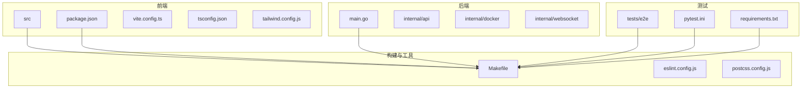
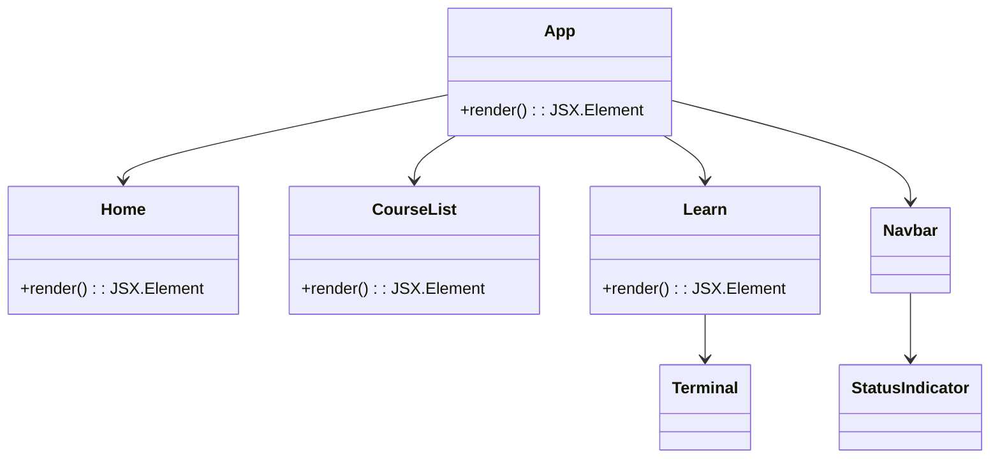
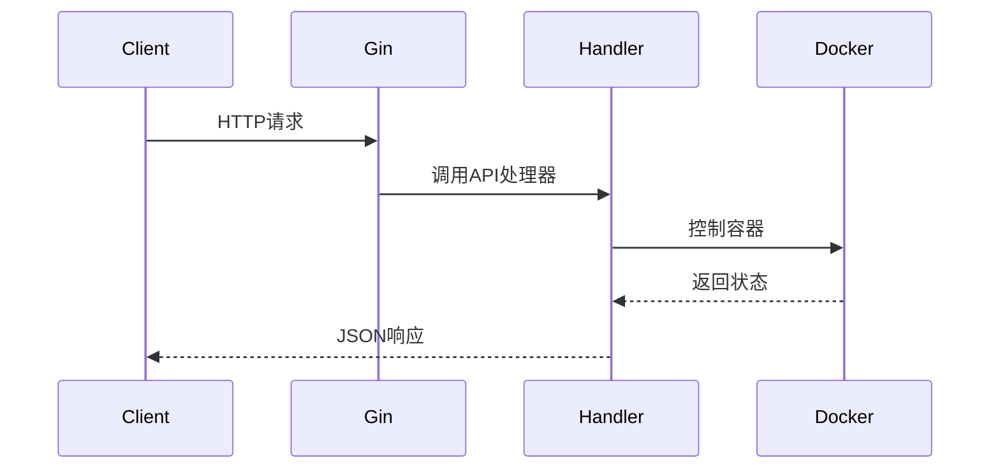
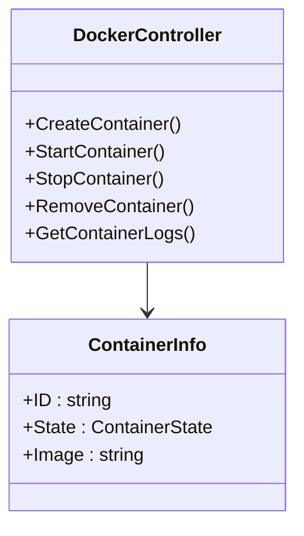

# 技术栈

<cite>
**本文档中引用的文件**  
- [tsconfig.json](file://tsconfig.json)
- [pytest.ini](file://pytest.ini)
- [main.go](file://main.go)
- [postcss.config.js](file://postcss.config.js)
- [tailwind.config.js](file://tailwind.config.js)
- [eslint.config.js](file://eslint.config.js)
- [Makefile](file://Makefile)
- [package.json](file://package.json)
- [vite.config.ts](file://vite.config.ts)
- [requirements.txt](file://requirements.txt)
- [src/main.tsx](file://src/main.tsx)
- [src/App.tsx](file://src/App.tsx)
- [internal/api/routes.go](file://internal/api/routes.go)
- [internal/docker/controller.go](file://internal/docker/controller.go)
- [internal/docker/types.go](file://internal/docker/types.go)
</cite>

## 目录
1. [简介](#简介)
2. [项目结构](#项目结构)
3. [前端技术栈](#前端技术栈)
4. [后端技术栈](#后端技术栈)
5. [测试技术栈](#测试技术栈)
6. [构建与工具链](#构建与工具链)
7. [技术选型考量](#技术选型考量)
8. [依赖关系与版本兼容性](#依赖关系与版本兼容性)
9. [总结](#总结)

## 简介
本项目为一个基于前后端分离架构的交互式学习平台，旨在为用户提供在线课程与实时终端操作体验。系统采用现代化技术栈，从前端界面到后端服务，再到自动化测试与部署流程，均使用业界主流且高效的工具组合。前端使用React + TypeScript + Vite构建用户界面，结合Tailwind CSS实现响应式样式；后端采用Go语言配合Gin框架提供高性能API服务，并通过Gorilla WebSocket支持实时通信；测试层面引入pytest和Selenium实现端到端自动化验证；构建流程由Makefile统一管理，pnpm负责前端依赖，ESLint保障代码质量，PostCSS处理样式预编译。整体架构设计注重可维护性、性能与开发效率。

## 项目结构
项目采用模块化分层结构，清晰划分前端、后端、测试与构建脚本：

- `src/`：前端源码，包含组件、页面、样式与工具函数
- `internal/`：后端核心逻辑，按功能划分为API、配置、课程、Docker控制与WebSocket模块
- `tests/e2e/`：端到端测试代码，使用Python编写
- `scripts/`：各类自动化脚本，包括环境清理与测试执行
- 根目录下为构建与配置文件，涵盖前端（Vite、TypeScript、Tailwind）、后端（Go）、测试（pytest）及自动化（Makefile）

该结构支持独立开发与部署，便于团队协作与持续集成。

**图示来源**
- [tsconfig.json](file://tsconfig.json)
- [pytest.ini](file://pytest.ini)
- [main.go](file://main.go)
- [postcss.config.js](file://postcss.config.js)
- [tailwind.config.js](file://tailwind.config.js)
- [eslint.config.js](file://eslint.config.js)
- [Makefile](file://Makefile)
- [package.json](file://package.json)
- [vite.config.ts](file://vite.config.ts)
- [requirements.txt](file://requirements.txt)

**本节来源**
- [tsconfig.json](file://tsconfig.json)
- [pytest.ini](file://pytest.ini)
- [main.go](file://main.go)
- [postcss.config.js](file://postcss.config.js)
- [tailwind.config.js](file://tailwind.config.js)
- [eslint.config.js](file://eslint.config.js)
- [Makefile](file://Makefile)
- [package.json](file://package.json)
- [vite.config.ts](file://vite.config.ts)
- [requirements.txt](file://requirements.txt)

## 前端技术栈

### React + TypeScript + Vite
前端采用React作为UI框架，结合TypeScript提升类型安全性，使用Vite作为构建工具以实现极速冷启动与热更新。Vite利用浏览器原生ES模块支持，避免了传统打包工具的全量构建开销，显著提升开发体验。

TypeScript配置中启用了模块解析为bundler模式，支持路径别名`@/*`映射至`src/`目录，提升导入可读性与维护性。

**图示来源**
- [src/App.tsx](file://src/App.tsx)
- [src/main.tsx](file://src/main.tsx)

**本节来源**
- [tsconfig.json](file://tsconfig.json)
- [package.json](file://package.json)
- [vite.config.ts](file://vite.config.ts)
- [src/App.tsx](file://src/App.tsx)
- [src/main.tsx](file://src/main.tsx)

### Tailwind CSS 与样式管理
样式系统采用Tailwind CSS实用类框架，结合PostCSS进行处理。Tailwind允许通过类名直接定义样式，减少CSS文件体积并提升开发效率。配置中启用了darkMode为class模式，支持主题切换。

PostCSS配置集成了Tailwind CSS与Autoprefixer插件，自动处理浏览器前缀兼容性问题，确保样式在不同环境中一致表现。

**本节来源**
- [tailwind.config.js](file://tailwind.config.js)
- [postcss.config.js](file://postcss.config.js)
- [src/styles/index.css](file://src/styles/index.css)

## 后端技术栈

### Go + Gin Web框架
后端使用Go语言编写，核心Web框架为Gin，以其高性能路由与中间件机制著称。Gin在Release模式下运行，减少日志输出，提升性能。服务器通过`main.go`启动，集成配置加载、日志记录、课程服务、Docker控制器与WebSocket终端管理。

API路由由`internal/api/routes.go`定义，采用RESTful风格，支持课程管理、容器控制与健康检查等接口。

**图示来源**
- [main.go](file://main.go)
- [internal/api/routes.go](file://internal/api/routes.go)

**本节来源**
- [main.go](file://main.go)
- [internal/api/routes.go](file://internal/api/routes.go)

### Gorilla WebSocket 与实时通信
系统通过Gorilla WebSocket实现浏览器与后端之间的实时终端通信。`internal/websocket/terminal.go`负责管理WebSocket会话，`handleTerminalWebSocket`处理连接升级，并创建交互式bash会话，使用户可在浏览器中操作Docker容器。

### Docker SDK 实现容器控制
项目通过Docker SDK（`github.com/moby/moby/client`）实现对Docker守护进程的控制。`internal/docker/controller.go`封装了容器的创建、启动、停止、重启与日志获取等功能，支持跨平台socket连接（macOS与Linux）。控制器具备缓存机制与状态同步能力，确保操作的可靠性与性能。

**图示来源**
- [internal/docker/controller.go](file://internal/docker/controller.go)
- [internal/docker/types.go](file://internal/docker/types.go)

**本节来源**
- [internal/docker/controller.go](file://internal/docker/controller.go)
- [internal/docker/types.go](file://internal/docker/types.go)

## 测试技术栈

### pytest 与 selenium 端到端测试
测试体系采用Python生态的pytest框架，结合Selenium实现UI自动化测试。`tests/e2e/`目录下包含多个测试用例，覆盖用户旅程、API集成与WebSocket通信场景。`pytest.ini`中配置了测试路径、标记分类与日志输出格式，支持并发执行与超时控制。

依赖`requirements.txt`中明确列出Selenium、requests、websocket-client等库，确保测试环境一致性。

**本节来源**
- [pytest.ini](file://pytest.ini)
- [requirements.txt](file://requirements.txt)
- [tests/e2e/test_user_journey.py](file://tests/e2e/test_user_journey.py)
- [tests/e2e/test_websocket.py](file://tests/e2e/test_websocket.py)

## 构建与工具链

### Makefile 自动化
`Makefile`作为项目统一构建入口，支持跨平台开发与部署。提供`dev`、`build`、`run`、`test`、`clean`等目标，集成前端构建、后端编译、依赖安装与环境检查。支持自定义端口与调试模式，提升开发效率。

**本节来源**
- [Makefile](file://Makefile)

### pnpm 包管理
前端依赖由pnpm管理，相比npm/yarn具有更快的安装速度与更优的磁盘空间利用率。`package.json`中定义了开发与生产依赖，包括React、Vite、Tailwind、Xterm等关键库。

**本节来源**
- [package.json](file://package.json)
- [pnpm-lock.yaml](file://pnpm-lock.yaml)

### ESLint 代码规范
代码质量由ESLint保障，配置文件`eslint.config.js`基于TypeScript ESLint插件，集成React Hooks与刷新规则，确保代码风格统一与最佳实践遵循。

**本节来源**
- [eslint.config.js](file://eslint.config.js)

### PostCSS 处理流程
样式预处理通过PostCSS完成，配置文件`postcss.config.js`引入Tailwind CSS与Autoprefixer插件，自动处理实用类生成与浏览器兼容性前缀。

**本节来源**
- [postcss.config.js](file://postcss.config.js)

## 技术选型考量

### 为何选择 Vite？
Vite利用现代浏览器ESM支持，实现按需编译，开发服务器启动极快，热更新几乎无延迟。相比Webpack等传统打包工具，显著提升开发效率，尤其适合快速迭代的前端项目。

### 为何选择 Gin？
Gin是Go语言中性能领先的Web框架之一，其路由基于Radix Tree，查找效率高。中间件机制灵活，社区活跃，文档完善，适合构建高性能API服务。

### 为何采用前后端分离？
前后端分离架构提升可维护性与扩展性。前端可独立部署于CDN，提升访问速度；后端专注业务逻辑与数据处理，接口清晰。团队可并行开发，技术栈解耦，便于未来微服务化演进。

**本节来源**
- [vite.config.ts](file://vite.config.ts)
- [main.go](file://main.go)
- [Makefile](file://Makefile)

## 依赖关系与版本兼容性

### 前端依赖
- React 18.3.1 + React DOM
- TypeScript ~5.8.3
- Vite ^6.3.5
- Tailwind CSS ^3.4.17
- Xterm ^5.5.0（终端渲染）

### 后端依赖
- Go 1.20+
- Gin ^1.9.1
- Gorilla WebSocket
- Docker SDK for Go

### 测试依赖
- pytest ^7.4.3
- selenium ^4.15.0
- websocket-client ^1.6.4

所有依赖版本在配置文件中明确锁定，确保构建可重现性与环境一致性。

**本节来源**
- [package.json](file://package.json)
- [requirements.txt](file://requirements.txt)
- [go.mod](file://go.mod)（隐含）

## 总结
本项目技术栈覆盖全栈开发各层面，从前端React+Vite+Tailwind到后端Go+Gin+Docker SDK，再到测试pytest+Selenium，构建工具Makefile+pnpm+ESLint+PostCSS，形成完整闭环。技术选型兼顾性能、开发效率与可维护性，前后端分离架构清晰，模块职责分明。通过自动化脚本统一管理生命周期，支持高效迭代与稳定部署，为交互式学习平台提供了坚实的技术基础。