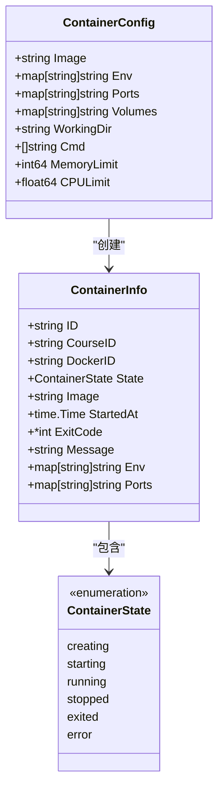
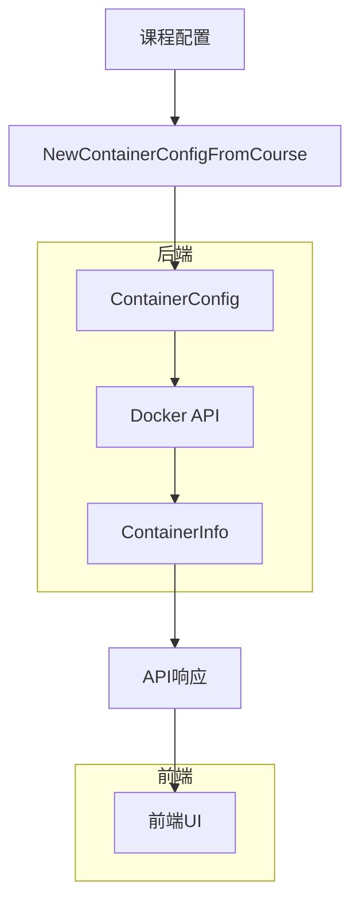

# 容器模型

<cite>
**本文档中引用的文件**  
- [types.go](file://internal/docker/types.go)
- [controller.go](file://internal/docker/controller.go)
- [adapter.go](file://internal/docker/adapter.go)
- [routes.go](file://internal/api/routes.go)
</cite>

## 目录
1. [简介](#简介)
2. [核心数据模型](#核心数据模型)
3. [容器配置模型详解](#容器配置模型详解)
4. [容器信息模型详解](#容器信息模型详解)
5. [Docker控制器与适配器模式](#docker控制器与适配器模式)
6. [容器生命周期管理](#容器生命周期管理)
7. [数据流转与调用流程](#数据流转与调用流程)
8. [常见问题诊断](#常见问题诊断)
9. [最佳实践与稳定性建议](#最佳实践与稳定性建议)

## 简介
本项目中的容器模型是实现课程沙箱环境的核心组件，通过Docker技术为用户提供隔离的、可编程的交互式学习环境。系统定义了`ContainerConfig`和`ContainerInfo`两个核心数据结构，分别用于描述容器的创建配置和运行时状态。这些模型通过Docker控制器与底层Docker SDK进行交互，实现了容器的创建、启动、停止和状态查询等全生命周期管理功能。本文档将深入分析这些数据模型的设计与实现，以及它们在系统中的实际应用。

## 核心数据模型



**图表来源**
- [types.go](file://internal/docker/types.go#L0-L47)

**本节来源**
- [types.go](file://internal/docker/types.go#L0-L47)

## 容器配置模型详解
`ContainerConfig`结构体定义了创建Docker容器所需的全部配置参数，是容器创建过程的输入模型。

### Image（镜像名）
`Image`字段指定容器所使用的Docker镜像名称，如`kwdb/kwdb:latest`。该字段是必需的，系统会优先使用课程配置中指定的镜像，若未指定则使用默认镜像。镜像名称决定了容器内预装的软件环境和初始状态。

### ContainerName（容器名称）
虽然`ContainerConfig`中没有直接定义容器名称，但系统在创建容器时会根据课程ID生成唯一的容器名称，格式为`kwdb-playground-{courseID}-{timestamp}`。这种命名策略确保了每个课程实例的容器名称唯一，便于管理和清理。

### Cmd（启动命令）
`Cmd`字段是一个字符串切片，定义了容器启动时执行的命令。在本系统中，为了防止容器创建后立即退出，启动命令被设置为`["/bin/bash", "-c", "while true; do sleep 30; done"]`，即一个持续运行的无限循环。这确保了容器能够保持运行状态，等待用户通过终端进行交互。

### MemoryLimit（内存限制）
`MemoryLimit`字段以字节为单位指定容器可使用的最大内存量。当该值大于0时，系统会将其设置到Docker主机配置的`Memory`字段中，从而对容器的内存使用进行硬性限制。这有助于防止某个容器占用过多内存而影响其他课程实例的运行。

### CPULimit（CPU限制）
`CPULimit`字段以浮点数形式表示CPU使用率的限制（1.0表示一个完整的CPU核心）。系统在创建容器时，会将此值乘以100000并赋值给`CPUQuota`，同时将`CPUPeriod`设置为100000微秒，从而实现CPU使用率的限制。例如，`CPULimit`为0.5时，表示容器最多可以使用50%的CPU资源。

### PortBindings（端口映射）
`Ports`字段是一个映射，定义了容器端口到宿主机端口的映射关系。系统在创建容器时，会将此映射转换为Docker SDK所需的`nat.PortMap`格式，实现`0.0.0.0:hostPort->containerPort/tcp`的端口绑定。这使得用户可以通过宿主机的指定端口访问容器内的服务。

**本节来源**
- [types.go](file://internal/docker/types.go#L0-L47)
- [controller.go](file://internal/docker/controller.go#L525-L576)

## 容器信息模型详解
`ContainerInfo`结构体用于表示容器的运行时状态，是容器管理的输出模型。

### ID与DockerID
`ID`是系统内部使用的容器标识符，由课程ID和时间戳生成。`DockerID`是Docker守护进程分配的容器唯一ID，用于与Docker API进行交互。两者共同构成了容器的完整标识。

### Status（运行状态）
`State`字段表示容器的当前状态，其值来自`ContainerState`枚举类型。系统定义了六种状态：`creating`（创建中）、`starting`（启动中）、`running`（运行中）、`stopped`（已停止）、`exited`（已退出）和`error`（错误）。这些状态在前端通过不同颜色的指示器直观展示，帮助用户了解容器的实时状态。

### IP地址
虽然`ContainerInfo`结构体中没有直接包含IP地址字段，但系统可以通过`ContainerInspect` API获取容器的网络设置，从而获得容器的IP地址。在实际应用中，由于使用了端口映射，用户通常通过宿主机的端口来访问容器服务，而无需直接使用容器IP。

### 创建时间
`StartedAt`字段记录了容器的创建时间，使用Go语言的`time.Time`类型。该时间戳在容器创建时被设置为当前时间，用于计算容器的运行时长和进行时间相关的逻辑判断。

### 其他属性
`ExitCode`字段记录了容器退出时的退出码，`Message`字段存储了与容器状态相关的消息或错误信息。`Env`和`Ports`字段则分别保存了容器的环境变量和端口映射信息，这些信息在容器创建时从配置中复制，并在容器启动后从Docker API中更新。

**本节来源**
- [types.go](file://internal/docker/types.go#L0-L47)
- [controller.go](file://internal/docker/controller.go#L184-L234)

## Docker控制器与适配器模式
系统采用适配器模式将Docker SDK的复杂接口抽象为更简洁、更易用的控制器接口。

### 适配器模式实现
`DockerClientInterface`接口定义了所有需要的Docker操作方法，如`ContainerCreate`、`ContainerStart`等。`dockerClientAdapter`结构体实现了该接口，它包装了真实的`*client.Client`实例，并将接口调用转发给底层SDK。这种设计实现了依赖倒置，使得上层业务逻辑不直接依赖于具体的SDK实现。

```mermaid
classDiagram
interface DockerClientInterface {
+ContainerCreate(...)
+ContainerStart(...)
+ContainerStop(...)
+ContainerInspect(...)
+ContainerList(...)
+ContainerLogs(...)
+ImagePull(...)
+ContainerExecCreate(...)
+ContainerExecAttach(...)
+ContainerExecStart(...)
+ContainerExecInspect(...)
+ContainerExecResize(...)
+Ping(...)
+Close()
}
class dockerClientAdapter {
-client *client.Client
}
class dockerController {
-client DockerClientInterface
-containers map[string]*ContainerInfo
-mu sync.RWMutex
-cache *containerCache
-courseMu map[string]*sync.Mutex
-courseMuMu sync.RWMutex
-logger *logger.Logger
}
DockerClientInterface <|-- dockerClientAdapter
dockerClientAdapter --> client.Client : "包装"
dockerController --> DockerClientInterface : "依赖"
```

**图表来源**
- [adapter.go](file://internal/docker/adapter.go#L0-L104)
- [controller.go](file://internal/docker/controller.go#L0-L799)

**本节来源**
- [adapter.go](file://internal/docker/adapter.go#L0-L104)
- [controller.go](file://internal/docker/controller.go#L0-L799)

## 容器生命周期管理
Docker控制器（`dockerController`）负责管理容器的完整生命周期，从创建到销毁。

### 创建流程
`CreateContainer`方法首先获取课程级别的互斥锁，确保同一课程的容器创建操作是原子性的。然后清理该课程的所有现有容器，避免资源冲突。接着生成唯一的容器名称，构建Docker SDK所需的配置和主机配置，并调用`ContainerCreate` API创建容器。最后，将容器信息保存到内存中并返回。

### 启动流程
`StartContainer`方法首先检查容器是否存在，然后调用`ContainerStart` API启动容器。启动后，系统会循环调用`ContainerInspect` API检查容器状态，最多等待30秒。如果容器成功进入运行状态，则更新其状态为`running`；如果容器因错误而停止，则更新状态为`error`；如果超时，则标记为启动超时。

### 停止与清理
`StopContainer`方法用于停止运行中的容器，`RemoveContainer`方法则用于彻底删除容器。在停止课程时，系统会先停止容器，然后立即删除它以彻底释放资源。此外，`cleanupCourseContainers`方法可以清理指定课程的所有容器，确保系统资源的及时回收。

**本节来源**
- [controller.go](file://internal/docker/controller.go#L502-L619)
- [controller.go](file://internal/docker/controller.go#L319-L391)
- [controller.go](file://internal/docker/controller.go#L389-L427)

## 数据流转与调用流程
系统中的数据流转遵循清晰的流程，从课程配置到最终的API响应。



**图表来源**
- [routes.go](file://internal/api/routes.go#L257-L278)
- [controller.go](file://internal/docker/controller.go#L578-L619)

**本节来源**
- [routes.go](file://internal/api/routes.go#L257-L278)
- [controller.go](file://internal/docker/controller.go#L578-L619)

## 常见问题诊断
### 容器启动失败
容器启动失败可能由多种原因引起。最常见的原因是镜像拉取失败或镜像不存在。系统在创建容器前不会自动拉取镜像，因此需要确保所需镜像已存在于本地。另一个常见原因是端口冲突，如果指定的宿主机端口已被占用，容器创建会失败。此外，资源限制设置不当（如内存限制过低）也可能导致容器无法启动。

### 资源限制无效
如果发现`MemoryLimit`或`CPULimit`设置无效，首先检查这些值是否大于0。只有当限制值大于0时，系统才会将其应用到Docker主机配置中。其次，确认Docker守护进程是否支持这些资源限制功能。在某些环境中，可能需要调整Docker的cgroup配置才能使资源限制生效。

**本节来源**
- [controller.go](file://internal/docker/controller.go#L361-L391)
- [controller.go](file://internal/docker/controller.go#L525-L576)

## 最佳实践与稳定性建议
为了提升系统的稳定性和用户体验，建议采取以下措施：

### 合理设置超时
容器启动和停止操作都应设置合理的超时时间。当前系统为启动操作设置了30秒的等待循环，为停止操作设置了10秒的超时。这些值可以根据实际环境的性能进行调整。对于网络较慢的环境，可以适当增加超时时间，避免因短暂延迟而导致操作失败。

### 实现重试机制
对于关键操作，如容器创建和启动，应实现指数退避重试机制。当前系统在前端（`Learn.tsx`）已经实现了简单的重试逻辑，最多重试10次，每次间隔2秒。后端也可以在遇到临时性错误（如网络抖动）时进行重试，以提高操作的成功率。

### 状态缓存优化
系统通过`containerCache`结构体实现了容器状态的缓存，缓存TTL为5分钟。这有效减少了对Docker API的频繁调用，提高了查询性能。建议根据实际负载情况调整缓存TTL，对于高并发场景，可以适当缩短TTL以保证状态的实时性。

**本节来源**
- [controller.go](file://internal/docker/cache.go#L0-L58)
- [src/pages/Learn.tsx](file://src/pages/Learn.tsx#L99-L135)