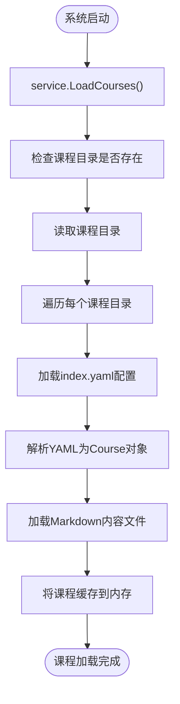
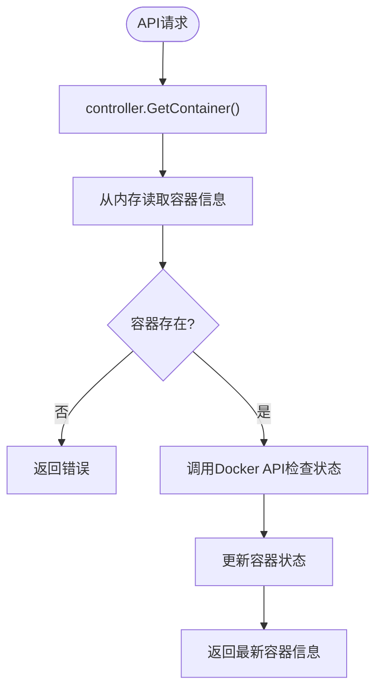
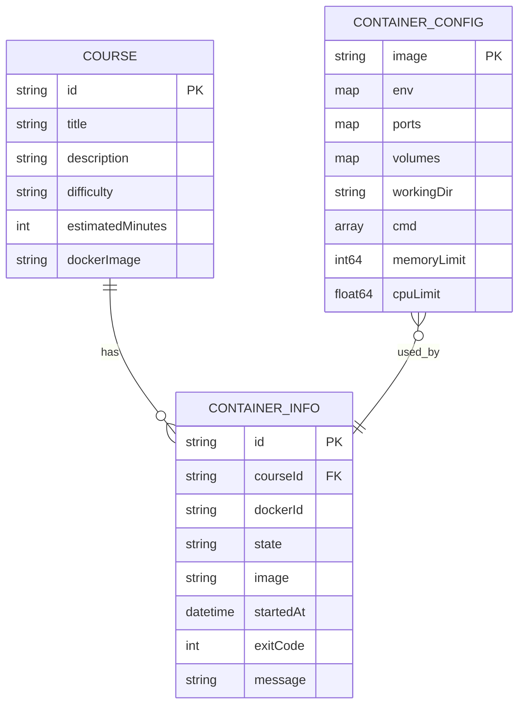

# 数据模型

<cite>
**本文档引用的文件**
- [models.go](file://internal/course/models.go)
- [types.go](file://internal/docker/types.go)
- [service.go](file://internal/course/service.go)
- [controller.go](file://internal/docker/controller.go)
- [routes.go](file://internal/api/routes.go)
- [index.yaml](file://courses/quick-start/index.yaml)
- [step1.md](file://courses/quick-start/step1.md)
</cite>

## 目录
1. [引言](#引言)
2. [核心数据结构](#核心数据结构)
3. [课程模型详解](#课程模型详解)
4. [容器模型详解](#容器模型详解)
5. [数据生命周期](#数据生命周期)
6. [实体关系图](#实体关系图)
7. [数据验证与序列化](#数据验证与序列化)
8. [类型安全与系统稳定性](#类型安全与系统稳定性)
9. [示例数据](#示例数据)
10. [总结](#总结)

## 引言
本数据模型文档全面定义了playground项目中的关键实体及其关系。系统通过Go语言的强类型系统确保数据完整性，将课程内容从YAML文件加载到内存对象，并与Docker容器运行时信息进行关联。文档重点解析了课程模型、容器配置与运行时信息的结构定义，以及它们在服务层的加载、缓存和转换过程。

## 核心数据结构
系统的核心数据结构围绕课程（Course）和容器（Container）两大实体构建。课程模型定义了教学内容的结构，而容器模型则管理实验环境的配置与状态。这些结构通过服务层进行交互，实现了从静态内容到动态实验环境的完整生命周期管理。

**Section sources**
- [models.go](file://internal/course/models.go#L1-L61)
- [types.go](file://internal/docker/types.go#L1-L48)

## 课程模型详解
`Course` 结构体是系统的核心数据模型，定义了每个课程的元数据和内容结构。

### 字段含义
- **ID**: 课程的唯一标识符，对应课程目录的名称
- **Title**: 课程标题，用于前端展示
- **Description**: 课程描述，简要说明课程内容
- **Details**: 课程详细内容，包含介绍、步骤和结束页
- **Backend**: 后端配置，指定容器镜像和工作目录
- **Difficulty**: 难度等级，如"beginner"、"intermediate"
- **EstimatedMinutes**: 预计完成时间（分钟）
- **Tags**: 课程标签，用于分类和搜索
- **DockerImage**: 容器镜像名称（兼容旧字段）
- **DockerEnv**: 环境变量映射，用于容器配置

### 嵌套结构
`CourseDetail` 结构体包含三个主要部分：
- **Intro**: 课程介绍，指向`intro.md`文件
- **Steps**: 课程步骤列表，每个步骤包含标题和内容文件
- **Finish**: 课程结束页，指向`finish.md`文件

`CourseStep` 和 `CourseFile` 结构体分别定义了步骤和文件的结构，其中`Text`字段存储文件路径，`Content`字段存储实际内容。

**Section sources**
- [models.go](file://internal/course/models.go#L6-L41)

## 容器模型详解
容器模型分为配置（`ContainerConfig`）和运行时信息（`ContainerInfo`）两个部分。

### ContainerConfig（容器配置）
定义了容器的创建参数：
- **Image**: 镜像名称
- **Env**: 环境变量映射
- **Ports**: 端口映射，容器端口到主机端口
- **Volumes**: 卷映射，主机路径到容器路径
- **WorkingDir**: 工作目录
- **Cmd**: 启动命令
- **MemoryLimit**: 内存限制（字节）
- **CPULimit**: CPU限制（核心数）

### ContainerInfo（运行时信息）
记录了容器的实时状态：
- **ID**: 容器标识符
- **CourseID**: 关联的课程ID
- **DockerID**: Docker内部ID
- **State**: 容器状态（枚举类型）
- **Image**: 使用的镜像
- **StartedAt**: 启动时间
- **ExitCode**: 退出码（可选）
- **Message**: 状态消息（可选）
- **Env**: 运行时环境变量
- **Ports**: 实际端口映射

**Section sources**
- [types.go](file://internal/docker/types.go#L31-L48)

## 数据生命周期
### 课程内容加载流程
课程数据从文件系统加载到内存的完整流程如下：



**Diagram sources**
- [service.go](file://internal/course/service.go#L68-L105)
- [service.go](file://internal/course/service.go#L107-L151)

### 容器状态同步机制
容器运行时信息从Docker API获取并同步到内存的流程：



**Diagram sources**
- [controller.go](file://internal/docker/controller.go#L662-L700)
- [controller.go](file://internal/docker/controller.go#L703-L730)

## 实体关系图
以下ERD展示了课程与容器之间的关联关系：



**Diagram sources**
- [models.go](file://internal/course/models.go#L6-L41)
- [types.go](file://internal/docker/types.go#L31-L48)

## 数据验证与序列化
### YAML解析
课程配置通过`gopkg.in/yaml.v3`库解析，`yaml`标签定义了字段与YAML键的映射关系。例如，`ID`字段的`yaml:"id"`标签确保YAML中的`id`键被正确映射到结构体字段。

### 序列化方式
所有结构体都定义了`json`标签，确保在API响应中正确序列化。例如，`ContainerInfo`结构体的`CourseID`字段使用`json:"courseId"`标签，将驼峰命名转换为小写形式。

### 验证规则
系统在多个层面实施验证：
1. **文件存在性验证**: 在加载课程前检查`index.yaml`和Markdown文件是否存在
2. **空内容验证**: 检查配置文件和内容文件是否为空
3. **API参数验证**: 在`routes.go`中验证课程ID等参数是否为空
4. **Docker配置验证**: 在创建容器前验证端口、路径等配置的有效性

**Section sources**
- [service.go](file://internal/course/service.go#L107-L151)
- [routes.go](file://internal/api/routes.go#L132-L154)

## 类型安全与系统稳定性
Go语言的类型系统为系统稳定性提供了重要保障：

### 编译时安全
- **结构体字段类型安全**: 所有字段都有明确的类型定义，避免运行时类型错误
- **枚举类型**: `ContainerState`使用自定义类型，确保状态值的合法性
- **指针与可选字段**: 使用指针类型（如`*int`）明确表示可选字段

### 运行时安全
- **并发安全**: `Service`结构体使用`sync.RWMutex`保护`courses`映射，确保并发访问安全
- **内存安全**: 所有资源在使用前都经过存在性检查，避免空指针异常
- **错误处理**: 每个操作都返回详细的错误信息，便于问题排查

### 优势体现
类型安全的优势体现在：
1. **减少运行时错误**: 大部分错误在编译时就能发现
2. **提高代码可维护性**: 明确的类型定义使代码更易理解和维护
3. **增强API可靠性**: JSON序列化和反序列化过程更加可靠
4. **简化调试**: 类型错误信息清晰，便于快速定位问题

**Section sources**
- [models.go](file://internal/course/models.go#L6-L41)
- [types.go](file://internal/docker/types.go#L17-L48)
- [service.go](file://internal/course/service.go#L25-L341)

## 示例数据
### YAML课程文件
以下是一个典型的`index.yaml`文件示例：

```yaml
title: 快速开始
description: 欢迎来到 KWDB 课程，本场景将引导您快速开始使用 KWDB。
details:
  intro:
    text: intro.md
  steps:
    - title: Install
      text: step1.md
    - title: Exec
      text: step2.md
  finish:
    text: finish.md
backend:
  imageid: kwdb/kwdb
  workspace: /kaiwudb/bin
estimatedMinutes: 10
difficulty: beginner
tags:
  - quick-start
  - 快速开始
```

**Section sources**
- [index.yaml](file://courses/quick-start/index.yaml#L1-L22)

### 内存对象映射
上述YAML文件被解析为如下的内存对象结构：

```json
{
  "id": "quick-start",
  "title": "快速开始",
  "description": "欢迎来到 KWDB 课程，本场景将引导您快速开始使用 KWDB。",
  "details": {
    "intro": {
      "text": "intro.md",
      "content": "# 课程介绍内容..."
    },
    "steps": [
      {
        "title": "Install",
        "text": "step1.md",
        "content": "## Install KWDB\n\nRUN `cd /kaiwudb/bin`{{exec}}"
      }
    ],
    "finish": {
      "text": "finish.md",
      "content": "# 课程结束内容..."
    }
  },
  "backend": {
    "imageid": "kwdb/kwdb",
    "workspace": "/kaiwudb/bin"
  },
  "estimatedMinutes": 10,
  "difficulty": "beginner",
  "tags": ["quick-start", "快速开始"]
}
```

**Section sources**
- [service.go](file://internal/course/service.go#L107-L151)

## 总结
本数据模型文档全面解析了playground项目的核心数据结构和生命周期。通过Go语言的强类型系统，系统实现了从课程内容到容器环境的完整数据流管理。课程模型通过YAML配置和Markdown内容文件定义教学内容，而容器模型则管理实验环境的配置和状态。服务层负责数据的加载、缓存和转换，确保了系统的高效运行和稳定性。实体关系图清晰地展示了课程与容器之间的关联，为系统的可维护性和扩展性提供了坚实基础。