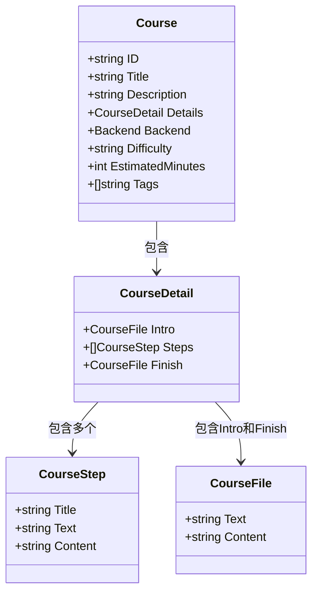

# 课程模型

<cite>
**本文档中引用的文件**  
- [models.go](file://internal/course/models.go)
- [service.go](file://internal/course/service.go)
- [index.yaml](file://courses/install/index.yaml)
- [index.yaml](file://courses/quick-start/index.yaml)
</cite>

## 目录
1. [简介](#简介)
2. [课程模型结构](#课程模型结构)
3. [YAML序列化与反序列化](#yaml序列化与反序列化)
4. [课程加载与缓存流程](#课程加载与缓存流程)
5. [数据验证规则](#数据验证规则)
6. [服务层使用方式](#服务层使用方式)
7. [结构关系图](#结构关系图)
8. [常见问题排查](#常见问题排查)
9. [性能优化建议](#性能优化建议)

## 简介
本项目中的课程模型设计用于支持动态加载和管理交互式学习内容。通过Go语言结构体与YAML配置文件的结合，实现灵活的内容定义与解析。课程数据从文件系统读取后，经反序列化为Go结构体并缓存于内存中，供前端按需访问。

**Section sources**
- [models.go](file://internal/course/models.go#L5-L16)
- [service.go](file://internal/course/service.go#L68-L105)

## 课程模型结构
`Course` 结构体是课程的核心数据模型，定义了课程的元信息与内容结构。

### 核心字段说明
- **ID**：课程唯一标识符，通常对应课程目录名
- **Title**：课程标题，展示给用户的名称
- **Description**：课程描述，简要说明课程目标与内容
- **Details**：嵌套结构，包含课程介绍、步骤列表和结束页
- **Backend**：后端环境配置，如Docker镜像与工作目录
- **Difficulty**：难度等级（如 beginner、intermediate）
- **EstimatedMinutes**：预计学习时长（分钟）
- **Tags**：标签数组，用于分类与检索
- **DockerImage**：运行环境Docker镜像
- **DockerEnv**：容器环境变量映射（可选）

### 嵌套结构详解
`CourseDetail` 包含三个主要部分：
- **Intro**：课程引导页，由 `CourseFile` 表示，包含Markdown文件路径与内容
- **Steps**：学习步骤列表，每个步骤为 `CourseStep` 类型，包含标题、文件路径与内容
- **Finish**：课程结束页，结构同 Intro

`CourseStep` 和 `CourseFile` 均包含 `Text`（文件路径）与 `Content`（文件内容），实现元数据与实际内容的分离。

**Section sources**
- [models.go](file://internal/course/models.go#L5-L36)

## YAML序列化与反序列化
课程元数据通过 `index.yaml` 文件进行定义，并利用 `gopkg.in/yaml.v3` 库实现与Go结构体之间的转换。

### 示例YAML结构
以 `install/index.yaml` 为例：
```yaml
title: 单节点部署
description: 使用官网脚本一键部署 KWDB 单节点
details:
  intro:
    text: intro.md
  steps:
    - title: 下载安装包
      text: step1.md
    - title: 修改配置文件
      text: step2.md
    - title: 安装
      text: step3.md
  finish:
    text: finish.md
```

该YAML文件在程序启动时被反序列化为 `Course` 结构体实例，字段名通过 `yaml` 标签映射（如 `yaml:"title"`）。

### 反序列化流程
1. 读取 `index.yaml` 文件内容为字节流
2. 调用 `yaml.Unmarshal()` 将YAML数据填充到 `Course` 结构体
3. 若 `Title` 为空，则使用目录名作为默认标题
4. 后续通过 `Text` 字段加载对应Markdown文件内容至 `Content` 字段

**Section sources**
- [service.go](file://internal/course/service.go#L111-L148)
- [index.yaml](file://courses/install/index.yaml#L1-L21)

## 课程加载与缓存流程
课程服务通过 `Service` 结构体统一管理课程的生命周期。

### 初始化与加载
`NewService(coursesDir string)` 创建服务实例，指定课程根目录（如 `./courses`）。调用 `LoadCourses()` 方法触发全量加载：
1. 扫描目录下所有子目录（每个子目录代表一门课程）
2. 对每门课程调用 `loadCourse()` 加载其 `index.yaml`
3. 解析YAML后调用 `loadCourseContent()` 读取Markdown文件内容
4. 将完整课程对象存入线程安全的 `map[string]*Course` 缓存

### 内容加载机制
`loadCourseContent()` 方法根据 `Details` 中的 `Text` 字段路径，依次加载 `intro.md`、各步骤文件和 `finish.md` 内容。若文件不存在或为空，记录警告日志并将内容设为空字符串。

**Section sources**
- [service.go](file://internal/course/service.go#L68-L221)

## 数据验证规则
系统在加载过程中实施以下验证逻辑：
- **字段非空校验**：`Text` 字段为空则跳过对应文件加载
- **文件存在性检查**：通过 `os.Stat()` 验证YAML中指定的Markdown文件是否存在
- **文件非空校验**：读取的文件内容长度必须大于0
- **YAML语法合法性**：`yaml.Unmarshal()` 确保配置文件格式正确
- **步骤顺序隐式校验**：步骤按YAML中定义顺序加载，索引即为执行顺序

未通过校验的情况均记录日志，避免因单个课程错误导致整体加载失败。

**Section sources**
- [service.go](file://internal/course/service.go#L111-L148)
- [service.go](file://internal/course/service.go#L203-L221)

## 服务层使用方式
`Service` 提供以下核心方法供外部调用：

### 获取课程列表
`GetCourses()` 返回所有已加载课程的副本，使用读锁保证并发安全，避免外部修改影响内部缓存。

### 查询特定课程
`GetCourse(id string)` 根据课程ID查找课程，返回 `(course, exists)` 二元组，便于判断课程是否存在。

### 提取可执行命令
`ExtractExecutableCommands(course *Course)` 扫描课程内容中的Markdown代码块，提取以 `$` 开头的命令行指令，用于后续自动化执行。

### 初始化示例
在 `main.go` 中初始化服务：
```go
courseService := course.NewService(cfg.Course.Dir)
courseService.SetLogger(loggerInstance)
courseService.LoadCourses()
```

**Section sources**
- [service.go](file://internal/course/service.go#L220-L268)
- [main.go](file://main.go#L51)

## 结构关系图


**Diagram sources**
- [models.go](file://internal/course/models.go#L5-L16)
- [models.go](file://internal/course/models.go#L19-L36)

## 常见问题排查
### YAML格式错误
- **症状**：`failed to parse course config` 日志
- **排查**：使用在线YAML校验工具检查缩进与冒号格式

### 字段类型不匹配
- **症状**：某些字段未正确加载
- **排查**：确认结构体字段的 `yaml` 标签与YAML键名一致，如 `imageid` 非 `imageId`

### 文件路径错误
- **症状**：`markdown file not found` 警告
- **排查**：检查 `index.yaml` 中 `text` 字段路径是否相对于课程目录，且文件存在

### 内容未加载
- **症状**：页面显示无内容
- **排查**：确认 `Content` 字段是否成功填充，日志中是否有 `Loaded step file` 记录

**Section sources**
- [service.go](file://internal/course/service.go#L154-L198)
- [service.go](file://internal/course/service.go#L203-L221)

## 性能优化建议
- **内存缓存**：所有课程在启动时一次性加载至内存，避免重复I/O操作
- **读写锁分离**：`sync.RWMutex` 支持高并发读取，提升API响应速度
- **延迟加载内容**：仅在需要时加载Markdown内容，减少初始解析开销
- **日志级别控制**：生产环境使用INFO级别，减少DEBUG日志对性能的影响
- **静态资源预加载**：前端可预请求课程列表，提升用户体验

**Section sources**
- [service.go](file://internal/course/service.go#L25-L34)
- [service.go](file://internal/course/service.go#L220-L268)