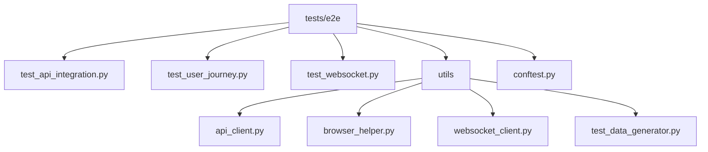
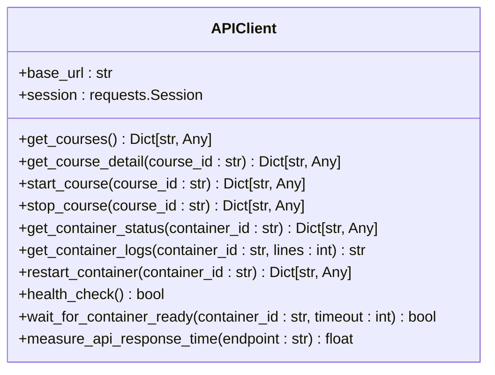
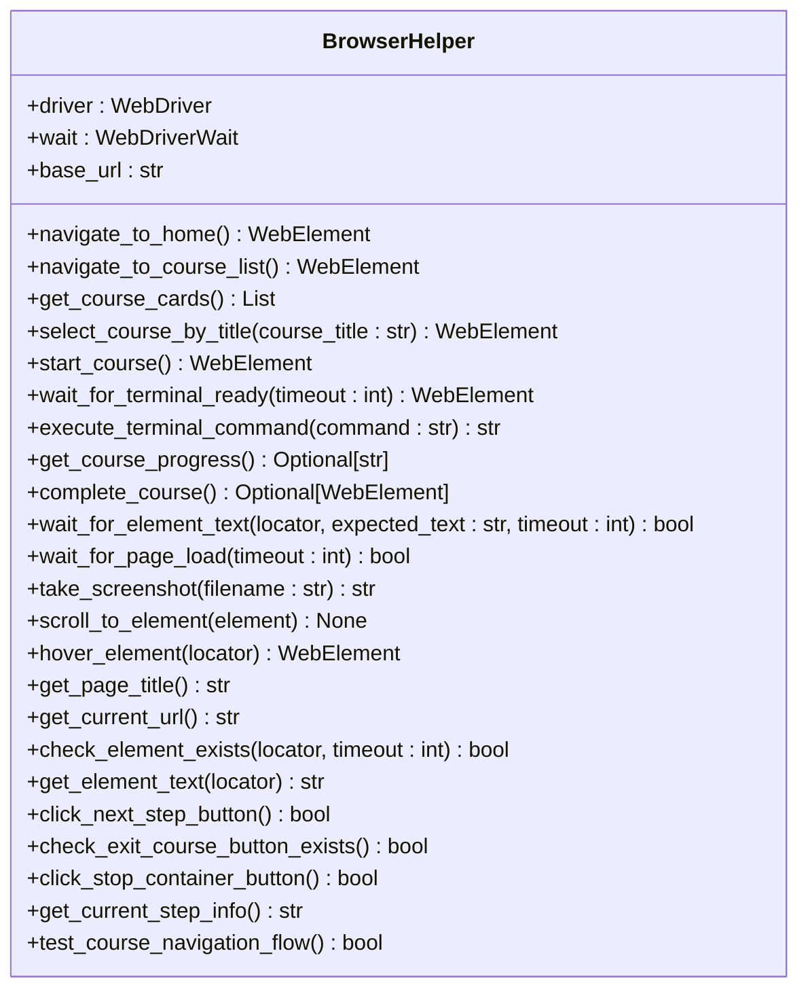
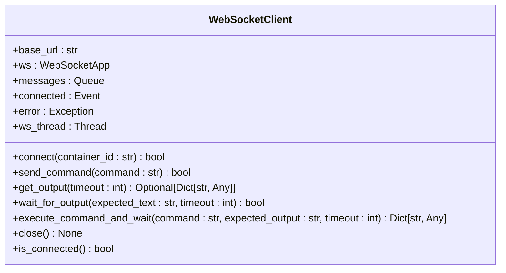

# 测试策略

<cite>
**本文档引用的文件**
- [test_api_integration.py](file://tests/e2e/test_api_integration.py)
- [test_user_journey.py](file://tests/e2e/test_user_journey.py)
- [test_websocket.py](file://tests/e2e/test_websocket.py)
- [api_client.py](file://tests/e2e/utils/api_client.py)
- [browser_helper.py](file://tests/e2e/utils/browser_helper.py)
- [websocket_client.py](file://tests/e2e/utils/websocket_client.py)
- [generate_test_data.py](file://scripts/generate_test_data.py)
- [setup_e2e_env.sh](file://scripts/setup_e2e_env.sh)
- [run_e2e_tests.sh](file://scripts/run_e2e_tests.sh)
- [cleanup_e2e.sh](file://scripts/cleanup_e2e.sh)
- [pytest.ini](file://pytest.ini)
- [conftest.py](file://tests/e2e/conftest.py)
</cite>

## 目录
1. [项目结构](#项目结构)
2. [端到端测试体系设计](#端到端测试体系设计)
3. [测试目录结构](#测试目录结构)
4. [测试工具包](#测试工具包)
5. [测试数据生成](#测试数据生成)
6. [自动化流程](#自动化流程)
7. [Pytest配置](#pytest配置)
8. [测试覆盖率与CI/CD集成](#测试覆盖率与cicd集成)

## 项目结构
playground项目的目录结构清晰地划分了前端、后端、测试和脚本等模块。核心测试代码位于`tests/e2e`目录下，包含端到端测试用例和工具包。自动化脚本位于`scripts`目录，负责环境准备、测试执行和清理。前端代码位于`src`目录，后端Go代码位于`internal`目录。这种分层结构有助于维护和扩展测试体系。

## 端到端测试体系设计
playground项目的端到端测试体系采用分层设计，覆盖了从API接口到用户界面的完整交互流程。测试体系基于Python的pytest框架，结合Selenium进行浏览器自动化，使用websocket-client进行WebSocket通信测试。测试用例分为三个主要类别：API集成测试、完整用户旅程测试和WebSocket交互测试，确保系统各个层面的功能正确性。

**测试体系特点：**
- **模块化设计**：测试用例按功能模块划分，便于维护和扩展
- **依赖管理**：通过`conftest.py`统一管理测试夹具和配置
- **环境隔离**：每个测试用例在独立的Docker容器中运行，避免相互影响
- **自动化程度高**：从环境准备到测试执行和清理，全程自动化

**Section sources**
- [test_api_integration.py](file://tests/e2e/test_api_integration.py#L1-L165)
- [test_user_journey.py](file://tests/e2e/test_user_journey.py#L1-L313)
- [test_websocket.py](file://tests/e2e/test_websocket.py#L1-L132)

## 测试目录结构
`tests/e2e`目录是端到端测试的核心，包含测试用例文件和工具包。测试用例文件按功能划分，每个文件负责特定的测试场景。`utils`子目录包含测试辅助类，简化测试代码的编写。

**Diagram sources**
- [test_api_integration.py](file://tests/e2e/test_api_integration.py#L1-L165)
- [test_user_journey.py](file://tests/e2e/test_user_journey.py#L1-L313)
- [test_websocket.py](file://tests/e2e/test_websocket.py#L1-L132)
- [api_client.py](file://tests/e2e/utils/api_client.py#L1-L85)
- [browser_helper.py](file://tests/e2e/utils/browser_helper.py#L1-L379)
- [websocket_client.py](file://tests/e2e/utils/websocket_client.py#L1-L139)

### test_api_integration.py
`test_api_integration.py`文件包含API集成测试用例，验证REST接口的正确性。测试用例包括API健康检查、课程列表API、课程详情API、课程生命周期和API响应时间测试。这些测试不依赖浏览器，直接通过API客户端与后端服务交互。

**主要测试用例：**
- `test_api_health_check`：验证API健康检查接口
- `test_courses_list_api`：验证课程列表API返回数据格式
- `test_course_detail_api`：验证课程详情API返回数据格式
- `test_course_lifecycle_basic`：测试课程的启动和停止流程
- `test_api_response_time`：测量API响应时间，确保性能达标

**Section sources**
- [test_api_integration.py](file://tests/e2e/test_api_integration.py#L1-L165)

### test_user_journey.py
`test_user_journey.py`文件包含完整用户旅程测试用例，模拟用户从浏览课程到完成学习的完整流程。测试用例使用Selenium进行浏览器自动化，验证前端界面的交互逻辑。

**主要测试用例：**
- `test_complete_user_journey`：测试完整的用户学习旅程，包括访问主页面、浏览课程列表、选择课程、启动学习环境、执行终端命令等
- `test_course_navigation_flow`：测试课程导航流程，验证课程卡片交互和页面跳转
- `test_error_handling_in_user_flow`：测试用户流程中的错误处理，如访问不存在的课程和页面刷新恢复
- `test_course_navigation_and_exit_flow`：测试课程导航流程和退出功能
- `test_container_stop_functionality`：测试容器停止功能

**Section sources**
- [test_user_journey.py](file://tests/e2e/test_user_journey.py#L1-L313)

### test_websocket.py
`test_websocket.py`文件包含WebSocket交互测试用例，验证WebSocket通信的稳定性和正确性。测试用例通过WebSocket客户端与后端服务建立连接，执行终端命令并验证输出。

**主要测试用例：**
- `test_realtime_terminal_interaction`：测试实时终端交互，包括命令执行和输出验证
- `test_websocket_connection_stability`：测试WebSocket连接的稳定性，验证长时间连接的可靠性
- `test_websocket_error_handling`：测试WebSocket错误处理，如连接到不存在的容器和执行无效命令

**Section sources**
- [test_websocket.py](file://tests/e2e/test_websocket.py#L1-L132)

## 测试工具包
`tests/e2e/utils`目录包含测试辅助类，简化测试代码的编写。这些工具包封装了常用的API调用、浏览器操作和WebSocket交互，提高测试代码的可读性和可维护性。

### ApiClient
`ApiClient`类封装了与后端API的交互，提供统一的API调用接口。通过`ApiClient`，测试用例可以方便地调用API接口，无需关心底层的HTTP请求细节。

**主要方法：**
- `get_courses`：获取课程列表
- `get_course_detail`：获取课程详情
- `start_course`：启动课程
- `stop_course`：停止课程
- `get_container_status`：获取容器状态
- `get_container_logs`：获取容器日志
- `restart_container`：重启容器
- `health_check`：健康检查
- `wait_for_container_ready`：等待容器就绪
- `measure_api_response_time`：测量API响应时间

**Diagram sources**
- [api_client.py](file://tests/e2e/utils/api_client.py#L1-L85)

### BrowserHelper
`BrowserHelper`类封装了常用的浏览器操作，提供统一的页面操作接口。通过`BrowserHelper`，测试用例可以方便地进行页面导航、元素查找和交互操作。

**主要方法：**
- `navigate_to_home`：导航到首页
- `navigate_to_course_list`：导航到课程列表
- `get_course_cards`：获取所有课程卡片
- `select_course_by_title`：根据标题选择课程
- `start_course`：启动课程学习
- `wait_for_terminal_ready`：等待终端就绪
- `execute_terminal_command`：在终端中执行命令
- `get_course_progress`：获取课程进度
- `complete_course`：完成课程
- `wait_for_element_text`：等待元素包含指定文本
- `wait_for_page_load`：等待页面完全加载
- `take_screenshot`：截取屏幕截图
- `scroll_to_element`：滚动到指定元素
- `hover_element`：悬停在元素上
- `get_page_title`：获取页面标题
- `get_current_url`：获取当前URL
- `check_element_exists`：检查元素是否存在
- `get_element_text`：获取元素文本
- `click_next_step_button`：点击下一步按钮
- `check_exit_course_button_exists`：检查退出课程按钮是否存在
- `click_stop_container_button`：点击停止容器按钮
- `get_current_step_info`：获取当前步骤信息
- `test_course_navigation_flow`：测试完整的课程导航流程

**Diagram sources**
- [browser_helper.py](file://tests/e2e/utils/browser_helper.py#L1-L379)

### WebSocketClient
`WebSocketClient`类封装了WebSocket客户端的功能，提供统一的WebSocket交互接口。通过`WebSocketClient`，测试用例可以方便地建立WebSocket连接，发送和接收消息。

**主要方法：**
- `connect`：连接到容器终端
- `send_command`：发送命令到终端
- `get_output`：获取终端输出
- `wait_for_output`：等待包含特定文本的输出
- `execute_command_and_wait`：执行命令并等待结果
- `close`：关闭WebSocket连接
- `is_connected`：检查连接状态

**Diagram sources**
- [websocket_client.py](file://tests/e2e/utils/websocket_client.py#L1-L139)

## 测试数据生成
`scripts/generate_test_data.py`脚本负责生成测试所需的数据，包括测试配置、用户场景、预期响应和报告模板。通过自动化生成测试数据，确保测试环境的一致性和可重复性。

**主要功能：**
- 生成测试配置文件`test_config.yaml`，包含测试环境、浏览器配置、测试数据和性能阈值
- 生成预期响应数据`expected_responses.json`，用于验证API响应
- 生成测试报告模板`report_template.md`，用于生成测试报告

**Section sources**
- [generate_test_data.py](file://scripts/generate_test_data.py#L1-L126)
- [test_data_generator.py](file://tests/e2e/utils/test_data_generator.py#L1-L44)

## 自动化流程
playground项目提供了一套完整的自动化流程，包括环境准备、测试执行和清理。这些流程通过shell脚本实现，确保测试环境的一致性和可重复性。

### setup_e2e_env.sh
`setup_e2e_env.sh`脚本负责准备端到端测试环境。脚本检查系统依赖，创建Python虚拟环境，安装测试依赖，生成测试配置文件，拉取测试镜像，并安装Chrome WebDriver。

**主要步骤：**
1. 检查系统依赖（Python3、Docker、Go、Node.js、pnpm）
2. 创建Python虚拟环境
3. 安装Python测试依赖
4. 创建测试数据目录结构
5. 生成测试配置文件
6. 拉取测试镜像
7. 清理可能存在的测试容器
8. 安装和配置Chrome WebDriver

**Section sources**
- [setup_e2e_env.sh](file://scripts/setup_e2e_env.sh#L1-L494)

### run_e2e_tests.sh
`run_e2e_tests.sh`脚本负责执行端到端测试。脚本检查服务状态，激活Python环境，生成测试数据，执行测试套件，并生成测试报告。

**主要步骤：**
1. 检查测试环境
2. 检查应用服务状态
3. 激活Python测试环境
4. 生成测试数据
5. 创建报告目录
6. 执行测试套件（API测试、基础功能测试、WebSocket交互测试）
7. 生成完整测试报告
8. 显示测试结果摘要

**Section sources**
- [run_e2e_tests.sh](file://scripts/run_e2e_tests.sh#L1-L212)

### cleanup_e2e.sh
`cleanup_e2e.sh`脚本负责清理测试环境。脚本停止应用服务，清理Docker容器，清理测试数据，并清理临时文件。

**主要步骤：**
1. 停止应用服务
2. 清理Docker容器
3. 清理测试数据
4. 清理临时文件
5. 清理Chrome用户数据
6. 检查端口占用

**Section sources**
- [cleanup_e2e.sh](file://scripts/cleanup_e2e.sh#L1-L91)

## Pytest配置
`pytest.ini`文件包含pytest的配置，定义了测试路径、文件模式、标记、输出选项、超时和并行执行等参数。通过合理的配置，提高测试执行的效率和可靠性。

**主要配置：**
- `testpaths`：指定测试目录为`tests/e2e`
- `python_files`：指定测试文件模式为`test_*.py`
- `python_classes`：指定测试类模式为`Test*`
- `python_functions`：指定测试函数模式为`test_*`
- `markers`：定义测试标记，如`slow`、`integration`、`performance`等
- `addopts`：指定输出选项，如`-v`、`--strict-markers`、`--tb=short`等
- `timeout`：设置测试超时为300秒
- `log_cli`：启用命令行日志
- `log_cli_level`：设置命令行日志级别为INFO
- `log_cli_format`：设置命令行日志格式
- `log_cli_date_format`：设置命令行日志日期格式
- `filterwarnings`：过滤警告信息

**Section sources**
- [pytest.ini](file://pytest.ini#L1-L51)

## 测试覆盖率与CI/CD集成
为了确保代码质量和稳定性，建议设置测试覆盖率目标，并将端到端测试集成到CI/CD流程中。每次代码提交都应触发自动化测试，确保新代码不会引入回归问题。

**测试覆盖率目标：**
- API集成测试覆盖率：100%
- 用户旅程测试覆盖率：90%以上
- WebSocket交互测试覆盖率：100%

**CI/CD集成方案：**
1. 在CI/CD流水线中添加测试步骤，每次代码提交都自动执行端到端测试
2. 使用`setup_e2e_env.sh`脚本准备测试环境
3. 使用`run_e2e_tests.sh`脚本执行测试
4. 生成测试报告并上传到CI/CD平台
5. 如果测试失败，阻止代码合并
6. 定期清理测试环境，避免资源浪费

通过将端到端测试集成到CI/CD流程中，可以确保每次代码提交都经过自动化验证，提高代码质量和开发效率。

**Section sources**
- [run_e2e_tests.sh](file://scripts/run_e2e_tests.sh#L1-L212)
- [setup_e2e_env.sh](file://scripts/setup_e2e_env.sh#L1-L494)