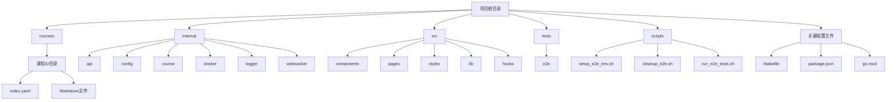
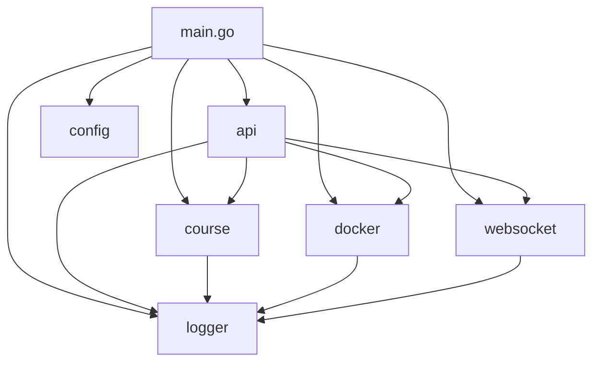
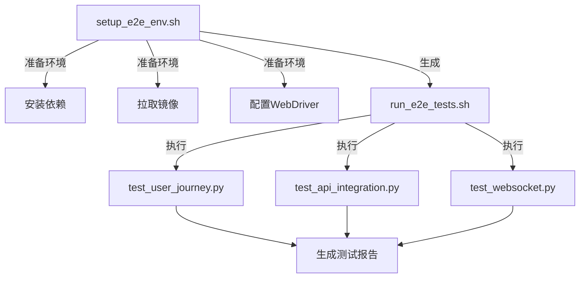

# 目录结构

<cite>
**本文档引用的文件**
- [main.go](file://main.go)
- [internal/api/routes.go](file://internal/api/routes.go)
- [internal/course/service.go](file://internal/course/service.go)
- [internal/docker/controller.go](file://internal/docker/controller.go)
- [internal/websocket/terminal.go](file://internal/websocket/terminal.go)
- [src/App.tsx](file://src/App.tsx)
- [src/pages/Learn.tsx](file://src/pages/Learn.tsx)
- [src/components/Terminal.tsx](file://src/components/Terminal.tsx)
- [Makefile](file://Makefile)
- [package.json](file://package.json)
- [go.mod](file://go.mod)
- [courses/install/index.yaml](file://courses/install/index.yaml)
- [courses/quick-start/index.yaml](file://courses/quick-start/index.yaml)
- [scripts/setup_e2e_env.sh](file://scripts/setup_e2e_env.sh)
</cite>

## 目录结构

本项目采用清晰的模块化目录结构，将前端、后端、课程内容、测试和脚本分离，便于维护和扩展。整体结构分为五个主要部分：`courses`（课程内容）、`internal`（后端内部模块）、`src`（前端源码）、`tests`（测试代码）和`scripts`（自动化脚本），以及位于根目录的关键配置文件。



**Diagram sources**
- [main.go](file://main.go#L1-L20)
- [internal/api/routes.go](file://internal/api/routes.go#L1-L10)

**Section sources**
- [main.go](file://main.go#L1-L50)

## 课程内容组织

`courses/` 目录是项目的核心内容存储区，用于存放所有交互式课程的文本和配置。每个子目录代表一个独立的课程，通过 `index.yaml` 文件定义课程元数据和内容结构。

### 课程目录结构

每个课程目录（如 `install` 和 `quick-start`）包含一个 `index.yaml` 配置文件和多个 Markdown 文件。这种设计实现了内容与配置的分离，便于内容创作和维护。

- **`index.yaml`**: 定义课程的标题、描述、步骤结构和后端配置。
- **`intro.md`**: 课程介绍页面内容。
- **`stepX.md`**: 课程的各个步骤内容。
- **`finish.md`**: 课程完成页面内容。

### 课程配置详解

`index.yaml` 文件是课程的“蓝图”，它不仅定义了课程的静态信息，还指定了运行环境。

```yaml
title: 单节点部署
description: 使用官网脚本一键部署 KWDB 单节点
details:
  intro:
    text: intro.md
  steps:
    - title: 下载安装包
      text: step1.md
    - title: 修改配置文件
      text: step2.md
    - title: 安装
      text: step3.md
  finish:
    text: finish.md
backend:
  imageid: ubuntu:20.04
```

- **`title` 和 `description`**: 课程的标题和简短描述。
- **`details`**: 定义了课程内容的组织结构，包括介绍、步骤和完成页，每个条目指向一个 Markdown 文件。
- **`backend`**: 指定课程运行所需的 Docker 镜像 (`imageid`) 和工作目录 (`workspace`)。

**Section sources**
- [courses/install/index.yaml](file://courses/install/index.yaml#L1-L21)
- [courses/quick-start/index.yaml](file://courses/quick-start/index.yaml#L1-L22)

## 后端模块化设计

`internal/` 目录是后端服务的核心，采用分层设计原则，将不同功能划分为独立的子模块，降低了耦合度，提高了代码的可维护性。

### 模块职责划分

| 模块 | 职责 |
| :--- | :--- |
| `api` | 处理所有 HTTP 请求，提供 RESTful API 接口。 |
| `config` | 管理应用程序的全局配置，从环境变量加载并验证配置项。 |
| `course` | 负责加载和管理 `courses/` 目录下的课程内容。 |
| `docker` | 封装对 Docker 守护进程的操作，如创建、启动、停止容器。 |
| `logger` | 提供统一的日志记录功能。 |
| `websocket` | 处理 WebSocket 连接，实现与容器终端的实时交互。 |

### 模块间依赖关系



**Diagram sources**
- [main.go](file://main.go#L1-L20)
- [internal/api/routes.go](file://internal/api/routes.go#L1-L10)

**Section sources**
- [internal/api/routes.go](file://internal/api/routes.go#L1-L50)
- [internal/course/service.go](file://internal/course/service.go#L1-L50)
- [internal/docker/controller.go](file://internal/docker/controller.go#L1-L50)
- [internal/websocket/terminal.go](file://internal/websocket/terminal.go#L1-L50)

## 前端组件化组织

`src/` 目录是前端代码的所在地，采用 React 框架，并遵循组件化开发模式，将 UI 拆分为可复用的独立组件。

### 目录结构与职责

- **`components/`**: 存放可复用的 UI 组件，如 `Navbar.tsx`、`Terminal.tsx` 和 `ConfirmDialog.tsx`。
- **`pages/`**: 存放页面级组件，如 `Home.tsx`、`CourseList.tsx` 和 `Learn.tsx`，每个文件代表一个路由页面。
- **`styles/`**: 存放样式相关的文件，如 `tailwind.config.js` 和 CSS 文件。
- **`lib/`**: 存放通用的工具函数。
- **`hooks/`**: 存放自定义的 React Hook。

### 核心页面分析

`Learn.tsx` 是学习页面的核心，它集成了课程内容渲染、容器状态管理和终端交互三大功能。

- **课程内容渲染**: 使用 `ReactMarkdown` 组件解析 Markdown 内容，并通过 `preprocessMarkdown` 函数将 `{{exec}}` 标记转换为可点击的“执行”按钮。
- **容器状态管理**: 通过 `fetch` API 调用后端 `/api/courses/:id/start` 和 `/api/courses/:id/stop` 等路由来控制容器的生命周期。
- **终端交互**: 通过 WebSocket 连接到 `/ws/terminal`，实现与容器终端的双向通信。

**Section sources**
- [src/App.tsx](file://src/App.tsx#L1-L35)
- [src/pages/Learn.tsx](file://src/pages/Learn.tsx#L1-L50)
- [src/components/Terminal.tsx](file://src/components/Terminal.tsx#L1-L50)

## 端到端测试布局

`tests/` 目录包含项目的端到端（E2E）测试，确保从用户界面到后端服务的整个流程正常工作。

### 测试结构

- **`e2e/`**: 存放所有 E2E 测试用例。
  - **`test_api_integration.py`**: 测试 API 接口的集成。
  - **`test_user_journey.py`**: 模拟用户从选择课程到完成学习的完整旅程。
  - **`test_websocket.py`**: 测试 WebSocket 连接和终端交互功能。
- **`utils/`**: 存放测试工具类，如 `api_client.py` 和 `websocket_client.py`。

### 测试执行流程

测试流程由 `scripts/` 目录下的脚本驱动，形成一个完整的自动化测试闭环。



**Diagram sources**
- [scripts/setup_e2e_env.sh](file://scripts/setup_e2e_env.sh#L1-L50)
- [tests/e2e/test_user_journey.py](file://tests/e2e/test_user_journey.py#L1-L10)

**Section sources**
- [tests/e2e/test_user_journey.py](file://tests/e2e/test_user_journey.py#L1-L50)
- [scripts/setup_e2e_env.sh](file://scripts/setup_e2e_env.sh#L1-L50)

## 自动化脚本功能

`scripts/` 目录包含一系列自动化脚本，用于简化开发、测试和部署流程。

### 核心脚本功能

| 脚本 | 功能 |
| :--- | :--- |
| `setup_e2e_env.sh` | 准备 E2E 测试环境，包括安装 Python 依赖、拉取 Docker 镜像和配置 Chrome WebDriver。 |
| `run_e2e_tests.sh` | 执行所有 E2E 测试用例并生成 HTML 报告。 |
| `cleanup_e2e.sh` | 清理测试过程中产生的临时文件和 Docker 容器。 |
| `quick_e2e_test.sh` | 快速执行 E2E 测试的便捷脚本。 |

## 根目录关键配置文件

根目录下的配置文件定义了项目的构建、依赖和运行时行为。

### Makefile

`Makefile` 是项目的构建和开发入口，定义了多个目标来管理整个开发周期。

- **`dev` 和 `dev-full`**: 启动开发服务器，支持热重载。
- **`build`**: 构建生产版本的可执行文件。
- **`run`**: 构建并运行应用。
- **`test`**: 运行所有测试。
- **`clean`**: 清理构建产物。

### package.json

`package.json` 定义了前端的依赖和脚本命令。

- **`dependencies`**: 列出了项目运行所需的前端库，如 `react`、`xterm` 和 `react-router-dom`。
- **`scripts`**: 定义了前端开发命令，如 `dev`（启动开发服务器）、`build`（构建生产包）和 `lint`（代码检查）。

### go.mod

`go.mod` 是 Go 项目的模块定义文件，声明了项目依赖的 Go 模块。

- **`require`**: 列出了项目直接依赖的模块，如 `github.com/gin-gonic/gin`（Web 框架）和 `github.com/moby/moby/client`（Docker 客户端）。
- **`indirect`**: 列出了间接依赖的模块。

**Section sources**
- [Makefile](file://Makefile#L1-L50)
- [package.json](file://package.json#L1-L50)
- [go.mod](file://go.mod#L1-L50)

## 新功能开发指引

### 新增课程

1.  在 `courses/` 目录下创建一个新的子目录，例如 `my-new-course`。
2.  在该目录下创建 `index.yaml` 文件，定义课程的标题、步骤和后端配置。
3.  创建相应的 Markdown 文件（`intro.md`, `step1.md`, `finish.md` 等）来编写课程内容。
4.  启动应用，新课程将自动出现在课程列表中。

### 修改API路由

1.  打开 `internal/api/routes.go` 文件。
2.  在 `SetupRoutes` 方法中，根据需要添加新的路由组或修改现有路由。
3.  实现对应的处理函数（如 `getCourse` 或 `startCourse`）。
4.  在 `main.go` 中，确保 `api.NewHandler` 被正确调用并传入了所有必要的服务实例。