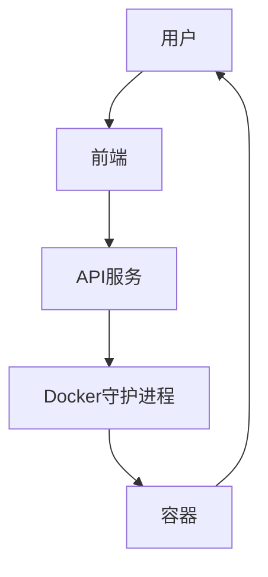

# 系统概述

<cite>
**本文档引用的文件**   
- [main.go](file://main.go)
- [internal/api/routes.go](file://internal/api/routes.go)
- [internal/config/config.go](file://internal/config/config.go)
- [internal/course/service.go](file://internal/course/service.go)
- [internal/course/models.go](file://internal/course/models.go)
- [internal/docker/controller.go](file://internal/docker/controller.go)
- [internal/websocket/terminal.go](file://internal/websocket/terminal.go)
- [src/App.tsx](file://src/App.tsx)
- [src/pages/Learn.tsx](file://src/pages/Learn.tsx)
- [src/components/Terminal.tsx](file://src/components/Terminal.tsx)
- [courses/install/index.yaml](file://courses/install/index.yaml)
- [courses/quick-start/index.yaml](file://courses/quick-start/index.yaml)
</cite>

## 目录
1. [项目简介](#项目简介)
2. [项目结构](#项目结构)
3. [核心功能与架构设计](#核心功能与架构设计)
4. [系统上下文图](#系统上下文图)
5. [组件初始化与依赖注入](#组件初始化与依赖注入)
6. [关键设计决策](#关键设计决策)
7. [可扩展性、安全性与性能优化](#可扩展性安全性与性能优化)
8. [课程内容与配置](#课程内容与配置)
9. [前端架构与用户交互](#前端架构与用户交互)
10. [总结](#总结)

## 项目简介

KWDB Playground 是一个交互式数据库学习平台，旨在为用户提供基于KWDB的隔离式学习环境。该平台支持课程驱动的实时命令行练习，使用户能够通过实践掌握KWDB的使用。项目采用前后端分离架构，后端使用Go语言和Gin框架，前端使用React，通过Docker容器化执行环境实现隔离的实验环境。

**Section sources**
- [main.go](file://main.go#L1-L50)
- [README.md](file://README.md#L1-L10)

## 项目结构

项目结构清晰，分为以下几个主要目录：

- `courses`: 存放课程内容，包括课程描述、步骤和完成状态。
- `internal`: 存放后端逻辑，包括API路由、配置、课程服务、Docker控制器和WebSocket终端。
- `scripts`: 存放脚本文件，用于环境设置和测试。
- `src`: 存放前端代码，包括组件、页面和样式。
- `tests`: 存放测试代码，包括端到端测试。
- 根目录下的文件包括`main.go`（后端入口）、`package.json`（前端依赖）、`Makefile`（构建脚本）等。

**Section sources**
- [project_structure](file://project_structure#L1-L50)

## 核心功能与架构设计

KWDB Playground 的核心功能是为用户提供一个隔离的、基于课程的学习环境。用户可以通过前端界面选择课程，启动一个Docker容器，然后在容器中进行命令行操作。后端通过WebSocket与前端通信，实现实时交互。

### 前后端分离架构

项目采用前后端分离架构，前端负责用户界面和交互，后端负责业务逻辑和数据处理。前端使用React构建，后端使用Go语言和Gin框架。前后端通过RESTful API和WebSocket进行通信。

### Go后端服务与React前端的协作机制

后端通过Gin框架提供RESTful API，前端通过HTTP请求调用这些API。例如，前端通过`/api/courses`获取课程列表，通过`/api/courses/:id/start`启动课程容器。WebSocket用于实现实时终端交互，前端通过`/ws/terminal`连接到后端，发送和接收终端数据。

### Docker容器化执行环境的集成方式

后端通过Docker API管理容器。当用户启动课程时，后端创建一个Docker容器，该容器基于课程配置的镜像。容器启动后，后端通过WebSocket将终端会话连接到前端，用户可以在前端的终端中执行命令。

**Section sources**
- [main.go](file://main.go#L50-L100)
- [internal/api/routes.go](file://internal/api/routes.go#L1-L50)
- [src/App.tsx](file://src/App.tsx#L1-L50)

## 系统上下文图



**Diagram sources**
- [main.go](file://main.go#L1-L20)
- [internal/api/routes.go](file://internal/api/routes.go#L1-L20)

## 组件初始化与依赖注入

### main.go中组件初始化流程

`main.go`是应用程序的入口点，负责初始化所有组件并启动HTTP服务器。初始化流程如下：

1. 加载环境变量。
2. 加载配置。
3. 创建日志记录器。
4. 初始化课程服务。
5. 初始化Docker控制器。
6. 初始化WebSocket终端管理器。
7. 设置Gin路由。
8. 启动HTTP服务器。

### 依赖注入模式

项目采用依赖注入模式，将各个组件的实例传递给需要它们的组件。例如，`api.NewHandler`函数接收`courseService`、`dockerController`、`terminalManager`和`logger`作为参数，这些参数在`main.go`中创建并传递。

**Section sources**
- [main.go](file://main.go#L100-L150)
- [internal/api/routes.go](file://internal/api/routes.go#L50-L100)

## 关键设计决策

### 使用Gin框架

Gin是一个高性能的Go Web框架，提供了丰富的中间件和路由功能。选择Gin框架可以提高开发效率和系统性能。

### WebSocket实现实时交互

WebSocket协议允许服务器和客户端之间进行全双工通信，适合实现实时终端交互。通过WebSocket，前端可以实时接收终端输出，并将用户输入发送到后端。

### 路径遍历防护

在静态文件服务中，通过检查文件路径是否包含`..`来防止路径遍历攻击。如果路径包含`..`，则返回400错误。

**Section sources**
- [main.go](file://main.go#L150-L200)
- [internal/api/routes.go](file://internal/api/routes.go#L100-L150)

## 可扩展性、安全性与性能优化

### 可扩展性

项目设计考虑了可扩展性。例如，课程内容存储在文件系统中，可以轻松添加新的课程。Docker容器化执行环境使得每个课程的执行环境相互隔离，便于管理和扩展。

### 安全性

项目采取了多种安全措施，包括路径遍历防护、Docker容器隔离和日志记录。通过这些措施，可以有效防止常见的安全威胁。

### 性能优化

项目通过以下方式优化性能：
- 使用Gin框架的发布模式，减少日志输出。
- 为静态文件设置缓存头，提高加载速度。
- 使用连接池和缓存减少Docker API调用。

**Section sources**
- [main.go](file://main.go#L200-L250)
- [internal/docker/controller.go](file://internal/docker/controller.go#L1-L50)

## 课程内容与配置

课程内容存储在`courses`目录下，每个课程有一个子目录，包含`index.yaml`和多个Markdown文件。`index.yaml`定义了课程的元数据，如标题、描述、步骤和完成状态。Markdown文件包含课程的具体内容。

### 示例课程配置

`courses/install/index.yaml`:
```yaml
title: 单节点部署
description: 使用官网脚本一键部署 KWDB 单节点
details:
  intro:
    text: intro.md
  steps:
    - title: 下载安装包
      text: step1.md
    - title: 修改配置文件
      text: step2.md
    - title: 安装
      text: step3.md
  finish:
    text: finish.md
backend:
  imageid: ubuntu:20.04
estimatedMinutes: 10
difficulty: intermediate
tags:
  - 安装
  - 单节点
```

**Section sources**
- [courses/install/index.yaml](file://courses/install/index.yaml#L1-L20)
- [courses/quick-start/index.yaml](file://courses/quick-start/index.yaml#L1-L20)

## 前端架构与用户交互

前端使用React构建，主要组件包括`App`、`Learn`、`Terminal`等。`App`组件负责路由和导航，`Learn`组件负责显示课程内容和终端，`Terminal`组件负责终端交互。

### 用户交互流程

1. 用户选择课程。
2. 前端调用`/api/courses/:id/start`启动课程容器。
3. 容器启动后，前端通过`/ws/terminal`连接到终端。
4. 用户在终端中执行命令，前端通过WebSocket将命令发送到后端。
5. 后端执行命令并将输出通过WebSocket返回给前端。

**Section sources**
- [src/App.tsx](file://src/App.tsx#L50-L100)
- [src/pages/Learn.tsx](file://src/pages/Learn.tsx#L1-L50)
- [src/components/Terminal.tsx](file://src/components/Terminal.tsx#L1-L50)

## 总结

KWDB Playground 是一个功能完善的交互式数据库学习平台，通过前后端分离架构和Docker容器化执行环境，为用户提供了一个安全、隔离的学习环境。项目设计考虑了可扩展性、安全性和性能优化，适合用于教学和培训。

**Section sources**
- [main.go](file://main.go#L1-L50)
- [README.md](file://README.md#L1-L10)