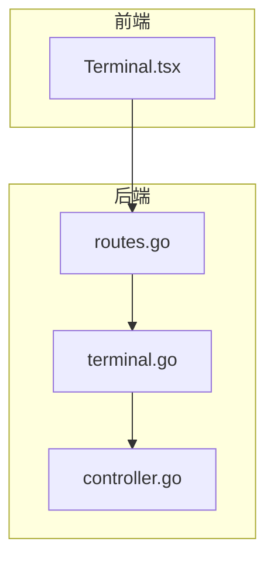
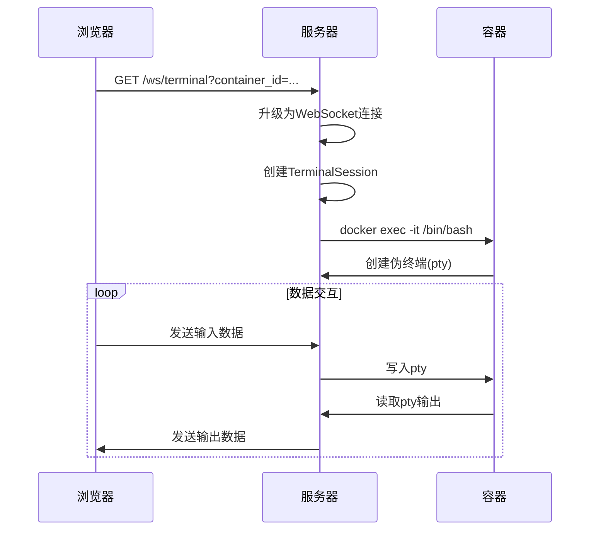
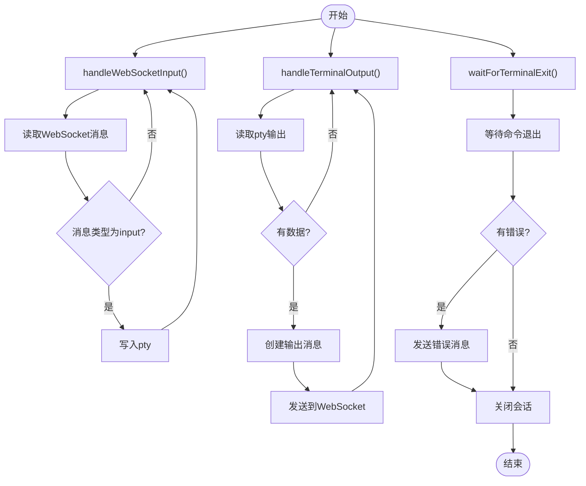
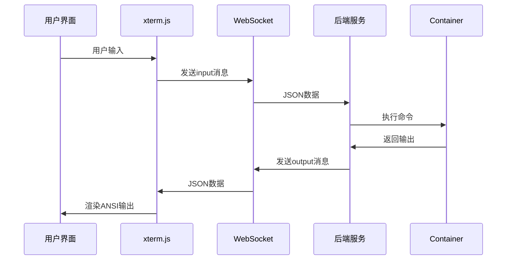
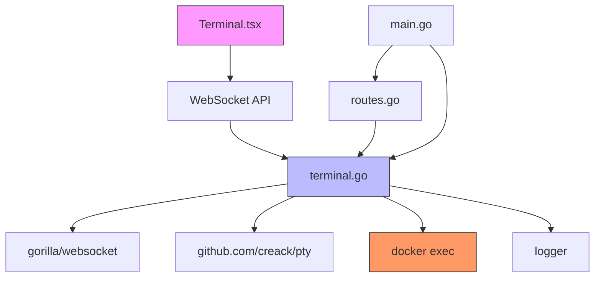

# 终端交互

<cite>
**本文档中引用的文件**   
- [terminal.go](file://internal/websocket/terminal.go)
- [Terminal.tsx](file://src/components/Terminal.tsx)
- [routes.go](file://internal/api/routes.go)
- [main.go](file://main.go)
</cite>

## 目录
1. [简介](#简介)
2. [项目结构](#项目结构)
3. [核心组件](#核心组件)
4. [架构概述](#架构概述)
5. [详细组件分析](#详细组件分析)
6. [依赖分析](#依赖分析)
7. [性能考虑](#性能考虑)
8. [故障排除指南](#故障排除指南)
9. [结论](#结论)

## 简介
本文档系统阐述了如何通过WebSocket在浏览器中实现与远程容器的实时命令行交互。重点分析了`terminal.go`文件中如何监听`/ws/terminal`路径的WebSocket升级请求，为每个会话创建`TerminalSession`结构体，并将其stdin/stdout与Docker exec会话桥接。描述了`PumpStdout`和`PumpStdin`协程如何实现双向数据流转发，以及`HandleResize`如何处理终端尺寸调整事件。结合前端`Terminal.tsx`组件，解释其如何使用WebSocket API发送用户输入并渲染返回的ANSI输出流。涵盖连接管理（会话超时、异常断开重连）、流量控制和安全防护（防止恶意命令注入）机制。提供交互时序图，展示从用户按键到容器响应的完整数据路径。包含调试技巧，如查看WebSocket帧内容和日志追踪终端会话状态。

## 项目结构
本项目采用分层架构设计，将前端与后端逻辑分离。后端核心功能位于`internal`目录下，其中`websocket`包负责终端交互功能，`api`包处理HTTP路由，`docker`包管理容器操作。前端组件位于`src/components`目录，`Terminal.tsx`实现了终端用户界面。`main.go`作为程序入口点，初始化所有服务并启动HTTP服务器。



**Diagram sources**
- [Terminal.tsx](file://src/components/Terminal.tsx)
- [routes.go](file://internal/api/routes.go)
- [terminal.go](file://internal/websocket/terminal.go)

**Section sources**
- [main.go](file://main.go)
- [internal/websocket/terminal.go](file://internal/websocket/terminal.go)

## 核心组件
终端交互功能的核心是`TerminalSession`结构体和`TerminalManager`管理器。`TerminalSession`封装了单个终端会话的所有状态，包括WebSocket连接、Docker命令、伪终端文件描述符和上下文控制。`TerminalManager`负责管理所有活动会话的生命周期，确保会话的创建、查找和清理。

**Section sources**
- [terminal.go](file://internal/websocket/terminal.go#L56-L78)
- [terminal.go](file://internal/websocket/terminal.go#L42-L47)

## 架构概述
系统通过WebSocket协议实现浏览器与远程容器之间的实时双向通信。当用户访问终端界面时，前端组件建立WebSocket连接到`/ws/terminal`端点。后端升级HTTP连接为WebSocket，并创建`TerminalSession`实例。该会话通过`docker exec`命令连接到指定容器的bash shell，并使用伪终端(pty)技术桥接数据流。



**Diagram sources**
- [terminal.go](file://internal/websocket/terminal.go#L81-L111)
- [routes.go](file://internal/api/routes.go#L637-L693)

## 详细组件分析

### 后端终端会话管理
后端通过`TerminalSession`结构体管理每个终端会话。会话创建时，系统生成唯一的会话ID，并建立与指定容器的连接。

#### 会话创建与初始化
```mermaid
classDiagram
class TerminalSession {
+string sessionID
+string containerID
+*websocket.Conn conn
+*exec.Cmd cmd
+*os.File pty
+context.Context ctx
+context.CancelFunc cancel
+*logger.Logger logger
+StartInteractiveSession() error
+handleWebSocketInput()
+handleTerminalOutput()
+waitForTerminalExit()
+Close()
+Done() <-chan struct{}
}
class TerminalManager {
+map[string]*TerminalSession sessions
+sync.RWMutex mu
+*logger.Logger logger
+CreateSession(sessionID, containerID string, conn *websocket.Conn) *TerminalSession
+RemoveSession(sessionID string)
+SetLogger(loggerInstance *logger.Logger)
}
TerminalManager --> TerminalSession : "管理"
```

**Diagram sources**
- [terminal.go](file://internal/websocket/terminal.go#L56-L78)
- [terminal.go](file://internal/websocket/terminal.go#L81-L111)

#### 双向数据流处理
系统使用三个独立的goroutine处理双向数据流：

1. `handleWebSocketInput`：从WebSocket读取用户输入并写入容器
2. `handleTerminalOutput`：从容器读取输出并发送到WebSocket
3. `waitForTerminalExit`：监控容器进程状态



**Diagram sources**
- [terminal.go](file://internal/websocket/terminal.go#L114-L135)
- [terminal.go](file://internal/websocket/terminal.go#L138-L165)
- [terminal.go](file://internal/websocket/terminal.go#L168-L181)

### 前端终端组件
前端`Terminal.tsx`组件使用xterm.js库渲染终端界面，并通过WebSocket与后端通信。

#### 组件交互流程


**Diagram sources**
- [Terminal.tsx](file://src/components/Terminal.tsx)
- [terminal.go](file://internal/websocket/terminal.go#L138-L165)

**Section sources**
- [Terminal.tsx](file://src/components/Terminal.tsx#L0-L217)
- [terminal.go](file://internal/websocket/terminal.go#L114-L135)

## 依赖分析
终端交互功能依赖多个核心组件和外部库。系统通过清晰的依赖管理确保各组件间的松耦合。



**Diagram sources**
- [go.mod](file://go.mod)
- [main.go](file://main.go)
- [terminal.go](file://internal/websocket/terminal.go)

**Section sources**
- [go.mod](file://go.mod)
- [main.go](file://main.go#L31-L165)

## 性能考虑
系统在设计时考虑了多项性能优化措施：

1. **连接复用**：每个终端会话使用独立的WebSocket连接，避免多路复用的复杂性
2. **缓冲处理**：使用1024字节缓冲区读取终端输出，平衡性能与内存使用
3. **并发处理**：使用goroutine实现非阻塞I/O操作，提高系统吞吐量
4. **资源清理**：通过context取消机制确保会话资源及时释放

## 故障排除指南
当终端交互功能出现问题时，可参考以下调试方法：

1. **检查WebSocket连接**：使用浏览器开发者工具查看WebSocket帧内容
2. **查看日志信息**：检查服务端日志中的`[DEBUG]`和`[ERROR]`级别消息
3. **验证Docker状态**：确认目标容器处于运行状态
4. **测试网络连通性**：确保前端能够访问WebSocket端点

**Section sources**
- [terminal.go](file://internal/websocket/terminal.go#L184-L194)
- [routes.go](file://internal/api/routes.go#L637-L693)

## 结论
本文档详细分析了终端交互功能的实现机制，从前后端架构到具体代码实现。系统通过WebSocket协议实现了浏览器与远程容器的实时命令行交互，采用伪终端技术桥接数据流，确保了交互的实时性和可靠性。通过合理的架构设计和错误处理机制，系统能够稳定运行并提供良好的用户体验。