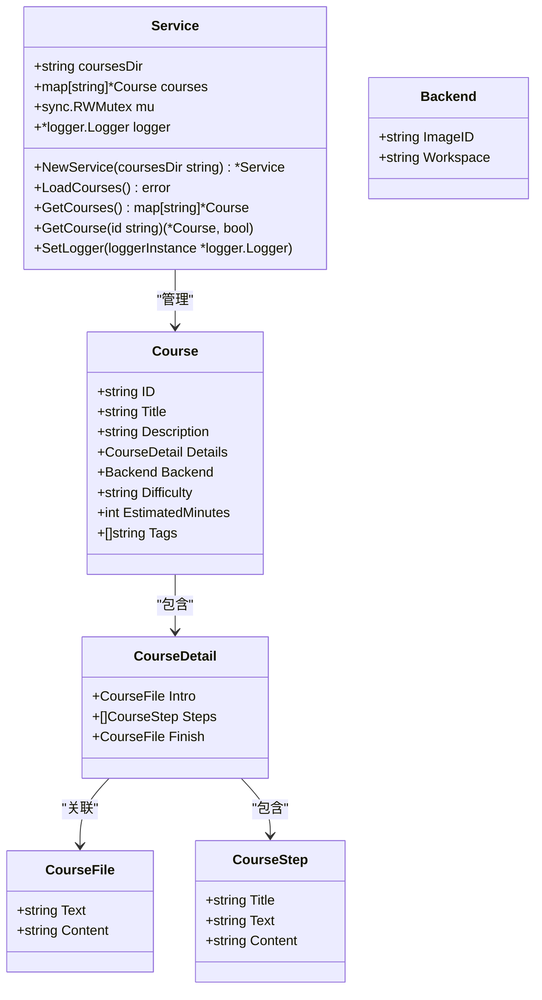
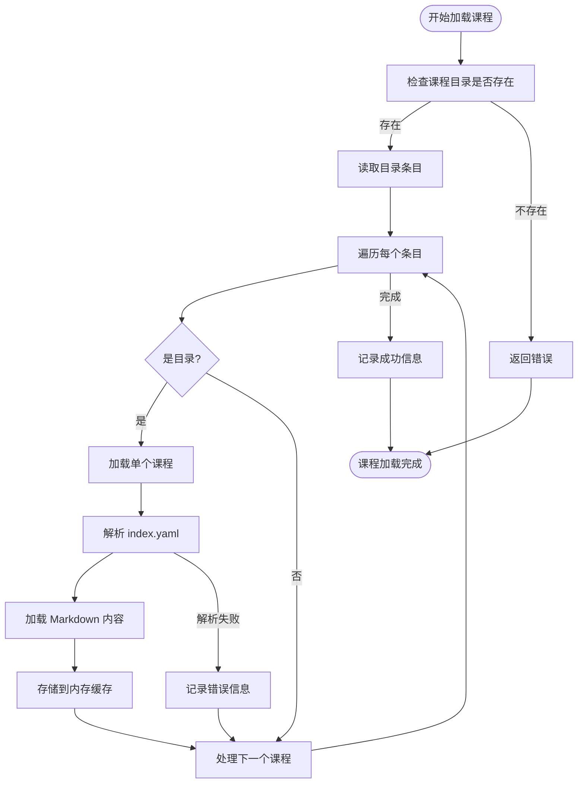
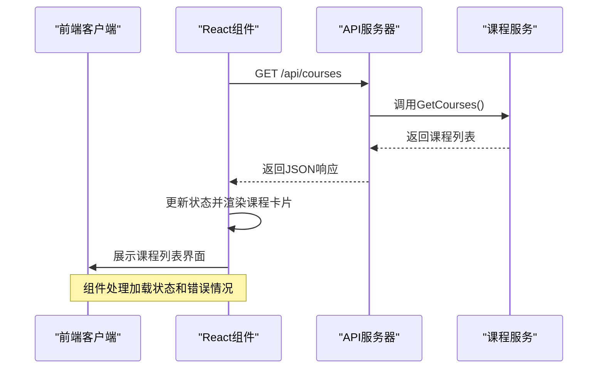
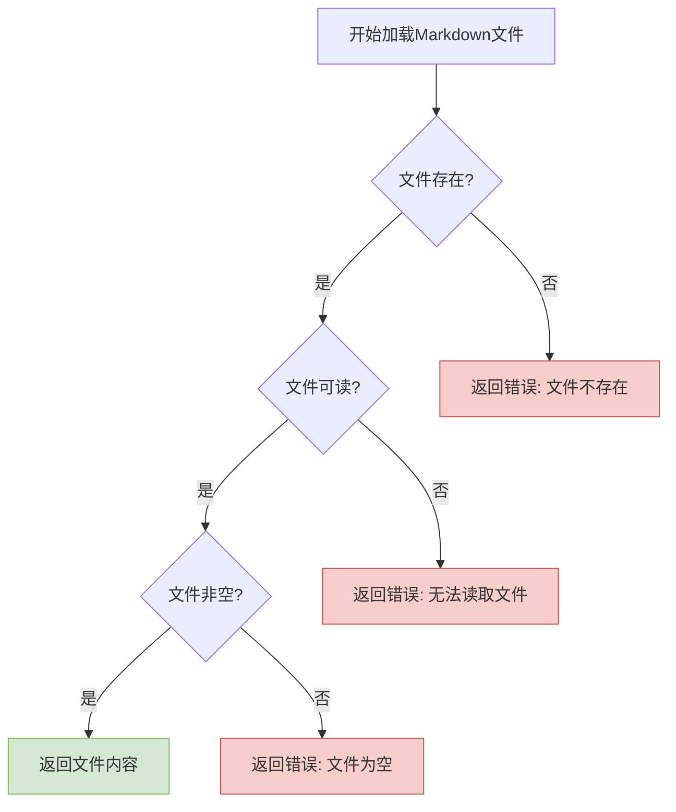

# 课程管理

<cite>
**本文档引用的文件**
- [service.go](file://internal/course/service.go)
- [models.go](file://internal/course/models.go)
- [routes.go](file://internal/api/routes.go)
- [CourseList.tsx](file://src/pages/CourseList.tsx)
- [index.yaml](file://courses/install/index.yaml)
- [intro.md](file://courses/install/intro.md)
- [step1.md](file://courses/install/step1.md)
</cite>

## 目录
1. [课程结构与内容组织](#课程结构与内容组织)
2. [课程服务核心功能](#课程服务核心功能)
3. [课程加载与解析流程](#课程加载与解析流程)
4. [前端课程列表展示](#前端课程列表展示)
5. [添加新课程指南](#添加新课程指南)
6. [错误处理与缓存策略](#错误处理与缓存策略)
7. [最佳实践建议](#最佳实践建议)

## 课程结构与内容组织

课程内容以文件夹形式组织在 `courses/` 目录下，每个子目录代表一门独立的课程。课程目录包含 `index.yaml` 配置文件和多个 Markdown 内容文件。

`index.yaml` 文件定义了课程的元数据，包括标题、描述、难度等级、预计学习时间、标签等基本信息。文件中的 `details` 字段指定了课程各部分内容对应的 Markdown 文件路径，包括介绍（intro）、学习步骤（steps）和完成页（finish）。

课程内容由多个 Markdown 文件构成，每个文件代表一个学习步骤。例如，`intro.md` 是课程介绍，`step1.md`、`step2.md` 等是具体的学习步骤，`finish.md` 是课程结束页面。这些文件按照 `index.yaml` 中的配置被动态加载和展示。

**Section sources**
- [index.yaml](file://courses/install/index.yaml)
- [intro.md](file://courses/install/intro.md)
- [step1.md](file://courses/install/step1.md)

## 课程服务核心功能

课程服务（Service）是课程管理的核心组件，负责课程的加载、存储和查询。服务通过 `NewService` 函数创建，接收课程目录路径作为参数，并初始化一个线程安全的课程存储结构。



**Diagram sources**
- [service.go](file://internal/course/service.go#L20-L40)
- [models.go](file://internal/course/models.go#L5-L60)

**Section sources**
- [service.go](file://internal/course/service.go#L43-L53)
- [models.go](file://internal/course/models.go#L5-L60)

## 课程加载与解析流程

课程加载流程从调用 `LoadCourses` 方法开始，该方法扫描课程目录，为每个子目录创建课程实例。加载过程是线程安全的，使用读写锁保护课程数据的并发访问。



**Diagram sources**
- [service.go](file://internal/course/service.go#L68-L105)
- [service.go](file://internal/course/service.go#L107-L148)

`loadCourse` 方法负责加载单个课程，首先读取并解析 `index.yaml` 文件，然后根据配置加载相应的 Markdown 内容文件。`loadCourseContent` 方法根据 `index.yaml` 中的文件路径配置，逐个加载介绍、步骤和结束页面的内容。

课程元数据通过 `GetCourses` 和 `GetCourse` 方法提供查询接口。`GetCourses` 返回所有课程的副本，避免外部修改影响内部缓存；`GetCourse` 根据课程 ID 返回特定课程的引用和存在状态。

**Section sources**
- [service.go](file://internal/course/service.go#L68-L256)

## 前端课程列表展示

前端通过 `CourseList.tsx` 组件展示课程列表。组件在初始化时通过 `useEffect` 钩子调用 `/api/courses` API 端点获取课程数据。



**Diagram sources**
- [CourseList.tsx](file://src/pages/CourseList.tsx#L1-L163)
- [routes.go](file://internal/api/routes.go#L107-L119)

组件使用 `fetch` API 异步获取课程数据，处理加载状态和错误情况。获取到数据后，将课程信息映射为卡片视图，展示课程标题、描述、难度、预计时间等信息，并提供"开始学习"按钮链接到具体课程页面。

**Section sources**
- [CourseList.tsx](file://src/pages/CourseList.tsx#L1-L163)
- [routes.go](file://internal/api/routes.go#L107-L119)

## 添加新课程指南

添加新课程需要创建一个新的目录并编写相应的配置和内容文件。首先，在 `courses/` 目录下创建以课程标识符命名的子目录，如 `my-new-course`。

在新目录中创建 `index.yaml` 文件，定义课程元数据：

```yaml
title: 课程标题
description: 课程描述
difficulty: beginner|intermediate|advanced
estimatedMinutes: 30
tags:
  - 标签1
  - 标签2
details:
  intro:
    text: intro.md
  steps:
    - title: 第一步
      text: step1.md
    - title: 第二步
      text: step2.md
  finish:
    text: finish.md
backend:
  imageid: docker镜像ID
  workspace: /workspace
```

然后创建相应的 Markdown 文件，如 `intro.md`、`step1.md` 等，编写课程内容。每个 Markdown 文件可以包含文本、代码示例等内容，支持标准 Markdown 语法。

**Section sources**
- [index.yaml](file://courses/install/index.yaml)

## 错误处理与缓存策略

课程加载过程中实现了完善的错误处理机制。当目录不存在时，`LoadCourses` 方法返回相应错误；当 `index.yaml` 文件不存在或为空时，`loadCourse` 方法返回错误；当 YAML 解析失败时，返回解析错误信息。

对于 Markdown 文件加载，系统采用容错策略：如果文件不存在或读取失败，记录警告日志并将内容设置为空字符串，而不是中断整个课程加载过程。这种设计确保了单个文件的问题不会影响其他课程的正常加载。



**Diagram sources**
- [service.go](file://internal/course/service.go#L184-L221)

系统采用内存缓存策略，所有课程在首次加载后存储在内存中，后续查询直接从内存获取，提高了访问性能。开发环境支持热重载，通过重新调用 `LoadCourses` 方法可以重新扫描目录并更新课程缓存。

**Section sources**
- [service.go](file://internal/course/service.go#L184-L221)

## 最佳实践建议

### 课程命名规范
课程目录名应使用小写字母和连字符（kebab-case），如 `database-basics`。课程标题应简洁明了，准确反映课程内容。

### 步骤划分原则
每个学习步骤应聚焦一个具体主题，保持内容长度适中（300-500字）。步骤标题应清晰描述该步骤的学习目标，如"配置数据库连接"、"创建第一个表"等。

### 多媒体内容嵌入方式
在 Markdown 文件中，可以使用标准语法嵌入图片、代码块等多媒体内容。对于交互式代码示例，可以使用特殊标记 `{{exec}}` 来标识可执行命令，系统会将其渲染为可点击的执行按钮。

### 配置文件最佳实践
`index.yaml` 文件中的 `backend.imageid` 字段应指定课程所需的 Docker 镜像，`backend.workspace` 字段指定容器内的工作目录。`tags` 字段应使用有意义的标签，便于课程分类和搜索。

**Section sources**
- [index.yaml](file://courses/install/index.yaml)
- [step1.md](file://courses/install/step1.md)