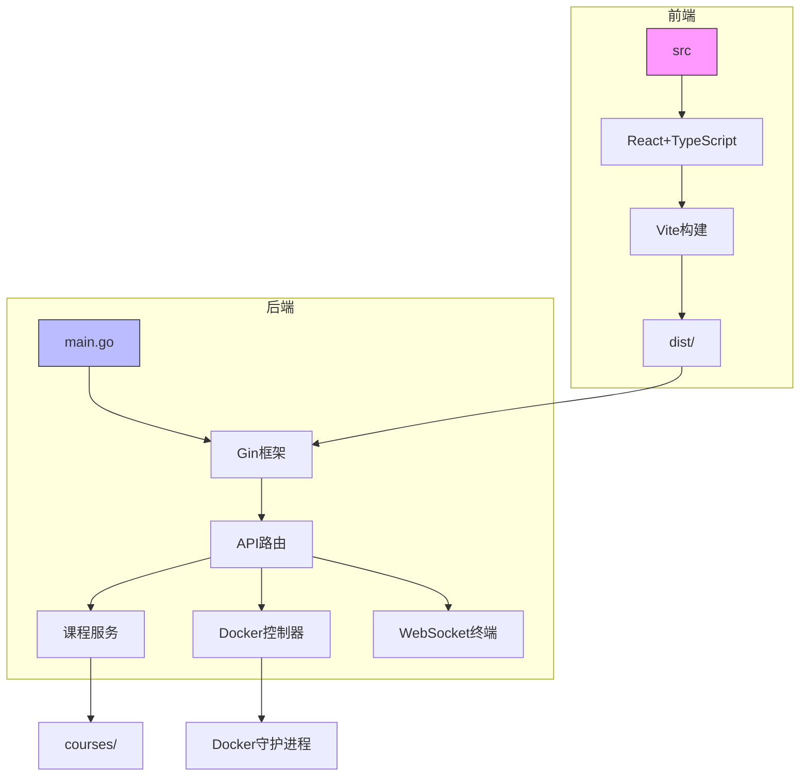
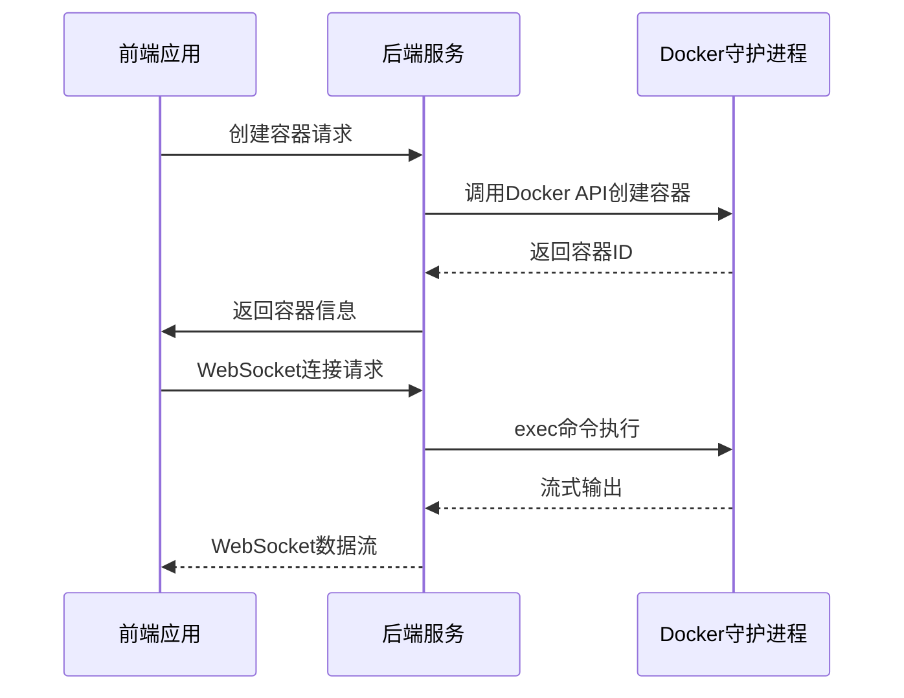

# 部署指南

<cite>
**本文档中引用的文件**   
- [Makefile](file://Makefile)
- [main.go](file://main.go)
- [config.go](file://internal/config/config.go)
</cite>

## 目录
1. [简介](#简介)
2. [项目结构](#项目结构)
3. [本地部署](#本地部署)
4. [Docker容器化部署](#docker容器化部署)
5. [环境变量配置](#环境变量配置)
6. [持久化存储与课程目录](#持久化存储与课程目录)
7. [生产环境最佳实践](#生产环境最佳实践)
8. [故障排查](#故障排查)
9. [版本升级与回滚](#版本升级与回滚)
10. [安全配置](#安全配置)

## 简介
本部署指南为运维人员提供从零开始部署KWDB Playground系统的完整步骤。文档涵盖通过Makefile本地启动服务、环境变量配置、持久化存储设置以及生产环境最佳实践等内容。系统采用Go语言后端与TypeScript前端的混合架构，通过Gin框架提供API服务，并嵌入前端静态资源。

**Section sources**
- [main.go](file://main.go#L1-L20)
- [config.go](file://internal/config/config.go#L1-L20)

## 项目结构
KWDB Playground项目采用分层架构设计，主要包含以下目录：

- **courses**: 课程内容目录，包含安装和快速入门等课程模块
- **internal**: 后端核心代码，包括API、配置、课程服务、Docker控制器和WebSocket终端
- **src**: 前端源码，使用React + TypeScript + Vite构建
- **scripts**: 自动化脚本，包含端到端测试相关脚本
- **tests**: 测试代码，包含e2e测试用例

系统通过Makefile统一管理构建和部署流程，支持跨平台开发和部署。



**Diagram sources **
- [main.go](file://main.go#L1-L20)
- [config.go](file://internal/config/config.go#L1-L20)

**Section sources**
- [main.go](file://main.go#L1-L50)
- [Makefile](file://Makefile#L1-L20)

## 本地部署
通过Makefile提供的目标可以轻松完成本地部署。系统支持跨平台（Linux、macOS、Windows）部署。

### 使用Makefile部署
Makefile提供了完整的构建和部署目标：

```makefile
# 安装所有依赖
make install

# 安装开发工具（air、dlv）
make install-tools

# 构建并运行应用
make run

# 开发模式（支持热重载）
make dev-full
```

`make run`目标会依次执行前端构建、后端构建，并在指定端口启动服务。默认服务器端口为3006，可通过`SERVER_PORT`环境变量自定义。

### 构建流程
构建过程分为前端和后端两个阶段：
1. 前端使用pnpm构建，输出到dist目录
2. 后端使用Go构建，将dist目录嵌入二进制文件
3. 生成可执行文件到bin目录

构建时会自动注入版本信息、构建时间和Git提交哈希。

**Section sources**
- [Makefile](file://Makefile#L15-L267)
- [main.go](file://main.go#L1-L20)

## Docker容器化部署
虽然项目根目录没有Dockerfile，但系统通过Docker API与Docker守护进程交互，管理课程相关的容器。

### Docker集成机制
系统通过`internal/docker`包实现Docker集成：
- 自动检测Docker守护进程（通过环境变量或socket路径）
- 支持创建、启动、停止和删除容器
- 管理容器生命周期和状态



**Diagram sources **
- [controller.go](file://internal/docker/controller.go#L1-L50)
- [main.go](file://main.go#L1-L20)

**Section sources**
- [internal/docker/controller.go](file://internal/docker/controller.go#L1-L20)
- [main.go](file://main.go#L47-L80)

## 环境变量配置
系统通过环境变量实现灵活配置，主要配置项如下：

### 核心环境变量
```bash
# 服务器配置
SERVER_HOST=localhost      # 服务器监听地址
SERVER_PORT=3006          # 服务器监听端口
DEBUG_PORT=2345           # 调试端口

# 课程配置
COURSE_DIR=./courses      # 课程文件目录
COURSES_RELOAD=true       # 是否启用课程热重载

# Docker配置
DOCKER_HOST=             # Docker守护进程地址
DOCKER_TIMEOUT=30        # Docker操作超时时间（秒）

# 日志配置
LOG_LEVEL=info           # 日志级别 (debug, info, warn, error)
LOG_FORMAT=json          # 日志格式 (json, text)
```

### 配置加载机制
系统通过`internal/config/config.go`中的`Load()`函数从环境变量加载配置，支持默认值机制。配置验证包括端口范围检查、目录存在性验证和日志级别有效性检查。

**Section sources**
- [config.go](file://internal/config/config.go#L65-L110)
- [config.go](file://internal/config/config.go#L139-L178)

## 持久化存储与课程目录
系统设计了专门的持久化存储机制，确保课程数据的持久性和可维护性。

### 课程目录结构
```
courses/
├── install/
│   ├── index.yaml
│   ├── intro.md
│   ├── step1.md
│   ├── step2.md
│   └── step3.md
└── quick-start/
    ├── index.yaml
    ├── intro.md
    ├── step1.md
    └── step2.md
```

课程内容通过`internal/course/service.go`中的`LoadCourses()`方法加载，支持动态扫描课程目录并缓存课程信息。

### 存储挂载建议
在生产环境中，建议将课程目录挂载为持久化卷：
- 宿主机路径：`/data/kwdb-playground/courses`
- 容器内路径：`/app/courses`
- 确保目录读写权限正确

**Section sources**
- [service.go](file://internal/course/service.go#L55-L105)
- [config.go](file://internal/config/config.go#L38-L63)

## 生产环境最佳实践
为确保系统在生产环境中的稳定性和安全性，建议遵循以下最佳实践。

### 反向代理配置
使用Nginx作为反向代理，配置示例如下：
```nginx
server {
    listen 80;
    server_name playground.example.com;
    
    location / {
        proxy_pass http://localhost:3006;
        proxy_http_version 1.1;
        proxy_set_header Upgrade $http_upgrade;
        proxy_set_header Connection 'upgrade';
        proxy_set_header Host $host;
        proxy_set_header X-Real-IP $remote_addr;
        proxy_set_header X-Forwarded-For $proxy_add_x_forwarded_for;
        proxy_set_header X-Forwarded-Proto $scheme;
        proxy_cache_bypass $http_upgrade;
    }
}
```

### HTTPS启用
通过Let's Encrypt免费证书启用HTTPS：
```bash
# 使用certbot获取证书
certbot --nginx -d playground.example.com

# 或使用Docker方式
docker run -d -v /etc/letsencrypt:/etc/letsencrypt \
  -v /var/lib/letsencrypt:/var/lib/letsencrypt \
  certbot/certbot certonly --standalone -d playground.example.com
```

### 日志收集
系统支持JSON和文本两种日志格式，建议配置集中式日志收集：
- 使用Filebeat收集日志
- 发送到Elasticsearch或Loki
- 通过Kibana或Grafana可视化

### 监控集成
集成Prometheus和Grafana进行系统监控：
- 暴露健康检查端点`/health`
- 监控关键指标：请求延迟、错误率、并发连接数
- 设置告警规则

**Section sources**
- [main.go](file://main.go#L164-L197)
- [config.go](file://internal/config/config.go#L65-L110)

## 故障排查
提供常见问题的解决方案，帮助运维人员快速定位和解决问题。

### Docker连接失败
**问题**：无法连接到Docker守护进程
**解决方案**：
1. 检查Docker服务是否运行：`systemctl status docker`
2. 验证用户是否在docker组：`groups $USER`
3. 检查socket文件权限：`ls -la /var/run/docker.sock`
4. 尝试指定DOCKER_HOST：`export DOCKER_HOST=unix:///var/run/docker.sock`

### 端口冲突
**问题**：端口3006已被占用
**解决方案**：
1. 查看端口占用：`lsof -i :3006`
2. 终止占用进程：`kill -9 <PID>`
3. 或更改端口：`SERVER_PORT=3007 make run`

### 权限不足
**问题**：无法读取课程目录
**解决方案**：
1. 检查目录权限：`ls -la courses/`
2. 修改目录所有者：`chown -R $USER:$USER courses/`
3. 确保读写权限：`chmod -R 755 courses/`

**Section sources**
- [controller.go](file://internal/docker/controller.go#L39-L130)
- [Makefile](file://Makefile#L153-L200)

## 版本升级与回滚
系统支持平滑的版本升级和快速回滚，确保服务连续性。

### 升级流程
1. 备份当前版本：`cp bin/kwdb-playground bin/kwdb-playground-v$(date +%Y%m%d)`
2. 停止当前服务：`make stop`
3. 构建新版本：`make build`
4. 启动新版本：`make run`
5. 验证服务状态：`make status`

### 回滚操作
当新版本出现问题时，可快速回滚：
1. 停止当前服务：`make stop`
2. 启动备份版本：`./bin/kwdb-playground-vYYYYMMDD`
3. 检查服务状态：`make status`

建议在升级前备份课程目录和配置文件。

**Section sources**
- [Makefile](file://Makefile#L153-L200)
- [main.go](file://main.go#L164-L197)

## 安全配置
强调安全配置，限制攻击面，保护系统安全。

### 容器权限限制
创建容器时应遵循最小权限原则：
- 使用非root用户运行容器
- 限制CPU和内存资源
- 禁用不必要的设备和权限
- 使用只读文件系统

### 最小化攻击面
- 关闭不必要的端口
- 使用防火墙限制访问
- 定期更新依赖
- 启用TLS加密
- 配置合理的日志级别

### 安全最佳实践
1. **环境隔离**：开发、测试、生产环境分离
2. **访问控制**：限制管理接口访问IP
3. **定期审计**：检查系统日志和安全事件
4. **备份策略**：定期备份课程数据和配置

**Section sources**
- [controller.go](file://internal/docker/controller.go#L525-L576)
- [config.go](file://internal/config/config.go#L65-L110)