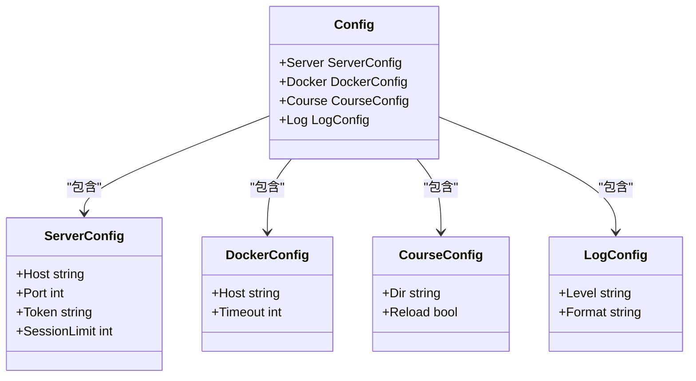
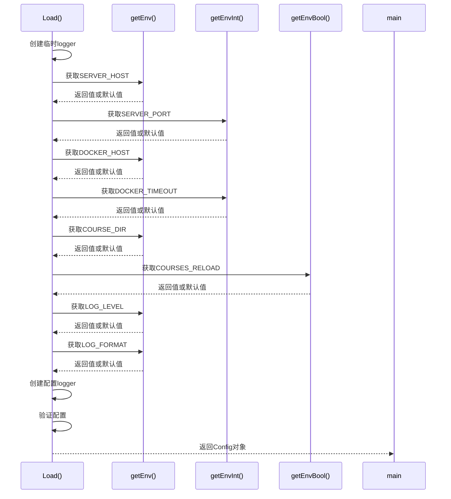
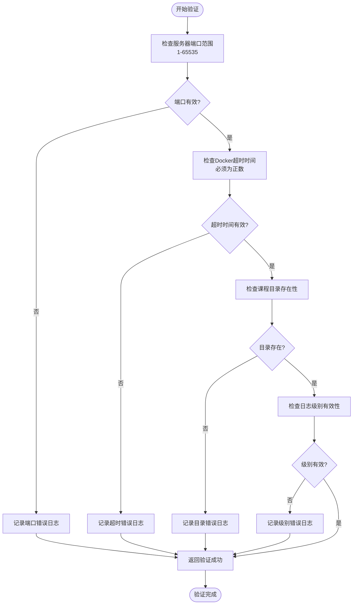
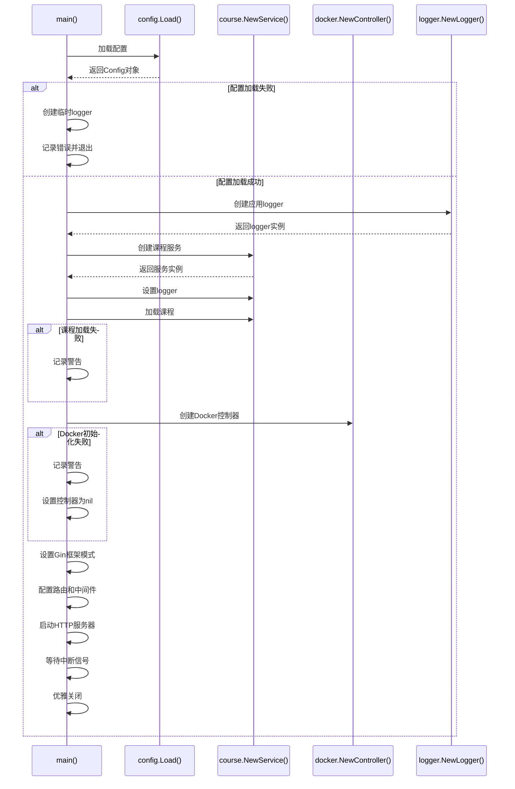

# 配置管理

<cite>
**本文档引用的文件**   
- [config.go](file://internal/config/config.go)
- [main.go](file://main.go)
- [logger.go](file://internal/logger/logger.go)
</cite>

## 目录
1. [配置管理](#配置管理)
2. [配置结构设计](#配置结构设计)
3. [配置加载机制](#配置加载机制)
4. [配置验证流程](#配置验证流程)
5. [主程序配置使用](#主程序配置使用)
6. [配置项清单](#配置项清单)
7. [部署配置指南](#部署配置指南)
8. [配置安全实践](#配置安全实践)

## 配置结构设计

playground项目的配置系统通过`Config`结构体实现了模块化的配置管理，将不同功能领域的配置项组织成嵌套结构。`Config`结构体包含四个主要子结构体：`ServerConfig`、`DockerConfig`、`CourseConfig`和`LogConfig`，分别管理服务器、Docker容器、课程内容和日志系统的配置参数。

`ServerConfig`定义了HTTP服务器的监听地址（Host）和端口（Port），默认值分别为"localhost"和8080。同时包含API访问令牌（Token）和并发会话限制（SessionLimit）等安全相关参数。`DockerConfig`配置了Docker守护进程的连接地址（Host）和操作超时时间（Timeout），支持通过socket或TCP方式连接Docker服务。

`CourseConfig`管理课程内容的存储路径（Dir）和热重载功能（Reload），默认课程目录为"./courses"且启用热重载。`LogConfig`则定义了日志级别（Level）和格式（Format），支持"debug"、"info"、"warn"、"error"四种日志级别和"json"、"text"两种输出格式。

**Diagram sources**
- [config.go](file://internal/config/config.go#L12-L19)

**Section sources**
- [config.go](file://internal/config/config.go#L12-L36)

## 配置加载机制

系统通过`Load()`函数实现了灵活的配置注入机制，按照优先级从环境变量中加载配置值。该函数采用"环境变量优先"的设计原则，当环境变量存在时使用其值，否则使用预设的默认值。这种设计使得部署者可以轻松地通过环境变量覆盖默认设置，特别适用于容器化部署场景。

配置加载过程首先创建一个临时的DEBUG级别logger用于记录配置加载过程。然后通过一系列辅助函数从环境变量中读取配置值：`getEnv()`用于字符串类型，`getEnvInt()`用于整数类型，`getEnvBool()`用于布尔类型。这些辅助函数不仅处理类型转换，还包含错误处理机制，在解析失败时记录警告但继续使用默认值，确保配置加载过程的健壮性。

环境变量与配置项的映射关系清晰明确：`SERVER_HOST`对应服务器主机地址，`SERVER_PORT`对应端口，`DOCKER_HOST`对应Docker守护进程地址，`COURSE_DIR`对应课程目录路径，`LOG_LEVEL`对应日志级别等。这种命名约定使得配置项的用途一目了然，便于部署者理解和使用。

**Diagram sources**
- [config.go](file://internal/config/config.go#L60-L97)

**Section sources**
- [config.go](file://internal/config/config.go#L60-L110)

## 配置验证流程

在配置加载完成后，系统通过`validateConfig()`函数对配置项进行验证，确保其符合业务逻辑和系统要求。验证过程包含多个检查点：服务器端口必须在1-65535的有效范围内，Docker操作超时时间必须为正数，课程目录必须存在，日志级别必须是预定义的有效值之一。

验证函数接收配置对象和logger实例作为参数，当发现无效配置时，通过logger记录警告信息但不会中断程序执行。这种"宽松验证"策略提高了系统的容错能力，允许应用在部分配置错误的情况下继续运行，同时通过日志提醒部署者存在问题。例如，如果课程目录不存在，系统会记录警告但不会阻止应用启动，这在开发环境中特别有用。

验证过程还体现了分层设计思想：基础类型验证（如端口范围）由配置系统自身完成，而更复杂的业务逻辑验证（如课程内容的完整性）则由相应的业务组件（如课程服务）在后续处理中完成。这种职责分离使得配置验证逻辑清晰且易于维护。

**Diagram sources**
- [config.go](file://internal/config/config.go#L102-L123)

**Section sources**
- [config.go](file://internal/config/config.go#L102-L137)

## 主程序配置使用

`main.go`文件中的主函数负责协调各个组件的初始化和配置应用。程序启动时首先加载`.env`文件（如果存在），然后调用`config.Load()`获取完整的配置对象。如果配置加载失败，程序会使用临时logger记录错误并退出。

获取配置后，主程序根据配置值初始化各个服务组件：使用`cfg.Course.Dir`作为参数创建课程服务，使用配置的日志级别创建应用logger实例。课程服务和Docker控制器等组件都支持通过`SetLogger()`方法注入统一的logger实例，确保整个应用使用一致的日志配置。

HTTP服务器的监听地址由`cfg.Server.Host`和`cfg.Server.Port`组合而成，API路由、静态文件服务等都基于此配置进行设置。应用启动时会记录关键配置信息，如服务器地址和课程目录，便于部署者确认配置是否正确应用。整个配置使用流程体现了"一次加载，全局使用"的设计原则，确保配置的一致性和可追溯性。

**Diagram sources**
- [main.go](file://main.go#L31-L165)

**Section sources**
- [main.go](file://main.go#L31-L165)

## 配置项清单

以下表格列出了系统中所有可配置的参数，包括其环境变量名称、类型、默认值和用途说明：

| 环境变量 | 配置路径 | 类型 | 默认值 | 用途说明 |
|---------|---------|------|-------|---------|
| SERVER_HOST | Server.Host | 字符串 | localhost | 服务器监听地址 |
| SERVER_PORT | Server.Port | 整数 | 8080 | 服务器监听端口 |
| TOKEN | Server.Token | 字符串 | 空字符串 | API访问令牌 |
| SESSION_LIMIT | Server.SessionLimit | 整数 | 1 | 并发会话限制数量 |
| DOCKER_HOST | Docker.Host | 字符串 | 空字符串 | Docker守护进程连接地址 |
| DOCKER_TIMEOUT | Docker.Timeout | 整数 | 30 | Docker操作超时时间（秒） |
| COURSE_DIR | Course.Dir | 字符串 | ./courses | 课程文件存储目录路径 |
| COURSES_RELOAD | Course.Reload | 布尔值 | true | 是否启用课程内容热重载 |
| LOG_LEVEL | Log.Level | 字符串 | info | 日志输出级别（debug/info/warn/error） |
| LOG_FORMAT | Log.Format | 字符串 | json | 日志输出格式（json/text） |

**Section sources**
- [config.go](file://internal/config/config.go#L60-L110)

## 部署配置指南

在部署playground项目时，可以通过环境变量灵活调整系统行为。对于容器化部署，推荐使用环境变量而非修改代码的方式来配置系统。例如，在Docker容器中运行时，可以通过`-e DOCKER_HOST=tcp://host.docker.internal:2375`参数将容器内的应用连接到宿主机的Docker守护进程。

服务器端口可以通过`SERVER_PORT`环境变量调整，如`-e SERVER_PORT=80`将服务暴露在标准HTTP端口。课程目录可以通过`COURSE_DIR`指向容器内的特定路径，便于将课程内容作为卷挂载。日志级别可以通过`LOG_LEVEL`调整，生产环境建议设置为"info"或"warn"以减少日志输出量。

部署时应注意环境变量的优先级：在`.env`文件中定义的变量可以被命令行设置的环境变量覆盖。建议在生产环境中直接通过部署平台的环境变量配置功能设置关键参数，避免将敏感信息写入文件。对于需要持久化的配置，可以考虑使用配置管理工具如Consul或etcd进行集中管理。

**Section sources**
- [config.go](file://internal/config/config.go#L60-L110)
- [main.go](file://main.go#L33-L39)

## 配置安全实践

配置安全是系统安全的重要组成部分。敏感信息如API令牌、数据库密码等绝不应硬编码在代码或配置文件中。本系统通过环境变量机制支持安全的配置管理，部署者应利用这一特性将敏感信息通过安全渠道注入。

生产环境部署时，建议使用专门的配置管理工具或密钥管理服务（如Hashicorp Vault、AWS Secrets Manager）来管理和分发配置。避免在版本控制系统中提交包含敏感信息的`.env`文件，应在`.gitignore`中将其排除。

对于Docker连接配置，应优先使用Unix socket而非TCP方式，以减少网络暴露面。如果必须使用TCP连接，应确保Docker守护进程配置了TLS加密和访问控制。日志输出应避免记录敏感信息，特别是在"debug"级别下要谨慎输出请求和响应的完整内容。

定期审查和更新配置策略，移除不再使用的配置项，确保所有配置项都有明确的文档说明和安全评估。通过自动化工具扫描代码库中的硬编码敏感信息，建立持续的安全监控机制。

**Section sources**
- [config.go](file://internal/config/config.go#L0-L178)
- [main.go](file://main.go#L0-L198)