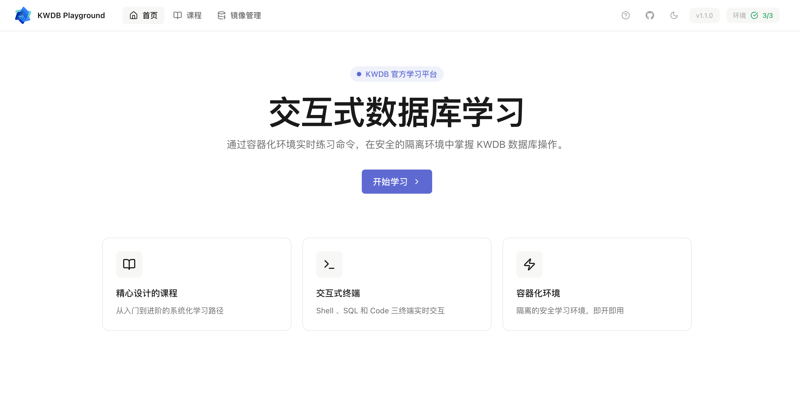
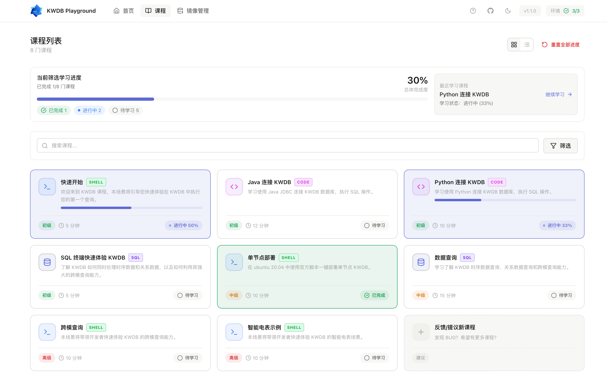
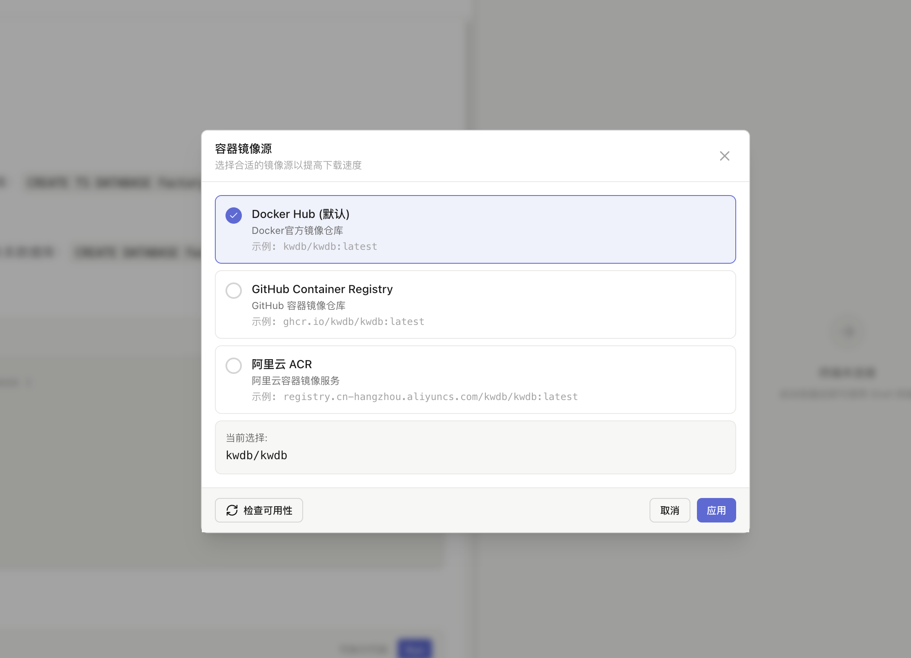

# KWDB Playground 交互式课程学习平台

KWDB Playground 是一个面向学习与演示的交互式课程平台，支持在同一页面中浏览课程、启动容器、执行命令或运行 SQL，帮助你在几分钟内完成从零到一的体验。

## 界面预览与说明

### 首页

- 用途：平台入口，展示项目简介与主要功能入口。
- 关键元素：顶部导航、进入课程的入口区域。
- 到达方式：启动服务后访问 `http://localhost:3006`。



### 课程列表

- 用途：浏览所有可用课程，包含课程标题与简介。
- 操作方式：点击任意课程卡片进入该课程的学习详情页。
- 到达方式：在首页点击“课程”入口或导航菜单进入课程列表。



### 课程详情

课程详情页根据课程类型提供不同的交互区域，主要有 **Shell 终端型** 与 **SQL 终端型** 两类。

#### Shell 终端型

- 用途：在浏览器内进行命令行交互（如 `echo`, `ls`, 包管理等）。
- 适用场景：练习安装 KWDB 及相关工具、配置环境、执行系统命令等。
- 常见操作：启动课程 → 启动容器 → 在终端输入命令并查看输出。


#### SQL 终端型

- 用途：在浏览器内执行 SQL 语句并查看查询结果。
- 适用场景：数据库入门、查询语言练习、示例数据探查等课程。
- 常见操作：启动课程 → 启动容器 → 输入语句（如 `SELECT 1`）→ 查看结果区输出。


### Docker 镜像源选择器(v0.4.1 新增)

支持灵活的镜像源选择，提高容器启动速度：

- **多镜像源支持**：Docker Hub、GitHub Container Registry (ghcr.io)、阿里云等镜像源
- **可用性检查**：启动前验证镜像源的可访问性和响应速度
- **自定义源**：支持配置任意 Docker 镜像仓库地址
- **配置持久化**：自动保存镜像源选择，下次访问时自动恢复



## 快速开始

### 发布版使用（推荐）

- 在 [Release 页面](https://github.com/kwdb/playground/releases) 下载最新版本的 `kwdb-playground` 二进制文件。
- 启动服务：
  ```bash
  kwdb-playground server
  ```
- 打开浏览器访问 `http://localhost:3006`，进入课程列表并开始交互体验。

### 开发版使用

- 克隆仓库并安装前端依赖：
  ```bash
  git clone https://github.com/kwdb/playground.git
  cd playground
  make install
  ```
- 启动后端与前端：
  ```bash
  # 前后端同时启动
  make dev
  ```
- 访问 `http://localhost:3006` 进行体验。

> 进阶用法（环境变量配置与 Docker 依赖等）请参阅完整使用指南 [`docs/usage-guide.md`](./docs/usage-guide.md)。

## 相关文档

- 开发指南：`docs/usage-guide.md`（系统要求、安装部署、功能使用、配置参数、常见问题）。
- 测试说明：`tests/README.md`（Playwright 与 PyTest E2E 的运行与排障）。

