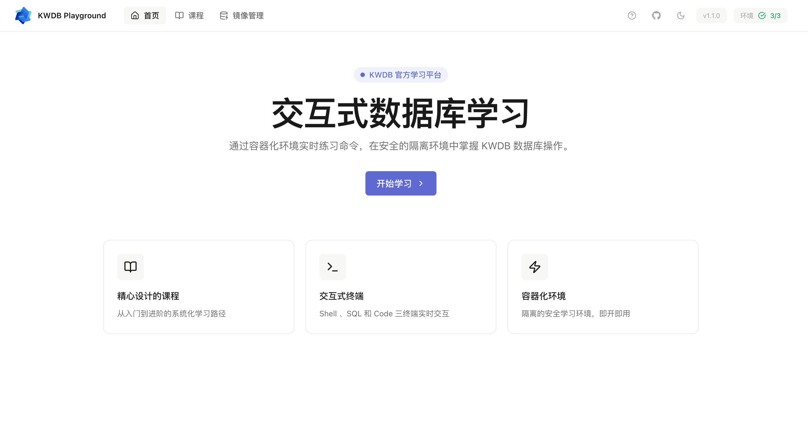
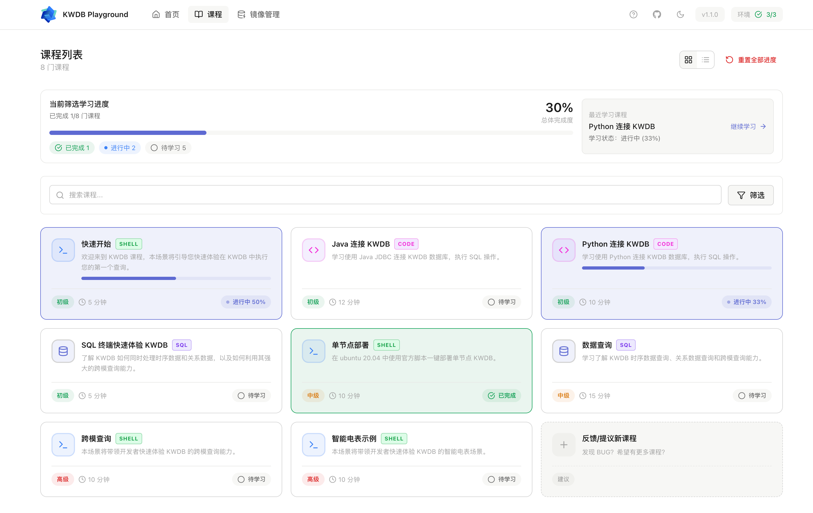
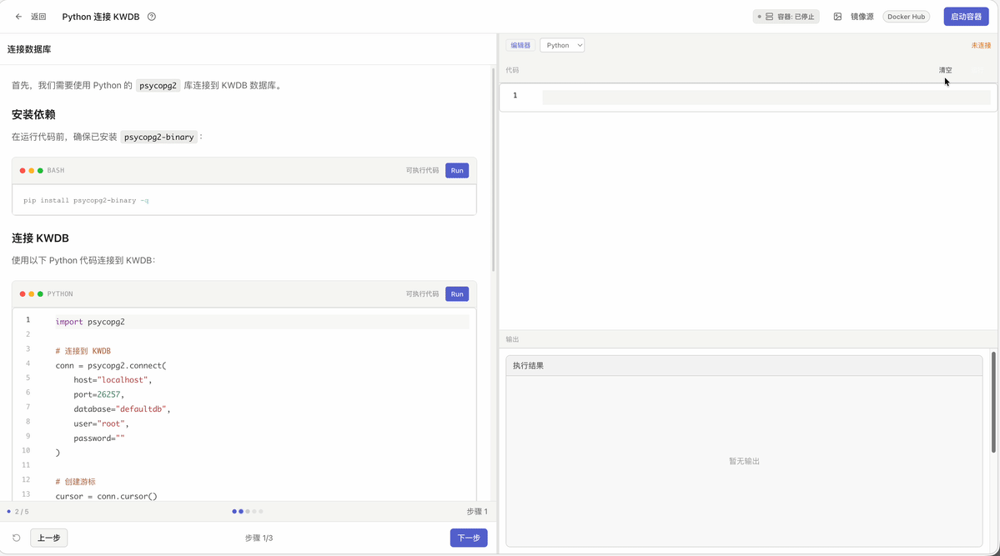
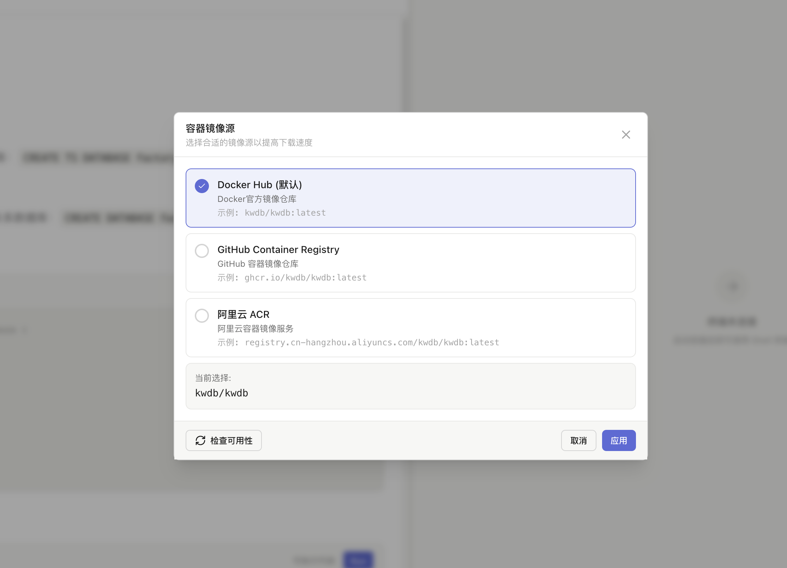
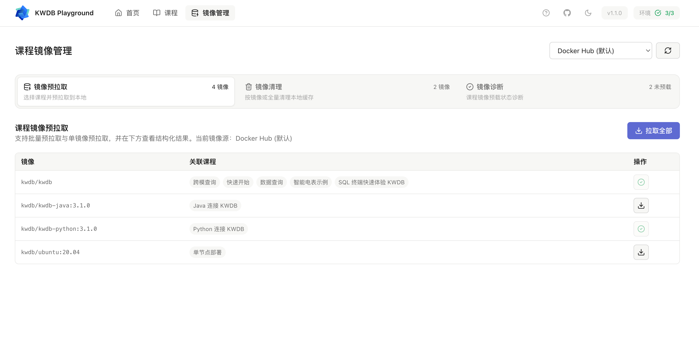

<div align="center">

# KWDB Playground

**一款面向学习与演示的轻量级交互式课程平台**

[](https://github.com/KWDB/playground/releases)
[](LICENSE)
[](go.mod)

[快速开始](#快速开始) • [功能特性](#功能特性) • [界面预览](#界面预览与说明) • [相关文档](#相关文档)

</div>

---

KWDB Playground 帮助你在几分钟内完成从零到一的体验。它支持在同一页面中浏览课程、启动隔离的容器环境、执行命令、运行 SQL 或执行示例代码，无需复杂的本地环境配置，开箱即用。

## 功能特性

- **🚀 开箱即用**: 提供开箱即用的 Web 终端环境，用户只需打开浏览器即可学习。
- **🛡️ 环境隔离**: 基于 Docker 容器化技术，为每个用户分配独立的学习环境，随开随用，用完即焚。
- **💻 丰富交互**: 支持 Shell、SQL 和多语言代码执行等多种终端模式，满足不同类型的课程需求。
- **⏸️ 进度管理**: 支持学习进度保存与环境状态的暂停/恢复（v0.5.0 新增）。
- **🌍 多镜像源切换**: 支持多 Docker 镜像源选择与连通性测试（v0.4.1 新增）。
- **🧑‍💻 多语言代码执行**: 支持在课程中编写和运行 Python、Bash、Java 代码，实时查看执行结果（v0.6.0 新增）。
- **🔌 自定义主机端口**: 学习页支持按课程自定义主机端口，进入页面即预检冲突并给出明显提示。(v1.2.0 新增)
- **📝 Markdown 动态变量**: 课程文档支持 `{{LOCAL_PORT}}`/`{{LOACL_PORT}}`、`{{copy}}`、`{{exec}}` 等增强渲染能力。(v1.2.0 新增)
- **⬆️ 在线升级**: 支持页面内版本检查与一键升级（v0.5.0 新增）。
- **🔍 环境检查**: 提供可视化的环境诊断面板，快速排查问题（v0.5.0 新增）。
- **📖 引导教程**: 首次访问提供交互式引导，快速了解功能（v0.5.0 新增）。

---

## 快速开始

### 推荐：使用预编译版本

#### 一键安装脚本 (macOS / Linux / Windows)

最简单的安装方式，在终端中执行以下命令（默认安装最新版本）：

```bash
curl -fsSL https://kwdb.tech/playground.sh | bash
```

如果需要安装指定版本（仅支持 `v0.6.0` 及以上）：

```bash
curl -fsSL https://kwdb.tech/playground.sh | bash -s -- --version v0.6.0
```

一键安装脚本支持以下常用参数：

- `--version <version>`：安装指定版本（如 `v0.6.0`）
- `--source <auto|github|atomgit>`：指定下载源，默认 `auto`（优先 GitHub，失败后回退 AtomGit）
- `--help`：查看参数说明

示例：

```bash
# 指定版本 + 指定 AtomGit 源
curl -fsSL https://kwdb.tech/playground.sh | bash -s -- --version v0.6.0 --source atomgit

# 查看帮助
curl -fsSL https://kwdb.tech/playground.sh | bash -s -- --help
```

安装完成后，直接运行即可启动服务：

```bash
kwdb-playground start
```

#### Homebrew 安装 (macOS)

如果您使用 Homebrew，可以通过以下命令快速安装：

```bash
brew tap kwdb/tap
brew install kwdb-playground
kwdb-playground start
```

#### 手动下载

1. 在 [Github](https://github.com/kwdb/playground/releases) 或 [AtomGit](https://atomgit.com/kwdb/playground/releases) Release 页面下载最新版本的 `kwdb-playground` 二进制文件。
2. macOS / Linux 授权并放到 PATH（Windows 可直接双击或加入 PATH 后在终端执行）：
   ```bash
   chmod +x kwdb-playground-<os>-<arch>
   sudo mv kwdb-playground-<os>-<arch> /usr/local/bin/kwdb-playground
   ```
3. 启动服务：
   ```bash
   kwdb-playground start
   ```
4. 打开浏览器访问 `http://localhost:3006`，进入课程列表并开始交互体验。

### Docker 部署

无需安装 Go 或 Node.js 环境，直接使用 Docker 部署（确保本机已安装 Docker）：

```bash
git clone https://github.com/kwdb/playground.git
cd playground
docker compose -f docker/playground/docker-compose.yml up -d
```

> **注意 (Windows 用户)**：默认配置挂载了 `/var/run/docker.sock`，仅适用于 Linux/macOS。Windows 下请通过 WSL2 运行，或参阅 [`docs/docker-deployment.md`](./docs/docker-deployment.md) 中的说明。

### 开发者模式

如果你想参与开发或本地调试：

```bash
# 1. 克隆代码仓库
git clone https://github.com/kwdb/playground.git
cd playground

# 2. 安装前端和后端依赖
make install

# 3. 启动前后端开发服务
make dev
```
启动后，访问 `http://localhost:3006` 进行体验。

---

## 界面预览与说明

### 🏠 首页 & 课程列表

- 平台入口，展示项目简介与主要功能入口。
- 浏览所有可用课程，点击课程卡片进入学习详情页。

**首页**


**课程列表**


### 💻 课程详情与交互终端

课程详情页根据课程类型提供不同的交互区域：

- **Shell 终端型**：在浏览器内进行命令行交互，适合练习包管理、系统配置等。
- **SQL 终端型**：在浏览器内执行 SQL 语句并查看查询结果，适合数据库实操。
- **Code 终端型**：在浏览器内编写代码并实时执行，支持多种语言（如 Python、Bash、Java），适合编程学习。

**Shell 终端**


**SQL 终端**


**Code 终端**


### ⚙️ 核心增强功能

#### 多镜像源切换与连通性测试
支持 Docker Hub、ghcr.io、阿里云镜像源，启动前验证连通性并自动保存您的偏好配置。



#### 镜像管理页面
提供独立的「镜像管理」页面，按场景拆分为三大分区：

- **镜像预拉取**：按课程映射查看镜像并执行批量/单镜像预拉取。
- **镜像清理**：按本地已缓存镜像清理，支持单镜像清理与全量清理。
- **镜像诊断**：按课程维度展示镜像状态。



#### 在线升级
新版本发布后，导航栏会显示「有更新」提示，点击即可一键升级到最新版本（生产环境）。

#### 环境检查
点击导航栏的「环境检查」按钮，可快速诊断 Docker、镜像源、端口占用等服务状态。

#### 端口冲突预检与动态链接
学习页支持在启动容器前设置主机端口，并在进入课程页面后自动进行冲突检测。对于监控类课程，可在 markdown 中通过 `{{LOCAL_PORT}}`（兼容 `{{LOACL_PORT}}`）动态渲染访问链接，避免端口变更后文档链接失效。

#### 引导教程
首次访问首页、课程页、学习页和镜像管理页时，可通过导航栏的帮助按钮开启交互式引导，快速了解各项功能。

#### 容器状态与进度管理
耗时较长的实战课程？没关系！您可以随时点击「暂停容器」保存当前环境进度，下次重新进入课程时，环境状态会被完整恢复。

---

## 相关文档

详细的使用说明、配置参数与开发指南，请参阅以下文档：

- 📖 **使用与开发指南**：[`docs/usage-guide.md`](./docs/usage-guide.md)（包含系统要求、依赖安装、开发规范）
- 🐳 **Docker 部署指南**：[`docs/docker-deployment.md`](./docs/docker-deployment.md)（镜像构建、挂载配置、故障排查）
- 🐍 **代码执行功能**：[`docs/code-execution.md`](./docs/code-execution.md)（Python/Bash/Java 代码执行功能说明）
- ⬆️ **版本升级指南**：[`docs/upgrade-guide.md`](./docs/upgrade-guide.md)（在线升级机制说明）

## 许可证

本项目采用 [GPL-3.0](LICENSE) 开源许可证。
